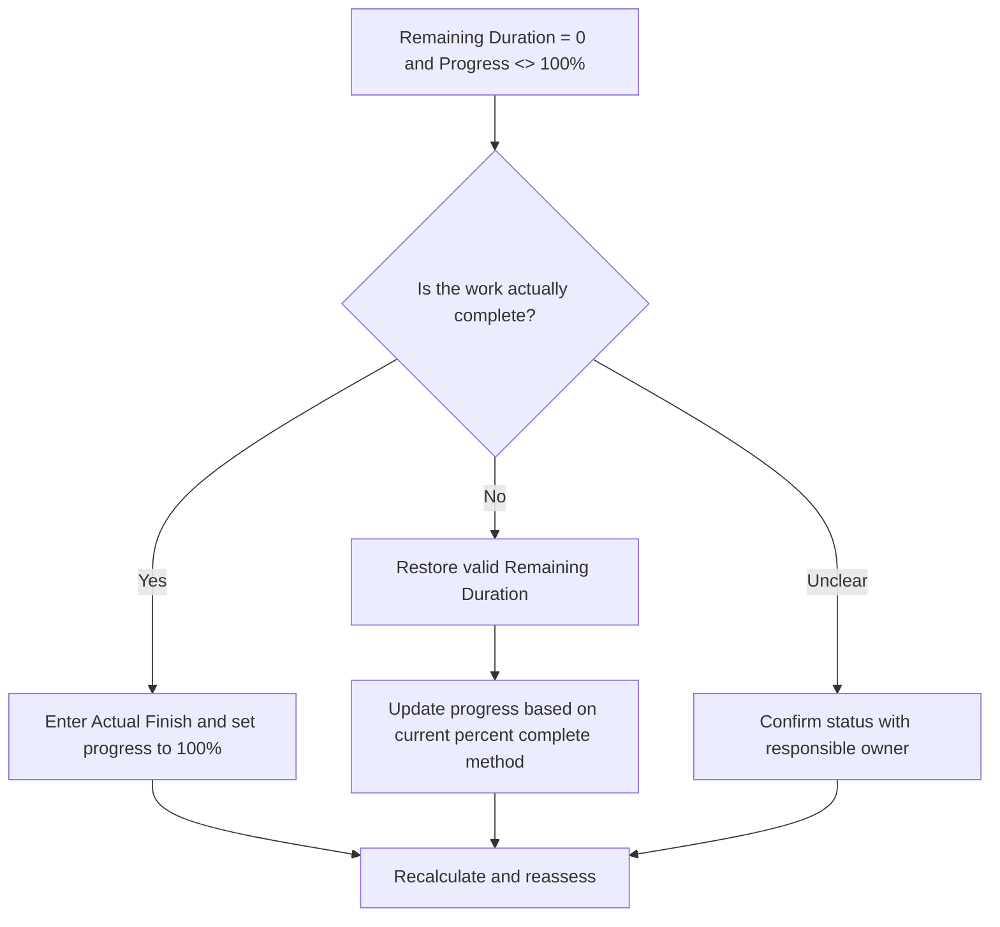

# Remaining Duration Zero and Progress Not 100% - Improvement Guide
## Purpose

This guide helps schedulers review and correct activities where Remaining Duration equals 0 but progress is not 100%. It supports cleaner Primavera P6 status updates by aligning remaining duration, progress percent, actual finish, and activity status.

## Before You Start

Gather the following information before taking action:

- Current assessment result for this metric.
- List of activities with Remaining Duration = 0 and progress <> 100%.
- Activity Status, Actual Start, Actual Finish, Original Duration, Remaining Duration, and At Completion Duration.
- Percent Complete Type and related progress fields.
- Physical Percent Complete, Duration Percent Complete, Units Percent Complete, and Activity Percent Complete.
- Data Date and latest progress update notes.
- Field confirmation of whether the work is complete or still has remaining work.

## Understand Your Result

A strong result is zero activities with Remaining Duration = 0 and progress below or above 100%.

An acceptable result may include rare documented cases where a specific percent complete method creates a temporary reporting difference, but these should be resolved before formal reporting.

A weak result means the schedule contains activities whose remaining work and progress status do not agree. This may create inaccurate reporting, earned value issues, or misleading completion status.

## Improvement Goal

The target is 0 unresolved activities with Remaining Duration = 0 and progress <> 100%.

The goal is to confirm whether each activity is complete, incorrectly progress-updated, or using a percent complete method that needs review.

## Action Plan

### Step 1: Identify the Main Issue

Create a P6 layout or report that filters for activities where Remaining Duration equals 0 and progress is not 100%. Include Activity ID, Activity Name, WBS, Activity Status, Actual Start, Actual Finish, Original Duration, Remaining Duration, Percent Complete Type, Physical Percent Complete, Duration Percent Complete, Units Percent Complete, and Activity Percent Complete.

Review each activity and ask:

- Is the work actually complete?
- If complete, is Actual Finish missing?
- If not complete, why is Remaining Duration 0?
- Which percent complete type is being used?
- Is the progress value coming from physical, duration, or units progress?
- Is this a status update error or a progress calculation issue?

### Step 2: Apply the Recommended Fixes

If the work is complete, update the activity as complete. Enter the Actual Finish, confirm Remaining Duration is 0, and confirm progress is 100% according to the project update procedure.

If the work is not complete, restore an appropriate Remaining Duration. Confirm the remaining work with the responsible owner and update the relevant progress field based on the activity's Percent Complete Type.

If the issue is caused by a percent complete method, review whether the activity should use Physical Percent Complete, Duration Percent Complete, or Units Percent Complete. Do not change the percent complete type casually; align it with the project controls procedure.

### Step 3: Remove Common Blockers

Common blockers include incomplete field updates, missing Actual Finish dates, confusion between physical and duration percent complete, and progress imported from external systems without validation.

Another blocker is treating Remaining Duration as a progress field. Remaining Duration should represent how much time is still needed to finish the activity, not simply the amount of work reported complete.

### Step 4: Validate the Changes

Recalculate the schedule after corrections. Re-run the metric and confirm that each remaining item is corrected or assigned for follow-up.

Review completed activities, actual finish dates, progress reports, earned value outputs, and lookahead reports to confirm that the correction did not create new inconsistencies.

## Improvement Schedule

### Day 1: Review and Diagnose

Run the metric, confirm the Data Date, and separate findings into completed work missing status, unfinished work with zero remaining duration, and percent complete method issues.

### Days 2-3: Implement Priority Actions

Correct activities used in reporting first. Update Actual Finish, restore Remaining Duration, or correct progress values as needed.

### Days 4-5: Monitor Early Results

Recalculate the schedule and review progress reports, completed activity lists, and earned value outputs.

### Day 6: Final Adjustments

Resolve remaining uncertain items with the responsible discipline, field lead, or project controls lead.

### Day 7: Reassess and Compare

Run the assessment again and compare the result against the target threshold.

## Tracking Progress

Use a simple tracker to manage corrections and approvals.

| Date | Action Taken | Expected Impact | Result / Observation | Next Step |
| --- | --- | --- | --- | --- |
| [Date] | Reviewed RD 0 and progress not 100 activities | Identify status inconsistency | [Observed result] | Assign owner |
| [Date] | Entered Actual Finish and corrected progress | Align completed status | [Observed result] | Recalculate schedule |
| [Date] | Restored Remaining Duration | Correct unfinished activity status | [Observed result] | Reassess metric |

## If Results Do Not Improve

If results do not improve, check whether progress updates are being imported, copied, or calculated inconsistently. Review whether different teams use different percent complete methods or whether Actual Finish dates are missing from the update workflow.

Escalate unresolved items when they affect critical, near-critical, earned value, client reporting, payment, or handover-related work.

## Maintenance

Review this metric during every update cycle before issuing reports. It should be part of the standard update validation alongside actual dates, remaining duration, percent complete, and activity status checks.

## Summary Checklist

- [ ] Current result reviewed
- [ ] Target threshold confirmed
- [ ] Data Date confirmed
- [ ] Main issue identified
- [ ] Completed activities updated correctly
- [ ] Actual Finish dates entered where needed
- [ ] Remaining Duration restored where work is incomplete
- [ ] Percent Complete Type reviewed
- [ ] Schedule recalculated
- [ ] Results monitored
- [ ] Assessment repeated
- [ ] Next steps documented

## Related Content
- [Overview](01_overview_template.md)
- [Blog Article](03_blog_template.md)
- [What A Schedule Is](../../01b_blogs_en/01_WHAT%20A%20SCHEDULE%20IS/01_blog.md)
- [Robust Logic](../../01b_blogs_en/02_ROBUST%20LOGIC/02_ROBUST%20LOGIC.md)
