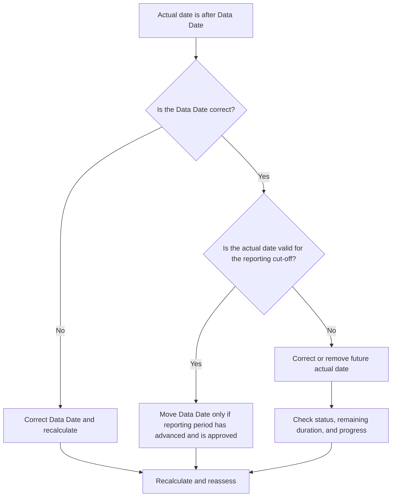

## Purpose

This guide helps schedulers review and correct activities with actual dates later than the Primavera P6 Data Date. It supports clean update discipline by keeping actual performance on or before the update boundary.

## Before You Start

Gather the following information before taking action:

- Current assessment result for this metric.
- Project Data Date used in the latest schedule update.
- List of activities with actual dates greater than the Data Date.
- Actual Start, Actual Finish, Activity Status, Remaining Duration, and Percent Complete fields.
- Source of the progress update, such as field report, import file, timesheet, or manual update.
- Project update cut-off rules and reporting period.
- Any known future-dated work entries or data import issues.

## Understand Your Result

A strong result is zero activities with actual dates later than the Data Date.

An acceptable result should still be zero. Actual dates after the Data Date normally indicate an update error or incorrect Data Date.

A weak result means the schedule contains future actuals. This can make the schedule report work as completed or started before the update period has actually reached that date.

## Improvement Goal

The target is 0 unresolved activities with actual dates greater than the Data Date.

The goal is to confirm whether the actual date is wrong, the Data Date is wrong, or the update import process is allowing future actuals.

## Action Plan

### Step 1: Identify the Main Issue

Create a P6 layout or report that filters for activities with Actual Start, Actual Finish, or other actual dates greater than the Data Date. Include Activity ID, Activity Name, WBS, Activity Status, Actual Start, Actual Finish, Start, Finish, Remaining Duration, Percent Complete, Calendar, and Data Date reference.

Review each activity and ask:

- Is the project Data Date correct?
- Is the actual date correct?
- Did the update include progress beyond the cut-off date?
- Did an import file load future actual dates?
- Should the actual date be changed, or should the Data Date be moved?
- Does the activity status match the corrected actual date?

### Step 2: Apply the Recommended Fixes

If the Data Date is wrong, correct it according to the approved reporting period and recalculate the schedule.

If the actual date is wrong, correct the Actual Start or Actual Finish to the proper date. If the work has not actually started or finished by the Data Date, remove the future actual and update status, Remaining Duration, and Percent Complete correctly.

If the issue came from an import, review the import file and mapping. Confirm that future actual dates are blocked or checked before schedule reports are issued.

### Step 3: Remove Common Blockers

Common blockers include progress files covering dates beyond the reporting cut-off, manual updates entered without checking the Data Date, and confusion between actual dates and forecast dates.

Another blocker is moving the Data Date just to accept future actuals. The Data Date should represent the approved update boundary, not be changed casually to hide a status error.

### Step 4: Validate the Changes

Recalculate the schedule after corrections. Re-run the metric and confirm that no actual dates remain after the Data Date.

Review completed activity lists, in-progress activity lists, earned value outputs, and schedule comparison reports to confirm that the correction did not create other status inconsistencies.

## Improvement Schedule

### Day 1: Review and Diagnose

Run the metric, confirm the Data Date, and separate findings into incorrect actual dates, incorrect Data Date, import issues, and update cut-off issues.

### Days 2-3: Implement Priority Actions

Correct activities used in reporting first. Fix actual dates, update statuses, and address import problems.

### Days 4-5: Monitor Early Results

Recalculate the schedule and review progress reports, completed activity lists, earned value outputs, and milestone dates.

### Day 6: Final Adjustments

Resolve remaining uncertain items with the responsible discipline, field lead, or project controls lead.

### Day 7: Reassess and Compare

Run the assessment again and compare the result against the target threshold.

## Tracking Progress

Use a simple tracker to manage corrections and approvals.

| Date | Action Taken | Expected Impact | Result / Observation | Next Step |
| --- | --- | --- | --- | --- |
| [Date] | Reviewed actual dates after Data Date | Identify future actuals | [Observed result] | Assign owner |
| [Date] | Corrected Actual Start or Actual Finish | Restore valid status boundary | [Observed result] | Recalculate schedule |
| [Date] | Reviewed import process | Prevent repeated future actuals | [Observed result] | Reassess metric |

## If Results Do Not Improve

If results do not improve, check whether future actuals are repeatedly introduced through imports, timesheets, or manual update workflows. Review the update cut-off procedure and confirm that the Data Date is communicated clearly to all contributors.

Escalate unresolved items when they affect critical, near-critical, earned value, client reporting, payment, or handover-related work.

## Maintenance

Review this metric during every update cycle before issuing reports. It should be part of the standard status validation together with actual dates, Data Date, Remaining Duration, Percent Complete, and Activity Status checks.

## Summary Checklist

- [ ] Current result reviewed
- [ ] Target threshold confirmed
- [ ] Data Date confirmed
- [ ] Main issue identified
- [ ] Future actual dates corrected
- [ ] Activity status checked
- [ ] Remaining Duration and progress checked
- [ ] Import or update workflow reviewed
- [ ] Schedule recalculated
- [ ] Results monitored
- [ ] Assessment repeated
- [ ] Next steps documented

## Related Content
- [Blog Article](03_blog_template.md)
- [What A Schedule Is](../../01b_blogs_en/01_WHAT%20A%20SCHEDULE%20IS/01_blog.md)
- [Robust Logic](../../01b_blogs_en/02_ROBUST%20LOGIC/02_ROBUST%20LOGIC.md)
