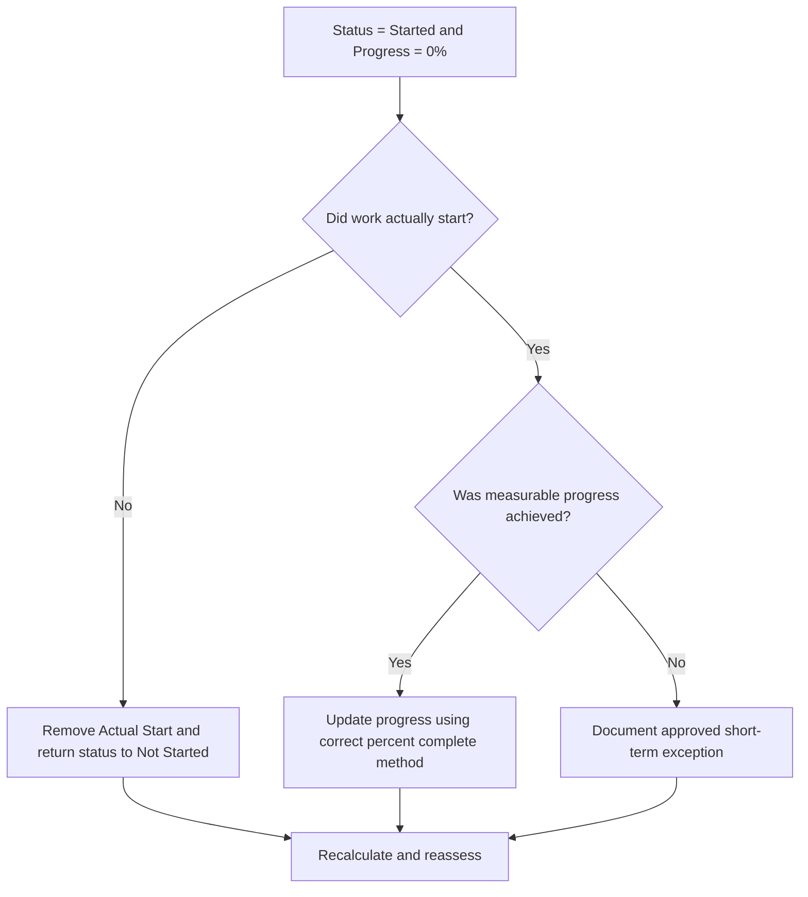

# Activity Started with Zero Progress - Improvement Guide
## Purpose

This guide helps schedulers review and correct activities where Activity Status is Started but progress is 0%. It supports cleaner Primavera P6 updates by aligning actual start, activity status, percent complete, and remaining duration.

## Before You Start

Gather the following information before taking action:

- Current assessment result for this metric.
- List of activities with Activity Status = Started and progress = 0%.
- Actual Start, Actual Finish, Remaining Duration, Original Duration, and Activity Status.
- Percent Complete Type and related progress fields.
- Physical Percent Complete, Duration Percent Complete, Units Percent Complete, and Activity Percent Complete.
- Data Date and latest update notes.
- Field confirmation of whether work actually started and what progress was achieved.

## Understand Your Result

A strong result is zero activities with Started status and 0% progress.

An acceptable result may include rare documented cases where an activity was started at the very end of the update period and no measurable progress was earned yet. These cases should be limited and clearly explained.

A weak result means the schedule contains activities whose start status and progress value do not agree. This can create misleading progress reports, earned value issues, and lookahead confusion.

## Improvement Goal

The target is 0 unresolved activities with Activity Status = Started and progress = 0%.

The goal is to confirm whether each activity truly started, whether progress was missed, or whether the activity should be returned to Not Started.

## Action Plan

### Step 1: Identify the Main Issue

Create a P6 layout or report that filters for activities with Started status and 0% progress. Include Activity ID, Activity Name, WBS, Activity Status, Actual Start, Actual Finish, Original Duration, Remaining Duration, Percent Complete Type, Physical Percent Complete, Duration Percent Complete, Units Percent Complete, Activity Percent Complete, Start, Finish, and Total Float.

Review each activity and ask:

- Did the work actually start?
- If work started, what measurable progress was achieved?
- Is the Actual Start correct?
- Which percent complete type is being used?
- Is progress missing from the correct field?
- Was the activity started administratively without real work beginning?

### Step 2: Apply the Recommended Fixes

If the work did not actually start, remove the incorrect Actual Start and return the activity to Not Started. Confirm Remaining Duration and forecast dates are still valid.

If the work did start and progress was achieved, update the correct progress field based on the Percent Complete Type. For Physical Percent Complete, enter the physical progress. For Duration Percent Complete, confirm Remaining Duration reflects the work performed. For Units Percent Complete, confirm units progress is updated.

If the work started but no measurable progress was earned, document the reason. This should be rare and temporary, such as a mobilization start recorded near the update cut-off with no earned progress yet.

### Step 3: Remove Common Blockers

Common blockers include missing field quantities, imported actual starts without progress values, confusion over percent complete type, and pressure to show work as started before measurable progress is available.

Another blocker is treating Actual Start as a planning signal instead of a status fact. Actual Start should represent real work beginning, not intent to start soon.

### Step 4: Validate the Changes

Recalculate the schedule after corrections. Re-run the metric and confirm that each remaining item is corrected, justified, or assigned for follow-up.

Review progress reports, earned value outputs, lookahead reports, and in-progress activity lists to confirm the correction did not create new inconsistencies.

## Improvement Schedule

### Day 1: Review and Diagnose

Run the metric, confirm the Data Date, and separate findings into incorrect starts, missing progress, percent complete method issues, and possible exceptions.

### Days 2-3: Implement Priority Actions

Correct activities used in reporting first. Remove incorrect Actual Starts, update progress values, or document valid exceptions.

### Days 4-5: Monitor Early Results

Recalculate the schedule and review progress reports, earned value outputs, in-progress activity lists, and lookahead reports.

### Day 6: Final Adjustments

Resolve remaining uncertain items with the responsible discipline, field lead, or project controls lead.

### Day 7: Reassess and Compare

Run the assessment again and compare the result against the target threshold.

## Tracking Progress

Use a simple tracker to manage corrections and approvals.

| Date | Action Taken | Expected Impact | Result / Observation | Next Step |
| --- | --- | --- | --- | --- |
| [Date] | Reviewed started activities with 0% progress | Identify status inconsistency | [Observed result] | Assign owner |
| [Date] | Removed incorrect Actual Start | Restore accurate status | [Observed result] | Recalculate schedule |
| [Date] | Updated progress value | Align started status with progress | [Observed result] | Reassess metric |

## If Results Do Not Improve

If results do not improve, check whether actual starts are imported without matching progress values or whether teams are using different rules for what counts as started. Review the update cut-off procedure and percent complete method.

Escalate unresolved items when they affect critical, near-critical, earned value, client reporting, payment, or handover-related work.

## Maintenance

Review this metric during every update cycle before issuing reports. It should be part of the standard update validation together with actual dates, remaining duration, percent complete, and activity status checks.

## Summary Checklist

- [ ] Current result reviewed
- [ ] Target threshold confirmed
- [ ] Data Date confirmed
- [ ] Main issue identified
- [ ] Incorrect Actual Starts removed
- [ ] Missing progress updated
- [ ] Percent Complete Type reviewed
- [ ] Valid exceptions documented
- [ ] Schedule recalculated
- [ ] Results monitored
- [ ] Assessment repeated
- [ ] Next steps documented

## Related Content
- [Overview](01_overview_template.md)
- [Blog Article](03_blog_template.md)
- [What A Schedule Is](../../01b_blogs_en/01_WHAT%20A%20SCHEDULE%20IS/01_blog.md)
- [Robust Logic](../../01b_blogs_en/02_ROBUST%20LOGIC/02_ROBUST%20LOGIC.md)
