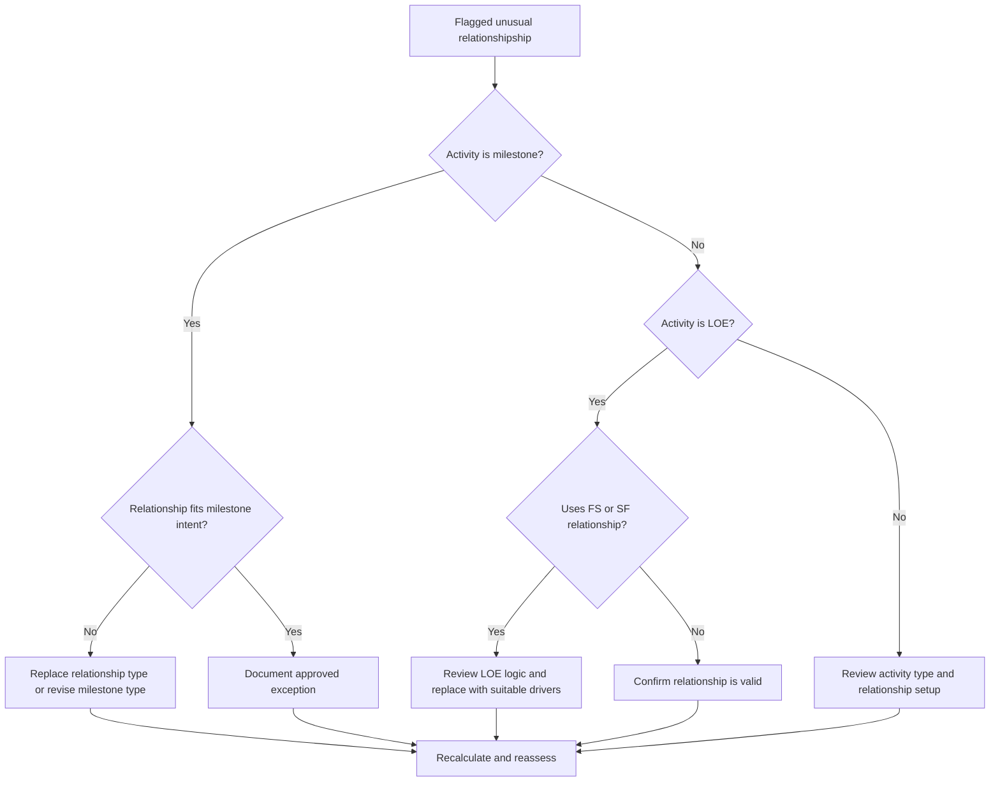

# Unusual Relationships - Improvement Guide
## Purpose

This guide helps schedulers review and correct unusual relationshipships involving Finish Milestones, Start Milestones, and Level of Effort (LOE) activities in Primavera P6.

## Before You Start

Gather the following information before taking action:

- Current assessment result for this metric.
- List of flagged relationships by predecessor, successor, activity type, and relationship type.
- Activity ID, Activity Name, WBS, Activity Type, Start, Finish, Total Float, and critical or longest path status.
- Relationship type, lag, predecessor activity type, and successor activity type.
- Milestone purpose, LOE purpose, and related reporting requirement.
- Data Date and latest schedule calculation output.

## Understand Your Result

A strong result is zero unresolved unusual relationshipships.

The metric should flag these cases:

- Finish Milestone with SS or SF successor.
- Finish Milestone with SS predecessor.
- Start Milestone with FF or SF predecessor.
- Start Milestone with FS or FF successor.
- LOE with FS relationship.
- LOE with SF relationship.

Rare exceptions may exist, but they should be documented and easy to explain during a schedule review.

## Improvement Goal

The target is 0 unresolved unusual relationshipships.

The goal is to make each milestone and LOE relationship match the intended scheduling behavior without forcing dates or hiding weak logic.

## Action Plan

### Step 1: Identify the Main Issue

Create a P6 layout or report that shows all milestone and LOE activities with predecessor and successor details. Include Activity Type, Relationship Type, Lag, Start, Finish, Total Float, and critical or longest path indicators.

Review each flagged relationship and ask:

- Is the activity type correct?
- Does the relationship type match the purpose of the milestone or LOE?
- Is the relationship trying to force a start, finish, or reporting date?
- Would a normal FS, SS, or FF relationship better represent the logic?
- Is the relationship an approved exception?

### Step 2: Apply the Recommended Fixes

For Finish Milestones, confirm that the logic is driving or responding to completion. Replace SS or SF relationships when they do not represent a real finish-based dependency.

For Start Milestones, confirm that the logic supports the start event. Replace FF, SF, FS successor, or other unsuitable relationships when they are being used to force a reporting date.

For LOE activities, review whether FS or SF relationships are incorrectly making the LOE drive discrete work. LOE activities normally summarize or span other work, so their relationships should be handled carefully.

If the relationship is valid by contract, client method, or special schedule design, document the reason and approval.

### Step 3: Remove Common Blockers

Common blockers include copied logic from older schedules, misunderstanding milestone behavior, using SF relationships as a shortcut, and using LOE activities to control work that should be driven by discrete activities.

Another blocker is treating relationship cleanup as cosmetic. These links can affect float, critical path reporting, milestone dates, and schedule credibility.

### Step 4: Validate the Changes

Recalculate the schedule after corrections. Re-run the metric and confirm that each remaining item is corrected, justified, or assigned for follow-up.

Review milestone dates, LOE dates, total float, critical or longest path, and key reporting outputs to confirm the correction did not create new issues.

## Improvement Schedule

### Day 1: Review and Diagnose

Run the metric and group findings by activity type and relationship pattern.

### Days 2-3: Implement Priority Actions

Correct relationships on critical, near-critical, contractual, handover, and client-facing milestones first.

### Days 4-5: Monitor Early Results

Recalculate the schedule and review float, critical path, milestone movement, and LOE behavior.

### Day 6: Final Adjustments

Resolve remaining exceptions with the scheduler, project controls lead, or PMO reviewer.

### Day 7: Reassess and Compare

Run the assessment again and compare the result against the target threshold.

## Tracking Progress

Use a simple tracker to manage corrections and approvals.

| Date | Action Taken | Expected Impact | Result / Observation | Next Step |
| --- | --- | --- | --- | --- |
| [Date] | Reviewed unusual relationshipships | Identify relationship-type issues | [Observed result] | Assign owner |
| [Date] | Corrected milestone relationship | Align logic with milestone purpose | [Observed result] | Recalculate schedule |
| [Date] | Reviewed LOE relationships | Prevent LOE from driving discrete work incorrectly | [Observed result] | Reassess metric |

## If Results Do Not Improve

If results do not improve, check whether the same relationships are being reintroduced through imports, copied logic, global changes, or external schedule integration.

Escalate unresolved items when they affect contractual milestones, critical path reporting, client submissions, payment events, or handover dates.

## Maintenance

Review this metric during each update cycle and before baseline approval. It is especially useful after schedule imports, copied fragnets, major resequencing, and milestone revisions.

## Summary Checklist

- [ ] Current result reviewed
- [ ] Target threshold confirmed
- [ ] Milestone and LOE activity types reviewed
- [ ] Flagged relationship types checked
- [ ] Incorrect relationships corrected
- [ ] Valid exceptions documented
- [ ] Schedule recalculated
- [ ] Float and critical path reviewed
- [ ] Results monitored
- [ ] Assessment repeated
- [ ] Next steps documented

## Related Content
- [Overview](01_overview_template.md)
- [Blog Article](03_blog_template.md)
- [What A Schedule Is](../../01b_blogs_en/01_WHAT%20A%20SCHEDULE%20IS/01_blog.md)
- [Robust Logic](../../01b_blogs_en/02_ROBUST%20LOGIC/02_ROBUST%20LOGIC.md)
