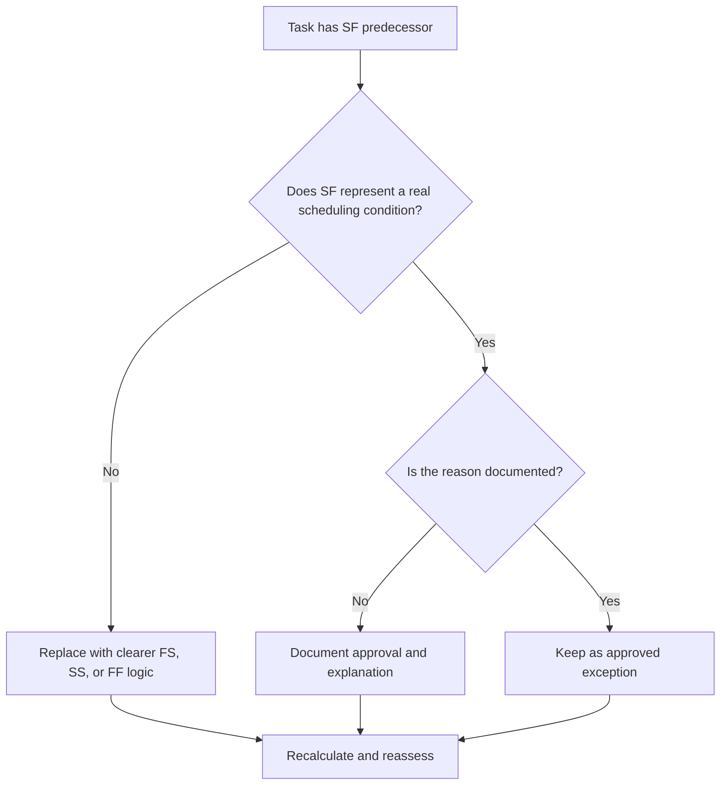

## Purpose

This guide helps schedulers review and correct task activities that have Start-to-Finish (SF) predecessor relationships in Primavera P6.

## Before You Start

Gather the following information before taking action:

- Current assessment result for this metric.
- List of task activities with at least one SF predecessor.
- Activity ID, Activity Name, WBS, Activity Type, Start, Finish, Total Float, and critical or longest path status.
- Predecessor Activity ID, predecessor Activity Type, relationship type, and lag.
- Any constraints, calendars, expected finish conditions, and related update notes.
- Data Date and latest schedule calculation output.

## Understand Your Result

A strong result is zero unresolved task activities with SF predecessor relationships.

An SF relationship means the successor activity cannot finish until the predecessor activity starts. This is uncommon in normal construction, engineering, procurement, or commissioning logic. Most task relationships should be represented with FS, SS, or FF logic when they reflect real sequencing.

A weak result means task activity finishes may be controlled by logic that is hard to justify or that was copied from another part of the schedule without review.

## Improvement Goal

The target is 0 unresolved SF predecessor relationships on task activities.

The goal is to confirm whether each SF relationship is a valid scheduling model or should be replaced with clearer logic.

## Action Plan

### Step 1: Identify the Main Issue

Create a P6 layout or report that filters task activities with an SF predecessor. Include predecessor and successor IDs, Activity Type, Relationship Type, Lag, Start, Finish, Total Float, constraints, and critical or longest path indicators.

Review each relationship and ask:

- What real condition is the SF relationship trying to represent?
- Should the predecessor start really control the successor finish?
- Would FS, SS, or FF logic describe the sequence more clearly?
- Is lag being used to force a date?
- Is the relationship on the critical or near-critical path?
- Is there a documented reason for using SF?

### Step 2: Apply the Recommended Fixes

If the SF relationship does not represent a real condition, replace it with the relationship type that best describes the sequence. Use FS when the successor should start after predecessor completion, SS when starts are linked, and FF when finish alignment is the intended logic.

If the SF relationship was added to control a finish date, review whether the schedule needs a proper predecessor, milestone, constraint review, or activity split instead.

If the SF relationship is valid, document why it is required and who approved it. This should be a rare exception, not a common scheduling pattern.

### Step 3: Remove Common Blockers

Common blockers include copied relationships, imported external logic, misunderstanding of SF behavior, and using SF with lag to force a finish date.

Another blocker is leaving the relationship because the calculated date looks acceptable. The relationship still needs to be logically defensible.

### Step 4: Validate the Changes

Recalculate the schedule after corrections. Re-run the metric and confirm that each remaining SF predecessor is corrected, justified, or assigned for follow-up.

Review total float, critical or longest path, affected milestones, and lookahead outputs to confirm the logic change did not create new issues.

## Improvement Schedule

### Day 1: Review and Diagnose

Run the metric, confirm the Data Date, and separate findings into invalid SF relationships, possible exceptions, and items needing owner input.

### Days 2-3: Implement Priority Actions

Correct SF relationships on critical, near-critical, contractual, and near-term activities first.

### Days 4-5: Monitor Early Results

Recalculate the schedule and review float, critical path, lookahead dates, and milestone movement.

### Day 6: Final Adjustments

Resolve remaining exceptions with the scheduler, discipline lead, project controls lead, or PMO reviewer.

### Day 7: Reassess and Compare

Run the assessment again and compare the result against the target threshold.

## Tracking Progress

Use a simple tracker to manage corrections and approvals.

| Date | Action Taken | Expected Impact | Result / Observation | Next Step |
| --- | --- | --- | --- | --- |
| [Date] | Reviewed task activities with SF predecessors | Identify unusual relationship logic | [Observed result] | Assign owner |
| [Date] | Replaced invalid SF relationship | Improve logic clarity | [Observed result] | Recalculate schedule |
| [Date] | Documented valid SF exception | Preserve approved special logic | [Observed result] | Reassess metric |

## If Results Do Not Improve

If results do not improve, check whether SF relationships are being reintroduced through imports, copied fragnets, global changes, or external schedule integration.

Escalate unresolved items when they affect critical path, contractual milestones, client submissions, payment events, or near-term execution work.

## Maintenance

Review this metric during every update cycle and before baseline approval. It is especially useful after schedule imports, major resequencing, and logic cleanup exercises.

## Summary Checklist

- [ ] Current result reviewed
- [ ] Target threshold confirmed
- [ ] SF predecessor list generated
- [ ] Critical and near-critical items prioritized
- [ ] Invalid SF relationships corrected
- [ ] Valid exceptions documented
- [ ] Schedule recalculated
- [ ] Float and critical path reviewed
- [ ] Results monitored
- [ ] Assessment repeated
- [ ] Next steps documented

## Related Content
- [Blog Article](03_blog_template.md)
- [What A Schedule Is](../../01b_blogs_en/01_WHAT%20A%20SCHEDULE%20IS/01_blog.md)
- [Robust Logic](../../01b_blogs_en/02_ROBUST%20LOGIC/02_ROBUST%20LOGIC.md)
