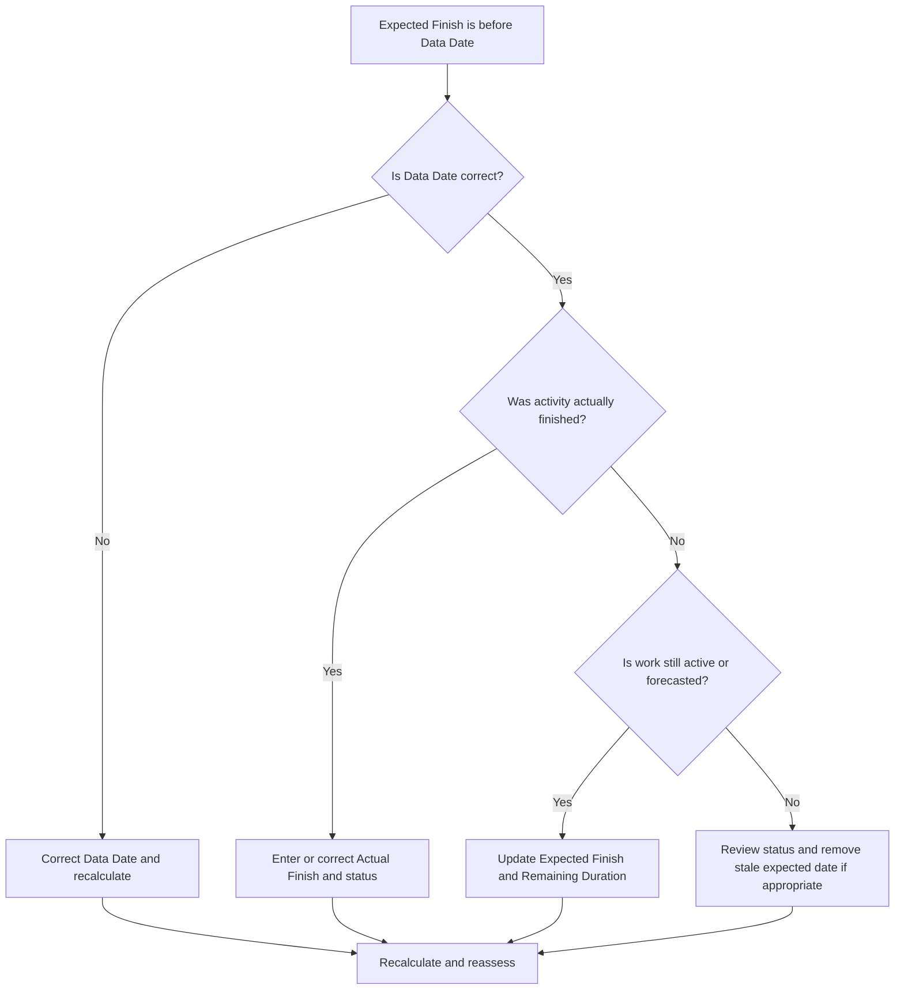

## Purpose

This guide helps schedulers review and correct activities whose Expected Finish date is earlier than the Primavera P6 Data Date. It supports cleaner update discipline by keeping expected dates aligned with the current reporting boundary.

## Before You Start

Gather the following information before taking action:

- Current assessment result for this metric.
- Project Data Date used in the latest schedule update.
- List of activities where Expected Finish is earlier than the Data Date.
- Activity Status, Actual Start, Actual Finish, Remaining Duration, Percent Complete, Start, Finish, and Total Float.
- Expected Finish source, such as manual entry, import file, field forecast, or P6 update workflow.
- Project update cut-off rules and latest progress notes.

## Understand Your Result

A strong result is zero activities with Expected Finish earlier than the Data Date.

An Expected Finish before the Data Date usually means the forecast or expected completion information was not updated when the schedule moved forward. It may also indicate that the activity should have an Actual Finish, a revised Remaining Duration, or a corrected status.

A weak result means the schedule contains expected completion dates that sit in the past relative to the current update boundary.

## Improvement Goal

The target is 0 unresolved activities with Expected Finish earlier than the Data Date.

The goal is to confirm whether each activity was completed, still in progress, not started, or incorrectly updated.

## Action Plan

### Step 1: Identify the Main Issue

Create a P6 layout or report that filters for activities where Expected Finish is earlier than the Data Date. Include Activity ID, Activity Name, WBS, Activity Status, Expected Finish, Actual Start, Actual Finish, Remaining Duration, Percent Complete, Start, Finish, Total Float, and Calendar.

Review each activity and ask:

- Is the Data Date correct?
- Was the activity actually finished before the Data Date?
- If it finished, is Actual Finish missing?
- If it did not finish, should Expected Finish be updated?
- Does Remaining Duration still represent the work left?
- Did an import or manual update leave an old Expected Finish value behind?

### Step 2: Apply the Recommended Fixes

If the Data Date is wrong, correct it according to the approved reporting period and recalculate the schedule.

If the activity finished before the Data Date, enter or correct the Actual Finish and confirm Activity Status, Percent Complete, and Remaining Duration are consistent.

If the activity is still active or not finished, update the Expected Finish to a valid date on or after the Data Date. Confirm Remaining Duration and forecast dates reflect the latest field information.

If the Expected Finish was introduced through an import, review the import file and mapping so outdated expected dates are not repeatedly loaded.

### Step 3: Remove Common Blockers

Common blockers include outdated field forecasts, progress imports that update percent complete but not expected dates, and confusion between Expected Finish, Forecast Finish, and Actual Finish.

Another blocker is ignoring Expected Finish because scheduled dates look acceptable. In P6, expected dates can influence schedule calculation depending on settings and workflows, so stale values should be reviewed.

### Step 4: Validate the Changes

Recalculate the schedule after corrections. Re-run the metric and confirm that no unresolved Expected Finish dates remain before the Data Date.

Review in-progress activities, near-term lookahead, total float, milestone dates, and schedule comparison reports to confirm the correction did not create new inconsistencies.

## Improvement Schedule

### Day 1: Review and Diagnose

Run the metric, confirm the Data Date, and separate findings into completed work, stale expected dates, remaining duration issues, and import issues.

### Days 2-3: Implement Priority Actions

Correct activities used in reporting first. Update Actual Finish, Expected Finish, Remaining Duration, Percent Complete, or Activity Status as needed.

### Days 4-5: Monitor Early Results

Recalculate the schedule and review lookahead reports, in-progress activity lists, milestone movement, and float changes.

### Day 6: Final Adjustments

Resolve remaining uncertain items with the responsible discipline, field lead, or project controls lead.

### Day 7: Reassess and Compare

Run the assessment again and compare the result against the target threshold.

## Tracking Progress

Use a simple tracker to manage corrections and approvals.

| Date | Action Taken | Expected Impact | Result / Observation | Next Step |
| --- | --- | --- | --- | --- |
| [Date] | Reviewed Expected Finish before Data Date | Identify stale expected dates | [Observed result] | Assign owner |
| [Date] | Updated Expected Finish or Actual Finish | Align status with update boundary | [Observed result] | Recalculate schedule |
| [Date] | Reviewed import process | Prevent repeated stale expected dates | [Observed result] | Reassess metric |

## If Results Do Not Improve

If results do not improve, check whether expected dates are being imported from field systems, spreadsheets, or previous update files without validation. Review the update workflow and confirm who owns Expected Finish updates.

Escalate unresolved items when they affect critical, near-critical, client reporting, payment, handover, or near-term execution work.

## Maintenance

Review this metric during every update cycle before issuing reports. It should be part of the standard status validation together with Data Date, actual dates, Remaining Duration, Percent Complete, and Activity Status checks.

## Summary Checklist

- [ ] Current result reviewed
- [ ] Target threshold confirmed
- [ ] Data Date confirmed
- [ ] Expected Finish list generated
- [ ] Completed work given Actual Finish
- [ ] Stale Expected Finish dates updated
- [ ] Remaining Duration checked
- [ ] Activity Status and Percent Complete checked
- [ ] Import or update workflow reviewed
- [ ] Schedule recalculated
- [ ] Assessment repeated
- [ ] Next steps documented

## Related Content
- [Blog Article](03_blog_template.md)
- [What A Schedule Is](../../01b_blogs_en/01_WHAT%20A%20SCHEDULE%20IS/01_blog.md)
- [Robust Logic](../../01b_blogs_en/02_ROBUST%20LOGIC/02_ROBUST%20LOGIC.md)
