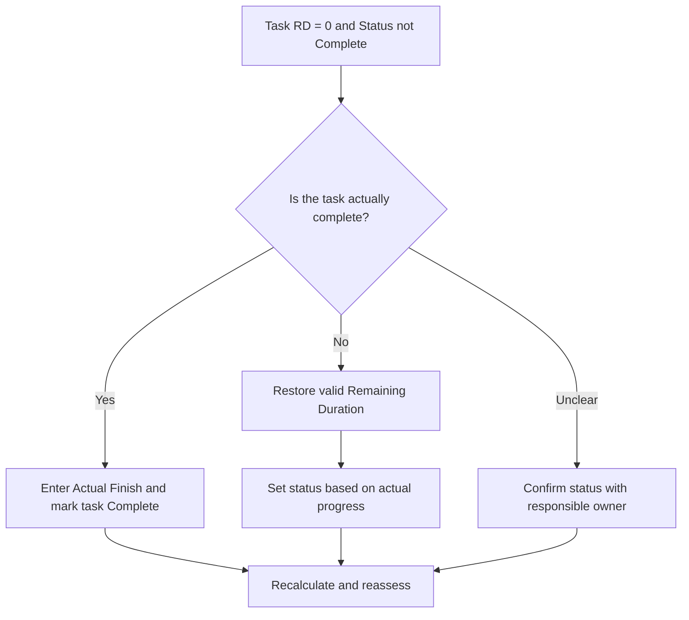

## Purpose

This guide helps schedulers review and correct task activities where Remaining Duration equals 0 but task status is not Complete. It supports clean Primavera P6 updates by aligning remaining work, actual finish, and activity status.

## Before You Start

Gather the following information before taking action:

- Current assessment result for this metric.
- List of task activities with Remaining Duration = 0 and status not Complete.
- Activity ID, Activity Name, WBS, Activity Type, Activity Status, Actual Start, Actual Finish, Original Duration, Remaining Duration, and At Completion Duration.
- Percent Complete Type and key progress fields.
- Data Date and latest update notes.
- Field confirmation of whether the task is complete or still has work remaining.

## Understand Your Result

A strong result is zero task activities with Remaining Duration = 0 and status not Complete.

This metric is limited to task activities so the review focuses on normal work activities, not milestones or LOE records. A task with zero remaining duration should normally have completed status and an Actual Finish.

A weak result means the schedule contains tasks whose time remaining and completion status do not agree.

## Improvement Goal

The target is 0 unresolved task activities with Remaining Duration = 0 and status not Complete.

The goal is to confirm whether each task is complete and should be closed, or incomplete and should have valid Remaining Duration restored.

## Action Plan

### Step 1: Identify the Main Issue

Create a P6 layout or report that filters for task activities where Remaining Duration equals 0 and Activity Status is not Complete. Include Activity ID, Activity Name, WBS, Activity Type, Activity Status, Actual Start, Actual Finish, Original Duration, Remaining Duration, Percent Complete Type, Activity Percent Complete, Start, Finish, and Total Float.

Review each task and ask:

- Is the task actually complete?
- If complete, why is the status not Complete?
- Is Actual Finish missing?
- If work is not complete, why is Remaining Duration 0?
- Was status imported or updated manually?
- Does the percent complete method match the update made?

### Step 2: Apply the Recommended Fixes

If the task is complete, update the activity as Complete. Enter the Actual Finish, confirm Remaining Duration is 0, and confirm progress values align with the project update procedure.

If the task is not complete, restore an appropriate Remaining Duration. Confirm the remaining work with the responsible owner and keep the task status as In Progress or Not Started based on actual progress.

If the issue comes from imported progress data, review the import mapping and update workflow. The update process should not leave task activities with zero remaining time but incomplete status.

### Step 3: Remove Common Blockers

Common blockers include missing Actual Finish dates, incomplete field confirmation, imported update data, and confusion between duration status and activity status.

Another blocker is reducing Remaining Duration to 0 to show progress without formally completing the task. Remaining Duration and Activity Status should tell the same story about whether work remains.

### Step 4: Validate the Changes

Recalculate the schedule after corrections. Re-run the metric and confirm that each remaining item is corrected or assigned for follow-up.

Review completed task lists, actual finish dates, progress reports, earned value outputs, and lookahead reports to confirm that the correction did not create new inconsistencies.

## Improvement Schedule

### Day 1: Review and Diagnose

Run the metric, confirm the Data Date, and separate findings into complete tasks missing Complete status, incomplete tasks with zero remaining duration, and import or workflow issues.

### Days 2-3: Implement Priority Actions

Correct tasks used in reporting first. Enter Actual Finish, mark tasks Complete, or restore Remaining Duration as needed.

### Days 4-5: Monitor Early Results

Recalculate the schedule and review completed task reports, progress reports, earned value outputs, and lookahead reports.

### Day 6: Final Adjustments

Resolve remaining uncertain items with the responsible discipline, field lead, or project controls lead.

### Day 7: Reassess and Compare

Run the assessment again and compare the result against the target threshold.

## Tracking Progress

Use a simple tracker to manage corrections and approvals.

| Date | Action Taken | Expected Impact | Result / Observation | Next Step |
| --- | --- | --- | --- | --- |
| [Date] | Reviewed task RD 0 and status not Complete | Identify task status inconsistency | [Observed result] | Assign owner |
| [Date] | Entered Actual Finish and marked Complete | Align completed status | [Observed result] | Recalculate schedule |
| [Date] | Restored Remaining Duration | Correct unfinished task status | [Observed result] | Reassess metric |

## If Results Do Not Improve

If results do not improve, check whether progress updates are imported, copied, or manually edited inconsistently. Review whether Actual Finish dates are missing from the update workflow or whether users are setting Remaining Duration to 0 without completing tasks.

Escalate unresolved items when they affect critical, near-critical, earned value, client reporting, payment, or handover-related work.

## Maintenance

Review this metric during every update cycle before issuing reports. It should be part of the standard task status validation alongside actual dates, remaining duration, percent complete, and activity status checks.

## Summary Checklist

- [ ] Current result reviewed
- [ ] Target threshold confirmed
- [ ] Data Date confirmed
- [ ] Task-only filter confirmed
- [ ] Main issue identified
- [ ] Completed tasks marked correctly
- [ ] Actual Finish dates entered where needed
- [ ] Remaining Duration restored where work is incomplete
- [ ] Import or update workflow checked
- [ ] Schedule recalculated
- [ ] Assessment repeated
- [ ] Next steps documented

## Related Content
- [Blog Article](03_blog_template.md)
- [What A Schedule Is](../../01b_blogs_en/01_WHAT%20A%20SCHEDULE%20IS/01_blog.md)
- [Robust Logic](../../01b_blogs_en/02_ROBUST%20LOGIC/02_ROBUST%20LOGIC.md)
