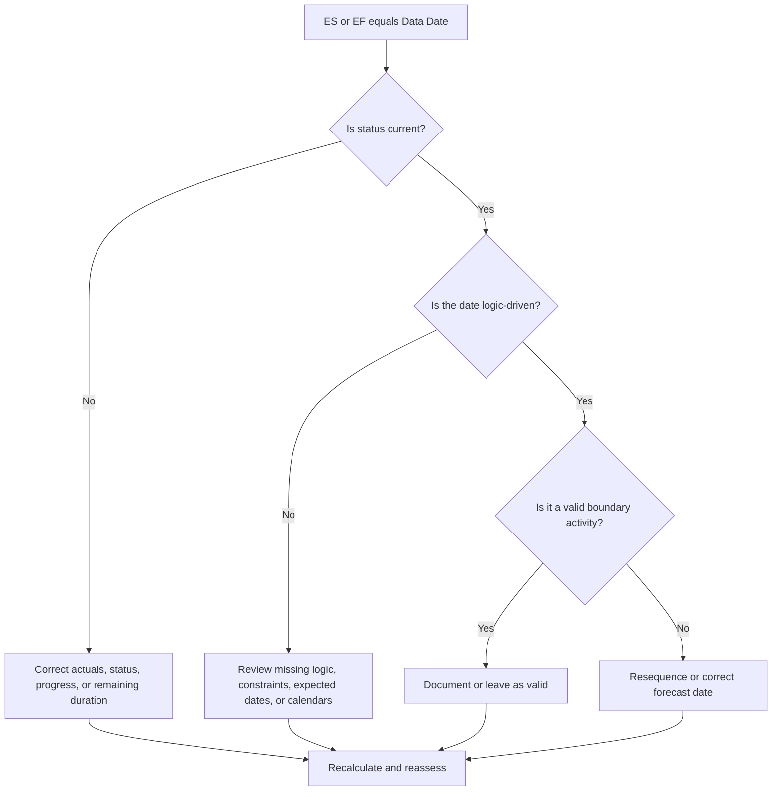

# Activities on the Data Date - Improvement Guide
## Purpose

This guide helps schedulers review activities whose Early Start or Early Finish falls exactly on the Primavera P6 Data Date. It supports update-cycle checks by showing where work is collecting at the boundary between actual performance and forecast work.

## Before You Start

Gather the following information before taking action:

- Current assessment result for this metric.
- Project Data Date used in the latest schedule calculation.
- List of activities where Early Start = Data Date.
- List of activities where Early Finish = Data Date.
- Activity Status, Actual Start, Actual Finish, Remaining Duration, Start, Finish, Total Float, and Calendar.
- Predecessor and successor relationship details.
- Constraints, expected dates, and update notes.

## Understand Your Result

A strong result is zero unexplained activities with Early Start or Early Finish on the Data Date.

Some activities may legitimately sit on the Data Date, especially near-term work that is ready to proceed or work finishing at the update boundary. The issue is not the date alone; the issue is whether the date is explained by valid status, logic, and update information.

A weak result means many activities are collecting at the Data Date without a clear schedule reason.

## Improvement Goal

The target is 0 unexplained activities with ES = Data Date or EF = Data Date.

The goal is to confirm whether each activity is correctly statused, logically driven, and forecast from the right update boundary.

## Action Plan

### Step 1: Identify the Main Issue

Create a P6 layout or report that filters for activities where Early Start equals the Data Date or Early Finish equals the Data Date. Include Activity ID, Activity Name, WBS, Activity Status, Early Start, Early Finish, Start, Finish, Actual Start, Actual Finish, Remaining Duration, Total Float, Calendar, constraints, predecessors, and successors.

Review each activity and ask:

- Is the activity complete, in progress, or not started?
- Is an Actual Start or Actual Finish missing?
- Is the activity logically driven to the Data Date?
- Is a constraint, expected date, or calendar pushing the activity to the Data Date?
- Is the activity open-ended or weakly linked?
- Is the Data Date correct for the update period?

### Step 2: Apply the Recommended Fixes

If status is incomplete, correct Actual Start, Actual Finish, Remaining Duration, Percent Complete, and Activity Status before changing logic.

If an activity is starting on the Data Date because predecessor logic is missing or non-driving, add or correct relationships that represent the real work sequence.

If an activity is finishing on the Data Date because progress was not updated, confirm whether the work finished by the update boundary. Enter Actual Finish if complete, or update Remaining Duration and forecast finish if work remains.

If constraints or expected dates are pushing activities to the Data Date, remove, revise, or document them according to the project controls procedure.

### Step 3: Remove Common Blockers

Common blockers include incomplete actualization, open starts, open finishes, constraints used as substitutes for logic, and Data Date movement without enough status review.

Another blocker is assuming that activities on the Data Date are harmless. A large cluster at the update boundary can hide missing sequencing or make the near-term forecast look cleaner than it is.

### Step 4: Validate the Changes

Recalculate the schedule after corrections. Re-run the metric and confirm that each remaining activity on the Data Date is explained by current status, valid logic, or an approved exception.

Review total float, critical or longest path, milestone dates, and near-term lookahead reports to confirm the correction did not create new inconsistencies.

## Improvement Schedule

### Day 1: Review and Diagnose

Run the metric, confirm the Data Date, and separate findings into ES on Data Date, EF on Data Date, status issues, logic issues, constraints, and valid boundary activities.

### Days 2-3: Implement Priority Actions

Correct critical, near-critical, and near-term activities first. Update status, add or correct logic, and review constraints.

### Days 4-5: Monitor Early Results

Recalculate the schedule and review lookahead outputs, float changes, milestone movement, and activities still sitting on the Data Date.

### Day 6: Final Adjustments

Resolve remaining uncertain items with the responsible discipline, field lead, or project controls lead.

### Day 7: Reassess and Compare

Run the assessment again and compare the result against the target threshold.

## Tracking Progress

Use a simple tracker to manage corrections and approvals.

| Date | Action Taken | Expected Impact | Result / Observation | Next Step |
| --- | --- | --- | --- | --- |
| [Date] | Reviewed ES/EF on Data Date | Identify boundary clustering | [Observed result] | Assign owner |
| [Date] | Corrected status or actual dates | Align work status with update boundary | [Observed result] | Recalculate schedule |
| [Date] | Corrected logic or constraints | Reduce unexplained Data Date clustering | [Observed result] | Reassess metric |

## If Results Do Not Improve

If results do not improve, check whether activities are repeatedly being pulled to the Data Date by missing logic, constraints, stale expected dates, or incomplete update procedures.

Escalate unresolved items when they affect critical, near-critical, client reporting, handover, payment, or near-term execution work.

## Maintenance

Review this metric during every update cycle before issuing reports. It is especially useful after moving the Data Date, importing progress, resequencing work, or recalculating after major status changes.

## Summary Checklist

- [ ] Current result reviewed
- [ ] Target threshold confirmed
- [ ] Data Date confirmed
- [ ] ES = Data Date activities reviewed
- [ ] EF = Data Date activities reviewed
- [ ] Status and actual dates checked
- [ ] Remaining Duration checked
- [ ] Logic and constraints reviewed
- [ ] Valid boundary activities documented
- [ ] Schedule recalculated
- [ ] Assessment repeated
- [ ] Next steps documented

## Related Content
- [Overview](01_overview_template.md)
- [Blog Article](03_blog_template.md)
- [What A Schedule Is](../../01b_blogs_en/01_WHAT%20A%20SCHEDULE%20IS/01_blog.md)
- [Robust Logic](../../01b_blogs_en/02_ROBUST%20LOGIC/02_ROBUST%20LOGIC.md)
