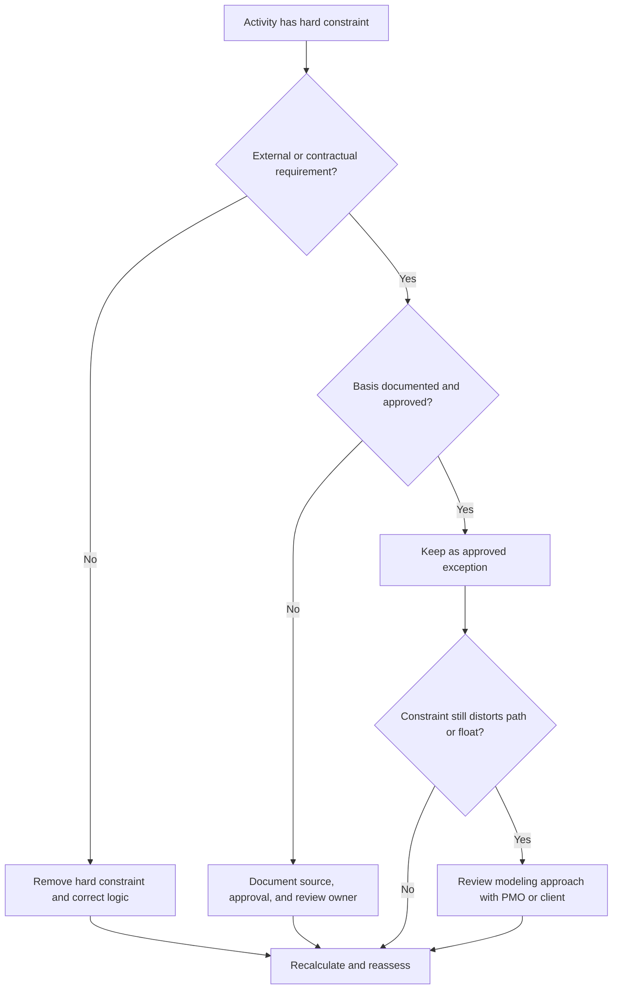

# Hard Constraints - Improvement Guide
## Purpose

This guide helps schedulers review and reduce hard constraints in Primavera P6. It focuses on constraints that strongly control activity dates, especially Mandatory Start and Mandatory Finish.

## Before You Start

Gather the following information before taking action:

- Current assessment result for this metric.
- List of activities with hard constraints.
- Constraint Type and Constraint Date for each activity.
- Activity ID, Activity Name, WBS, Activity Status, Start, Finish, Total Float, and critical or longest path status.
- Predecessor and successor relationship details.
- Contract, client, permit, access, regulatory, or handover basis for any required constraint.
- Baseline or prior update comparison showing when the constraint was added.

## Understand Your Result

A strong result is zero unexplained hard constraints.

Hard constraints can override or heavily restrict normal CPM calculation. They may be valid for contract dates, access windows, permit releases, regulatory hold points, or owner-directed requirements, but they should not be used as a substitute for missing logic.

A weak result means the schedule contains imposed dates that may be controlling the forecast instead of the network logic.

## Improvement Goal

The target is 0 unexplained hard constraints.

The goal is to remove unnecessary hard constraints and document any constraints that are truly required.

## Action Plan

### Step 1: Identify the Main Issue

Create a P6 layout or report that filters for activities with hard constraint types. Include Activity ID, Activity Name, WBS, Activity Status, Start, Finish, Constraint Type, Constraint Date, Total Float, critical or longest path status, predecessors, and successors.

Review each constrained activity and ask:

- What is the source of the hard constraint?
- Is it contractually or externally required?
- Is it replacing missing predecessor or successor logic?
- Is it forcing a target date that should be forecast by the schedule?
- Does it affect total float, critical path, or milestone reporting?
- Is the reason documented and approved?

### Step 2: Apply the Recommended Fixes

If the hard constraint is not externally required, remove it and add or correct CPM logic. Use relationships, activity sequencing, calendars, and realistic durations to model the work instead of forcing dates.

If the hard constraint is required, document the basis. Capture the source, approval, date, responsible owner, and reason it cannot be modeled with normal logic.

If the constraint is being used to preserve a target date, review whether a softer constraint, milestone, deadline, or reporting note would be more appropriate.

### Step 3: Remove Common Blockers

Common blockers include inherited constraints from old baselines, client target dates entered as mandatory dates, recovery plans that leave temporary constraints behind, and missing interface logic.

Another blocker is assuming a hard constraint is acceptable because the date is important. Important dates should be visible, but the schedule should still explain how the work reaches them.

### Step 4: Validate the Changes

Recalculate the schedule after corrections. Re-run the metric and confirm that remaining hard constraints are approved and documented.

Review total float, critical or longest path, milestone dates, and schedule comparison outputs to confirm the correction did not create unexpected movement.

## Improvement Schedule

### Day 1: Review and Diagnose

Run the metric and group findings by WBS, constraint type, criticality, and documented basis.

### Days 2-3: Implement Priority Actions

Remove unnecessary hard constraints from critical, near-critical, contractual, and near-term activities first. Add missing logic where needed.

### Days 4-5: Monitor Early Results

Recalculate the schedule and review float movement, critical path changes, and milestone impacts.

### Day 6: Final Adjustments

Resolve remaining exceptions with the scheduler, project controls lead, PMO reviewer, or client representative.

### Day 7: Reassess and Compare

Run the assessment again and compare the result against the target threshold.

## Tracking Progress

Use a simple tracker to manage corrections and approvals.

| Date | Action Taken | Expected Impact | Result / Observation | Next Step |
| --- | --- | --- | --- | --- |
| [Date] | Reviewed hard constraints | Identify imposed date controls | [Observed result] | Assign owner |
| [Date] | Removed unnecessary hard constraint | Restore logic-driven calculation | [Observed result] | Recalculate schedule |
| [Date] | Documented approved hard constraint | Preserve justified exception | [Observed result] | Reassess metric |

## If Results Do Not Improve

If results do not improve, check whether hard constraints are being reintroduced through imports, copied fragnets, baseline updates, or recovery schedule changes.

Escalate unresolved items when they affect critical path, contractual milestones, client reporting, delay analysis, payment events, or handover dates.

## Maintenance

Review this metric during every update cycle and before baseline approval. Hard constraints should be part of standard schedule health checks, especially after major resequencing, recovery planning, and client submission preparation.

## Summary Checklist

- [ ] Current result reviewed
- [ ] Target threshold confirmed
- [ ] Hard constraint list generated
- [ ] Constraint type and date checked
- [ ] External basis confirmed
- [ ] Unnecessary hard constraints removed
- [ ] Missing logic corrected
- [ ] Approved exceptions documented
- [ ] Schedule recalculated
- [ ] Float and critical path reviewed
- [ ] Assessment repeated
- [ ] Next steps documented

## Related Content
- [Overview](01_overview_template.md)
- [Blog Article](03_blog_template.md)
- [What A Schedule Is](../../01b_blogs_en/01_WHAT%20A%20SCHEDULE%20IS/01_blog.md)
- [Robust Logic](../../01b_blogs_en/02_ROBUST%20LOGIC/02_ROBUST%20LOGIC.md)
