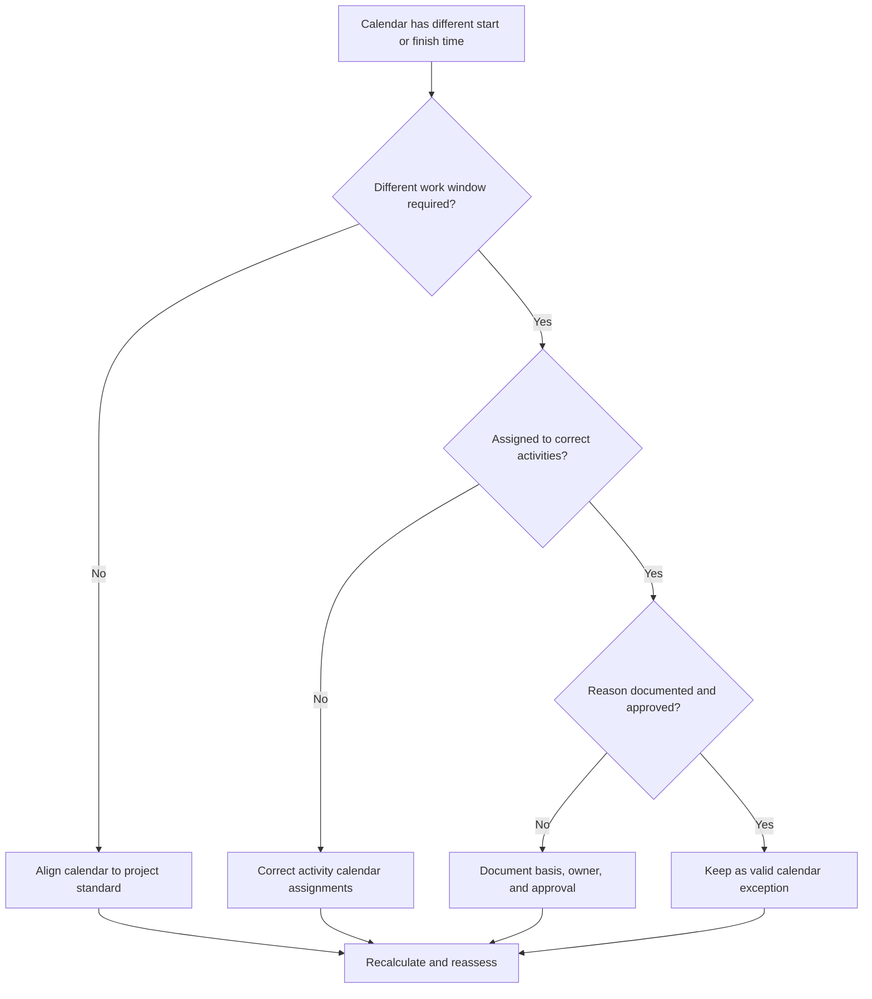

## Purpose

This guide helps schedulers review Primavera P6 calendars that use different workday start or finish times. It supports schedule quality checks by confirming that calendar time differences are intentional, approved, and understood.

## Before You Start

Gather the following information before taking action:

- Current assessment result for this metric.
- Approved project calendar standard and normal daily work window.
- List of calendars with different start times, finish times, shift windows, or partial-day patterns.
- Activities assigned to each affected calendar.
- Calendar type, such as global, project, or resource calendar.
- Critical or near-critical activities using affected calendars.
- Reason for each non-standard calendar, such as night shift, outage work, restricted access, or special crew schedule.

## Understand Your Result

A strong result is zero unexplained calendars with different start or finish times.

Calendar differences may be valid when work truly follows different shifts, access windows, or resource availability. The concern is when calendars differ by time of day without a clear reason.

A weak result means the schedule may contain hidden calendar assumptions that affect dates, float, and logic behavior.

## Improvement Goal

The target is 0 unexplained calendars with different start or finish times.

The goal is to confirm whether each different work window is required, documented, and assigned only to the right activities.

## Action Plan

### Step 1: Identify the Main Issue

Create a calendar review export from P6 or a schedule assessment tool that lists each calendar, its normal workday start time, finish time, daily hours, exceptions, and assigned activities.

Review each non-standard calendar and ask:

- What is the approved standard workday for the project?
- Which calendars use different start or finish times?
- Are the differences intentional or accidental?
- Which activities use each calendar?
- Are critical or near-critical activities affected?
- Is the calendar difference documented and approved?

### Step 2: Apply the Recommended Fixes

If the calendar difference is accidental, align the start time, finish time, and daily work periods with the approved project standard.

If the calendar difference is valid, document the reason. Common valid cases include night shift, weekend work, shutdown windows, owner access restrictions, environmental restrictions, or resource-specific work periods.

If activities are assigned to the wrong calendar, correct the activity calendar assignment before changing the calendar itself. A valid special calendar can still create problems if it is assigned too broadly.

### Step 3: Remove Common Blockers

Common blockers include copied calendars from old schedules, imported calendars with hidden time settings, resource calendars used as activity calendars, and small time differences that are not visible in standard date layouts.

Another blocker is reviewing only the date without the time. In P6, the time of day can affect activity placement, float, relationship behavior, and apparent one-day date movement.

### Step 4: Validate the Changes

Recalculate the schedule after calendar corrections. Re-run the metric and confirm that remaining calendar differences are valid and documented.

Review affected activity dates, total float, critical or longest path, relationship ties, and near-term lookahead reports to confirm that the correction did not create unexpected movement.

## Improvement Schedule

### Day 1: Review and Diagnose

Run the metric and group findings by calendar, work window, calendar type, assigned activities, and criticality.

### Days 2-3: Implement Priority Actions

Correct accidental calendar time differences and wrong activity calendar assignments on critical, near-critical, and near-term activities first.

### Days 4-5: Monitor Early Results

Recalculate the schedule and review float movement, date shifts, milestone impacts, and lookahead changes.

### Day 6: Final Adjustments

Resolve remaining calendar exceptions with the scheduler, discipline owner, project controls lead, or PMO reviewer.

### Day 7: Reassess and Compare

Run the assessment again and compare the result against the target threshold.

## Tracking Progress

Use a simple tracker to manage corrections and approvals.

| Date | Action Taken | Expected Impact | Result / Observation | Next Step |
| --- | --- | --- | --- | --- |
| [Date] | Reviewed calendar start and finish times | Identify non-standard work windows | [Observed result] | Assign owner |
| [Date] | Aligned calendar to project standard | Remove accidental time difference | [Observed result] | Recalculate schedule |
| [Date] | Documented valid calendar exception | Preserve justified work window | [Observed result] | Reassess metric |

## If Results Do Not Improve

If results do not improve, check whether non-standard calendars are being reintroduced through imports, copied schedules, resource assignments, or baseline updates.

Escalate unresolved calendar differences when they affect critical path, client reporting, payment milestones, outage work, handover dates, or near-term execution.

## Maintenance

Review this metric during baseline development, schedule imports, and every major update cycle. Calendar time settings should be part of standard schedule health checks before reports are issued.

## Summary Checklist

- [ ] Current result reviewed
- [ ] Target threshold confirmed
- [ ] Project calendar standard confirmed
- [ ] Non-standard calendar times identified
- [ ] Assigned activities reviewed
- [ ] Critical and near-critical impacts checked
- [ ] Accidental calendar differences corrected
- [ ] Valid calendar exceptions documented
- [ ] Schedule recalculated
- [ ] Date and float changes reviewed
- [ ] Assessment repeated
- [ ] Next steps documented

## Related Content
- [Blog Article](03_blog_template.md)
- [What A Schedule Is](../../01b_blogs_en/01_WHAT%20A%20SCHEDULE%20IS/01_blog.md)
- [Robust Logic](../../01b_blogs_en/02_ROBUST%20LOGIC/02_ROBUST%20LOGIC.md)
