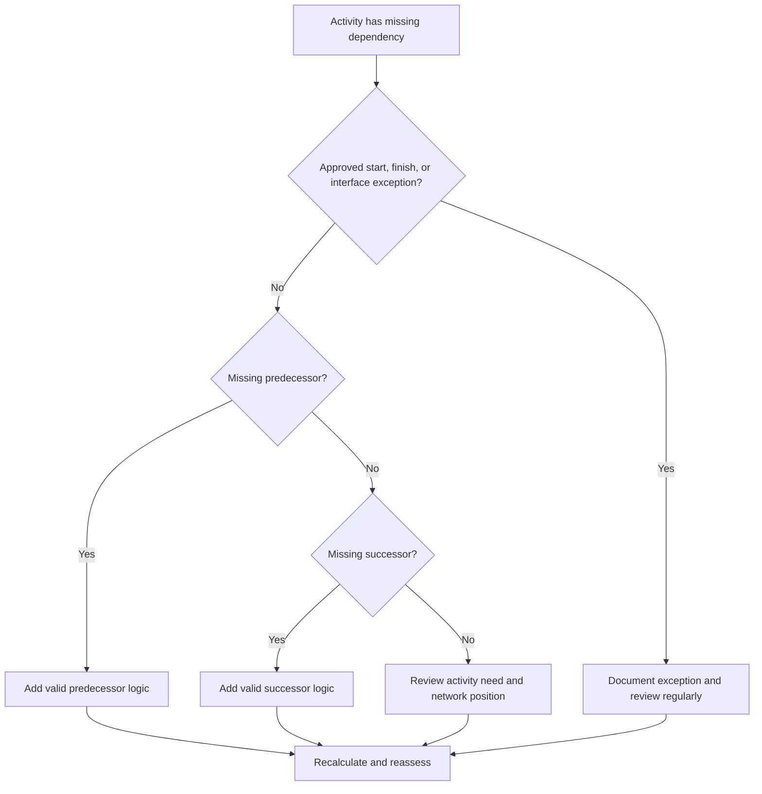

## Purpose

This guide helps schedulers identify and correct missing predecessor or successor logic in Primavera P6. It supports schedule quality by improving the completeness of the CPM network.

## Before You Start

Gather the following information before taking action:

- Current assessment result for this metric.
- List of activities with no predecessors.
- List of activities with no successors.
- List of activities with neither predecessor nor successor logic.
- Activity ID, Activity Name, WBS, Activity Type, Activity Status, Start, Finish, Total Float, and Calendar.
- Approved project start, project finish, external interface, and contractual exception list.
- Latest update notes and responsible discipline or package owner.

## Understand Your Result

A strong result is zero unresolved activities with missing dependency logic.

Some activities may legitimately have no predecessor or no successor, such as the approved project start milestone, final completion milestone, or approved external interface milestones. These should be limited and documented.

A weak result means the schedule contains activities that are not properly connected to the CPM network.

## Improvement Goal

The target is 0 unresolved activities with missing dependencies.

The goal is to connect each activity to valid predecessor and successor logic, or document the approved reason why it is an exception.

## Action Plan

### Step 1: Identify the Main Issue

Create a P6 layout or report that filters for activities with no predecessors, no successors, or neither. Include Activity ID, Activity Name, WBS, Activity Type, Activity Status, Start, Finish, Total Float, Calendar, constraints, predecessors, and successors.

Review each activity and ask:

- Is this activity an approved project start or project finish item?
- Is it an external interface, owner-controlled date, or contractual exception?
- What work must happen before this activity can start?
- What work depends on this activity finishing or starting?
- Is the activity obsolete, duplicated, or incorrectly statused?
- Which owner can confirm the real dependency?

### Step 2: Apply the Recommended Fixes

For open starts, add predecessor logic that represents the real condition required before the activity can begin. This may include prior work, approvals, access, procurement, design release, inspection, or handover.

For open finishes, add successor logic that represents what depends on the activity. This may include follow-on work, testing, commissioning, turnover, closeout, or a completion milestone.

For isolated activities with no predecessors and no successors, confirm whether the activity is still needed. If it is valid work, connect it to the network. If it is obsolete, remove or close it according to the project controls procedure.

### Step 3: Remove Common Blockers

Common blockers include copied activities, incomplete fragnets, unclear handoffs between disciplines, missing interface information, and pressure to load activities before sequencing is known.

Another blocker is adding placeholder relationships only to pass the metric. Relationships should represent real dependencies, not artificial links.

### Step 4: Validate the Changes

Recalculate the schedule after corrections. Re-run the metric and confirm that each remaining activity is either connected or documented as an approved exception.

Review total float, critical or longest path, milestone dates, and near-term lookahead reports to confirm that the added logic did not create unexpected movement.

## Improvement Schedule

### Day 1: Review and Diagnose

Run the metric and group findings into missing predecessors, missing successors, isolated activities, valid exceptions, and obsolete activities.

### Days 2-3: Implement Priority Actions

Correct critical, near-critical, contractual, and near-term activities first. Add valid logic and remove obsolete activities where appropriate.

### Days 4-5: Monitor Early Results

Recalculate the schedule and review float, critical path, lookahead dates, and milestone impacts.

### Day 6: Final Adjustments

Resolve remaining dependency questions with discipline leads, package owners, construction managers, or project controls leadership.

### Day 7: Reassess and Compare

Run the assessment again and compare the result against the target threshold.

## Tracking Progress

Use a simple tracker to manage corrections and approvals.

| Date | Action Taken | Expected Impact | Result / Observation | Next Step |
| --- | --- | --- | --- | --- |
| [Date] | Reviewed missing dependencies | Identify open starts and open finishes | [Observed result] | Assign owner |
| [Date] | Added predecessor logic | Improve activity start logic | [Observed result] | Recalculate schedule |
| [Date] | Added successor logic | Improve activity finish continuity | [Observed result] | Reassess metric |

## If Results Do Not Improve

If results do not improve, check whether new activities are being added without logic, imported fragnets are incomplete, or exception rules are too loose.

Escalate unresolved items when they affect critical path, client reporting, payment milestones, handover, procurement, or near-term execution.

## Maintenance

Review this metric during every update cycle, after schedule imports, and before baseline approval. Missing dependencies should be part of standard schedule health checks.

## Summary Checklist

- [ ] Current result reviewed
- [ ] Target threshold confirmed
- [ ] Open starts reviewed
- [ ] Open finishes reviewed
- [ ] Isolated activities reviewed
- [ ] Valid exceptions documented
- [ ] Missing predecessor logic added
- [ ] Missing successor logic added
- [ ] Obsolete activities resolved
- [ ] Schedule recalculated
- [ ] Assessment repeated
- [ ] Next steps documented

## Related Content
- [Blog Article](03_blog_template.md)
- [What A Schedule Is](../../01b_blogs_en/01_WHAT%20A%20SCHEDULE%20IS/01_blog.md)
- [Robust Logic](../../01b_blogs_en/02_ROBUST%20LOGIC/02_ROBUST%20LOGIC.md)
