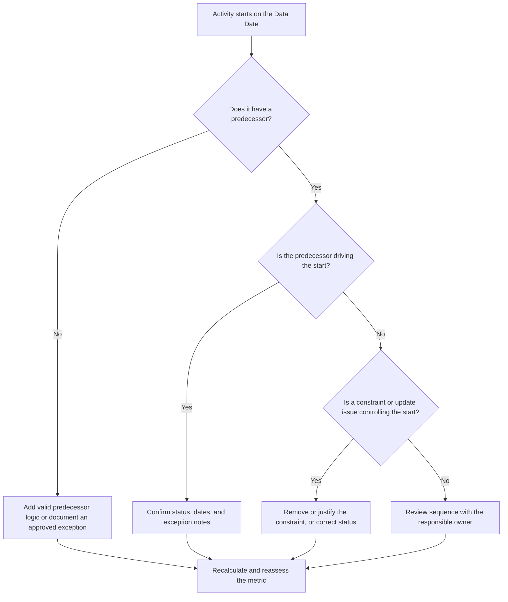

## Purpose

This guide helps schedulers and project controls teams reduce or eliminate activities that are scheduled to start on the Primavera P6 Data Date without valid predecessor logic driving the start. It applies to schedule quality reviews, PMO health checks, and update-cycle validation.

The objective is to confirm that near-term work is supported by clear CPM logic and that activities are not starting on the Data Date only because of missing relationships, constraints, manual dates, or incomplete progress updates.

## Before You Start

Gather the following information before taking action:

- Current assessment result for this metric.
- Project Data Date used in the latest schedule calculation.
- List of open or not-started activities with a start date equal to the Data Date.
- Predecessor and successor relationship details for each activity.
- Constraints, expected dates, actual dates, and calendar assignments.
- P6 scheduling options used for the update, including retained logic or progress override settings where relevant.
- Any approved exceptions, such as project start activities, external interface milestones, or owner-directed starts.

## Understand Your Result

A strong result is zero unresolved activities starting on the Data Date without driving predecessor logic. This means the current and near-term work is connected to the schedule network and the Data Date is not hiding missing sequencing.

An acceptable result may include a small number of documented exceptions. These should be reviewed and approved, not ignored. For example, a notice-to-proceed milestone or an externally authorized activity may not need a normal predecessor, but the reason should be visible to reviewers.

A weak result means multiple activities are starting on the Data Date without a clear logical driver. This may indicate open starts, missing predecessor relationships, excessive constraints, incomplete progress updates, or activities that were not properly resequenced after the latest update.

## Improvement Goal

The target is 0 unresolved activities starting on the Data Date with no valid driving logic.

The improvement goal is not only to reduce the count. The deeper goal is to make sure each activity near the Data Date has a defensible reason for its forecast start. After correction, each affected activity should either have appropriate predecessor logic, a documented exception, or a corrected status/date condition.

## Action Plan

### Step 1: Identify the Main Issue

Create a P6 layout or report that filters for open or not-started activities with a start date equal to the Data Date. Include columns for Activity ID, Activity Name, WBS, Start, Finish, Status, Total Float, Calendar, Primary Constraint, Predecessors, Successors, and Driving Relationship indicators if available.

Review each activity and ask:

- Does the activity have any predecessors?
- If predecessors exist, are they actually driving the start?
- Is the activity being held or moved by a constraint?
- Is the activity missing an actual start or progress update?
- Is the activity a valid exception, such as a project start milestone?
- Does the activity belong to a WBS area where logic is generally weak?

Group the findings into practical causes: missing predecessors, non-driving predecessors, constraints or expected dates, update/status errors, or approved exceptions.

### Step 2: Apply the Recommended Fixes

Start with missing or weak logic. Add valid predecessor relationships that represent the real sequence of work, such as finish-to-start, start-to-start, or finish-to-finish relationships where appropriate. Avoid adding relationships only to satisfy the metric; each relationship should reflect a real construction, engineering, procurement, access, approval, or handover dependency.

Review constraints next. If an activity is starting on the Data Date because of a start constraint, confirm whether the constraint is contractually or operationally justified. Remove unnecessary constraints and allow the activity to be driven by logic. If the constraint is valid, document the reason and confirm that it does not distort the critical path.

Check progress status. If work has already started, update the actual start and remaining duration correctly. If work has not started, confirm that the forecast start should remain on the Data Date. An activity should not appear ready to start simply because the update cycle pulled it to the current date.

After changes are made, recalculate the schedule and review the affected activities again. Confirm that the start date is now driven by logic, correctly statused, or documented as an approved exception.

### Step 3: Remove Common Blockers

Common blockers include unclear field feedback, missing interface information, and pressure to make near-term work look ready. Resolve these by reviewing the affected activities with discipline leads, construction managers, procurement owners, or package managers.

Another common blocker is the misuse of constraints as a substitute for logic. Constraints may be needed in some cases, but they should not replace the schedule network. If a constraint is retained, document why it exists and how it affects float and the longest path.

Also check whether the issue is caused by schedule calculation settings or update practices. If progress override, retained logic, out-of-sequence progress, or incomplete actualization is affecting the result, align the update method with the project controls procedure before reassessing the metric.

### Step 4: Validate the Changes

Validate the corrected schedule before the next assessment. Re-run the filter for open or not-started activities starting on the Data Date with no driving logic. Confirm that each remaining item is either corrected or documented as an approved exception.

Review total float, longest path, and near-term lookahead activities after recalculation. A logic correction may change the critical path or reveal additional sequencing issues. If the schedule movement is significant, communicate the impact to the project controls lead or PMO reviewer.

## Improvement Schedule

### Day 1: Review and Diagnose

Run the metric, confirm the Data Date, and produce the activity list. Separate the results into missing logic, non-driving logic, constraints, status errors, and potential exceptions.

### Days 2-3: Implement Priority Actions

Correct the highest-impact activities first, especially critical or near-critical activities. Add valid predecessor logic, remove unnecessary constraints, update incorrect status, and document exceptions.

### Days 4-5: Monitor Early Results

Recalculate the schedule and review whether the affected activities are now logic-driven. Check for unexpected changes to total float, longest path, and milestone dates.

### Day 6: Final Adjustments

Resolve remaining blockers with the responsible discipline or package owner. Confirm that any retained exceptions are justified and clearly documented.

### Day 7: Reassess and Compare

Run the assessment again and compare the new result against the previous result and target threshold. Confirm whether the metric is now at zero unresolved activities or whether further action is required.

## Tracking Progress

Use a simple tracker to manage corrections and approvals.

| Date | Action Taken | Expected Impact | Result / Observation | Next Step |
| --- | --- | --- | --- | --- |
| [Date] | Reviewed activities starting on the Data Date with no driving logic | Identify missing or weak logic | [Observed result] | Assign corrections to responsible owner |
| [Date] | Added valid predecessor relationships | Improve CPM sequencing | [Observed result] | Recalculate and review float impact |
| [Date] | Removed or justified constraints | Reduce artificial starts | [Observed result] | Confirm remaining exceptions |
| [Date] | Updated incorrect activity status | Improve update accuracy | [Observed result] | Re-run assessment |

## If Results Do Not Improve

If the result does not improve, review whether the same activities are still failing or whether new activities are appearing at the Data Date. Repeated failures may indicate a broader schedule development issue, such as incomplete logic in a WBS area, weak update discipline, or inconsistent use of constraints.

Escalate persistent issues to the project controls lead, planning manager, or PMO reviewer. For major schedules, consider a focused logic review workshop for the affected work packages. If the schedule is used for contractual reporting, delay analysis, or earned value forecasting, unresolved items should be treated as a quality concern.

## Maintenance

Review this metric during every update cycle before issuing the schedule. The check should be part of the standard schedule health review, especially after progress updates, resequencing, major scope changes, or recovery planning.

Good maintenance habits include keeping predecessor and successor columns visible in P6 layouts, reviewing open starts before each submission, documenting approved exceptions, and checking that Data Date movement does not create a new group of undriven activities.

## Summary Checklist

- [ ] Current result reviewed
- [ ] Target threshold confirmed
- [ ] Data Date confirmed
- [ ] Activities starting on the Data Date identified
- [ ] Main issue identified
- [ ] Missing or weak logic corrected
- [ ] Constraints reviewed and justified or removed
- [ ] Status dates checked
- [ ] Approved exceptions documented
- [ ] Schedule recalculated
- [ ] Results monitored
- [ ] Assessment repeated
- [ ] Next steps documented
