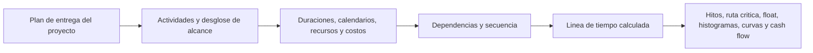

Un cronograma de proyecto es mas que una lista de fechas. Es una representacion grafica y logica del plan de entrega del proyecto. Explica como se ejecutara el proyecto desde el inicio hasta el final, como se conectan los paquetes de trabajo, cuando deben alcanzarse los hitos principales y que informacion debe usar el equipo para tomar decisiones.

En terminos simples, el cronograma convierte el plan del proyecto en una hoja de ruta. Ayuda a que todos los involucrados entiendan que debe hacerse, cuando debe ocurrir y quien es responsable de hacerlo posible. Para project managers, planners, equipos de construccion, ingenieros, responsables de procura y revisores PMO, el cronograma se convierte en una de las herramientas principales de coordinacion y control.

El cronograma es una linea de tiempo, pero no es solamente una linea de tiempo. Un cronograma debil puede mostrar fechas. Un cronograma fuerte explica por que esas fechas son creibles.

## El Cronograma como Hoja de Ruta de Entrega

Todo proyecto empieza con una intencion. El equipo sabe que debe entregar: un edificio, una planta, un sistema industrial, un parada, una obra de infraestructura o un paquete de trabajo. Pero entregar requiere mas que conocer el objetivo final. El equipo debe entender la secuencia.

Que va primero? Que puede ocurrir en paralelo? Que debe esperar por aprobacion de diseno, entrega de materiales, acceso, liberacion de permisos, pruebas o entrega? Que actividades controlan la fecha final? Que hitos importan mas al cliente?

Un cronograma responde esas preguntas convirtiendo el plan en actividades, duraciones, dependencias, calendarios, recursos, costos e hitos.

La linea de tiempo grafica es util porque las personas pueden ver el trabajo. La red logica es util porque el software puede calcular el trabajo. Juntas, permiten que el cronograma sea una herramienta de comunicacion y una herramienta de control.

## Que Alimenta el Cronograma

Un cronograma es tan confiable como la informacion usada para construirlo. En Primavera P6, el cronograma se alimenta de varios insumos principales.

El primer insumo es la lista de actividades. Las actividades dividen el proyecto en partes manejables de trabajo. Cada actividad debe ser suficientemente clara para planificar, actualizar y medir.

El segundo insumo es la duracion deterministica. Es el tiempo de trabajo planificado necesario para completar cada actividad. La duracion debe reflejar el metodo de ejecucion, productividad, tamano de cuadrilla, acceso, restricciones de frente de trabajo y condiciones del proyecto.

El tercer insumo es la logica de dependencias. Las dependencias explican como se relacionan las actividades. Una actividad puede necesitar terminar antes de que otra inicie. Dos actividades pueden iniciar juntas. Dos finales pueden necesitar alinearse. Estas relaciones crean la red CPM.

El cuarto insumo es la secuencia. La secuencia es el orden practico de ejecucion. Considera constructabilidad, flujo de ingenieria, tiempos de procura, acceso, logica de commissioning, estrategia de entrega y prioridades del cliente.

El quinto insumo son recursos y costos. La carga de recursos permite que el cronograma muestre la demanda de mano de obra, equipos y materiales en el tiempo. La carga de costos permite soportar cash flow, earned value y pronostico financiero.

Cuando estos insumos son completos y realistas, el cronograma puede producir salidas utiles.

## Que Nos Dice el Cronograma

Un cronograma bien construido indica la duracion total del proyecto. Muestra hitos de completacion y entregables intermedios. Produce histogramas de recursos que muestran cuando sube o baja la demanda de mano de obra o equipos. Soporta curvas de progreso, curvas de cash flow, reporte de earned value y planificacion lookahead.

Mas importante aun, identifica la ruta critica o longest path. Esta es la cadena de trabajo que impulsa la terminacion del proyecto. Si las actividades de esa ruta se retrasan, la fecha final del proyecto puede retrasarse. Por eso la logica importa tanto. Sin buenas dependencias, la ruta critica puede no mostrar los verdaderos impulsores del proyecto.

El float es otra salida importante. El float indica cuanta flexibilidad tiene una actividad antes de afectar otra actividad o la fecha final del proyecto. Pero el float solo es significativo cuando la red del cronograma esta completa. Si faltan relaciones, el float puede verse mejor o peor que la realidad.

## Por Que la Logica Hace Creible la Linea de Tiempo

Aqui es donde la metrica "Actividades que comienzan en la fecha de datos sin logica impulsora" se vuelve importante.

La fecha de datos en P6 es el limite entre el desempeno real y el pronostico. Todo lo anterior a la fecha de datos debe representar lo que ya ocurrio. Todo lo posterior debe representar el plan desde ahora hacia adelante.

Cuando las actividades comienzan exactamente en la fecha de datos sin logica que las impulse, el cronograma envia una senal de alerta. Puede parecer que el trabajo esta listo para iniciar inmediatamente, pero el cronograma puede no explicar por que. Puede no existir un predecesor que muestre que el area esta disponible, ningun enlace con entrega de materiales, ninguna relacion con aprobacion de diseno, ninguna conexion con liberacion de inspeccion y ninguna logica desde el trabajo previo.

Eso importa porque un cronograma no debe simplemente colocar trabajo en una fecha. Debe explicar el camino hacia esa fecha.

Si una actividad inicia en la fecha de datos porque todo el trabajo predecesor requerido esta completo y la logica respalda el inicio, la fecha es defendible. Si inicia alli porque la actividad esta abierta, sin impulsor, restringida o mal actualizada, la fecha es debil. El equipo puede creer que el trabajo esta listo cuando las condiciones habilitantes reales no fueron modeladas.

## Un Ejemplo Practico

Imagine un cronograma con fecha de datos del 01 de junio. Despues de la actualizacion, varias actividades inician el 01 de junio:

- Instalar bandejas de cable en Area B.
- Iniciar pruebas de presion de tuberia.
- Comenzar alineacion de equipos.
- Movilizar cuadrilla de aislamiento.

A primera vista, el lookahead parece activo y listo. Pero cuando el planificador revisa la logica, aparece el problema. La instalacion de bandejas no esta vinculada a la entrega de materiales. Las pruebas de presion no estan vinculadas a la finalizacion de tuberia. La alineacion de equipos no tiene el predecesor de completacion mecanica. La movilizacion de aislamiento no tiene predecesor de liberacion de acceso.

El cronograma muestra trabajo en la fecha de datos, pero no explica por que ese trabajo puede iniciar. Eso no es una hoja de ruta confiable. Es una lista de intenciones de corto plazo.

La correccion es agregar o corregir logica CPM real. Si la entrega de materiales impulsa la instalacion de bandejas, se debe vincular. Si la completacion de tuberia impulsa las pruebas de presion, se debe vincular. Si la liberacion de acceso impulsa aislamiento, esa condicion debe modelarse. Despues de recalcular, algunas actividades pueden seguir iniciando cerca de la fecha de datos, pero ahora el cronograma puede explicar por que.

## Que Debe Hacer un Buen Cronograma

Un buen cronograma debe ayudar al equipo a ver el plan, probar el plan y gestionar el plan.

Debe mostrar que necesita hacerse. Debe explicar el orden del trabajo. Debe identificar quien debe actuar y cuando. Debe revelar la ruta critica. Debe soportar planificacion de recursos, medicion de progreso, pronostico de cash flow y reporte PMO.

Tambien debe hacer visibles los puntos debiles. Logica faltante, hard restricciones, fechas obsoletas, open starts, open finishes y actividades agrupadas en la fecha de datos no son solo temas tecnicos. Afectan como el equipo entiende preparacion, riesgo y control.

## Conclusion

Un cronograma es el plan de entrega del proyecto expresado como tiempo, logica y trabajo medible. Es una hoja de ruta, un modelo de calculo y una herramienta de comunicacion.

Cuando esta bien construido, le dice al equipo que debe ocurrir, cuando debe ocurrir y por que las fechas son creibles. Cuando las actividades comienzan en la fecha de datos sin logica impulsora, esa credibilidad se debilita. El cronograma deja de explicar el plan y empieza a adivinar el siguiente paso.

Por eso, las revisiones de calidad del cronograma deben hacer siempre una pregunta simple: el cronograma explica por que el trabajo inicia cuando inicia? Si la respuesta es si, el cronograma esta haciendo su trabajo. Si la respuesta es no, la hoja de ruta necesita mas logica antes de poder confiar en ella.
## Contenido relacionado
- [Actividades que Comienzan en la fecha de datos sin Lógica Impulsora: Por Qué Importa esta Métrica del Cronograma - Descripción general](../../metrics/01_activities_starting_in_dd_with_no_logic_driving/02_guide_template.md)
- [Logica Robusta](../02_ROBUST%20LOGIC/02_ROBUST%20LOGIC.md)
