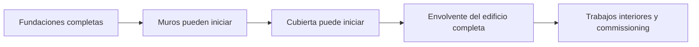
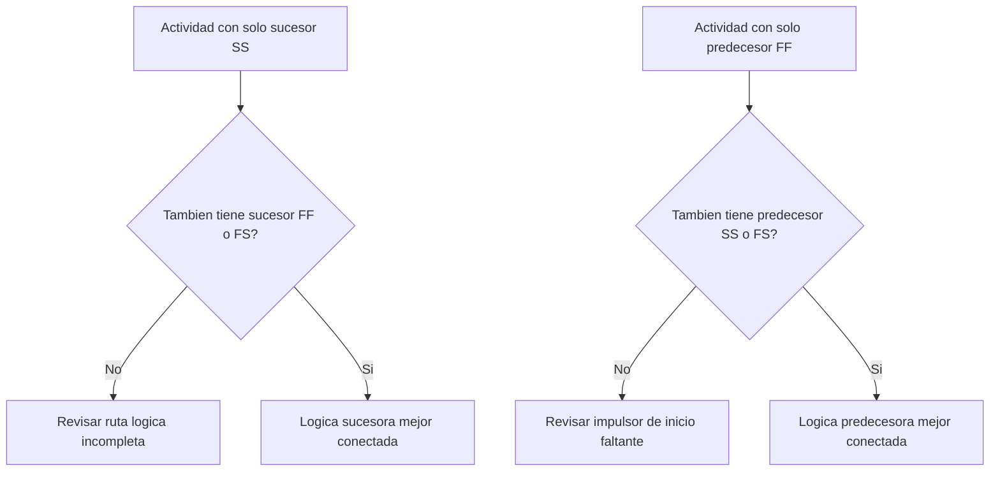

# Logica Robusta

La logica es la representacion matematica de la secuencia y las dependencias dentro de un cronograma de proyecto. Explica que debe ocurrir antes de que otra actividad pueda avanzar, que actividades pueden ejecutarse al mismo tiempo y como el equipo del proyecto pretende moverse desde la primera actividad hasta la terminacion final.

En un buen cronograma de Primavera P6, la logica no es decoracion. Es el motor que permite calcular fechas, float, ruta critica y movimiento del pronostico. Cuenta la historia de ejecucion de una forma que puede revisarse, cuestionarse y mejorarse.

Si el cronograma dice "colocar fundaciones, luego construir muros y luego construir la cubierta", la logica convierte esa secuencia en una red calculable. El planificador no solo dibuja una linea de tiempo. Define el camino de entrega.

## La Logica Cuenta la Historia del Trabajo

Todo equipo de proyecto tiene una forma prevista de ejecutar el trabajo. Ingenieria puede liberar diseno por area. Procura puede entregar equipos por paquete. Civil puede preparar acceso antes de que empiece estructura. La completacion mecanica puede ser necesaria antes de iniciar commissioning.

Los enlaces logicos son la expresion matematica de ese plan.

Este diagrama simple no es solo una secuencia. Es un modelo de decision. Si las fundaciones se atrasan, los muros pueden atrasarse. Si los muros se atrasan, la cubierta puede atrasarse. Si la cubierta se atrasa, los trabajos interiores pueden afectarse. El cronograma solo puede mostrar ese impacto si la logica existe.

Logica robusta significa que el cronograma puede explicar por que las actividades inician, por que terminan y que ocurre cuando una parte del plan se mueve.

## Por Que la Logica Robusta Importa en la fecha de datos

La metrica "Actividades que comienzan en la fecha de datos sin logica impulsora" es una prueba fuerte de calidad del cronograma.

La fecha de datos es el limite entre el desempeno real y el trabajo pronosticado. Cuando una actividad inicia exactamente en la fecha de datos, el revisor debe hacer una pregunta simple: que impulsa este inicio?

Si la actividad tiene logica predecesora valida, el cronograma puede explicar el inicio. Tal vez se libero un area. Tal vez se completo una entrega de materiales. Tal vez la actividad predecesora termino y permitio que la siguiente cuadrilla comenzara.

Si la actividad no tiene logica impulsora, el inicio es mas debil. La actividad puede estar ubicada en la fecha de datos porque no tiene predecesor, porque la logica esta incompleta, porque un restriccion la fuerza o porque la actualizacion no fue completada correctamente.

Por eso importa la logica robusta. Un cronograma no debe permitir que el trabajo parezca listo solo porque se movio la fecha de datos. Debe mostrar la condicion real que permite que el trabajo inicie.

## El Balance: Logica Suficiente, No Logica Redundante

La buena logica es balanceada. El cronograma necesita suficientes relaciones para conectar correctamente las actividades con predecesores y sucesores. Al mismo tiempo, debe evitar logica redundante que repite la misma dependencia de formas innecesarias.

Muy poca logica crea open starts, open finishes, float poco confiable y resultados debiles de ruta critica. Demasiada logica puede hacer que la red sea dificil de revisar y puede ocultar el verdadero impulsor de una actividad.

La meta no es maximizar la cantidad de relaciones. La meta es representar dependencias obligatorias y necesarias con claridad.

Para cada actividad, el planificador debe poder responder:

- Que permite que esta actividad inicie?
- Que habilita esta actividad despues?
- Que relacion esta realmente impulsando la actividad?
- Alguna relacion esta duplicada o es innecesaria?
- Un revisor entenderia la secuencia prevista?

Este balance es central en revisiones PMO de cronograma. Una red densa no es automaticamente una red fuerte. Una red liviana no es automaticamente una red limpia. La red correcta explica el plan de ejecucion sin ruido.

## Cada Actividad Necesita un Impulsor de Inicio

Logica robusta significa que cada actividad tiene un predecesor que permite o dispara su inicio, excepto excepciones validas de inicio de proyecto o autorizaciones externas.

Para una actividad de construccion, el impulsor de inicio puede ser acceso al area, completacion de un predecesor, disponibilidad de materiales, liberacion de diseno, aprobacion de permisos o finalizacion del trade anterior. Para una actividad de procura, puede ser aprobacion de diseno o liberacion de purchase order. Para commissioning, puede ser completacion mecanica, preparacion del paquete de pruebas o turnover del sistema.

Cuando falta este impulsor de inicio, la actividad puede flotar a una posicion artificial en el cronograma. Durante las actualizaciones, puede aparecer en la fecha de datos. Eso crea una falsa sensacion de estar listo.

Considere una actividad llamada "Install Pumps". Si inicia en la fecha de datos pero no tiene predecesor para completacion de fundaciones, entrega de bombas o entrega del area, el cronograma no explica por que la instalacion puede comenzar. La actividad puede estar planificada, pero la logica no es robusta.

## SS y FF Son Relaciones Parciales

Las relaciones Start-to-Start y Finish-to-Finish son utiles, pero deben usarse con cuidado. En muchas revisiones de cronograma, conviene entenderlas como relaciones "parciales" porque por si solas no insertan completamente la actividad dentro de una ruta logica.

Una relacion SS puede explicar cuando una actividad puede iniciar, pero puede no explicar cuando debe terminar o que entrega despues. Una relacion FF puede explicar alineacion de terminacion, pero puede no explicar cuando la actividad esta autorizada para iniciar.

Eso no significa que SS o FF esten mal. El trabajo superpuesto es comun y muchas veces realista. El punto es si la actividad esta completamente conectada.

Por ejemplo:

- Una actividad con sucesor SS normalmente deberia estar acompanada por un sucesor FF o FS.
- Una actividad con predecesor FF normalmente deberia estar acompanada por un predecesor SS o FS.

Esto ayuda a evitar que las actividades queden conectadas solo en un lado de su duracion. El cronograma debe explicar tanto como inicia el trabajo como como se completa.

## Logica Robusta en la Practica

Una revision practica de logica debe empezar con actividades cercanas a la fecha de datos, trabajo critico o casi critico y rutas principales de entrega. Estas areas tienen el mayor impacto en decisiones actuales.

En P6, columnas utiles para revision incluyen Activity ID, Activity Name, WBS, Start, Finish, Activity Status, Total Float, predecesores, sucesores, relationship type, lag, restricciones, calendar e indicadores de driving relationship si estan disponibles.

Para cada actividad que inicia en la fecha de datos, pregunte:

- La actividad esta realmente lista para iniciar?
- Que predecesor permite el inicio?
- Ese predecesor esta completo, en progreso o pronosticado?
- La relacion esta driving?
- Un restriccion o expected date esta reemplazando la logica?
- La actividad tambien tiene logica sucesora valida?

Si la respuesta no es clara, la actividad debe revisarse con el responsable. La correccion puede ser agregar un predecesor faltante, cambiar el tipo de relacion, eliminar un restriccion, actualizar actuals o documentar una excepcion valida.

## Evitar Logica Artificial

Un error es agregar relaciones solo para pasar una metrica. Eso no crea logica robusta. Crea logica artificial.

Las relaciones deben representar dependencias reales. Si un enlace no refleja secuencia constructiva, liberacion de ingenieria, necesidad de procura, acceso, aprobacion, pruebas, commissioning o entrega, tal vez no pertenece a la red.

Otro error es dejar logica redundante porque parece mas segura. Si la misma dependencia ya esta representada por una relacion mas clara, los enlaces adicionales pueden confundir la ruta critica y hacer que la red sea mas dificil de auditar.

La logica robusta es clara, intencional y defendible.

## Conclusion

La logica es la historia matematica de como se ejecutara el proyecto. Define que debe ocurrir primero, que puede ocurrir al mismo tiempo y que sigue despues.

Logica robusta no significa agregar la mayor cantidad posible de enlaces. Significa agregar los enlaces correctos: suficientes para conectar cada actividad con predecesores y sucesores reales, pero no tantos que la red se vuelva redundante o misleading.

Cuando las actividades comienzan en la fecha de datos sin logica impulsora, el cronograma esta mostrando una debilidad en esa historia. La actividad puede aparecer como lista, pero la red no explica por que.

Un cronograma confiable debe responder esa pregunta claramente. Que permite que este trabajo inicie? Que habilita despues? Si el cronograma puede responder ambas, la logica se vuelve robusta. Si no puede, el equipo del proyecto tiene mas trabajo de secuenciacion antes de confiar en el pronostico.
## Contenido relacionado
- [Dependencias Faltantes en Primavera P6 - Descripción general](../../metrics/21_missing_dependencies/02_guide_template.md)
- [Lógica Redundante en Cronogramas Primavera P6 - Descripción general](../../metrics/06_redundant_logic/02_guide_template.md)
- [Que Es Un Cronograma](../01_WHAT%20A%20SCHEDULE%20IS/01_blog.md)
- [Ruta Critica](../03_CRITICAL%20PATH/03_CRITICAL%20PATH.md)
