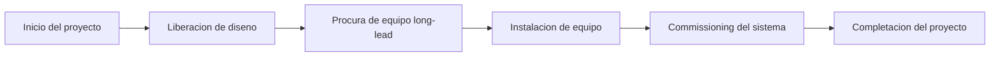

# Ruta Critica

La ruta critica es la secuencia mas larga de actividades dependientes dentro de un cronograma. Determina la duracion minima posible del proyecto y define directamente la fecha de terminacion.

En terminos practicos, la ruta critica es la cadena de tareas que no puede retrasarse sin afectar la fecha final. Si una actividad de la ruta critica se retrasa y nada mas cambia, la fecha de completacion del proyecto tambien se retrasara.

Por eso la ruta critica es una de las salidas mas importantes de un cronograma de Primavera P6. No es solo un filtro, un color o un reporte. Es la explicacion del cronograma sobre que esta impulsando la terminacion.

## Que Significa la Ruta Critica

Un cronograma contiene muchas actividades, pero no todas tienen el mismo impacto sobre la fecha final. Algunas actividades tienen float. Pueden moverse un poco antes de afectar la siguiente actividad o la terminacion del proyecto. Las actividades criticas no tienen esa flexibilidad, o tienen la menor flexibilidad segun el metodo y las configuraciones del cronograma.

La ruta critica muestra el tiempo minimo necesario para completar el proyecto con base en la logica, duraciones, calendarios, restricciones y estado actual.

Si esta es la cadena controlante, un retraso en procura puede retrasar la instalacion. Un retraso en instalacion puede retrasar commissioning. Un retraso en commissioning puede retrasar la completacion del proyecto. La ruta critica ayuda al equipo a ver esa conexion.

## Es la Cadena que No Puede Retrasarse

La ruta critica no es simplemente el trabajo que parece importante. Es la secuencia dependiente de trabajo que define la fecha final.

Esta diferencia importa. Una actividad de alto valor puede no ser critica si tiene float. Un hito visible para el cliente puede no ser critico si otra ruta impulsa la completacion. Una actividad tecnica pequena puede ser critica si esta en la unica cadena que lleva a la entrega final.

Para equipos de project controls, esto convierte la ruta critica en una herramienta de decision. Ayuda a responder:

- Que esta impulsando la fecha final del proyecto?
- Que actividades necesitan mas atencion de planificacion?
- Donde un retraso afectaria inmediatamente la completacion?
- Que acciones de recuperacion podrian proteger la fecha final?
- La ruta reportada tiene sentido?

La ultima pregunta es la que los planificadores nunca deben omitir.

## No Acepte el Filtro Critico Ciegamente

Primavera P6 puede identificar actividades criticas, pero el software no entiende la intencion del proyecto. Calcula con base en los datos disponibles: logica, calendarios, restricciones, duraciones, avance y opciones de calculo.

Si los datos son debiles, la ruta critica puede verse extrana.

Actividades o hitos pueden aparecer en el filtro critico aunque no esten impulsando realmente el proyecto. Esto puede ocurrir por logica faltante, hard restricciones, fechas obsoletas, extremos abiertos, calendarios inusuales, float negativo, status incorrecto o configuraciones de retained logic.

El planificador debe usar criterio profesional. La ruta critica debe ser cuestionada. Debe parecer razonable. Debe contar una historia que el equipo del proyecto reconozca.

Si la ruta dice que la completacion final esta impulsada por un hito administrativo sin trabajo real aguas abajo, cuestionela. Si la ruta empieza con un hito que no controla realmente la ejecucion, cuestionela. Si la ruta salta entre areas WBS no relacionadas sin una interfaz clara, cuestionela.

La ruta critica solo es tan buena como el modelo de cronograma que la produce.

## Baselines y Ruta Critica

En un cronograma que nunca ha sido actualizado, como una primera baseline, la ruta critica normalmente empieza con el hito de inicio del proyecto y termina con el hito de completacion del proyecto.

Eso es comun, pero no es una regla escrita en piedra.

Algunos proyectos tienen una ruta critica que empieza en un hito intermedio clave. Por ejemplo, la construccion puede no iniciar hasta que el owner entregue un area, se libere un permiso o un paquete de diseno llegue a estado aprobado. En ese caso, el hito de entrega o liberacion puede disparar el inicio de la ruta controlante.

La misma idea aplica cerca del final del proyecto. La ruta critica puede terminar en completacion final, pero tambien puede impulsar un hito contractual intermedio, una etapa de entrega, turnover de sistema o fecha de acceso del cliente que actualmente sea mas restrictiva.

La clave no es si la ruta empieza y termina en el lugar mas tradicional. La clave es si la ruta es logica, completa y defendible.

## Cronogramas en Progreso

Cuando un cronograma ya esta en progreso, la ruta critica cambia de forma. El trabajo completado ya no deberia impulsar la completacion futura. La ruta debe comenzar desde el limite actual de estado.

En un cronograma actualizado, la ruta critica a menudo empieza con una actividad actualmente en progreso, una actividad no iniciada lista para empezar o un hito valido que controla acceso a trabajo futuro. Tambien puede iniciar desde una interfaz de proyecto o hito de entrega cuando ese evento impulsa realmente el siguiente trabajo critico.

Aqui importa la fecha de datos. La fecha de datos separa el desempeno real del trabajo pronosticado. Una ruta critica despues de la fecha de datos debe explicar como el trabajo restante lleva a la completacion.

Si la ruta empieza con una actividad sin logica impulsora, un inicio no explicado en la fecha de datos o un hito dudoso, el revisor debe investigar. El cronograma puede estar mostrando una ruta calculada, pero no necesariamente una ruta creible.

## Cuidado con los Milestones

Los hitos son utiles porque marcan puntos clave: notice to proceed, entrega de area, aprobacion de diseno, mechanical completion, turnover de sistema, substantial completion y final completion.

Pero los hitos tambien pueden confundir una revision de ruta critica.

Un hito puede aparecer critico porque tiene un restriccion. Puede aparecer critico porque no tiene duracion y queda en un limite de fecha. Puede aparecer critico porque falta logica alrededor. Eso no significa automaticamente que el hito sea realmente parte de la cadena controlante de ejecucion.

Tenga especial cuidado cuando la ruta critica empieza con un hito. Pregunte:

- Este hito representa un evento controlante real?
- Que actividad o condicion externa impulsa el hito?
- Que trabajo libera el hito?
- El hito esta restringido en lugar de estar impulsado por logica?
- La ruta seguiria siendo critica si se corrigiera la logica del hito?

Si el hito no controla el trabajo, no debe permitirse que defina la historia de la ruta critica.

## Retained Logic Puede Cambiar la Historia

Retained logic es una configuracion de Primavera P6 usada para manejar avance fuera de secuencia. Puede ser apropiada, pero tambien puede afectar la ruta critica de formas que los revisores necesitan entender.

Cuando se usa retained logic, P6 puede preservar la logica predecesora aunque el trabajo sucesor ya haya iniciado fuera de secuencia. Esto puede hacer que trabajo restante quede retenido o secuenciado de una forma que cambia la ruta critica calculada.

El problema no es que retained logic siempre este mal. El problema es que el planificador debe entender si produce un pronostico realista.

Si retained logic hace que la ruta critica pase por relaciones que ya no reflejan como se ejecuta el trabajo, el equipo debe revisar status, logica y opciones de calculo. La ruta debe reflejar un plan restante defendible, no solo un calculo mecanico.

## Como Revisar la Ruta Critica

Una buena revision de ruta critica debe combinar la salida de P6 con criterio de planificacion.

Empiece generando el reporte de longest path o critical path. Luego revise la ruta actividad por actividad. Mire predecesores, sucesores, tipos de relacion, lags, restricciones, calendarios, actual dates, remaining duration y Total Float.

Pregunte si la ruta tiene sentido:

- La ruta sigue una secuencia de ejecucion creible?
- Empieza desde un impulsor actual valido?
- Termina en el hito correcto de completacion o control?
- Los restricciones estan forzando la ruta?
- Relaciones faltantes estan ocultando el verdadero impulsor?
- Retained logic esta afectando la ruta de forma misleading?
- El equipo del proyecto reconoce este trabajo como controlante?

Si la respuesta es no, el cronograma necesita revision antes de usar la ruta critica con confianza.

## Conclusion

La ruta critica es la secuencia de tareas dependientes que define la fecha final del proyecto. Muestra el tiempo minimo necesario para completar el proyecto e identifica el trabajo que no puede retrasarse sin afectar el deadline.

Pero la ruta critica no debe aceptarse ciegamente. P6 calcula lo que los datos le indican calcular. El planificador debe cuestionar si el resultado es razonable, logico y alineado con el plan real de ejecucion.

En un cronograma fuerte, la ruta critica cuenta una historia clara. Empieza desde un impulsor actual valido, sigue dependencias reales, evita restricciones misleading, maneja correctamente el avance y lleva al hito correcto de completacion.

Cuando esa historia tiene sentido, la ruta critica se convierte en una de las herramientas mas poderosas de project controls. Cuando no lo tiene, es una advertencia de que el cronograma necesita mas revision antes de confiar en el pronostico.
## Contenido relacionado
- [Ruta Crítica o Ruta de Holgura que Inicia con una Restricción - Descripción general](../../02_metrics_es/09_cp_or_float_path_starting_with_restriccion/01_overview_template.md)
- [Logica Robusta](../02_ROBUST%20LOGIC/02_ROBUST%20LOGIC.md)
- [Matriz de Criticidad](../04_CRITICALITY%20MATRIX/04_CRITICALITY%20MATRIX.md)
