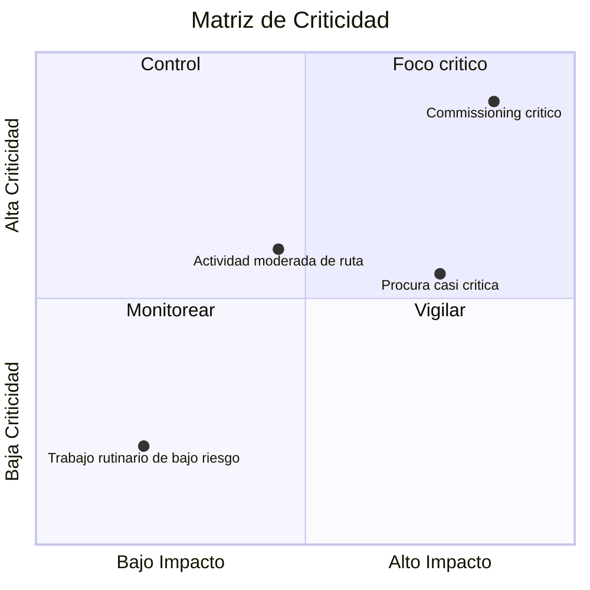

# Matriz de Criticidad

Una matriz de criticidad es un metodo visual o analitico usado para clasificar y priorizar actividades del proyecto segun que tan criticas son para la completacion. En el contexto de Primavera P6, ayuda a project managers, planificadores y revisores PMO a identificar que actividades generan mayor riesgo para el cronograma.

La ruta critica cuenta la historia deterministica actual del cronograma. Una matriz de criticidad va un paso mas alla. Ayuda al equipo a entender que actividades ya son criticas, cuales estan cerca de volverse criticas y cuales causarian un impacto serio si se retrasan.

Esto importa porque la actividad critica de hoy no siempre es la unica actividad que merece atencion. Una actividad casi critica con alto impacto puede convertirse en el problema de manana. Una actividad larga de procura puede no estar en la ruta critica actual, pero puede tener suficiente riesgo para justificar control cercano.

## Que Significa Criticidad en P6

En Primavera P6, criticidad normalmente se refiere a si una actividad puede afectar la fecha final del proyecto si se retrasa. Tradicionalmente, P6 identifica actividades criticas usando Total Float o configuraciones de longest path.

La definicion deterministica comun es simple:

- Actividades criticas son actividades con float cero o negativo.
- Estas actividades estan en la ruta critica, o muy vinculadas a ella.
- Si se retrasan, probablemente se retrase la fecha final del proyecto.

Esa definicion es util, pero no es completa. Esta basada en una condicion calculada del cronograma. No explica completamente incertidumbre, probabilidad o tamano del impacto si una actividad se retrasa.

Una matriz de criticidad amplia la conversacion desde "esta actividad es critica hoy?" hacia "que tan probable es que esta actividad se vuelva critica, y cuanto dano podria causar?"

## Que Combina una Matriz de Criticidad

Una matriz de criticidad normalmente combina dos dimensiones.

La primera dimension es sensibilidad del cronograma o probabilidad. Puede medirse por que tan seguido una actividad se vuelve critica durante una simulacion Monte Carlo, o por que tan cerca esta de ser critica segun Total Float o umbrales near-critical.

La segunda dimension es impacto. Esto significa la severidad del retraso si la actividad se mueve. El impacto puede basarse en duracion, efecto sobre la fecha final, sensitivity index, exposicion de costos, impacto en hito contractual o criterio de gestion.

Juntas, estas dimensiones ayudan al equipo a priorizar actividades.

Este tipo de vista es util porque separa actividades que simplemente aparecen en el filtro critico de actividades que merecen atencion activa de gestion.

## Una Estructura Simple de Matriz

Una matriz basica de criticidad puede mostrarse como una grilla:

| Criticidad / Impacto | Bajo Impacto | Medio Impacto | Alto Impacto |
| --- | --- | --- | --- |
| Baja Criticidad | Monitorear | Monitorear | Vigilar |
| Media Criticidad | Revisar | Controlar | Alta prioridad |
| Alta Criticidad | Controlar | Alta prioridad | Foco critico |

Las etiquetas exactas pueden cambiar por organizacion, pero la idea se mantiene. Las actividades con baja criticidad y bajo impacto pueden monitorearse. Las actividades con alta criticidad y alto impacto requieren control enfocado.

## Datos de P6 Usados en la Matriz

Primavera P6 normalmente no incluye una vista integrada de matriz de criticidad por defecto. La matriz suele construirse usando datos de actividades de P6 combinados con analisis externo.

Campos utiles de P6 incluyen:

- Total Float.
- Free Float.
- Duracion de actividad.
- Remaining Duration.
- Activity Status.
- Fechas Start y Finish.
- Constraints.
- Logica de relaciones.
- Calendar.
- WBS o activity codes.
- Indicadores de critical o longest path.

Estos datos entregan la vista deterministica del cronograma. Muestran la ruta calculada actual, trabajo near-critical, actividades con restricciones y actividades con larga exposicion restante.

## Insumos de Analisis de Riesgo

Para hacer la matriz mas potente, el equipo puede agregar datos probabilisticos de riesgo de cronograma desde analisis Monte Carlo. Esto puede venir de herramientas como Primavera Risk Analysis u otras plataformas de simulacion.

Metricas importantes de riesgo incluyen Criticality Index, Total Float, Schedule Sensitivity Index y valor de duracion o impacto.

Criticality Index, o CI, muestra el porcentaje de simulaciones donde una actividad aparece en la ruta critica. Por ejemplo, si una actividad tiene CI = 80%, fue critica en 80% de los escenarios simulados.

Total Float muestra que tan cerca esta una actividad de afectar la terminacion del proyecto en el cronograma deterministico. Float cercano a cero es una senal de alerta.

Schedule Sensitivity Index combina criticidad e impacto. Ayuda a mostrar no solo si la actividad se vuelve critica, sino tambien si afecta de forma significativa el resultado.

Duracion o valor de impacto ayuda a estimar severidad. Una actividad mas larga, un paquete de procura de alto riesgo o una tarea conectada a un hito contractual puede tener mayor impacto si se retrasa.

## Ejemplo

Considere el siguiente grupo simplificado de actividades:

| Actividad | Float | Criticality Index | Duracion | Resultado de Matriz |
| --- | ---: | ---: | ---: | --- |
| A | 0 dias | 95% | 20 dias | Foco critico |
| B | 5 dias | 60% | 15 dias | Alta prioridad |
| C | 20 dias | 15% | 10 dias | Monitorear |

La Actividad A pertenece al area de alta criticidad y alto impacto. No tiene float, aparece critica en la mayoria de simulaciones y tiene duracion larga. Merece control enfocado.

La Actividad B puede no ser tan urgente como la Actividad A, pero aun merece atencion. Tiene float limitado y una probabilidad significativa de volverse critica.

La Actividad C tiene mas float y menor criticidad. No debe ignorarse, pero no requiere el mismo nivel de foco gerencial.

## Por Que Es Util

Una matriz de criticidad ayuda al equipo del proyecto a no depender solamente de la ruta critica deterministica unica. La ruta deterministica es importante, pero es solo una vista del cronograma.

La matriz ayuda a los equipos a:

- Priorizar que monitorear de cerca.
- Enfocar mitigacion en actividades clave de riesgo.
- Identificar actividades near-critical antes de que sean criticas.
- Entender riesgo probabilistico de cronograma.
- Comparar probabilidad e impacto en una sola vista.
- Comunicar riesgo de cronograma a la gerencia con mas claridad.

Para reportes PMO, esto es especialmente util porque traduce la complejidad del cronograma en un marco de decision. En lugar de presentar cientos de actividades, el equipo puede mostrar cuales estan en zonas de "foco critico", "alta prioridad", "control" o "monitorear".

## Una Forma Simple de Construirla

Empiece exportando datos de actividades desde P6. Incluya Activity ID, Activity Name, WBS, Total Float, Remaining Duration, Start, Finish, Calendar, restricciones e indicadores critical o longest path.

Luego agregue campos opcionales de analisis de riesgo, como Criticality Index y Schedule Sensitivity Index. Si no existe data de simulacion, use umbrales practicos basados en float y duracion. Por ejemplo, alta criticidad puede significar Total Float menor o igual a 0 dias, o CI mayor a 70%. Criticidad media puede significar float near-critical o CI entre 40% y 70%.

Defina umbrales de impacto. Una actividad de alto impacto puede tener larga duracion, estar vinculada a un hito contractual, formar parte de un paquete de alto riesgo o aparecer en simulacion como actividad que afecta la terminacion del proyecto.

Finalmente, grafique las actividades en Excel, Power BI u otra herramienta de reporte. El resultado no necesita ser complicado. El valor aparece cuando la prioridad se vuelve visible.

## Use Criterio

Una matriz de criticidad es una herramienta de apoyo a decisiones, no una respuesta automatica. Los umbrales deben revisarse por el equipo de project controls y ajustarse al tipo de proyecto, sensibilidad contractual y madurez del cronograma.

Tambien recuerde que la matriz depende de la calidad del cronograma. Si el cronograma P6 tiene logica faltante, duraciones poco realistas, hard restricciones, calendarios deficientes o actualizaciones de estado debiles, la matriz heredara esas debilidades.

El mejor uso de la matriz es combinar salida analitica con criterio profesional de planificacion.

## Conclusion

Una matriz de criticidad clasifica actividades del proyecto segun que tan probable es que se vuelvan criticas y cuanto impacto tendrian si se retrasan. Usa datos de P6 como Total Float, duracion, restricciones y logica, y puede fortalecerse con resultados Monte Carlo como Criticality Index y Schedule Sensitivity Index.

Para project managers y revisores PMO, la matriz convierte el riesgo de cronograma en una conversacion de gestion mas clara. Ayuda al equipo a enfocarse en las actividades que mas importan, no solo en las actividades que aparecen en el filtro critico de hoy.

Usada correctamente, una matriz de criticidad ayuda al equipo del proyecto a pasar de reporte reactivo a control proactivo del cronograma.
## Contenido relacionado
- [Ruta Crítica o Ruta de Holgura que Inicia con una Restricción - Descripción general](../../02_metrics_es/09_cp_or_float_path_starting_with_restriccion/01_overview_template.md)
- [Ruta Critica](../03_CRITICAL%20PATH/03_CRITICAL%20PATH.md)
- [Tipos de Actividad en P6](../05_ACTIVITY%20TYPES%20IN%20P6/05_ACTIVITY%20TYPES%20IN%20P6.md)
