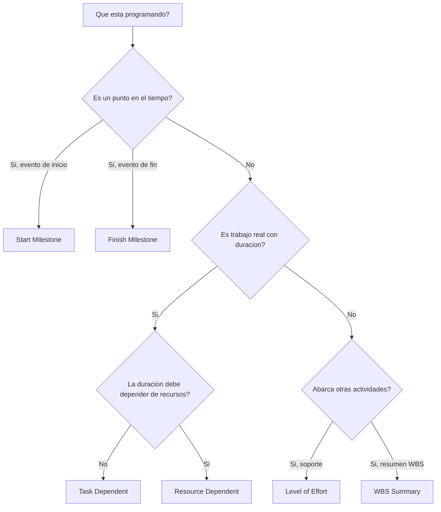

# Tipos de Actividad en P6

Activity Type es uno de los campos de configuracion mas importantes en Primavera P6. Le dice a P6 que tipo de actividad esta calculando y como debe comportarse esa actividad dentro del cronograma.

Muchos planificadores se enfocan primero en nombres de actividades, duraciones, fechas y relaciones. Eso es esencial, pero el tipo de actividad tambien importa. Una task activity, un hito, una actividad Level of Effort y una WBS Summary no se comportan igual. Elegir el tipo incorrecto puede distorsionar fechas, progreso, recursos, float y reportes.

El proposito de este blog es explicar los principales tipos de actividad disponibles en P6, para que sirve cada uno y como decidir cual tipo corresponde al trabajo que se esta planificando.

## Por Que Importa el Tipo de Actividad

El tipo de actividad debe coincidir con el proposito del item en el cronograma. Es trabajo real con duracion? Es un punto en el tiempo? Es un resumen de trabajo que abarca otras actividades? Es esfuerzo que depende de recursos mas que de una duracion fija?

Si el tipo de actividad no coincide con el proposito, el cronograma puede volverse confuso. Un hito con duracion no es realmente un hito. Una task normal usada como resumen puede ocultar logica. Una actividad Level of Effort usada para impulsar trabajo puede distorsionar la ruta critica. Una Resource Dependent usada incorrectamente puede calcular distinto a lo esperado.

En P6, activity type ayuda a responder una pregunta practica: como debe comportarse este item cuando se calcula el cronograma?

## Los Principales Tipos de Actividad en P6

Los tipos de actividad mas comunes en Primavera P6 son:

- Task Dependent.
- Resource Dependent.
- Level of Effort.
- Start Milestone.
- Finish Milestone.
- WBS Summary.

Cada uno tiene un proposito diferente.

## Task Dependent

Task Dependent es el tipo de actividad mas comun en P6. Se usa para trabajo planificado normal donde la duracion de la actividad esta controlada por el calendario asignado a la actividad, no por calendarios individuales de recursos.

Ejemplos incluyen:

- Excavar fundacion.
- Instalar bandeja de cable.
- Vaciar losa de concreto.
- Preparar paquete de diseno.
- Ejecutar prueba de presion.

Las actividades Task Dependent suelen ser la mejor opcion para la mayoria de tareas de construccion, ingenieria, procura, pruebas y commissioning. Son claras, estables y faciles de entender. El planificador define la duracion, asigna el calendario de actividad, conecta la logica y P6 calcula las fechas.

Use Task Dependent cuando la actividad representa un alcance discreto de trabajo y la duracion no debe cambiar segun calendarios de recursos.

## Resource Dependent

Las actividades Resource Dependent se usan cuando la duracion y el comportamiento de programacion deben ser influenciados por los recursos asignados a la actividad. En este caso, P6 puede usar calendarios de recursos y disponibilidad para calcular como se programa la actividad.

Esto puede ser util cuando la disponibilidad de recursos es un impulsor real del trabajo. Por ejemplo, una cuadrilla especializada, un inspector o un equipo especifico puede estar disponible solo ciertos dias o turnos.

Ejemplos pueden incluir:

- Inspeccion especializada por inspector limitado.
- Soporte de tecnico de proveedor.
- Calibracion de equipo con recurso escaso.
- Mantenimiento impulsado por disponibilidad de recursos.

Las actividades Resource Dependent deben usarse con cuidado. Si el proyecto no esta realmente cargado o nivelado por recursos, usar Resource Dependent por costumbre puede crear confusion. Muchos cronogramas usan Task Dependent como opcion por defecto porque el calendario de actividad es la base principal de calculo.

Use Resource Dependent cuando los recursos y sus calendarios deben influir en el calculo del cronograma.

## Start Milestone

Un Start Milestone es una actividad de duracion cero que representa el inicio de un evento, fase, ventana de acceso, autorizacion o condicion importante de trabajo.

Ejemplos incluyen:

- Notice to Proceed recibido.
- Acceso al area otorgado.
- Inicio de construccion.
- Paquete de diseno liberado para ejecucion.
- Inicio de ventana de commissioning.

Los Start Milestones no representan trabajo ejecutado. Representan un punto en el tiempo que permite que el trabajo inicie o marca un evento importante de inicio.

Use un Start Milestone cuando el cronograma necesita marcar el comienzo de algo importante. Normalmente debe estar conectado con logica que explique que impulsa el hito y que trabajo libera.

## Finish Milestone

Un Finish Milestone es una actividad de duracion cero que representa la completacion de un evento, fase, entregable o punto contractual.

Ejemplos incluyen:

- Mechanical completion logrado.
- System turnover completado.
- Aprobacion de permiso recibida.
- Substantial completion.
- Final completion.

Los Finish Milestones son utiles para reporte porque marcan logro. No deben usarse como actividades normales de trabajo. Si se requiere esfuerzo para alcanzar el hito, ese esfuerzo debe modelarse como tareas que llegan al hito.

Use un Finish Milestone cuando el cronograma necesita marcar que algo fue completado o alcanzado.

## Level of Effort

Level of Effort, o LOE, se usa para actividades que abarcan otro trabajo en lugar de impulsar directamente el proyecto. Las actividades LOE se usan comunmente para gestion, supervision, soporte de inspeccion, project controls o coordinacion continua.

Ejemplos incluyen:

- Soporte de project management.
- Supervision en sitio.
- Gestion de ingenieria.
- Construction management.
- Soporte de inspeccion de calidad.

Una actividad LOE normalmente deriva sus fechas de otras actividades. Debe representar esfuerzo de soporte que continua mientras ocurre otro trabajo. Normalmente no esta pensada para ser impulsor de tareas discretas de construccion o ingenieria.

Use LOE cuando la actividad representa soporte, supervision o gestion continua que debe abarcar un grupo de actividades.

Tenga cuidado con la logica LOE. Si un LOE se vincula incorrectamente, puede parecer que impulsa fechas o distorsiona float. Las actividades LOE deben revisarse durante health checks del cronograma, especialmente cuando aparecen en la ruta critica o tienen relaciones FS o SF inusuales.

## WBS Summary

Las actividades WBS Summary resumen un grupo de actividades dentro de un elemento WBS. Sus fechas se derivan de las actividades bajo la WBS, no de su propia logica detallada.

Ejemplos incluyen:

- Resumen de ingenieria.
- Resumen de procura.
- Resumen de construccion Area A.
- Resumen de commissioning Sistema 01.

Las actividades WBS Summary pueden ser utiles para reporte de alto nivel, pero no deben reemplazar actividades reales ni logica. Son herramientas de rollup, no tareas de ejecucion.

Use WBS Summary cuando necesita una vista resumen de una seccion WBS y solo cuando el metodo de reporte del proyecto soporte su uso.

## Elegir el Tipo Correcto

Una regla simple ayuda:

- Si es trabajo real con duracion, use Task Dependent salvo que calendarios de recursos deban controlarlo.
- Si la disponibilidad de recursos debe controlarlo, use Resource Dependent.
- Si es un evento de inicio, use Start Milestone.
- Si es un evento de completacion, use Finish Milestone.
- Si es soporte continuo que abarca otro trabajo, use Level of Effort.
- Si es un rollup de reporte, use WBS Summary.

El tipo de actividad debe hacer que el cronograma sea mas facil de entender. Si los revisores necesitan preguntar por que un hito tiene duracion, por que un LOE impulsa trabajo o por que una WBS Summary aparece en logica detallada, el tipo de actividad puede estar mal.

## Errores Comunes

Un error comun es usar hitos como sustitutos de trabajo. Un hito debe marcar un punto en el tiempo. Si se requiere trabajo, cree actividades para ese trabajo.

Otro error es usar actividades LOE para controlar trabajo discreto. LOE debe soportar o abarcar trabajo, no reemplazar logica entre actividades reales.

Un tercer error es usar Resource Dependent sin un proceso de programacion basado en recursos. Si los calendarios de recursos no se mantienen, el tipo de actividad puede crear mas confusion que valor.

Finalmente, evite usar WBS Summary como sustituto de una WBS bien construida y logica detallada. Los summaries son utiles para reporte, pero el cronograma todavia necesita actividades reales debajo.

## Conclusion

Los tipos de actividad en P6 definen como se comportan las actividades. No son solo etiquetas. El tipo correcto ayuda a que el cronograma calcule correctamente y comunique con claridad.

Las actividades Task Dependent representan la mayor parte del trabajo normal. Las Resource Dependent son utiles cuando los calendarios de recursos deben controlar la programacion. Start y Finish Milestones marcan puntos clave en el tiempo. Level of Effort representa soporte que abarca otro trabajo. WBS Summary soporta reportes rollup.

Elegir el tipo correcto hace que el cronograma sea mas facil de revisar, explicar y confiar para project controls. Un cronograma fuerte no solo tiene buenas fechas y logica. Tambien usa el tipo correcto de actividad para el trabajo que representa.
## Contenido relacionado
- [Actividades que Comienzan en la fecha de datos sin Lógica Impulsora: Por Qué Importa esta Métrica del Cronograma - Descripción general](../../02_metrics_es/01_activities_starting_in_dd_with_no_logic_driving/01_overview_template.md)
- [Matriz de Criticidad](../04_CRITICALITY%20MATRIX/04_CRITICALITY%20MATRIX.md)
- [Tipos de Duracion en P6](../06_DURATION%20TYPES%20IN%20P6/06_DURATION%20TYPES%20IN%20P6.md)
