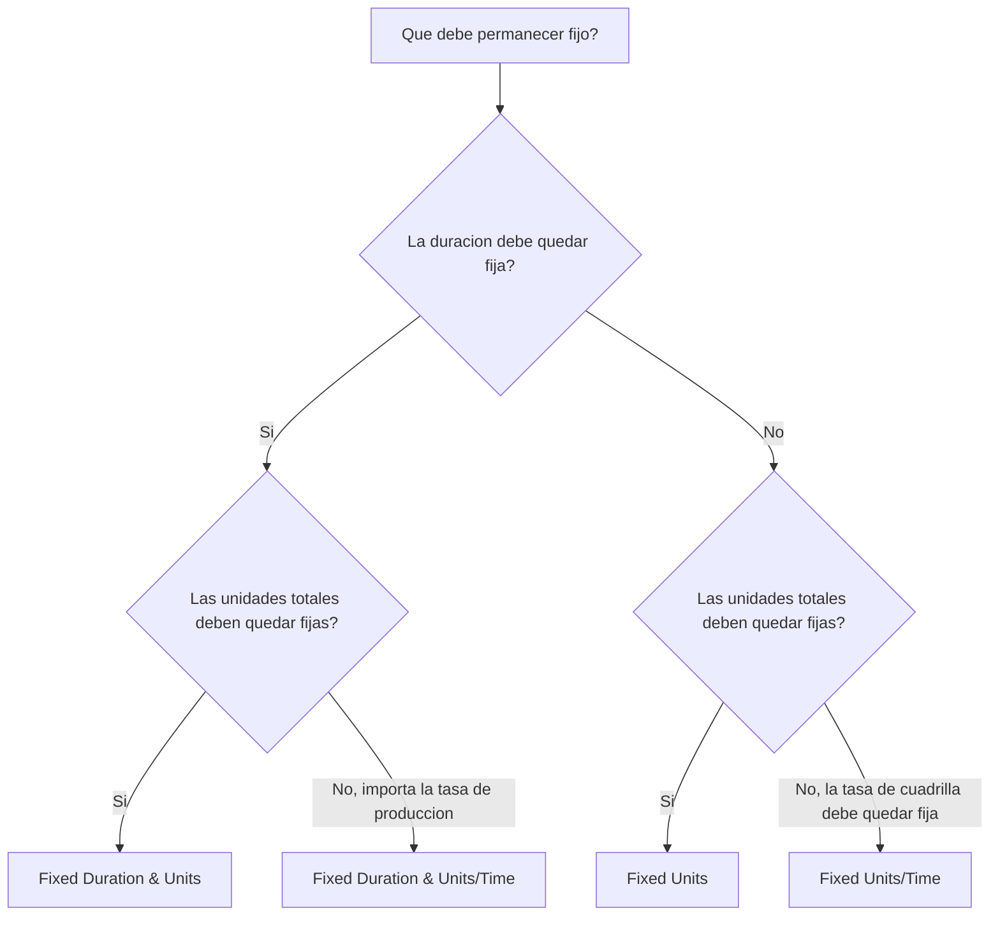

# Tipos de Duracion en P6

Duration Type es uno de los campos de Primavera P6 que controla como se comporta una actividad cuando cambian la duracion, las unidades y la productividad de recursos. Es facil pasarlo por alto, pero puede afectar fechas, carga de recursos, pronostico de costos, earned value y comportamiento durante actualizaciones.

Muchos planificadores piensan en duracion solo como un numero de dias. En P6, la duracion es mas que un numero. Una actividad tambien puede tener labor units, nonlabor units, units per time, calendarios de recursos, calendario de actividad y trabajo restante. El Duration Type le dice a P6 que debe permanecer fijo cuando el cronograma recalcula o cuando el planificador cambia recursos y duraciones.

Este blog explica los principales Duration Types disponibles para actividades en P6, como se diferencian, para que sirve cada uno y cuando usar uno en lugar de otro.

## Duration Type No Es lo Mismo que Campo de Duracion

Antes de revisar los tipos, conviene separar dos ideas.

Los campos de duracion son valores como Original Duration, Remaining Duration, Actual Duration y At Completion Duration. Estos describen tiempo.

Duration Type es una configuracion de calculo. Le dice a P6 como balancear duracion, unidades totales y unidades por tiempo cuando algo cambia.

Por ejemplo, si agrega mas recursos a una actividad, la actividad debe terminar antes? O la duracion debe mantenerse igual y aumentar el esfuerzo total? La respuesta depende del Duration Type.

## Los Principales Duration Types

Los Duration Types comunes en P6 son:

- Fixed Duration & Units.
- Fixed Duration & Units/Time.
- Fixed Units.
- Fixed Units/Time.

Los nombres pueden parecer tecnicos al principio, pero cada uno responde una pregunta practica: que parte de la actividad debe proteger P6 cuando algo cambia?

## Fixed Duration & Units

Fixed Duration & Units mantiene fijas la duracion de la actividad y las unidades totales. Si cambian las units per time, P6 ajusta la tasa en lugar de cambiar duracion o esfuerzo total.

Este tipo es util cuando tanto la ventana de tiempo planificada como el esfuerzo total deben permanecer estables.

Ejemplo:

Una actividad esta planificada para 10 dias con 400 horas labor. El equipo quiere que la duracion siga siendo 10 dias y que el esfuerzo presupuestado siga siendo 400 horas. Si cambian detalles de asignacion de recursos, la duracion planificada y las unidades totales no deben moverse automaticamente.

Use Fixed Duration & Units cuando:

- La actividad tiene una ventana fija de trabajo.
- El esfuerzo total ya esta acordado.
- Los cambios de tasa de recursos no deben cambiar automaticamente la duracion.
- El cronograma se usa para control estable de costos o earned value.

Esto suele ser util para paquetes de trabajo gestionados donde se controlan tanto duracion como esfuerzo presupuestado.

## Fixed Duration & Units/Time

Fixed Duration & Units/Time mantiene fijas la duracion y la tasa de recursos. Si se agregan o quitan recursos, P6 puede ajustar las unidades totales.

Este tipo es util cuando la actividad debe ocurrir durante una ventana fija de tiempo y la tasa de carga de recursos debe permanecer consistente.

Ejemplo:

Una actividad de soporte de project management dura 20 dias. El equipo asigna un project engineer a 8 horas por dia. La duracion debe permanecer en 20 dias y la tasa diaria debe permanecer en 8 horas por dia. Las unidades totales son resultado de la ventana de tiempo y la tasa.

Use Fixed Duration & Units/Time cuando:

- La duracion de la actividad es fija.
- La tasa diaria u horaria de recursos es importante.
- Las unidades totales deben calcularse desde duracion y tasa.
- La actividad representa soporte continuo o un periodo fijo de trabajo.

Esto puede ser util para supervision, gestion, soporte de inspeccion o actividades de soporte basadas en tiempo.

## Fixed Units

Fixed Units mantiene fijas las unidades totales. Si cambia la tasa de recursos, P6 puede ajustar la duracion.

Este tipo es util cuando la cantidad de trabajo es fija, pero la duracion depende de productividad o disponibilidad de recursos.

Ejemplo:

Una actividad requiere 800 horas labor. Si el equipo asigna mas capacidad de cuadrilla, la actividad puede terminar antes. Si hay menos capacidad disponible, puede durar mas. El trabajo total permanece en 800 horas.

Use Fixed Units cuando:

- La cantidad de trabajo o esfuerzo total es fija.
- La duracion debe responder a disponibilidad de recursos o productividad.
- El tamano de cuadrilla puede cambiar el tiempo necesario para completar la actividad.
- La planificacion de recursos esta activa y mantenida.

Esto puede ser util para trabajo de produccion donde el esfuerzo total es conocido y se espera que la duracion responda a la carga de cuadrilla.

## Fixed Units/Time

Fixed Units/Time mantiene fija la tasa de recursos. Si cambia la duracion, las unidades totales cambian con ella.

Este tipo es util cuando una cuadrilla o recurso trabaja a una tasa fija durante todo el tiempo que dura la actividad.

Ejemplo:

Una actividad de supervision en sitio usa un supervisor a 8 horas por dia. Si la duracion aumenta de 10 dias a 15 dias, las unidades totales deben aumentar porque el supervisor se necesita por mas dias. La tasa diaria permanece fija.

Use Fixed Units/Time cuando:

- La tasa de cuadrilla o recurso es fija.
- Las unidades totales deben aumentar o disminuir cuando cambia la duracion.
- La actividad representa esfuerzo basado en tiempo.
- El recurso esta asignado durante toda la duracion de la actividad.

Esto suele ser util para soporte, supervision, inspeccion y actividades de gestion donde el tiempo impulsa el esfuerzo total.

## Como Elegir el Duration Type Correcto

El mejor Duration Type depende de lo que representa la actividad y de como el equipo de project controls espera que P6 calcule los cambios.

Una forma simple de elegir es preguntar:

- La duracion esta fija por plan, contrato, ventana o acceso?
- El esfuerzo total esta fijo por cantidad, presupuesto o estimacion?
- La tasa de recursos esta fija por plan de cuadrilla o staffing?
- Agregar recursos debe acortar la actividad?
- Extender la actividad debe aumentar las unidades totales?

Si duracion y unidades totales deben permanecer fijas, use Fixed Duration & Units.

Si duracion y tasa de produccion deben permanecer fijas, use Fixed Duration & Units/Time.

Si el trabajo total debe permanecer fijo y la duracion debe responder a carga de recursos, use Fixed Units.

Si la tasa de recursos debe permanecer fija y las unidades deben cambiar con la duracion, use Fixed Units/Time.

## Ejemplos Practicos

Para un vaciado de concreto planificado como una operacion fija de 1 dia con cuadrilla definida y presupuesto de costo definido, Fixed Duration & Units puede ser apropiado.

Para soporte de project management asignado a una tasa diaria estable durante un periodo fijo de reporte, Fixed Duration & Units/Time o Fixed Units/Time puede ser apropiado segun si las unidades totales o la duracion deben impulsar el pronostico.

Para una actividad de instalacion con una cantidad total conocida de trabajo donde el tamano de cuadrilla afecta el tiempo de completacion, Fixed Units puede ser apropiado.

Para supervision en sitio que continua mientras se extiende el periodo de construccion, Fixed Units/Time puede ser apropiado.

El punto importante es que la eleccion debe reflejar el metodo de project controls, no la costumbre.

## Errores Comunes

Un error comun es dejar el Duration Type por defecto en todas las actividades sin revisar si coincide con el proposito de la actividad.

Otro error es usar comportamiento de duracion impulsado por recursos cuando el proyecto no mantiene cuidadosamente las asignaciones de recursos. Si los datos de recursos son debiles, el calculo basado en recursos puede producir resultados poco confiables.

Un tercer error es cambiar duraciones durante actualizaciones sin entender como P6 recalculara unidades o tasas. Esto puede afectar carga de costos, earned value e histogramas de recursos.

Finalmente, evite tratar Duration Type como una configuracion puramente tecnica. Afecta como se comporta el cronograma cuando cambia el plan.

## Duration Type y Calidad del Cronograma

Duration Type es parte de la calidad del cronograma porque afecta si el pronostico es creible. Si la duracion, unidades y tasa de recursos de una actividad no se comportan como se espera, el cronograma puede mostrar fechas o demanda de recursos misleading.

Para revisiones PMO, es util verificar si los Duration Types son consistentes entre grupos similares de actividades. Actividades de ingenieria, procura, construccion, LOE y soporte pueden requerir reglas diferentes, pero las elecciones deben ser intencionales.

Si el cronograma esta cargado con recursos, Duration Type se vuelve aun mas importante. Ayuda a determinar si los cambios de recursos afectan duracion, unidades totales o units per time.

## Conclusion

Los Duration Types en P6 definen como responden las actividades cuando cambian duracion, unidades totales y tasas de recursos. No son solo configuraciones de fondo.

Fixed Duration & Units protege tiempo y esfuerzo total. Fixed Duration & Units/Time protege tiempo y tasa. Fixed Units protege esfuerzo total. Fixed Units/Time protege la tasa de recursos.

Elegir el Duration Type correcto ayuda a que el cronograma calcule de una forma consistente con el plan del proyecto. Tambien hace que la carga de recursos, actualizaciones de progreso, pronosticos de costo y reportes de cronograma sean mas faciles de entender y defender.
## Contenido relacionado
- [Actividades que Comienzan en la fecha de datos sin Lógica Impulsora: Por Qué Importa esta Métrica del Cronograma - Descripción general](../../metrics/01_activities_starting_in_dd_with_no_logic_driving/02_guide_template.md)
- [Tipos de Actividad en P6](../05_ACTIVITY%20TYPES%20IN%20P6/05_ACTIVITY%20TYPES%20IN%20P6.md)
- [Fechas en P6](../07_DATES%20IN%20P6/07_DATES%20IN%20P6.md)
