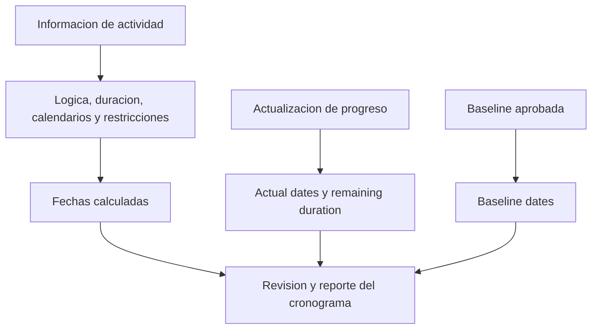

# Fechas en P6

Las fechas en Primavera P6 pueden ser confusas porque una actividad no tiene solo una fecha de inicio y una fecha de fin. Puede tener planned dates, current schedule dates, early dates, late dates, actual dates, baseline dates, restriccion dates, expected dates y a veces fechas externas o relacionadas con pronostico segun el layout y la configuracion del proyecto.

Estas fechas no significan lo mismo. Algunas son calculadas por logica CPM. Algunas se ingresan durante la actualizacion de progreso. Algunas se usan para comparacion. Algunas controlan o limitan el cronograma. Entender la diferencia es esencial para calidad de cronograma, reporte PMO, preparacion para analisis de demora y control de proyecto.

La pregunta mas importante es simple: que me esta diciendo esta fecha y de donde viene?

## Por Que P6 Tiene Tantas Fechas

P6 no es solo una lista de fechas. Es un modelo de calculo. El software calcula fechas desde duraciones, calendarios, relaciones, restricciones, recursos, estado de avance y fecha de datos.

Existen diferentes campos de fecha porque los planificadores necesitan responder preguntas diferentes:

- Cual era el plan original?
- Cual es el pronostico actual?
- Que ocurrio realmente?
- Cual es lo mas temprano que la actividad puede iniciar o terminar?
- Cual es lo mas tarde que puede iniciar o terminar sin afectar el proyecto?
- Un restriccion esta forzando la actividad?
- Como se compara el plan actual con la baseline?

El problema empieza cuando estos tipos de fecha se mezclan sin entender su proposito.

## fecha de datos

La fecha de datos no es una fecha de actividad, pero controla como deben interpretarse todas las fechas de actividad.

La fecha de datos es el limite entre el desempeno real y el trabajo pronosticado. El trabajo antes de la fecha de datos debe estar actualizado como real o statused. El trabajo despues de la fecha de datos debe ser pronostico.

Si una actividad tiene actual dates despues de la fecha de datos, normalmente es un error de estado. Si una actividad abierta inicia exactamente en la fecha de datos sin logica impulsora, puede indicar secuencia faltante. Si un Expected Finish esta antes de la fecha de datos, puede indicar informacion de actualizacion obsoleta.

Antes de revisar cualquier fecha de actividad, confirme la fecha de datos.

## Start y Finish

Start y Finish son las fechas principales que la mayoria de usuarios ve en layouts de P6. Representan las fechas actuales calculadas o programadas para la actividad con base en los datos del cronograma.

Para actividades no iniciadas, Start y Finish son fechas pronostico. Para actividades en progreso, pueden combinar estado real y pronostico restante. Para actividades completadas, deben alinearse con actual dates.

Estas son normalmente las fechas usadas en reportes, lookahead schedules y conversaciones de gestion. Sin embargo, no deben aceptarse sin revisar la logica y el estado que las soporta.

Use Start y Finish para responder: cuando esta programada actualmente esta actividad para iniciar y terminar?

## Early Start y Early Finish

Early Start y Early Finish son fechas de calculo CPM. Muestran las fechas mas tempranas en que una actividad puede iniciar y terminar segun logica predecesora, calendarios, restricciones y condiciones actuales del cronograma.

Las early dates son importantes porque ayudan a explicar el forward pass del calculo. Muestran como el trabajo puede avanzar por la red tan pronto como la logica lo permite.

Si muchas actividades tienen Early Start en la fecha de datos, el revisor debe verificar si realmente estan listas o si son open starts, actividades con restricciones o actividades con logica debil.

Use Early Start y Early Finish para responder: que tan temprano puede ocurrir esta actividad segun la red actual?

## Late Start y Late Finish

Late Start y Late Finish muestran las fechas mas tardias en que una actividad puede iniciar o terminar sin retrasar la fecha final del proyecto o el punto de terminacion controlante, segun la configuracion del cronograma.

Las late dates son parte del backward pass. Se usan para calcular float. La diferencia entre fechas early y late ayuda a mostrar cuanta flexibilidad tiene la actividad.

Si las late dates parecen extranas, revise restricciones, sucesores faltantes, open finishes, calendarios o configuraciones inusuales de finish del proyecto.

Use Late Start y Late Finish para responder: que tan tarde puede moverse esta actividad antes de afectar la completacion controlante?

## Actual Start y Actual Finish

Actual Start y Actual Finish son hechos de estado. Deben representar lo que realmente ocurrio en campo o en la ejecucion del proyecto.

Actual Start significa que la actividad realmente comenzo. Actual Finish significa que la actividad realmente termino. Estas fechas no deben usarse como metas de planificacion o fechas pronostico.

Las actual dates normalmente deben estar en o antes de la fecha de datos. Si las actual dates estan despues de la fecha de datos, el cronograma esta reportando trabajo futuro como ya iniciado o completado, lo cual debilita la credibilidad de la actualizacion.

Use Actual Start y Actual Finish para responder: que ocurrio realmente?

## Planned Start y Planned Finish

Planned Start y Planned Finish suelen malinterpretarse. Dependiendo de como se crea, actualiza y muestra el cronograma, estos campos pueden no comportarse como una baseline formal aprobada.

Algunos usuarios esperan que Planned dates muestren el plan original para siempre. Esa no siempre es una suposicion segura. Para reporte formal de variaciones, una baseline asignada suele ser mas confiable que depender casualmente de Planned dates.

Use Planned Start y Planned Finish solo cuando el procedimiento de project controls define claramente como se mantienen y que significan.

## Baseline Start y Baseline Finish

Las baseline dates vienen de un cronograma baseline asignado. Se usan para comparar el cronograma actual contra el plan aprobado.

Por ejemplo, BL1 Start y BL1 Finish pueden mostrar las fechas de inicio y fin de la actividad desde la baseline aprobada. Current Start y Finish muestran el pronostico mas reciente. La diferencia entre ellas muestra variacion.

Las baseline dates son centrales para reporte de desempeno, schedule variance, change control y preparacion para analisis de demora.

Use Baseline Start y Baseline Finish para responder: como se compara el cronograma actual con el plan aprobado?

## Constraint Date

Constraint dates son controles de fecha impuestos. Estan conectados a tipos de restriccion como Start On, Start On or After, Finish On, Finish On or Before, Mandatory Start o Mandatory Finish.

Los restricciones no son automaticamente incorrectos. Algunos representan fechas contractuales reales, restricciones de acceso, liberacion de permisos, ventanas de outage o requisitos del owner. Pero tambien pueden ocultar logica faltante o forzar fechas poco realistas.

Los hard restricciones, especialmente Mandatory Start y Mandatory Finish, deben ser poco comunes y documentados.

Use Constraint Date para responder: una fecha impuesta esta controlando o limitando esta actividad?

## Expected Finish y Fechas Tipo Forecast

Expected Finish suele usarse durante actualizaciones para capturar cuando el equipo espera que una actividad termine. Dependiendo de configuraciones y procedimientos, expected dates pueden influir en como P6 calcula o muestra fechas de actividad.

Expected Finish puede ser util para trabajo en progreso cuando los equipos de campo entregan una expectativa realista de terminacion. Pero si no se mantiene, puede volverse obsoleto. Un Expected Finish antes de la fecha de datos es una senal comun de alerta.

Algunos proyectos tambien usan campos de fecha tipo pronostico o user-defined fields para reporte. La clave es definirlos claramente para que el equipo sepa si son calculados, ingresados manualmente o importados.

Use expected o pronostico dates para responder: cual es la ultima expectativa del equipo y esta controlada por un procedimiento definido de actualizacion?

## Primary y Secondary Constraint Dates

P6 puede mantener mas de una condicion de restriccion en una actividad, dependiendo de los campos seleccionados. El primary restriccion normalmente es el principal que se muestra en layouts estandar, pero un secondary restriccion tambien puede afectar la interpretacion.

Durante una revision del cronograma, no mire solo Start y Finish. Agregue restriccion type y restriccion date al layout. Si las fechas no se comportan como se espera, los restricciones son una de las primeras cosas que debe revisar.

## Que Fechas Debe Usar

Use cada fecha para su proposito:

- Use Start y Finish para el pronostico actual del cronograma.
- Use Early y Late dates para entender calculo CPM y float.
- Use Actual dates para trabajo iniciado o completado.
- Use Baseline dates para variacion contra el plan aprobado.
- Use Constraint dates para identificar controles de fecha impuestos.
- Use Expected Finish o campos pronostico solo cuando el procedimiento de actualizacion los define.
- Use la fecha de datos para separar desempeno real de trabajo pronosticado.

## Errores Comunes

Un error comun es comparar fechas incorrectas. Por ejemplo, comparar current Start contra Planned Start puede no ser significativo si Planned dates no estan controladas por el procedimiento del proyecto.

Otro error es tratar Actual Start como pronostico. Las actual dates deben representar desempeno real, no intencion.

Un tercer error es ignorar la hora del dia. P6 guarda fechas con hora, y diferencias de calendario pueden crear aparentes desplazamientos de un dia o sorpresas de float.

Finalmente, evite ocultar restriccion dates. Si una fecha esta impuesta, los revisores necesitan verla.

## Conclusion

Las fechas en P6 son poderosas porque cuentan diferentes partes de la historia del cronograma. Las fechas actuales muestran el pronostico. Early y late dates explican el calculo CPM. Actual dates registran lo ocurrido. Baseline dates soportan comparacion. Constraint dates revelan controles impuestos. Expected dates pueden soportar actualizaciones cuando se mantienen correctamente.

Una revision fuerte del cronograma no pregunta solamente "cual es la fecha?" Pregunta "que tipo de fecha es esta, de donde viene y es creible?"

Cuando el equipo entiende el significado de cada campo de fecha, el cronograma se vuelve mas facil de explicar, mas facil de auditar y mas confiable para control de proyecto.
## Contenido relacionado
- [Fechas Reales Posteriores a la fecha de datos en Primavera P6 - Descripción general](../../metrics/12_actual_date_greater_than_data_date/02_guide_template.md)
- [Tipos de Duracion en P6](../06_DURATION%20TYPES%20IN%20P6/06_DURATION%20TYPES%20IN%20P6.md)
- [Calendarios en P6](../08_CALENDARS%20IN%20P6/08_CALENDARS%20IN%20P6.md)
