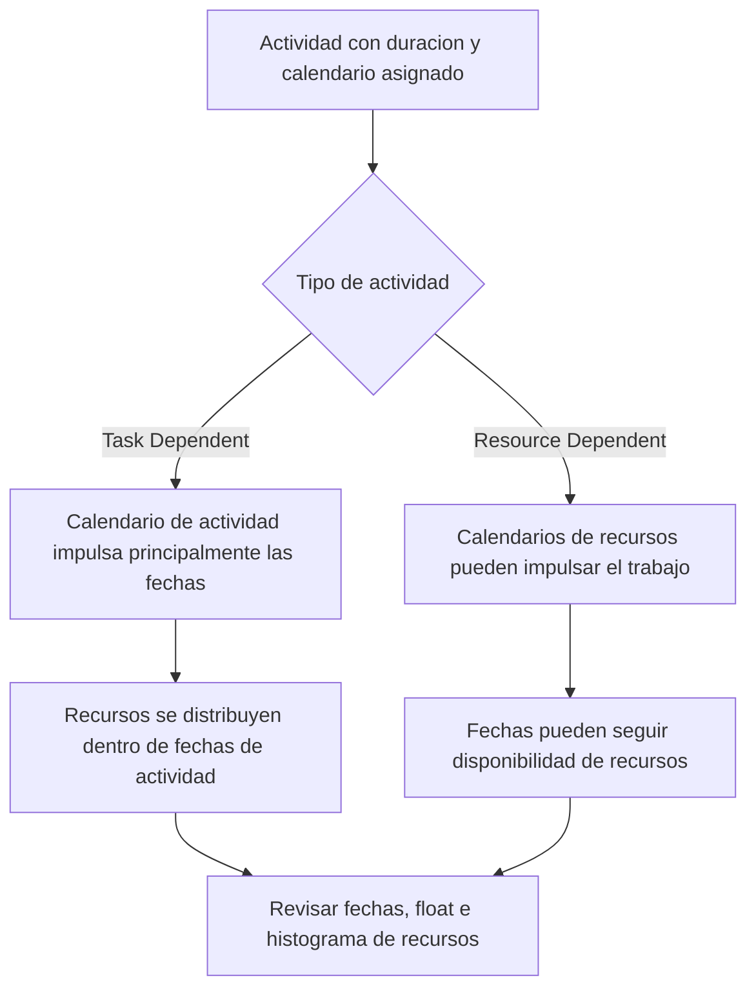

Los calendarios son una de las bases silenciosas de un cronograma de Primavera P6. Definen cuando puede ocurrir el trabajo. Le indican a P6 que dias son laborables, que dias no lo son, cuantas horas hay disponibles en un dia y a que hora empieza y termina el trabajo.

Como los calendarios trabajan detras de escena, es facil subestimarlos. Un cronograma puede tener buena logica y duraciones razonables, pero si los calendarios son incorrectos o inconsistentes, las fechas pueden seguir siendo misleading.

Entender calendarios es esencial para calidad de cronograma, planificacion de recursos, revision de ruta critica y disciplina de actualizacion.

## Que Hace un Calendario en P6

En P6, un calendario convierte duracion en fechas. Si una actividad tiene una duracion de 10 dias laborables, P6 necesita saber que significa un dia laborable. Es lunes a viernes? Incluye sabado? El dia de trabajo es de 8, 10 o 12 horas? El trabajo empieza a las 7:00 o a las 8:00? Los feriados estan excluidos?

El calendario responde esas preguntas.

Los calendarios influyen en:

- Fechas de inicio y fin de actividades.
- Early y late dates.
- Total Float.
- Ruta critica y longest path.
- Momento de uso de recursos.
- Interpretacion de lags.
- Movimientos de fecha durante actualizaciones.
- Precision de lookahead y reportes.

Un calendario no es solo un dato administrativo. Es parte del calculo del cronograma.

## Por Que Puede Necesitarse Mas de Un Calendario

Muchos proyectos necesitan mas de un calendario porque no todo el trabajo sigue el mismo patron laboral.

Ejemplos incluyen:

- Trabajo de ingenieria de oficina en calendario de 5 dias.
- Trabajo de construccion en sitio en calendario de 6 dias.
- Trabajo de parada u outage en calendario de 24 horas.
- Commissioning en turno nocturno.
- Ventanas de acceso del owner.
- Restricciones ambientales.
- Actividades de procura basadas en dias laborables del proveedor.
- Calendarios especificos de recursos para inspectores, vendors o cuadrillas especializadas.

Usar un solo calendario para todo puede parecer simple, pero puede producir fechas poco realistas. Si commissioning solo puede ocurrir de noche, un calendario normal diurno puede ser incorrecto. Si un proveedor trabaja solo dias de semana, un calendario de construccion de 7 dias puede exagerar su disponibilidad.

La meta no es crear muchos calendarios. La meta es crear suficientes calendarios para modelar condiciones reales de trabajo sin hacer el cronograma innecesariamente complejo.

## Calendarios de Actividad

El calendario de actividad se asigna directamente a una actividad. Define el tiempo laborable usado para calcular la duracion y fechas de esa actividad, especialmente en actividades Task Dependent.

Por ejemplo, si "Install Cable Tray" tiene un calendario de construccion de 6 dias, P6 calculara su trabajo con base en ese calendario. Si el sabado es laborable, la actividad puede terminar antes que en un calendario de 5 dias.

Los calendarios de actividad suelen ser el control principal para actividades normales del cronograma.

Use calendarios de actividad cuando el trabajo en si sigue un patron definido, como turno diurno, turno nocturno, parada work o trabajo de oficina.

## Calendarios de Recursos

Los calendarios de recursos definen cuando un recurso esta disponible. Un recurso puede ser una persona, cuadrilla, equipo, especialista de proveedor u otro recurso asignado.

Los calendarios de recursos se vuelven especialmente importantes cuando las actividades son Resource Dependent o cuando el proyecto usa resource leveling o planificacion detallada de recursos.

Por ejemplo, una actividad puede estar asignada a un calendario de construccion de 6 dias, pero el inspector especialista asignado puede estar disponible solo de lunes a miercoles. Si la actividad es resource-driven, P6 puede calcular fechas segun el calendario del recurso y no solo segun el calendario de actividad.

Los calendarios de recursos son utiles cuando la disponibilidad de recursos es una restriccion real de programacion. Tambien pueden crear confusion si se asignan pero no se mantienen.

## Como Interactuan Calendarios de Actividad y Recurso

La relacion entre calendarios de actividad y calendarios de recursos depende del tipo de actividad, configuraciones de recursos y comportamiento de calculo.

Para actividades Task Dependent, el calendario de actividad normalmente es la base principal para la duracion de la actividad. Los calendarios de recursos aun pueden afectar la distribucion y uso de recursos.

Para actividades Resource Dependent, los calendarios de recursos pueden influir en cuando se ejecuta el trabajo. Esto significa que el calendario del recurso puede afectar las fechas de la actividad de forma mas directa.

El punto clave es que los calendarios deben revisarse juntos. Un calendario de actividad puede decir que el trabajo es posible, mientras el calendario de recurso indica que el recurso asignado no esta disponible. Ese desajuste puede crear desincronizacion.

## Que Significa Desincronizacion de Calendarios

La desincronizacion de calendarios ocurre cuando diferentes calendarios del cronograma no estan alineados con la forma real en que el proyecto debe trabajar.

Ejemplos comunes incluyen:

- La actividad usa calendario de 6 dias, pero los recursos asignados usan calendario de 5 dias.
- La actividad usa calendario diurno, pero los recursos usan turno nocturno.
- Dos actividades vinculadas usan diferentes horas de inicio y fin dentro del dia.
- El lag se interpreta con un calendario que no coincide con el trabajo.
- Una actividad copiada conserva un calendario antiguo de otro proyecto.
- Un calendario de recurso tiene feriados que el calendario de actividad no tiene.

El resultado puede ser confuso. Las fechas pueden moverse inesperadamente. Las actividades pueden parecer terminar un dia despues. El float puede cambiar sin una razon logica evidente. Los histogramas de recursos pueden no coincidir con el plan de ejecucion. La ruta critica puede moverse por comportamiento de calendario, no por secuencia real.

## Problemas Causados por Desajustes de Calendario

Los desajustes de calendario pueden crear varios problemas de calidad.

Primero, pueden crear fechas misleading. Una tarea puede parecer mas larga porque el calendario tiene menos periodos laborables.

Segundo, pueden distorsionar float. Actividades en diferentes calendarios pueden calcular early y late dates de formas dificiles de explicar.

Tercero, pueden afectar la ruta critica. Una ruta puede volverse critica porque un calendario restringe el trabajo, no porque la secuencia logica sea realmente controlante.

Cuarto, pueden danar reportes de recursos. Un histograma puede mostrar demanda en fechas donde el recurso no esta disponible, o puede omitir demanda que deberia aparecer.

Finalmente, pueden crear confusion en actualizaciones. Cuando se mueve la fecha de datos, actividades en diferentes calendarios pueden responder de forma distinta, haciendo el cronograma mas dificil de actualizar y revisar.

## Como Resolver Desincronizaciones

Empiece identificando el estandar de calendario del proyecto. Defina la semana laboral normal, horas de inicio y fin del dia, feriados, periodos de parada y ventanas especiales de trabajo.

Luego revise todos los calendarios del cronograma. Verifique:

- Nombre y proposito del calendario.
- Dias laborables.
- Horas laborables por dia.
- Horas de inicio y fin.
- Feriados y excepciones.
- Tipo de calendario.
- Actividades asignadas al calendario.
- Recursos asignados al calendario.

Luego revise actividades donde las fechas parecen extranas. Agregue columnas de Activity Calendar, Activity Type, Start, Finish, Early Start, Early Finish, Total Float, resources y resource calendars si estan disponibles.

Si un calendario esta mal, corrijalo. Si la actividad esta asignada al calendario incorrecto, cambie la asignacion. Si el calendario de recurso es valido pero causa resultados inesperados, confirme si la actividad debe ser Resource Dependent o Task Dependent.

Despues de corregir, recalcule el cronograma y revise fechas afectadas, float, ruta critica e histograma de recursos.

## Buen Gobierno de Calendarios

Los calendarios deben gobernarse igual que la logica y los restricciones. No deben multiplicarse sin control.

Buenas practicas incluyen:

- Usar una convencion clara de nombres.
- Mantener un conjunto limitado de calendarios aprobados del proyecto.
- Documentar por que existen calendarios especiales.
- Evitar copiar calendarios no usados de cronogramas antiguos.
- Revisar asignaciones de calendario antes de aprobar la baseline.
- Revisar calendarios de recursos si se usa carga de recursos.
- Revisar horas de inicio y fin del calendario, no solo dias laborables.

El gobierno de calendarios es especialmente importante en cronogramas grandes donde muchos usuarios pueden agregar o copiar actividades.

## Ejemplo Practico

Un proyecto de construccion usa un calendario de 6 dias para trabajo de sitio. La mayoria de actividades de construccion corren de lunes a sabado de 7:00 a 17:00. Un equipo de commissioning trabaja de noche de 22:00 a 6:00 porque las pruebas solo pueden hacerse cuando operaciones esta fuera de servicio.

Ambos calendarios son validos.

El problema aparece cuando actividades de construccion copiadas heredan accidentalmente el calendario nocturno. Sus fechas empiezan a moverse de forma extrana. Algunas relaciones parecen empujar sucesores al dia siguiente. El float cambia de una forma que el equipo no puede explicar.

La solucion no es eliminar el calendario nocturno. La solucion es corregir la asignacion de calendario de actividad, confirmar que actividades realmente necesitan el calendario nocturno y recalcular el cronograma.

## Conclusion

Los calendarios en P6 definen cuando puede ocurrir el trabajo. Afectan fechas de actividad, float, ruta critica, carga de recursos, lags y comportamiento de actualizacion.

Mas de un calendario suele ser necesario porque los proyectos incluyen diferentes patrones de trabajo: sitio, oficina, turnos nocturnos, paradas, proveedores y disponibilidad de recursos. Pero multiples calendarios deben controlarse con cuidado.

El riesgo principal es la desincronizacion. Cuando los calendarios de actividad y recursos no coinciden con el plan real de ejecucion, el cronograma puede mostrar fechas confusas, float misleading e informacion de recursos poco confiable.

Un cronograma fuerte usa calendarios intencionalmente. Cada calendario tiene un proposito, cada calendario especial esta documentado, y las asignaciones de calendario de actividad y recursos se revisan antes de confiar en el cronograma.
## Contenido relacionado
- [Calendarios con Diferentes Horas de Inicio y Fin en Primavera P6 - Descripción general](../../metrics/20_calendars_with_different_start_finish_time_in_day/02_guide_template.md)
- [Fechas en P6](../07_DATES%20IN%20P6/07_DATES%20IN%20P6.md)
- [Duracion en P6](../09_DURATION%20IN%20P6/09_DURATION%20IN%20P6.md)
