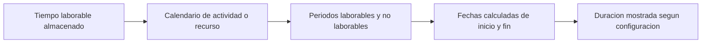

# Duracion en P6

La duracion en Primavera P6 parece simple al principio: una actividad toma cierta cantidad de dias. En la practica, la duracion es una de las partes mas importantes y mas mal entendidas de un cronograma.

La duracion esta conectada con calendarios, activity type, asignaciones de recursos, actualizaciones de progreso y configuraciones de visualizacion del usuario. Una duracion mostrada como "5 dias" puede no significar lo mismo en cada cronograma, cada calendario o cada layout de usuario. Por eso los planificadores deben entender no solo que es la duracion, sino tambien como P6 la almacena, calcula y muestra.

## Que Significa Duracion

Duracion es la cantidad de tiempo laborable requerida para ejecutar una actividad. No es simplemente la cantidad de dias calendario entre una fecha de inicio y una fecha de fin.

Por ejemplo, una actividad con 5 dias de duracion puede abarcar:

- 5 dias calendario en un calendario lunes a viernes sin interrupciones.
- 7 dias calendario si un fin de semana cae dentro del periodo de trabajo.
- Menos de 5 dias calendario en un calendario de 24 horas o turno extendido.
- Mas de 5 dias calendario si feriados o dias no laborables interrumpen el trabajo.

Esta es la primera leccion clave: la duracion es tiempo laborable, mientras que las fechas de inicio y fin son posiciones en el calendario.

## Como P6 Almacena la Duracion

P6 almacena la duracion como tiempo, comunmente a nivel de horas en los datos internos del cronograma. Lo que el usuario ve en el layout puede mostrarse como dias, semanas, meses o anos segun preferencias.

Esto significa que la duracion mostrada suele ser una conversion. Si P6 almacena una actividad como 40 horas laborables, un usuario puede verla como 5 dias si la conversion usa 8 horas por dia. Otra configuracion puede mostrarla distinto si la conversion de periodos de tiempo o la base de calendario es diferente.

Por eso dos personas pueden mirar el mismo cronograma y confundirse si sus User Preferences o las configuraciones administrativas de time periods no estan alineadas.

## Duracion y Calendarios

Los calendarios le dicen a P6 cuando puede ocurrir el trabajo. La duracion le dice a P6 cuanto tiempo laborable se requiere. Luego el calendario coloca ese tiempo laborable en fechas reales.

Si una actividad tiene 40 horas de Remaining Duration, el calendario determina como se distribuyen esas 40 horas.

En un calendario de 8 horas por dia, 40 horas pueden aparecer como 5 dias laborables. En un calendario de 10 horas por dia, las mismas 40 horas pueden aparecer como 4 dias laborables. En un calendario de 24 horas, puede abarcar mucho menos tiempo calendario.

Por eso las asignaciones de calendario importan. Cambiar el calendario puede cambiar la fecha de fin aunque la duracion laborable almacenada permanezca igual.

## Original Duration

Original Duration es la duracion planificada de la actividad antes de aplicar avance. Representa la estimacion inicial de tiempo laborable necesario para completar la actividad.

Original Duration es importante durante planificacion y desarrollo de baseline. Ayuda a definir el esfuerzo esperado o la ventana de tiempo de una tarea. Tambien se usa en discusiones de progreso y desempeno porque ofrece una referencia sobre cuanto se esperaba que durara la actividad.

Use Original Duration para responder: cuanto se planifico que durara esta actividad antes de actualizar estado?

## Remaining Duration

Remaining Duration es la cantidad de tiempo laborable que todavia se necesita para completar la actividad desde la fecha de datos actual.

Para una actividad no iniciada, Remaining Duration normalmente coincide con Original Duration salvo que haya sido revisada. Para una actividad en progreso, Remaining Duration debe reflejar el trabajo realista que queda. Para una actividad completada, Remaining Duration debe ser 0.

Remaining Duration es uno de los campos de actualizacion mas importantes en P6. Si esta mal, el pronostico estara mal.

Use Remaining Duration para responder: cuanto tiempo laborable todavia se requiere?

## Actual Duration

Actual Duration representa la cantidad de tiempo ya consumido en la actividad segun el avance real. Esta ligada a Actual Start, Actual Finish, fecha de datos, calendarios y metodo de actualizacion.

Actual Duration debe apoyar la historia de estado. Si una actividad ya inicio, la actual duration debe tener sentido respecto al Actual Start y la fecha de datos. Si la actividad esta completada, Actual Duration debe alinearse con el periodo real de trabajo.

Use Actual Duration para responder: cuanto tiempo laborable ya fue consumido?

## At Completion Duration

At Completion Duration representa la duracion total esperada de la actividad despues de combinar trabajo real y trabajo restante.

En terminos simples:

Actual Duration + Remaining Duration = At Completion Duration

Esto es util porque muestra si se espera que una actividad tome mas o menos tiempo que lo planificado originalmente. Si Original Duration era 10 dias pero At Completion Duration ahora es 15 dias, la actividad esta pronosticado para durar mas de lo previsto.

Use At Completion Duration para responder: cuanto se espera que dure esta actividad en total?

## Duracion y User Preferences

User Preferences controla como se muestran las unidades de tiempo para cada usuario. Un usuario puede elegir si las duraciones se muestran en horas, dias, semanas, meses o anos.

Esto afecta lo que el usuario ve, no necesariamente el calculo interno del cronograma. Por ejemplo, la misma duracion almacenada puede mostrarse como horas en un layout y como dias en otro.

Esto es util, pero tambien puede crear confusion. Un planificador revisando detalle puede preferir horas. Un project manager puede preferir dias. Un reporte de portafolio puede mostrar meses. Si la base de conversion no se entiende, los numeros pueden parecer inconsistentes.

Al revisar duraciones, confirme la unidad mostrada. Pregunte si la duracion visible esta en horas, dias, semanas u otra unidad.

## Admin Preferences y Time Periods

Admin Preferences incluye configuraciones de time periods que definen como P6 convierte horas en unidades mayores como dias, semanas, meses y anos. Estas configuraciones son importantes porque influyen en como se muestran y convierten los valores de duracion.

Por ejemplo, si el sistema usa 8 horas por dia, 40 horas se muestran como 5 dias. Si el sistema usa 10 horas por dia, 40 horas se muestran como 4 dias.

Esto no significa necesariamente que el trabajo cambio. Puede significar solamente que cambio la conversion.

En algunas configuraciones de P6, la visualizacion de duracion tambien puede depender de si el sistema o el usuario usa horas del calendario asignado para convertir periodos de tiempo. Por eso los equipos deben alinear estandares de calendario, user preferences y admin time-period settings antes de emitir reportes formales.

## Por Que la Duracion Puede Verse Diferente

La duracion puede verse diferente por varias razones:

- Usuarios diferentes muestran tiempo en unidades diferentes.
- Admin time-period settings convierten horas de forma distinta.
- Calendarios de actividad tienen diferentes horas por dia.
- Calendarios de recursos difieren de calendarios de actividad.
- Las actividades usan diferentes activity types.
- Remaining Duration fue actualizada manualmente.
- El progreso fue aplicado incorrectamente.
- La hora del dia esta oculta en el layout.

Por eso un problema de duracion no siempre es un problema de duracion. A veces es un problema de calendario. A veces es un problema de visualizacion. A veces es un problema de actualizacion de progreso.

## Relacion con Activity Types y Duration Types

Activity Type afecta que base de calendario es mas importante. Las actividades Task Dependent normalmente dependen principalmente del calendario de actividad. Las actividades Resource Dependent pueden estar mas influenciadas por calendarios de recursos.

Duration Type afecta como P6 balancea duracion, unidades de recursos y units per time. Por ejemplo, agregar recursos puede o no acortar la actividad segun el Duration Type.

Entonces, cuando una duracion se comporta de forma inesperada, revise tres cosas juntas:

- Calendario de actividad y calendario de recursos.
- Activity Type.
- Duration Type.

Estos campos trabajan juntos. Revisar solo uno puede llevar a una conclusion incorrecta.

## Problemas Comunes

Un problema comun es ingresar una duracion en dias sin notar que el calendario de actividad usa una cantidad de horas por dia diferente a la esperada.

Otro problema es comparar duraciones entre actividades que usan calendarios diferentes. Cinco dias en un calendario pueden no representar la misma cantidad de tiempo laborable que cinco dias en otro.

Un tercer problema es tener User Preferences inconsistentes. Un revisor puede ver horas mientras otro ve dias, y ambos pueden pensar que el cronograma cambio.

Otro problema comun es cambiar Admin Preferences despues de que ya existen cronogramas. Esto puede hacer que las duraciones mostradas parezcan diferentes aunque las horas internas almacenadas no hayan cambiado.

## Como Revisar Duracion Correctamente

Al revisar duracion en P6, no mire solo el numero mostrado en la columna Duration.

Revise:

- Original Duration.
- Remaining Duration.
- Actual Duration.
- At Completion Duration.
- Calendario de actividad.
- Calendario de recurso si se usan recursos.
- Activity Type.
- Duration Type.
- Visualizacion de unidad de tiempo en User Preferences.
- Conversion de time periods en Admin Preferences.

Si fechas o duraciones se ven extranas, agregue campos de calendario y hora al layout. No oculte la hora del dia durante el troubleshooting.

## Conclusion

La duracion en P6 es tiempo laborable, no solo tiempo calendario transcurrido. P6 almacena duracion como tiempo, aplica calendarios para colocar ese tiempo en el cronograma y la muestra segun User Preferences y configuraciones administrativas de time periods.

Esto significa que la duracion debe revisarse con contexto. Un valor mostrado como "5 dias" depende de horas de calendario, unidades de visualizacion, configuraciones de conversion, activity type, duration type y estado de actualizacion.

Un buen planificador entiende que la duracion no es solo un dato de entrada. Es parte del motor de calculo. Cuando duracion, calendarios y preferencias estan alineados, el cronograma es mas facil de explicar y mas confiable para project controls.
## Contenido relacionado
- [Actividades que Comienzan en la fecha de datos sin Lógica Impulsora: Por Qué Importa esta Métrica del Cronograma - Descripción general](../../metrics/01_activities_starting_in_dd_with_no_logic_driving/02_guide_template.md)
- [Calendarios en P6](../08_CALENDARS%20IN%20P6/08_CALENDARS%20IN%20P6.md)
- [Tipos de Percent Complete en P6](../10_PERCENT%20COMPLETION%20TYPES%20IN%20P6/10_PERCENT%20COMPLETION%20TYPES%20IN%20P6.md)
