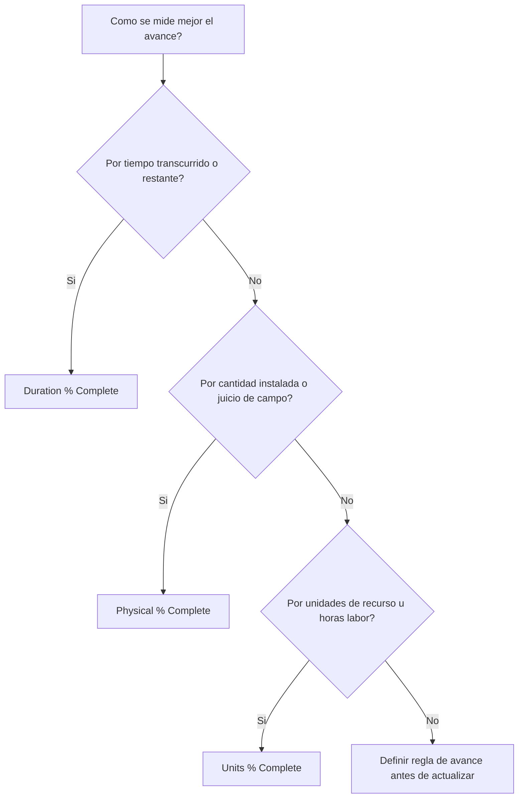

# Tipos de Percent Complete en P6

Percent complete es uno de los campos de avance mas visibles en Primavera P6, pero tambien uno de los mas mal entendidos. Un valor de 50% complete puede significar cosas diferentes segun como esta configurada la actividad y como el proyecto mide el avance.

En P6, Percent Complete Type controla como se calcula o actualiza Activity % Complete. Le dice a P6 si el avance debe basarse en tiempo, avance fisico o unidades de recursos.

Los principales Percent Complete Types para actividades son:

- Duration % Complete.
- Physical % Complete.
- Units % Complete.

Elegir el correcto importa porque el avance no es solo un numero de reporte. Afecta Remaining Duration, earned value, reportes de recursos, credibilidad del cronograma y calidad de cada ciclo de actualizacion.

## Por Que Importa el Percent Complete Type

Diferentes actividades necesitan diferentes formas de medir avance.

Para algunas actividades, el tiempo es una aproximacion razonable. Si una tarea tenia 10 dias de duracion y ya se completaron 5 dias laborables, puede ser razonable decir que esta cerca del 50% complete.

Para otras actividades, el tiempo no es suficiente. Una cuadrilla puede pasar 5 dias en una tarea de 10 dias y completar solo 20% del trabajo fisico. Otra cuadrilla puede completar 80% de la cantidad durante la primera mitad de la duracion. En esos casos, el avance basado en duracion puede confundir al equipo.

Para cronogramas cargados con recursos, las unidades pueden ser la mejor base de avance. Si una actividad esta planificada para 1,000 horas labor y se han ganado o consumido 600 horas, Units % Complete puede reflejar mejor el progreso.

El Percent Complete Type correcto depende de lo que representa la actividad y de como se mide realmente el avance.

## Activity % Complete

Activity % Complete es el valor general de avance mostrado para la actividad. Su origen depende del Percent Complete Type seleccionado.

Si la actividad usa Duration % Complete, Activity % Complete se impulsa por la relacion entre duracion original, actual y restante.

Si la actividad usa Physical % Complete, Activity % Complete sigue el valor de Physical % Complete ingresado por el usuario.

Si la actividad usa Units % Complete, Activity % Complete se basa en el avance de unidades de recursos.

Por eso dos actividades pueden mostrar 50% complete y significar cosas muy diferentes.

## Duration % Complete

Duration % Complete mide el avance con base en tiempo. Compara cuanta duracion se ha consumido contra la duracion total esperada.

En terminos simples, si una actividad tiene 10 dias de duracion planificada o at-completion y se han consumido 5 dias, puede mostrar cerca de 50% Duration % Complete.

Duration % Complete es util cuando el avance es razonablemente proporcional al tiempo.

Ejemplos incluyen:

- Periodos de revision administrativa.
- Periodos de espera o curado.
- Tareas de soporte basadas en tiempo.
- Algunas actividades simples donde la produccion es estable.

Use Duration % Complete cuando el tiempo es una medida justa del avance y Remaining Duration se mantiene cuidadosamente.

El riesgo es que tiempo consumido no siempre equivale a trabajo logrado. Una tarea puede consumir la mitad de su duracion planificada y estar muy atrasada fisicamente. Si el planificador depende solo de duracion, los reportes pueden verse mejor que la realidad.

## Physical % Complete

Physical % Complete se ingresa o actualiza manualmente con base en avance fisico real. Representa lo que realmente se ha logrado en el trabajo, independiente de duracion o unidades de recursos.

Esta suele ser la mejor opcion para construccion, entregables de ingenieria, instalacion, paquetes de commissioning o cualquier actividad donde el avance debe basarse en logro medible.

Ejemplos incluyen:

- 40% de planos emitidos.
- 60% de bandejas de cable instaladas.
- 75% de soldadura de tuberia completada.
- 30% de test package completo.
- 100% de alineacion de equipo terminada.

Use Physical % Complete cuando el avance debe medirse por cantidad, estado de entregable, verificacion de campo o criterio del responsable.

El beneficio es que puede reflejar la realidad mejor que el tiempo transcurrido. El riesgo es que requiere disciplina. El equipo debe definir como se mide el avance fisico, quien lo aprueba y que evidencia se recopila.

## Units % Complete

Units % Complete mide el avance con base en unidades de recursos. Compara actual units contra at-completion units.

Esto es util cuando el cronograma esta cargado con recursos y el avance se controla mediante labor hours, equipment hours u otras unidades medibles de recursos.

Ejemplos incluyen:

- Horas labor reales ganadas contra horas labor presupuestadas.
- Horas de equipo usadas contra horas de equipo planificadas.
- Trabajo instalado vinculado a avance de unidades de recursos.
- Flujos earned value basados en unidades.

Use Units % Complete cuando las unidades de recursos son confiables, se mantienen y forman parte del metodo de avance del proyecto.

El riesgo es que consumo de recursos no siempre equivale a avance fisico. Un equipo puede gastar muchas horas sin completar el trabajo esperado. Por eso Units % Complete funciona mejor cuando el reporte de recursos y la medicion de avance estan bien controlados.

## Como Elegir el Tipo Correcto

Una forma practica de elegir el Percent Complete Type es preguntar que significa avance para la actividad.

Si avance significa que paso el tiempo, use Duration % Complete.

Si avance significa que se logro trabajo fisico, use Physical % Complete.

Si avance significa que se ganaron o consumieron unidades de recursos, use Units % Complete.

La eleccion debe ser consistente entre grupos similares de actividades. Entregables de ingenieria pueden usar Physical % Complete. Instalacion de construccion puede usar Physical % Complete basado en cantidades. Soporte de gestion basado en tiempo puede usar Duration % Complete. Paquetes con alta carga de recursos pueden usar Units % Complete si los datos de recursos son confiables.

## Relacion con Remaining Duration

Percent complete y Remaining Duration deben contar una historia consistente.

Una actividad puede estar 80% fisicamente completa y aun tener 10 dias de Remaining Duration si el trabajo restante es dificil, esta retrasado o depende de otra condicion. Eso puede ser valido.

Una actividad puede estar 50% Duration % Complete porque paso la mitad del tiempo planificado, pero si solo 20% del trabajo fisico esta hecho, probablemente Remaining Duration debe revisarse.

Por eso las buenas actualizaciones requieren revisar avance y pronostico. Percent complete dice cuanto se logro. Remaining Duration dice cuanto tiempo todavia se necesita.

## Errores Comunes

Un error comun es usar Duration % Complete para actividades donde el avance fisico no es proporcional al tiempo. Esto puede hacer que el progreso parezca mejor o peor que el trabajo real.

Otro error es usar Physical % Complete sin una regla de medicion. Si una disciplina reporta avance fisico por cantidad instalada y otra por opinion, el cronograma se vuelve inconsistente.

Un tercer error es usar Units % Complete cuando los datos de recursos estan incompletos o no son confiables. Si las actual units no se mantienen, el valor de avance no sera confiable.

Otro problema es actualizar percent complete e ignorar Remaining Duration. Una actividad puede mostrar avance y aun tener un pronostico poco realista.

## Buenas Practicas

Defina reglas de avance antes de que empiece el ciclo de actualizacion. El equipo debe saber que grupos de actividades usan Duration, Physical o Units % Complete.

Use layouts que muestren Percent Complete Type, Activity % Complete, Physical % Complete, Duration % Complete, Units % Complete, Remaining Duration, Actual Start, Actual Finish y Activity Status.

Revise inconsistencias como:

- Actividades Started con 0% progress.
- Remaining Duration = 0 pero status no complete.
- 100% progress sin Actual Finish.
- Physical % Complete que no coincide con evidencia de campo.
- Units % Complete basado en actualizaciones faltantes de recursos.

Estos controles ayudan a asegurar que el avance no solo se ingrese, sino que sea creible.

## Conclusion

Percent Complete Type en P6 define como se mide el avance de una actividad. Duration % Complete mide avance basado en tiempo. Physical % Complete mide trabajo real logrado. Units % Complete mide avance por unidades de recursos.

Ningun tipo es el mejor para todas las actividades. La eleccion correcta depende de como el trabajo se planifica, mide y controla.

Un cronograma fuerte usa Percent Complete Types intencionalmente. Cuando el metodo coincide con el trabajo, las actualizaciones son mas claras, Remaining Duration es mas confiable y el reporte del proyecto es mas facil de defender.
## Contenido relacionado
- [Actividades que Comienzan en la fecha de datos sin Lógica Impulsora: Por Qué Importa esta Métrica del Cronograma - Descripción general](../../metrics/01_activities_starting_in_dd_with_no_logic_driving/02_guide_template.md)
- [Duracion en P6](../09_DURATION%20IN%20P6/09_DURATION%20IN%20P6.md)
- [Donde Viven los Costos en P6](../11_WHERE%20THE%20COST%20LIVE%20IN%20P6/11_WHERE%20THE%20COST%20LIVE%20IN%20P6.md)
