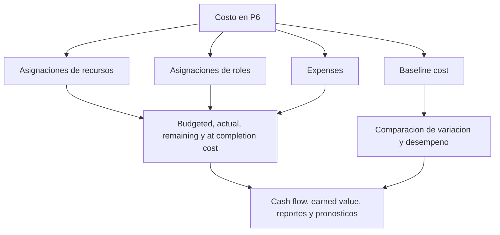

# Donde Viven los Costos en P6

El costo en Primavera P6 puede vivir en varios lugares. Eso es util, pero tambien puede ser confuso. Un cronograma puede mostrar Budgeted Cost, Actual Cost, Remaining Cost, At Completion Cost, resource cost, role cost, expense cost, earned value fields y baseline cost. Estos valores estan relacionados, pero no significan lo mismo.

Para equipos de project controls, la pregunta clave no es solo "cual es el costo?" La mejor pregunta es: de donde viene este costo, que representa y como debe usarse?

Este blog explica los principales tipos de costos disponibles en P6, las diferencias entre ellos y cuando conviene usar cada uno.

## Por Que Importa Donde Vive el Costo

P6 es principalmente una herramienta de programacion, pero tambien puede soportar cronogramas cargados con costos, earned value, cash flow y reportes de pronostico. Para hacerlo correctamente, el costo debe ubicarse en la parte correcta del modelo.

Si el costo de mano de obra se ingresa como expense, los histogramas de recursos pueden no contar la historia correcta. Si Actual Cost se ingresa manualmente pero el proyecto espera que venga de actual resource units, los reportes pueden volverse inconsistentes. Si falta baseline cost, los reportes de variacion pierden contexto.

La ubicacion del costo importa porque la fuente del costo afecta como se resume, actualiza, pronosticado y reporta.

## Costos de Recursos

Los costos de recursos vienen de recursos asignados a actividades. Un recurso puede representar mano de obra, equipo u otra categoria. Cada recurso puede tener rates, units y calculos de costo.

Por ejemplo, si una actividad usa una cuadrilla de pipefitters durante 80 horas a una tarifa definida, P6 puede calcular el costo laboral desde las unidades asignadas y la tarifa.

Los costos de recursos son utiles cuando el proyecto quiere conectar actividades con mano de obra, equipos, productividad e histogramas de recursos.

Use costos de recursos cuando:

- Importa la demanda de mano de obra o equipos.
- Se necesitan histogramas de recursos.
- El costo esta vinculado a horas o unidades.
- Earned value o avance se basa en recursos.
- El cronograma se usa para planificacion de recursos.

El riesgo principal es el mantenimiento. Los cronogramas cargados con recursos requieren disciplina. Si units, rates, calendarios o actuals no se mantienen, los reportes de costo no seran confiables.

## Costos de Roles

Los roles son funciones genericas, como engineer, electrician, planner, inspector o crane operator. En P6, los roles pueden asignarse a actividades antes de conocer los recursos nombrados.

Los costos de roles pueden soportar planificacion temprana cuando el equipo conoce el tipo de recurso necesario pero no la persona o cuadrilla especifica.

Por ejemplo, durante planificacion temprana de ingenieria, una actividad puede necesitar 120 horas de "Senior Engineer". La persona especifica aun no esta asignada, pero el rol puede aportar una tarifa de planificacion y una estimacion de costo.

Use costos de roles cuando:

- El cronograma aun esta en planificacion.
- Los recursos nombrados no estan confirmados.
- El proyecto necesita una estimacion de recursos o costos de alto nivel.
- Los roles luego seran reemplazados por recursos reales.

Los costos de roles son utiles en etapas tempranas, pero deben revisarse cuando el proyecto madura. Si los roles permanecen despues de conocer los recursos reales, el cronograma puede ser demasiado generico para control detallado.

## Expense Costs

Expenses son costos no asociados a recursos y asignados directamente a actividades. Son utiles para costos que no se representan bien como mano de obra o equipos.

Ejemplos incluyen:

- Permisos.
- Viajes.
- Lump sums de vendor.
- Paquetes de subcontratistas.
- Materiales comprados como monto fijo.
- Tarifas de pruebas.
- Cargos de movilizacion.

Los expenses pueden ser budgeted, actual, remaining o at completion segun como el proyecto los controla.

Use expenses cuando:

- El costo no esta impulsado por horas de recursos.
- El costo es fijo o lump-sum.
- La actividad necesita un costo directo no asociado a recursos.
- El proyecto necesita cash flow para items no laborales.

El riesgo es que expenses se conviertan en un cajon para todo. Si todos los costos se ingresan como expenses, el cronograma puede perder la capacidad de explicar mano de obra, equipos y productividad por separado.

## Budgeted Cost

Budgeted Cost es el costo planificado asignado a la actividad. Puede venir de recursos, roles, expenses o una combinacion.

Budgeted Cost es importante porque representa el plan de costo antes de la ejecucion. Soporta cash flow, baseline cost, configuracion de earned value y reportes de project controls.

Use Budgeted Cost para responder: cual era el costo planificado de esta actividad?

Si falta Budgeted Cost o es inconsistente, el cronograma puede calcular fechas, pero no puede soportar reportes significativos de costo.

## Actual Cost

Actual Cost representa el costo ya incurrido. Segun la configuracion del proyecto, puede calcularse desde actual resource units y rates, ingresarse manualmente, importarse desde timesheets o cargarse desde un sistema externo de costos.

Actual Cost es importante para reporte de progreso y earned value. Muestra lo que se ha gastado o registrado hasta el momento.

Use Actual Cost para responder: que costo ya fue incurrido o registrado?

El riesgo es mezclar fuentes. Si algunos actual costs se importan desde contabilidad y otros se ingresan manualmente en P6, el equipo necesita una regla clara para evitar duplicaciones o vacios.

## Remaining Cost

Remaining Cost es el costo pronosticado que aun se necesita para completar la actividad. Esta vinculado a remaining units, resource rates, remaining expenses y supuestos de actualizacion.

Remaining Cost es uno de los campos de pronostico mas importantes. Le dice al equipo cuanto costo queda desde la fecha de datos hacia adelante.

Use Remaining Cost para responder: cuanto costo todavia se espera?

Si Remaining Duration se actualiza pero Remaining Cost no, el pronostico puede volverse inconsistente. Lo mismo ocurre cuando las resource units o remaining expenses no se mantienen.

## At Completion Cost

At Completion Cost es el costo total esperado de la actividad despues de combinar actual y remaining cost.

En terminos simples:

Actual Cost + Remaining Cost = At Completion Cost

At Completion Cost ayuda a mostrar si una actividad esta pronosticado para terminar sobre, bajo o en presupuesto.

Use At Completion Cost para responder: cual es el ultimo costo total esperado?

## Baseline Cost

Baseline Cost viene de una baseline asignada. Se usa para comparar los valores actuales de costo contra el plan aprobado.

Baseline cost es importante para reportes de variacion. Sin baseline, el proyecto puede conocer el pronostico actual, pero no si ese pronostico esta mejor o peor que el plan aprobado.

Use Baseline Cost para responder: como se compara el costo actual con el plan aprobado?

Baseline cost es especialmente importante cuando se usa P6 para earned value o reportes formales PMO.

## Campos de Earned Value

P6 puede soportar campos de earned value como Planned Value, Earned Value, Actual Cost, Cost Variance y Schedule Variance, dependiendo de la configuracion del proyecto.

Earned value usa informacion del cronograma cargado con costos para comparar trabajo planificado, trabajo ganado y costo real.

Estos campos son utiles cuando el proyecto tiene un proceso formal de earned value. Requieren baselines consistentes, reglas de progreso, percent complete methods y cost loading.

Use campos de earned value cuando:

- El proyecto requiere reporte EV.
- Las reglas de progreso estan definidas.
- Baseline cost esta aprobada.
- La fuente de Actual Cost esta controlada.
- El avance de actividades se mantiene consistentemente.

Sin esos controles, los resultados de earned value pueden verse precisos pero ser poco confiables.

## Que Tipo de Costo Debe Usar

Use costos de recursos para mano de obra y equipos que deben soportar planificacion de recursos, productividad e histogramas.

Use costos de roles para planificacion temprana cuando los recursos nombrados aun no se conocen.

Use expenses para costos directos no asociados a recursos, lump sums, vendors, permisos, viajes o paquetes de subcontrato.

Use budgeted, actual, remaining y at completion cost para entender el ciclo de vida del costo.

Use baseline cost para comparacion contra el plan aprobado.

Use earned value fields cuando el proyecto tiene el gobierno necesario para soportar reporte EV.

## Problemas Comunes

Un problema comun es la duplicacion de costos. El mismo costo de subcontratista puede ingresarse como resource cost y otra vez como expense.

Otro problema es Actual Cost faltante. El cronograma puede tener budget y remaining cost, pero el actual cost puede vivir en un sistema contable separado y nunca llegar a P6.

Un tercer problema es usar expenses para todo. Esto puede producir costo total, pero poca visibilidad de recursos.

Otro issue es progreso inconsistente. Si percent complete, remaining duration y remaining cost no estan alineados, at completion cost se vuelve poco confiable.

## Buenas Practicas

Defina la estrategia de costos antes de cargar el cronograma. Decida donde viviran mano de obra, equipos, materiales, subcontratos e indirectos.

Use cost accounts, activity codes, recursos, roles y expense categories de forma consistente.

Documente si los actual costs se ingresaran en P6, se importaran o se reportaran desde otro sistema.

Revise los campos de costo en cada ciclo de actualizacion. Budgeted, actual, remaining y at completion cost deben contar una historia coherente.

## Conclusion

El costo en P6 puede vivir en recursos, roles, expenses, baselines y campos de earned value. Cada lugar tiene un proposito diferente.

Los costos de recursos conectan costo con mano de obra y equipos. Los costos de roles soportan planificacion temprana. Expense costs capturan items directos no asociados a recursos. Budgeted, actual, remaining y at completion costs muestran el ciclo de vida del costo. Baseline y earned value fields soportan comparacion y reporte de desempeno.

Un cronograma cargado con costos fuerte no se construye poniendo numeros donde quepan. Se construye decidiendo donde pertenece cada tipo de costo y manteniendo esa estructura durante cada ciclo de actualizacion.
## Contenido relacionado
- [Actividades que Comienzan en la fecha de datos sin Lógica Impulsora: Por Qué Importa esta Métrica del Cronograma - Descripción general](../../02_metrics_es/01_activities_starting_in_dd_with_no_logic_driving/01_overview_template.md)
- [Tipos de Percent Complete en P6](../10_PERCENT%20COMPLETION%20TYPES%20IN%20P6/10_PERCENT%20COMPLETION%20TYPES%20IN%20P6.md)
- [Tipos de Recursos en P6](../12_RESOURCE%20TYPES%20IN%20P6/12_RESOURCE%20TYPES%20IN%20P6.md)
