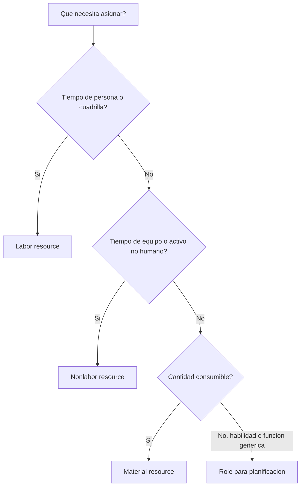

# Tipos de Recursos en P6

Los recursos en Primavera P6 representan las personas, equipos y materiales necesarios para ejecutar el trabajo. Conectan el cronograma con capacidad, productividad, costo y demanda de recursos en el tiempo.

Un cronograma puede existir sin recursos, pero un cronograma cargado con recursos entrega una vista mas profunda. Puede mostrar histogramas de mano de obra, demanda de equipos, uso de materiales, curvas de costo, restricciones de recursos y posibles sobrecargas. Para que esa informacion sea util, el planificador debe entender los diferentes tipos de recursos disponibles en P6 y cuando usar cada uno.

Los principales tipos de recursos en P6 son:

- Labor.
- Nonlabor.
- Material.

P6 tambien usa roles, que no son exactamente lo mismo que recursos, pero estan muy relacionados y son utiles durante la planificacion.

## Por Que Importa el Tipo de Recurso

El tipo de recurso afecta como P6 maneja units, rates, costos, calendarios y reportes.

Un recurso labor se comporta distinto a un recurso material. Una grua no debe tratarse igual que volumen de concreto. Un rol generico de engineer no es lo mismo que un recurso nombrado. Si los tipos de recursos se mezclan incorrectamente, los histogramas, reportes de costo, revisiones de productividad y salidas de earned value pueden ser misleading.

El tipo de recurso responde una pregunta practica: que tipo de elemento se esta asignando a la actividad?

## Labor Resources

Los Labor resources representan personas o cuadrillas. Normalmente se miden en horas, dias u otras unidades basadas en tiempo. Pueden tener rates, calendarios, limites de disponibilidad y valores de costo.

Ejemplos incluyen:

- Planner.
- Cuadrilla civil.
- Electrician.
- Welding crew.
- Engineer.
- Inspector.
- Commissioning technician.

Use Labor resources cuando el cronograma necesita mostrar esfuerzo humano o demanda de cuadrillas. Son utiles para histogramas de mano de obra, staffing plans, analisis de productividad y pronostico de costo laboral.

Por ejemplo, una actividad llamada "Install Cable Tray" puede requerir 4 electricistas durante 5 dias. Asignar recursos labor permite que el cronograma muestre la demanda de electricistas durante ese periodo.

Los Labor resources tambien son utiles cuando el proyecto necesita comparar labor hours planificadas contra labor hours reales.

## Nonlabor Resources

Los Nonlabor resources representan equipos u otros activos reutilizables que no son personas. Normalmente son basados en tiempo, como labor, pero no son recursos humanos.

Ejemplos incluyen:

- Crane.
- Excavator.
- Welding machine.
- Testing equipment.
- Equipo de scaffolding.
- Herramienta especializada.
- Generator.

Use Nonlabor resources cuando la disponibilidad de equipos importa o cuando el costo de equipo debe controlarse en el tiempo.

Por ejemplo, si un heavy lift requiere una grua durante dos dias, asignar una grua como recurso nonlabor ayuda al equipo a ver demanda, evitar conflictos y pronostico de costo de equipo.

Los Nonlabor resources son importantes cuando el equipo es escaso, costoso, compartido entre areas o impulsor de la secuencia.

## Material Resources

Los Material resources representan items consumibles. Normalmente se miden en cantidades en lugar de tiempo.

Ejemplos incluyen:

- Metros cubicos de concreto.
- Toneladas de acero.
- Metros de cable.
- Pipe spools.
- Valves.
- Litros de coating.
- Panels.

Use Material resources cuando el cronograma necesita controlar consumo por cantidad o costo relacionado con materiales.

Los Material resources pueden soportar curvas de materiales, seguimiento de cantidades y cost loading. Son especialmente utiles cuando el cronograma se conecta con cantidades instaladas o earned value basado en cantidades.

Por ejemplo, una actividad puede incluir instalacion de 500 metros de cable. Asignar cable como material resource ayuda al equipo a controlar cantidad planificada y real instalada en el tiempo.

Los Material resources no deben usarse para representar labor hours o tiempo de equipo. Tienen otro proposito.

## Roles

Los roles son funciones genericas o categorias de habilidad. No son lo mismo que recursos, pero ayudan durante la planificacion antes de conocer recursos nombrados.

Ejemplos incluyen:

- Senior engineer.
- Electrical supervisor.
- Civil inspector.
- Scheduler.
- Commissioning lead.
- Crane operator.

Los roles son utiles en planificacion temprana porque el proyecto puede conocer que tipo de habilidad necesita sin saber exactamente quien ejecutara el trabajo.

Por ejemplo, una actividad de ingenieria puede necesitar 80 horas de "Senior Electrical Engineer". Mas adelante, ese rol puede reemplazarse o complementarse con un recurso nombrado.

Use roles cuando:

- La planificacion aun esta a alto nivel.
- Los recursos nombrados no estan confirmados.
- Se necesita demanda por tipo de habilidad.
- La organizacion quiere pronosticos tempranos de staffing.

Los roles deben revisarse cuando el proyecto madura. Si el cronograma requiere control detallado, los roles pueden necesitar reemplazarse por recursos reales.

## Calendarios de Recursos

Los recursos pueden tener calendarios. Esto importa porque la disponibilidad de recursos puede diferir de la disponibilidad de la actividad.

Por ejemplo, una actividad de construccion puede usar un calendario de actividad de 6 dias, pero el especialista vendor asignado puede estar disponible solo de lunes a viernes. Si la actividad es Resource Dependent o se usa resource leveling, el calendario de recurso puede afectar el cronograma.

Labor y Nonlabor resources suelen necesitar calendarios porque personas y equipos estan disponibles solo en ciertos momentos. Material resources normalmente se comportan distinto porque representan cantidades, no tiempo laborable.

Cuando las fechas de recursos se ven extranas, revise tanto el calendario de actividad como el calendario de recurso.

## Costos de Recursos

Los recursos pueden tener tarifas de costo. Labor y Nonlabor resources suelen usar tarifas basadas en tiempo. Material resources suelen usar tarifas unitarias.

Por ejemplo:

- Electrician: costo por hora.
- Crane: costo por hora o dia.
- Concrete: costo por metro cubico.

Cuando los recursos se asignan a actividades, P6 puede calcular Budgeted, Actual, Remaining y At Completion Cost.

Esto es util para cronogramas cargados con costos, earned value, pronosticos de recursos y analisis de cash flow. Pero funciona bien solo cuando units, rates, calendarios y actualizaciones de progreso se mantienen.

## Elegir el Tipo Correcto

Use Labor cuando el recurso es una persona, cuadrilla o esfuerzo humano.

Use Nonlabor cuando el recurso es equipo o un activo reutilizable cuyo tiempo importa.

Use Material cuando el recurso es una cantidad consumible.

Use Roles cuando planifica por habilidad o funcion antes de conocer recursos nombrados.

La eleccion debe reflejar como el proyecto quiere planificar, medir y reportar el trabajo.

## Errores Comunes

Un error comun es usar labor resources para todo. Esto puede facilitar el cost loading al inicio, pero reduce claridad cuando importan equipos o cantidades de materiales.

Otro error es usar material resources para items que realmente son expenses o lump sums de subcontrato. Si el proyecto no necesita seguimiento de cantidades, un expense puede ser mas apropiado.

Un tercer error es asignar recursos sin mantener actual units. Un cronograma cargado con recursos solo es util si las actualizaciones mantienen actualizada la data de recursos.

Otro problema es confundir roles y recursos. Los roles son buenos para planificar, pero los recursos nombrados son mejores cuando importan asignaciones detalladas, calendarios y actuals.

## Buenas Practicas

Defina la estrategia de recursos antes de cargar el cronograma.

Decida que trabajo usara labor resources, que trabajo usara nonlabor resources, que materiales necesitan seguimiento de cantidades y donde conviene usar expenses.

Use convenciones consistentes de nombres y resource codes. Mantenga limpio el resource dictionary. Evite recursos duplicados con nombres ligeramente distintos.

Revise asignaciones de recursos en cada ciclo de actualizacion. Units, costos, calendarios y actuals deben permanecer alineados con el proceso de project controls.

## Conclusion

Los tipos de recursos en P6 ayudan a definir que se necesita para ejecutar el trabajo. Labor resources representan personas y cuadrillas. Nonlabor resources representan equipos y activos reutilizables. Material resources representan cantidades consumibles. Roles soportan planificacion por habilidad o funcion antes de conocer recursos nombrados.

Elegir el tipo correcto hace que el cronograma sea mas facil de analizar. Mejora histogramas de mano de obra, planificacion de equipos, seguimiento de materiales, cost loading, earned value y pronostico reporting.

Un buen cronograma cargado con recursos no es solo un cronograma con recursos pegados. Es un cronograma donde cada tipo de recurso se usa intencionalmente y se mantiene durante la vida del proyecto.
## Contenido relacionado
- [Actividades Iniciadas con 0% de Avance en Primavera P6 - Descripción general](../../02_metrics_es/13_activity_started_progress_zero/01_overview_template.md)
- [Donde Viven los Costos en P6](../11_WHERE%20THE%20COST%20LIVE%20IN%20P6/11_WHERE%20THE%20COST%20LIVE%20IN%20P6.md)
- [Limites de Recursos en P6](../13_RESOURCES%20LIMITS%20IN%20P6/13_RESOURCES%20LIMITS%20IN%20P6.md)
