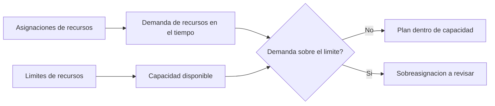

# Limites de Recursos en P6

Los limites de recursos en Primavera P6 definen cuanto de un recurso esta disponible durante un periodo de tiempo. Se usan para comparar la demanda de recursos creada por las asignaciones de actividades contra la capacidad que el proyecto realmente tiene.

En terminos simples, un limite de recurso responde la pregunta: cuanto de este recurso puede usar el proyecto?

Si un cronograma dice que una cuadrilla debe trabajar en cinco actividades al mismo tiempo, P6 puede mostrar la demanda. Pero sin un limite de recurso, el cronograma no muestra claramente si esa demanda es realista. El limite permite ver sobreasignaciones, problemas de capacidad y posibles problemas de cronograma causados por recursos.

## Que Son los Limites de Recursos

Un limite de recurso es la disponibilidad maxima de un recurso. Puede definirse como unidades por periodo de tiempo, por ejemplo horas por dia, horas por semana o numero de unidades disponibles durante un periodo laborable.

Por ejemplo:

- Un planner disponible 8 horas por dia.
- Tres electricistas disponibles 24 horas-hombre por dia.
- Una grua disponible 8 horas-equipo por dia.
- Dos inspectores disponibles 16 horas-hombre por dia.

Cuando las actividades tienen recursos asignados, P6 calcula la demanda creada por esas asignaciones. El limite del recurso entrega la linea de capacidad contra la que se compara la demanda.

## Por Que Importan

Los limites de recursos son importantes porque los cronogramas muchas veces son tecnicamente posibles, pero practicamente imposibles.

Una red logica puede calcular que varias actividades pueden ejecutarse en paralelo. Las fechas pueden verse aceptables. El camino critico puede parecer razonable. Pero si todas esas actividades necesitan la misma cuadrilla, especialista o equipo limitado, el plan puede no ser ejecutable.

Los limites de recursos ayudan a mostrar esa diferencia entre un cronograma calculado y un cronograma ejecutable.

Son utiles para:

- Identificar cuadrillas sobrecargadas.
- Revisar demanda de equipos.
- Soportar histogramas de recursos.
- Revisar planes de manpower.
- Preparar resource leveling.
- Explicar por que algun trabajo no puede iniciar aunque la logica lo permita.
- Probar si el plan coincide con la capacidad disponible.

En project controls, esto es especialmente valioso cuando el cronograma se usa para staffing, soporte a procurement, planificacion de construccion o earned value.

## Limites de Labor

Los limites de labor definen cuantas personas u horas-hombre estan disponibles.

Por ejemplo, si el proyecto tiene 10 electricistas trabajando 8 horas por dia, el limite diario puede ser 80 horas por dia. Si la demanda del cronograma muestra 120 horas de electricista en el mismo dia, el cronograma esta pidiendo mas electricistas de los que el proyecto tiene.

Esto no significa automaticamente que el cronograma este mal. Significa que el planificador debe revisar el plan. La solucion puede ser agregar cuadrillas, cambiar la secuencia, mover trabajo no critico, usar overtime o aceptar un peak temporal si es realista y aprobado.

Los limites de labor son utiles cuando la disponibilidad de mano de obra es una restriccion real. Son menos utiles cuando el cronograma no se mantiene con el nivel de detalle necesario para controlar recursos.

## Limites de Nonlabor

Los limites de nonlabor aplican a equipos y otros activos reutilizables.

Ejemplos incluyen gruas, excavadoras, equipos de prueba, herramientas especializadas, generadores o instalaciones temporales. Si solo hay una grua disponible, las actividades que requieren esa misma grua no pueden ejecutarse todas al mismo tiempo, a menos que se agregue otra grua o se cambie la secuencia.

Aqui los limites de recursos pueden ser muy practicos. El equipo muchas veces es una restriccion real, especialmente cuando es costoso, compartido entre areas, dificil de movilizar o necesario para trabajo critico.

Por ejemplo, dos izajes pesados pueden estar logicamente listos. Pero si ambos necesitan la misma grua, el limite del recurso puede mostrar que el plan excede la capacidad disponible.

## Materiales y Limites

Los recursos material se comportan distinto a labor y nonlabor. Normalmente representan cantidades, no disponibilidad diaria de tiempo de trabajo.

Una asignacion de material puede mostrar volumen de concreto planificado, longitud de cable, toneladas de acero o cantidad instalada. El proyecto puede tener restricciones de materiales, pero esas restricciones muchas veces se manejan mediante fechas de procurement, hitos de entrega, control de inventario o relaciones logicas en el cronograma, no con el mismo tipo de limite diario usado para personas o equipos.

Esto no significa que los materiales no sean importantes. Significa que el planificador debe tener claro que quiere representar el limite.

Si el problema es capacidad de produccion, por ejemplo maximos metros cubicos de concreto colocados por dia, un modelo de recurso o produccion puede ser util. Si el problema es si el material llego o no llego, los hitos de procurement o las relaciones logicas suelen ser mas claros.

## Como P6 Usa los Limites

P6 puede usar limites de recursos en resource profiles, spreadsheets, histogramas y analisis de recursos. La demanda de las asignaciones se puede mostrar contra el limite disponible.

Cuando se usa resource leveling, P6 tambien puede usar la disponibilidad de recursos para retrasar actividades y mantener la demanda dentro de los limites, dependiendo de la configuracion de leveling.

Esto es poderoso, pero debe manejarse con cuidado. Resource leveling puede cambiar fechas pronostico. Si los limites, calendarios, prioridades y logica no estan bien mantenidos, el resultado nivelado puede verse matematico, pero no practico.

Por eso, los limites de recursos deben ser parte de un proceso controlado de planificacion, no un boton que se presiona al final de una actualizacion.

## Cuando Usarlos

Use limites de recursos cuando los recursos son realmente limitados y el cronograma esta cargado con recursos con suficiente calidad para soportar el analisis.

Buenos casos de uso incluyen:

- Un proyecto con numero fijo de cuadrillas.
- Gruas o equipos especializados compartidos.
- Especialistas limitados de ingenieria o commissioning.
- Shutdowns, turnarounds y outages.
- Planes de construccion donde los peaks de manpower deben controlarse.
- Programas donde la misma pool de recursos soporta varios proyectos.

Los limites de recursos tambien son utiles para analisis what-if. El planificador puede probar si el plan actual funciona con la capacidad disponible o si necesita cuadrillas adicionales, overtime o cambios de secuencia.

## Cuando Tener Cuidado

Tenga cuidado cuando la data de recursos esta incompleta o es simbolica.

Si los recursos se agregaron solo para cost loading, las units pueden no representar disponibilidad real. Si todo el trabajo esta asignado a recursos genericos, el histograma puede ser demasiado amplio para tomar decisiones reales. Si las actual units no se actualizan, el plan de recursos puede alejarse rapidamente de la realidad.

Tambien tenga cuidado con limites artificiales. Un limite demasiado bajo puede crear retrasos innecesarios durante leveling. Un limite demasiado alto puede ocultar problemas reales de capacidad.

El limite debe coincidir con la pregunta de planificacion. Estamos probando disponibilidad real de cuadrilla, staffing presupuestado, acceso a equipos o un target de management? Cada caso puede requerir una configuracion distinta.

## Errores Comunes

Un error comun es definir limites sin acordar que representan. Un recurso puede mostrar 80 horas por dia, pero eso representa la cuadrilla actual, la cuadrilla maxima, la cuadrilla presupuestada o la cuadrilla prometida por el contratista?

Otro error es usar resultados de leveling sin revisarlos. P6 puede mover actividades segun reglas de recursos, pero el planificador debe verificar si el resultado tiene sentido constructivo.

Otro problema es ignorar calendarios. Un limite de recurso esta conectado con disponibilidad, y la disponibilidad depende del tiempo laborable. Si el calendario del recurso no coincide con el patron real de trabajo, el limite puede producir sobreasignaciones falsas o disponibilidad que no existe.

Tambien es comun aceptar recursos sobrecargados como si el histograma fuera solo un reporte. Una sobreasignacion es una senal de planificacion. Debe activar una revision, no simplemente ignorarse.

## Buenas Practicas

Empiece por los recursos que mas importan. No todos los recursos necesitan un limite detallado. Enfoquese en cuadrillas criticas, equipos escasos, especialistas clave y recursos que afectan la terminacion del proyecto o hitos mayores.

Defina si el limite representa capacidad normal, capacidad maxima o peak aprobado. Mantenga esa definicion consistente.

Revise los perfiles de recursos durante cada actualizacion del cronograma. Si el pronostico cambia, la demanda de recursos tambien cambia. Los limites deben revisarse junto con logica, calendarios, duraciones remanentes y progreso.

Use resource leveling con cuidado y documente la configuracion. Compare el resultado nivelado con el cronograma sin nivelar para que el equipo entienda que cambio y por que.

Lo mas importante es validar el resultado con las personas que ejecutan el trabajo. Un histograma solo es util si refleja un plan real de recursos.

## Conclusion

Los limites de recursos en P6 definen capacidad disponible. Permiten que el equipo compare lo que el cronograma demanda contra lo que el proyecto puede entregar realisticamente.

Bien usados, los limites ayudan a identificar sobreasignaciones, soportar planificacion de manpower, controlar demanda de equipos y mejorar el realismo del cronograma. Mal usados, pueden crear histogramas misleading o resultados artificiales de leveling.

Los mejores limites de recursos son simples, intencionales y conectados con decisiones reales del proyecto. Ayudan a responder una pregunta practica: puede el proyecto ejecutar este plan con los recursos que realmente tiene?
## Contenido relacionado
- [Actividades Iniciadas con 0% de Avance en Primavera P6 - Descripción general](../../metrics/13_activity_started_progress_zero/02_guide_template.md)
- [Tipos de Recursos en P6](../12_RESOURCE%20TYPES%20IN%20P6/12_RESOURCE%20TYPES%20IN%20P6.md)
- [Balance de Recursos en P6](../14_RESOURCES%20BALANCING%20IN%20P6/14_RESOURCES%20BALANCING%20IN%20P6.md)
