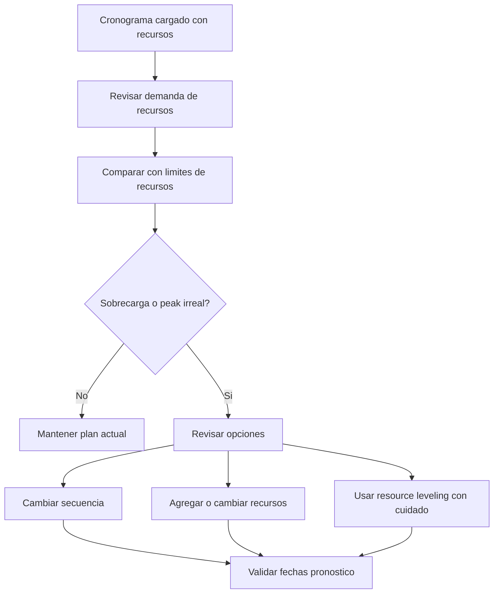

El balance de recursos en Primavera P6 es el proceso de revisar la demanda de recursos contra la capacidad disponible y ajustar el plan para que el trabajo pueda ejecutarse con los recursos reales del proyecto. Ayuda al equipo a entender si el cronograma es solo logicamente correcto o tambien practico desde el punto de vista de recursos.

En el uso diario, muchas personas usan resource balancing y resource leveling como si fueran lo mismo. Estan relacionados, pero no son exactamente iguales.

Resource balancing es la revision mas amplia de planificacion. Incluye revisar histogramas, resource profiles, disponibilidad de cuadrillas, demanda de equipos, peaks de manpower y realismo del plan.

Resource leveling es una funcion de P6 que puede mover actividades segun disponibilidad de recursos y configuraciones de leveling.

La funcion puede ser util, pero debe usarse con control. P6 puede calcular un resultado nivelado, pero el scheduler debe decidir si ese resultado tiene sentido para el proyecto.

## Que Es el Balance de Recursos

El balance de recursos hace una pregunta practica: puede el proyecto ejecutar este cronograma con los recursos que realmente tiene?

Un cronograma puede tener buena logica, fechas aceptables y un camino critico razonable. Pero si requiere que la misma cuadrilla o equipo limitado trabaje en demasiados lugares al mismo tiempo, el plan puede no ser realista.

Balancear recursos significa revisar esa demanda y decidir como administrarla.

Acciones posibles incluyen:

- Mover trabajo no critico.
- Agregar recursos.
- Dividir trabajo entre diferentes cuadrillas o areas.
- Cambiar la secuencia de actividades.
- Usar overtime o turnos.
- Ajustar calendarios.
- Actualizar limites de recursos.
- Aceptar un peak temporal si es realista y esta aprobado.

El objetivo no es que el histograma quede perfectamente plano. Los proyectos reales tienen peaks y valles. El objetivo es asegurar que la demanda de recursos sea entendida, alcanzable y alineada con el plan de ejecucion.

## Por Que Importa

El balance de recursos importa porque el cronograma debe soportar la ejecucion, no solo el calculo.

Si el plan requiere 50 soldadores la proxima semana pero el contratista solo puede proveer 30, el cronograma muestra una demanda que no puede cumplirse. Si dos actividades criticas requieren la misma grua al mismo tiempo, al menos una tendra que moverse. Si varias actividades de revision de ingenieria requieren el mismo especialista, el cuello de botella puede aparecer antes de construccion.

Sin balance de recursos, el proyecto puede creer que tiene mas capacidad de la que realmente tiene.

Esto puede afectar:

- Lookahead planning.
- Forecasts de manpower.
- Planificacion de equipos.
- Credibilidad del camino critico.
- Forecasts de earned value.
- Curvas de costo y cash flow.
- Compromisos de avance.
- Planes de recuperacion.

El balance de recursos ayuda a conectar el cronograma CPM con la capacidad real de campo y oficina.

## Resource Balancing vs Resource Leveling

Resource balancing es una actividad de management y planificacion.

Resource leveling es un calculo de programacion.

Esa diferencia es importante. Un planner puede balancear recursos manualmente revisando histogramas y ajustando el cronograma segun conocimiento del proyecto. P6 resource leveling tambien puede ayudar retrasando automaticamente actividades cuando la demanda excede la disponibilidad.

Ambos enfoques pueden ser utiles.

El balance manual es mejor cuando el scheduler necesita criterio, input de campo, revision de constructabilidad o control cuidadoso sobre que actividades se mueven.

P6 resource leveling es util cuando la data de recursos es confiable, los limites de recursos estan definidos, los calendarios son correctos y el scheduler quiere probar como cambia el cronograma cuando se fuerza la disponibilidad de recursos.

Leveling no debe reemplazar el criterio de planificacion. Debe soportarlo.

## Que Necesita P6 Antes de Leveling

Antes de usar la funcion de resource leveling de P6, el cronograma debe estar listo para analisis de recursos.

Como minimo, revise:

- Las actividades tienen asignaciones de recursos con sentido.
- Las resource units reflejan demanda real.
- Los limites de recursos reflejan disponibilidad real.
- Los calendarios de recursos son correctos.
- Los calendarios de actividades son correctos.
- La logica es suficientemente completa para soportar decisiones de programacion.
- Las restricciones se entienden.
- Las prioridades estan definidas o revisadas.
- El cronograma actual fue guardado para poder comparar el resultado nivelado.

Si estos puntos son debiles, leveling puede producir un resultado que parece preciso pero no es util.

Por ejemplo, si toda la mano de obra de construccion esta asignada a un recurso generico llamado "construction crew", P6 puede mostrar una sobrecarga, pero el resultado puede no decir si el problema es civil, piping, electrico o mecanico. La estructura de recursos debe coincidir con la decision de planificacion.

## Como P6 Usa Resource Leveling

P6 resource leveling revisa asignaciones y disponibilidad de recursos. Dependiendo de la configuracion, puede retrasar actividades para reducir o eliminar sobreasignaciones.

El calculo puede considerar limites de recursos, logica de actividades, float, calendarios, prioridades y opciones de leveling. El resultado exacto depende de como este configurado el proyecto.

En terminos practicos, P6 busca situaciones donde la demanda de recursos es mayor que la disponibilidad y luego intenta mover actividades a fechas donde los recursos esten disponibles.

Esto puede crear un cronograma mas factible desde recursos, pero tambien puede cambiar el camino critico, retrasar hitos o mover trabajo de formas que necesitan revision.

Despues de leveling, el scheduler debe comparar el resultado contra el pronostico original:

- Que actividades se movieron?
- Que hitos cambiaron?
- Cambio el camino critico?
- Leveling uso float disponible o retraso la fecha final del proyecto?
- Las nuevas fechas son constructibles?
- El resultado soluciono el problema de recursos o creo otro?

El cronograma nivelado no debe aceptarse a ciegas.

## Cuando Usarlo

Use balance de recursos cuando la disponibilidad de recursos afecta la ejecucion.

Es especialmente util en:

- Cronogramas de construccion con limitaciones de cuadrillas.
- Shutdowns, turnarounds y outages.
- Planes de commissioning con especialistas limitados.
- Cronogramas de ingenieria con revisores compartidos.
- Proyectos con equipos costosos o compartidos.
- Programas donde una misma pool de recursos soporta varios proyectos.
- Planes de recuperacion donde se evalua agregar recursos.

El balance de recursos tambien es util antes de aprobar una baseline. Una baseline que asume manpower o equipos irreales puede ser dificil de defender despues.

Durante actualizaciones, el balance de recursos ayuda a confirmar si el trabajo remanente todavia puede ejecutarse con el equipo y recursos actuales.

## Cuando Tener Cuidado

Tenga cuidado cuando la data de recursos no se mantiene.

Si las actual units no se actualizan, las curvas de recursos pueden alejarse de la realidad. Si los recursos se asignan solo para cost loading, las units pueden no representar capacidad real. Si los calendarios estan incorrectos, la disponibilidad de recursos tambien puede estar incorrecta.

Tambien tenga cuidado al usar resource leveling en un cronograma contractual o baseline. Leveling puede mover fechas y afectar float. El equipo debe entender si el cronograma nivelado es el plan oficial, un escenario what-if o una vista interna de planificacion.

Leveling tambien puede ocultar debilidades de logica. Si una actividad se mueve por leveling, los revisores pueden pasar por alto que la logica original estaba incompleta o incorrecta. Revise siempre la logica primero y los recursos despues.

## Como Usarlo en la Practica

Empiece identificando los recursos que mas importan. No intente balancear cada recurso menor con el mismo nivel de detalle. Enfoquese en cuadrillas clave, especialistas criticos, equipos compartidos y recursos que pueden afectar hitos.

Luego revise el resource profile o histograma en P6. Busque peaks, sobrecargas, vacios y cambios bruscos de demanda.

Compare la demanda contra los limites de recursos. Si la demanda excede el limite, discuta el problema con el equipo responsable. La respuesta puede ser operacional, no solo de programacion.

Despues, decida el metodo de correccion:

- Si el limite de recurso esta mal, actualice el limite.
- Si la demanda de recurso esta mal, corrija la asignacion.
- Si la secuencia no es realista, ajuste logica o timing de actividades.
- Si la sobrecarga es real, decida si agregar recursos, usar overtime, mover trabajo o aceptar el peak.
- Si automated leveling es apropiado, ejecutelo como escenario controlado y compare el resultado.

Guarde una copia del cronograma sin nivelar antes de ejecutar resource leveling. Esto da al equipo un punto de referencia y ayuda a explicar que cambio.

## Buenas Practicas

Use el balance de recursos como parte de la revision del cronograma, no como una limpieza de una sola vez.

Revise curvas de recursos durante desarrollo de baseline, repronosticos mayores, recovery planning y ciclos regulares de actualizacion.

No nivele un cronograma de mala calidad esperando que el resultado se vuelva confiable. Primero corrija logica, calendarios, status de actividades, duraciones remanentes y asignaciones de recursos.

Documente las configuraciones de leveling cuando se use la funcion de P6. Resource leveling puede producir resultados diferentes segun las opciones seleccionadas, por lo que la configuracion forma parte del registro del cronograma.

Lo mas importante es validar el plan de recursos con las personas que ejecutan el trabajo. El equipo del proyecto debe confirmar si los peaks son alcanzables, si la secuencia es practica y si los recursos adicionales realmente estan disponibles.

## Conclusion

El balance de recursos en P6 ayuda al equipo a probar si el cronograma puede ejecutarse con los recursos disponibles. Conecta fechas y logica con manpower, equipos, especialistas y capacidad real de produccion.

P6 resource leveling puede apoyar esta revision moviendo actividades segun disponibilidad de recursos, pero debe usarse con cuidado y revisarse despues del calculo.

Un cronograma balanceado no necesariamente es un cronograma perfectamente plano. Es un cronograma donde la demanda de recursos es visible, realista y alineada con la forma en que el proyecto realmente sera ejecutado.
## Contenido relacionado
- [Actividades Iniciadas con 0% de Avance en Primavera P6 - Descripción general](../../metrics/13_activity_started_progress_zero/02_guide_template.md)
- [Limites de Recursos en P6](../13_RESOURCES%20LIMITS%20IN%20P6/13_RESOURCES%20LIMITS%20IN%20P6.md)
- [Relaciones SS y FF](../15_SS%20&%20FF%20RELATIONS/15_SS%20&%20FF%20RELATIONS.md)
