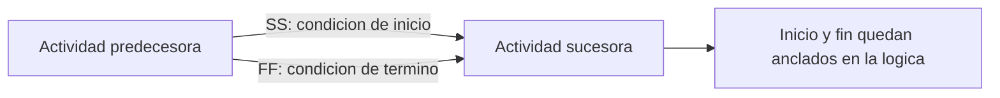

# Relaciones SS y FF

Las relaciones Start-to-Start (SS) y Finish-to-Finish (FF) son tipos de logica validos en Primavera P6. Son utiles cuando dos actividades se traslapan y el cronograma necesita representar ese traslape mejor que con una relacion simple Finish-to-Start.

El problema no es SS o FF por si mismas. El problema es usarlas solas cuando la actividad necesita control en ambos extremos. Una relacion SS controla el inicio del sucesor, pero no su fin. Una relacion FF controla el fin del sucesor, pero no su inicio. Por eso muchos schedulers las llaman relaciones a medias cuando no tienen logica complementaria.

## Que Significan SS y FF

Una relacion SS indica que el sucesor puede iniciar cuando inicia el predecesor, o despues de un lag definido desde el inicio del predecesor.

Una relacion FF indica que el sucesor puede terminar cuando termina el predecesor, o despues de un lag definido desde el fin del predecesor.

Ambas pueden representar trabajo real. Por ejemplo, una revision de ingenieria puede iniciar despues de que inicia la produccion de diseno. Las pruebas pueden terminar solo cuando termina la instalacion. Las cuadrillas de construccion pueden trabajar en areas traslapadas, donde una actividad inicia despues de que otra empezo, pero ambas necesitan control de terminacion.

## Por Que Una SS Sola Puede Ser Incompleta

Una SS sola solo amarra el inicio del sucesor. No explica que controla el fin del sucesor.

Si la duracion del sucesor cambia, o si la actividad se extiende mas alla de lo realista, el cronograma puede no mostrar bien el impacto salvo que exista logica aguas abajo que lo capture. El inicio esta conectado, pero el fin puede quedar flotando.

En P6, esto puede hacer que el cronograma parezca mejor conectado de lo que realmente esta. La actividad tiene un predecesor, pero la logica no necesariamente describe la ejecucion completa del trabajo.

## Por Que Una FF Sola Puede Ser Incompleta

Una FF sola crea el problema contrario. Amarra el fin del sucesor, pero no explica cuando el sucesor puede iniciar.

Esto puede permitir que el early start se calcule demasiado hacia atras, especialmente en un cronograma actualizado. La actividad puede parecer lista para iniciar en la fecha de datos o incluso antes, no porque el trabajo este realmente listo, sino porque la logica no definio la condicion de inicio.

Esto puede distorsionar float, analisis de camino critico y planificacion de corto plazo.

## El Par SS + FF

Cuando el trabajo realmente se traslapa, el modelo mas fuerte suele ser un par SS + FF.

La relacion SS controla cuando el sucesor puede iniciar. La relacion FF controla cuando el sucesor puede terminar. Juntas definen el marco logico del trabajo traslapado.

Esto es util en trabajo continuo o repetitivo, como construccion por areas, ciclos de diseno y revision, instalacion y pruebas, o secuencias de produccion.

## Cuando SS o FF Sola Puede Ser Aceptable

No toda relacion SS o FF individual esta automaticamente mal.

Una SS sola puede ser aceptable si el fin del sucesor esta controlado por otra relacion valida aguas abajo. Una FF sola puede ser aceptable si el inicio del sucesor esta controlado por otro predecesor valido. La pregunta clave es si ambos extremos de la actividad estan controlados en algun punto de la red.

El scheduler debe poder explicar por que esa relacion individual es suficiente.

## Como Revisarlo en P6

En P6, revise actividades con predecesores SS, sucesores SS, predecesores FF y sucesores FF. Ponga especial atencion a actividades donde el unico predecesor es FF o el unico sucesor es SS.

Campos utiles incluyen Activity ID, Activity Name, Start, Finish, Activity Status, Total Float, Predecessors, Successors, Relationship Type, Lag, Constraints y relación impulsora cuando este disponible.

Pregunte:

- Que permite iniciar esta actividad?
- Que controla su fin?
- El traslape es fisico o contractual?
- El lag esta ocultando detalle faltante?
- La relacion explica el plan de ejecucion?
- Un revisor independiente entenderia la logica?

## Problemas Comunes

Un problema comun es usar SS para adelantar trabajo sin modelar la condicion real que permite el traslape.

Otro problema es usar FF para sostener una fecha de termino dejando abierto el inicio.

SS y FF tambien se usan mal cuando el trabajo deberia dividirse en actividades mas pequenas. Si una actividad es demasiado amplia, el planner puede forzar el resultado con SS o FF en vez de separar el trabajo en pasos mas claros.

## Buenas Practicas

Use SS y FF con intencion. Deben representar secuencia real, no conveniencia del cronograma.

Cuando use SS, confirme que el fin del sucesor tambien este controlado logicamente. Cuando use FF, confirme que el inicio del sucesor tambien este controlado logicamente.

Use pares SS + FF para trabajo traslapado cuando el inicio y el fin necesitan estar vinculados. Documente excepciones cuando una SS o FF individual sea deliberada y defendible.

## Conclusion

Las relaciones SS y FF son herramientas utiles en P6, pero requieren disciplina. Usadas solas, pueden crear logica incompleta porque controlan solo un extremo de la actividad.

Un cronograma CPM confiable debe explicar por que el trabajo puede iniciar y que controla su terminacion. Cuando SS y FF ayudan a responder esas preguntas, fortalecen el cronograma. Cuando dejan un extremo abierto, crean logica debil que debe revisarse.
## Contenido relacionado
- [Actividades que Comienzan en la fecha de datos sin Lógica Impulsora: Por Qué Importa esta Métrica del Cronograma - Descripción general](../../02_metrics_es/01_activities_starting_in_dd_with_no_logic_driving/01_overview_template.md)
- [Balance de Recursos en P6](../14_RESOURCES%20BALANCING%20IN%20P6/14_RESOURCES%20BALANCING%20IN%20P6.md)
- [CPM (Critical Path Method)](../16_CPM%20(CRITICAL%20PATH%20METHOD)/16_CPM%20(CRITICAL%20PATH%20METHOD).md)
