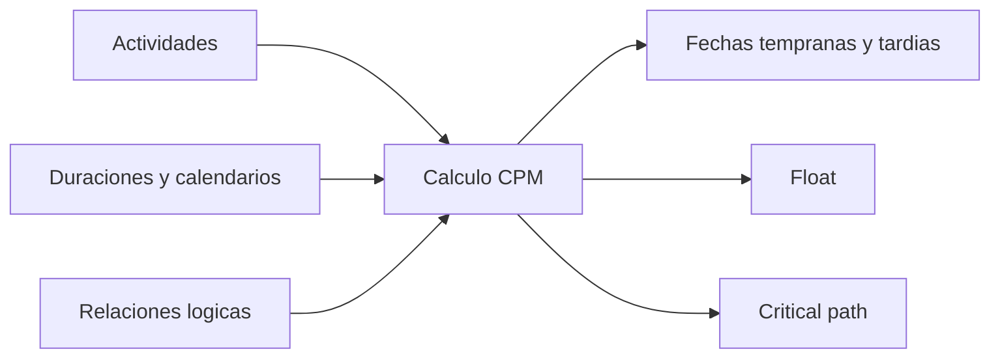

El Critical Path Method, o CPM, es el metodo de calculo detras de un cronograma serio. Convierte una lista de actividades en un modelo con logica que puede responder preguntas clave: cuando puede terminar el proyecto, que actividades controlan esa terminacion y donde existe flexibilidad.

En Primavera P6, CPM muchas veces queda escondido detras del boton de schedule. El software calcula fechas, float y actividades criticas muy rapido. Pero el metodo sigue siendo importante. Si el planner no entiende CPM, el cronograma puede calcular, pero el resultado puede no significar lo que el equipo cree.

## Que Hace CPM

CPM calcula la duracion del proyecto a partir de una red de actividades, duraciones, calendarios y relaciones.

La idea central es simple: la duracion del proyecto no es la suma de todas las actividades. Es la duracion del camino conectado mas largo de trabajo dependiente dentro de la red. Ese camino es el critical path.

Si una actividad en ese camino se retrasa, la terminacion del proyecto se retrasa, a menos que el equipo recupere tiempo en el mismo camino.

## Que Entradas Necesita CPM

CPM depende de la calidad de la red del cronograma.

Primero, el cronograma necesita actividades que representen partes claras del trabajo. Cada actividad debe tener alcance definido, duracion razonable y criterio claro de terminacion.

Segundo, cada actividad necesita una duracion. En la mayoria de cronogramas P6, esta es una estimacion deterministica: una duracion planificada basada en productividad, recursos, calendarios y supuestos de ejecucion.

Tercero, las actividades necesitan logica. Las relaciones definen que debe ocurrir antes de que, que puede ejecutarse en paralelo y que condicion permite que un sucesor inicie o termine.

CPM no sabe si la logica es buena. Calcula con la logica que recibe. Si la red tiene logica faltante, restricciones debiles, lag excesivo o relaciones SS/FF incompletas, el resultado puede ser matematicamente correcto pero poco confiable.

## Forward Pass y Backward Pass

CPM calcula el cronograma en dos pasadas principales.

El forward pass avanza desde la fecha de datos hacia el final del proyecto. Calcula las fechas mas tempranas en que cada actividad puede iniciar y terminar segun logica, duraciones, calendarios y restricciones.

Estas son Early Start y Early Finish.

El backward pass avanza desde el final del proyecto hacia el inicio. Calcula las fechas mas tardias en que cada actividad puede iniciar y terminar sin retrasar la terminacion del proyecto o el target seleccionado.

Estas son Late Start y Late Finish.

Con fechas tempranas y tardias, P6 puede calcular float.

## Float

Float es el tiempo que una actividad puede moverse antes de afectar un objetivo del cronograma.

Total Float suele ser el valor principal revisado en P6. Muestra cuanto puede retrasarse una actividad antes de afectar la terminacion del proyecto o el camino controlador.

Free Float es mas local. Muestra cuanto puede retrasarse una actividad antes de afectar el early start de su sucesor inmediato.

Float no es tiempo libre para consumir sin cuidado. Es flexibilidad del cronograma. Cuando el float se consume, el proyecto tiene menos proteccion contra retrasos futuros.

## Critical Path

El critical path es el camino conectado mas largo de actividades dependientes que controla la terminacion del proyecto. En muchos cronogramas, las actividades criticas se identifican por total float cero o negativo, pero la mejor revision es entender el longest path y confirmar si tiene sentido.

Un buen critical path debe contar una historia de ejecucion creible. Debe pasar por actividades que realmente controlan la terminacion: liberaciones de ingenieria, procurement, secuencias de construccion, pruebas, commissioning, entrega u otros impulsores reales.

Si el critical path pasa por hitos extranos, restricciones innecesarias, logica faltante o actividades que no controlan realmente la terminacion, el cronograma puede estar enviando una senal falsa.

## Trabajo Near-Critical

El equipo no debe mirar solo actividades con float cero.

Las actividades near-critical tienen poco float y pueden volverse criticas con un retraso moderado. El umbral depende del tamano y sensibilidad del proyecto. En proyectos grandes, actividades con menos de 10 o 20 dias laborables de float pueden requerir atencion cercana.

Los caminos near-critical importan porque el riesgo rara vez vive en una sola linea. Un cronograma puede tener varios caminos cerca de ser criticos, especialmente durante construccion densa, commissioning o paradas.

## CPM y Analisis de Riesgo

CPM entrega una respuesta deterministica: si cada actividad toma la duracion planificada, esta es la fecha de terminacion.

Schedule Risk Analysis va mas lejos. Prueba incertidumbre aplicando rangos o distribuciones probabilisticas a duraciones y ejecutando muchas simulaciones. Esto ayuda a estimar la probabilidad de terminar en una fecha objetivo.

Pero el analisis de riesgo depende de la red CPM. Si la logica es debil, el resultado de riesgo tambien sera debil. Una simulacion Monte Carlo no corrige logica faltante, duraciones irreales ni mala estructura.

## CPM en Primavera P6

P6 hace el calculo CPM rapido, pero esa velocidad puede ocultar los supuestos detras del resultado.

Cuando se calcula el cronograma, P6 usa fecha de datos, calendarios, duraciones, relaciones, restricciones, actuals, remaining durations y schedule options. Cambios pequenos en estas configuraciones pueden cambiar float, critical path y fechas pronostico.

Por eso el planner no debe solo presionar F9 y aceptar el resultado. Debe revisar lo calculado y desafiar si coincide con el plan real de ejecucion.

## Buenas Practicas

Construya la red CPM desde logica real de ejecucion. Evite agregar relaciones solo para pasar una revision o producir una fecha deseada.

Revise el critical path despues de cada actualizacion. Confirme que inicia y termina de forma razonable para el estado actual del proyecto.

Monitoree el movimiento del float en el tiempo. Un proyecto puede verse en plan mientras consume float silenciosamente.

Revise caminos near-critical. Muchas veces muestran donde aparecera el siguiente problema de cronograma.

Mantenga el cronograma suficientemente limpio para soportar CPM. Open starts, open finishes, hard restricciones, lag excesivo y relaciones incompletas reducen el valor del calculo.

## Conclusion

CPM es el motor que convierte un cronograma Primavera P6 en una herramienta de project control. Calcula fechas tempranas, fechas tardias, float y critical path desde la red de actividades.

Pero CPM es tan confiable como el cronograma que calcula. Buenas actividades, duraciones realistas, calendarios correctos y logica fuerte hacen que el resultado tenga significado.

El valor de CPM no es solo mostrar una fecha final. Su valor real es explicar por que esa fecha esta controlada, donde existe flexibilidad y donde debe enfocarse la atencion del management.
## Contenido relacionado
- [Ruta Crítica o Ruta de Holgura que Inicia con una Restricción - Descripción general](../../metrics/09_cp_or_float_path_starting_with_restriccion/02_guide_template.md)
- [Relaciones SS y FF](../15_SS%20&%20FF%20RELATIONS/15_SS%20&%20FF%20RELATIONS.md)
- [Desarrollar un Cronograma de Proyecto](../17_DEVELOPE%20A%20PROJECT%20SCHEDULE/17_DEVELOPE%20A%20PROJECT%20SCHEDULE.md)
