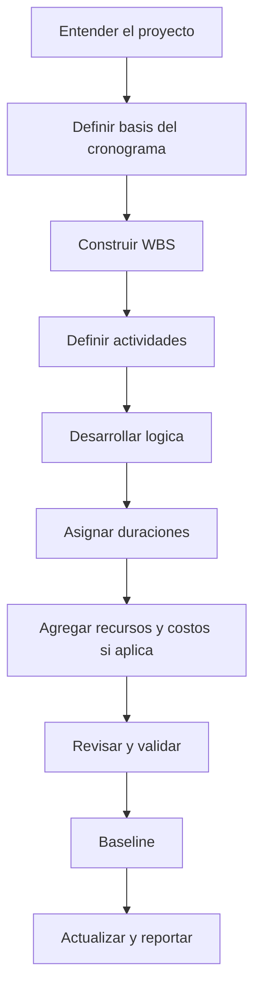

Desarrollar un cronograma desde cero no es solo ingresar actividades en Primavera P6. Es convertir alcance, estrategia de ejecucion, restricciones, recursos y compromisos del proyecto en un modelo de tiempo que pueda revisarse, aprobarse, actualizarse y usarse para tomar decisiones.

Un buen cronograma se construye antes de calcularse. La calidad del archivo P6 depende del pensamiento que ocurre antes de ingresar la primera actividad.

## Flujo de Desarrollo

## Entender el Proyecto Primero

No empiece en P6 antes de entender el proyecto.

Revise contrato, alcance, especificaciones, hitos, estrategia de ejecucion, restricciones de procurement, permisos, accesos y entregas principales. Luego converse con quienes ejecutaran el trabajo: project manager, ingenieria, procurement, construccion, commissioning, subcontratistas y proveedores cuando aplique.

El cronograma es un modelo de como el equipo pretende entregar el proyecto. Si el planner no entiende esa intencion, el cronograma quedara basado en supuestos.

## Definir la Basis del Cronograma

La scheduling basis explica como se construira el cronograma. Debe definir WBS, calendarios, codificacion, nivel de detalle, reglas de relaciones, politica de lag, configuracion de P6, convencion de fecha de datos, reportes y enfoque de baseline.

Este documento es importante porque explica por que el cronograma fue construido asi. Tambien da una referencia para revisiones de calidad y comparaciones futuras.

## Construir la WBS

La Work Breakdown Structure organiza el cronograma. Debe reflejar como el proyecto sera gestionado y reportado.

Puede organizarse por fase, area, sistema, disciplina, entregable, paquete contractual o una combinacion. La estructura debe soportar filtros, medicion de avance, responsabilidades y reportes.

Si la WBS no coincide con la forma de controlar el proyecto, el cronograma sera dificil de usar aunque las actividades sean correctas.

## Definir las Actividades

Las actividades deben representar partes claras y medibles del trabajo. Cada una debe tener alcance definido, condicion clara de inicio, condicion clara de termino y un responsable.

Actividades demasiado grandes son dificiles de actualizar. Actividades demasiado pequenas hacen que el cronograma sea costoso de mantener. El nivel correcto depende de la fase, contrato, reportes y control esperado.

Los nombres de las actividades importan. Un buen nombre debe decir que trabajo se realiza, donde se realiza y con que objeto, sistema o entregable se relaciona.

## Desarrollar la Logica

La logica es el corazon del cronograma CPM. Define que debe ocurrir antes de que, que puede ejecutarse en paralelo y que condicion permite iniciar o terminar cada actividad.

La logica debe desarrollarse con quienes conocen el trabajo. En P6, evite construir la secuencia solo desde el escritorio. Revise con disciplinas, construction managers, commissioning, procurement y subcontratistas.

Use FS cuando represente mejor el trabajo. Use SS y FF con cuidado cuando el traslape sea real. Evite lag negativo y evite SF salvo razon clara y aprobada. Cada actividad normalmente debe tener predecessor y successor, excepto hitos validos de inicio y fin.

## Asignar Duraciones

Las duraciones deben ser realistas, no aspiracionales. Deben basarse en alcance, productividad, recursos, calendarios, input de vendors, subcontratistas y experiencia comparable.

Una duracion no es solo un numero. Supone cierta cuadrilla, ritmo de produccion, calendario, acceso y metodo de ejecucion. Si esos supuestos cambian, la duracion puede cambiar.

Documente supuestos importantes de duracion. Ayuda en revisiones, actualizaciones, cambios y analisis de demora.

## Agregar Recursos y Costos Cuando Aplique

Si el cronograma se usara para recursos, cost loading, earned value o cash flow, recursos y costos deben agregarse con cuidado.

Resource loading permite ver demanda de mano de obra, equipos, materiales y posibles sobrecargas. Cost loading conecta el cronograma con presupuestos, pronosticos y curvas de pago o progreso.

No agregue recursos solo por apariencia. Si el proyecto usara esa data, debe mantenerse durante las actualizaciones.

## Revisar y Validar

Antes de aprobar la baseline, el cronograma debe revisarse tecnica y operacionalmente.

Ejecute controles de calidad: open starts, open finishes, tipos de relaciones, lags, restricciones, duraciones largas, logica faltante, distribucion de float y razonabilidad del critical path. Los checks tipo DCMA son utiles, pero requieren criterio de proyecto.

Revise el cronograma con el equipo. Pregunte si logica, duraciones, recursos e hitos coinciden con el plan real. Un cronograma que pasa metricas pero falla ante el equipo de campo no esta listo.

## Baseline del Cronograma

Cuando esta revisado y aprobado, el cronograma se convierte en baseline. La baseline es la referencia para medir avance, variaciones, demoras, recuperacion y performance.

La baseline debe ser formal. Guarde la version aprobada, protejala de cambios no controlados y documente aprobaciones. Cambios posteriores deben seguir change control.

Una baseline que cambia cada vez que el proyecto se atrasa no es baseline. Es un objetivo movil.

## Establecer el Ciclo de Actualizacion

El cronograma sigue siendo util solo si se actualiza consistentemente.

Defina quien entrega avance, cuando se recoge, que evidencia se requiere, como se verifican actual dates, como se revisan remaining durations y que reportes se emiten. Construccion y commissioning activos pueden requerir updates semanales o quincenales. Fases tempranas pueden ser mensuales.

El ciclo de actualizacion convierte la baseline en una herramienta viva de control.

## Conclusion

Desarrollar un cronograma es un proceso estructurado. Entienda el proyecto, defina la basis, construya la WBS, cree actividades, desarrolle logica, asigne duraciones, cargue recursos cuando corresponda, valide, baselinese y mantengalo con updates.

Los mejores cronogramas no nacen por abrir P6 rapido. Nacen de entender el trabajo, desafiar supuestos y crear un modelo en el que el equipo pueda confiar.
## Contenido relacionado
- [Actividades que Comienzan en la fecha de datos sin Lógica Impulsora: Por Qué Importa esta Métrica del Cronograma - Descripción general](../../metrics/01_activities_starting_in_dd_with_no_logic_driving/02_guide_template.md)
- [CPM (Critical Path Method)](../16_CPM%20(CRITICAL%20PATH%20METHOD)/16_CPM%20(CRITICAL%20PATH%20METHOD).md)
- [Activity Codes](../18_ACTIVITY%20CODES/18_ACTIVITY%20CODES.md)
