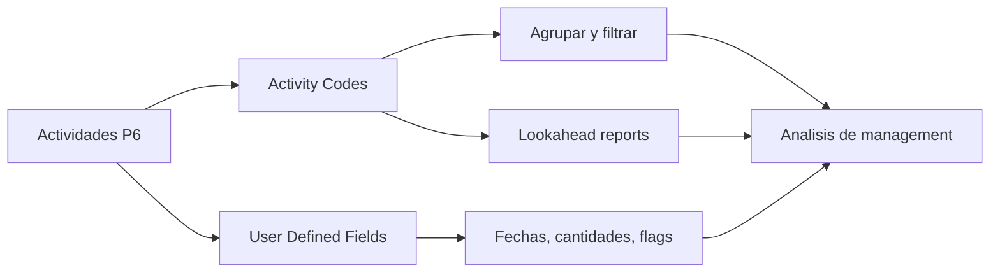

# Activity Codes

Los Activity Codes en Primavera P6 son una de las herramientas principales para convertir un cronograma de una lista de actividades en una base de datos util para project controls. Permiten agrupar, filtrar, ordenar, reportar y analizar el cronograma desde diferentes perspectivas de gestion.

Un cronograma no es solo un bar chart. En P6, cada actividad tambien es un registro que puede llevar informacion sobre responsable, fase, area, sistema, disciplina, contrato, tipo de hito y otros atributos del proyecto. Los Activity Codes ayudan a organizar esa informacion de forma controlada.

## Que Son los Activity Codes

Los Activity Codes son campos estructurados de clasificacion asignados a actividades. Cada code type representa una dimension de reporte, y cada code value representa una opcion dentro de esa dimension.

Por ejemplo:

- Code type: Area.
- Code values: Unit 1, Unit 2, Tank Farm, Utilities.

O:

- Code type: Discipline.
- Code values: Civil, Mechanical, Electrical, Instrumentation, Commissioning.

La WBS indica donde esta el trabajo dentro de la estructura del proyecto. Los Activity Codes indican como puede verse ese trabajo para reportes y analisis.

## Que No Son

Los Activity Codes no reemplazan la WBS. La WBS es la jerarquia del alcance. Los codes son vistas adicionales de las mismas actividades.

Los Activity Codes no reemplazan la logica. La logica define la secuencia del trabajo.

Los Activity Codes no reemplazan los recursos. Los recursos definen mano de obra, equipos, materiales y cost loading.

Cuando estos conceptos se mezclan, el cronograma se vuelve dificil de mantener. Un cronograma P6 limpio usa WBS, logica, recursos, Activity Codes y UDFs para propositos distintos.

## Global y Project Activity Codes

P6 tiene Global Activity Codes y Project Activity Codes.

Global Activity Codes se comparten entre proyectos. Son utiles cuando la misma clasificacion debe usarse en un portfolio, como fases estandar, grupos corporativos de responsabilidad o categorias de reporte de programa.

Project Activity Codes pertenecen a un proyecto especifico. Son utiles para necesidades propias del proyecto, como areas, sistemas, paquetes contractuales, frentes de trabajo, turnover packages o categorias locales de reporte.

Use global codes con cuidado porque los cambios pueden afectar otros proyectos. Use project codes para atributos que solo tienen sentido dentro de un proyecto.

## Tipos Comunes de Activity Codes

Los code types utiles dependen del proyecto, pero ejemplos comunes incluyen:

- Responsible Party.
- Discipline.
- Project Phase.
- Area or Location.
- System or Subsystem.
- Contract Package.
- Work Package.
- Milestone Type.
- Turnover Package.
- Reporting Level.

Los mejores code types nacen de las necesidades de reporte. Antes de crear codes, pregunte: que preguntas debe responder el cronograma?

Ejemplos:

- Que trabajo esta planificado en Area A el proximo mes?
- Que actividades pertenecen al contratista electrico?
- Que sistemas estan controlando commissioning?
- Que contract package se esta atrasando?
- Que hitos deben reportarse al cliente?

## User Defined Fields

Los User Defined Fields, o UDFs, son diferentes de los Activity Codes. Los codes clasifican actividades en categorias. Los UDFs guardan datos personalizados como fechas, numeros, texto, costos, cantidades o indicadores si/no.

Use UDFs cuando la informacion no sea simplemente una categoria.

Ejemplos:

- Contractual finish date.
- Forecast finish date.
- Risk flag.
- Quantity planned.
- Quantity installed.
- Change order number.
- Drawing reference.
- Inspection status.

Los Activity Codes son mejores para agrupar y filtrar. Los UDFs son mejores para guardar informacion adicional que P6 no entrega por defecto.

## Por Que Importan Para Reportes

Una buena codificacion hace que los reportes sean mas rapidos y confiables.

Con Activity Codes consistentes, el scheduler puede producir lookaheads por disciplina, reportes por area, resumenes por paquete contractual, reportes por sistema de commissioning, reportes de hitos y dashboards sin reconstruir filtros cada vez.

Sin codes, el reporte suele volverse manual. El equipo exporta data, edita spreadsheets, agrega etiquetas a mano y repite el trabajo en cada update. Eso crea errores y consume tiempo.

Los codes hacen que el cronograma sea reutilizable como fuente de datos.

## Gobernanza

Los Activity Codes necesitan gobernanza. Si todos crean valores libremente, el cronograma se vuelve inconsistente rapidamente.

Por ejemplo, una persona puede usar "Electrical", otra "Elec" y otra "E&I". El reporte puede perder actividades porque la misma categoria queda dividida en varias etiquetas.

Defina code types y valores validos antes de la baseline cuando sea posible. Documente que significa cada code, quien lo mantiene y si es obligatorio.

La completitud de codificacion debe revisarse como cualquier otro punto de calidad del cronograma. Si muchas actividades no tienen codes obligatorios, los reportes basados en esos codes no son confiables.

## Evitar Sobre-Ingenieria

Mas codes no significan automaticamente mejor control.

Cada code y UDF crea trabajo de mantenimiento. Si un code nunca se usa en un reporte, filtro, dashboard o analisis, quizas no vale la pena mantenerlo.

Empiece con las preguntas de reporte que importan. Construya suficiente estructura para responderlas, pero evite crear campos solo porque algun dia podrian ser utiles.

## Buenas Practicas

Disene la estructura de codificacion durante el desarrollo del cronograma, no despues de la baseline.

Alinee los codes con el plan de reportes del proyecto. Si el proyecto reporta por area, disciplina, contrato y sistema, esas dimensiones deben existir en P6.

Mantenga valores consistentes y controlados. Evite duplicados y abreviaturas poco claras.

Use UDFs para fechas, cantidades, referencias e indicadores personalizados. No fuerce informacion numerica o de fechas dentro de Activity Codes.

Revise la codificacion en cada update. Las actividades nuevas deben recibir los codes requeridos antes de emitir reportes.

## Conclusion

Los Activity Codes no son solo etiquetas administrativas. Permiten que un cronograma Primavera P6 responda preguntas de management de forma rapida y consistente.

Bien usados, hacen que el cronograma sea mas facil de filtrar, agrupar, reportar y analizar. Los UDFs extienden esa capacidad guardando informacion especifica del proyecto que los campos estandar de P6 no cubren.

El bar chart muestra el tiempo. La estructura de codes explica como el cronograma puede leerse, dividirse y usarse.
## Contenido relacionado
- [Dependencias Faltantes en Primavera P6 - Descripción general](../../metrics/21_missing_dependencies/02_guide_template.md)
- [Desarrollar un Cronograma de Proyecto](../17_DEVELOPE%20A%20PROJECT%20SCHEDULE/17_DEVELOPE%20A%20PROJECT%20SCHEDULE.md)
- [Schedule Basis](../19_SCHEDULE%20BASIS/19_SCHEDULE%20BASIS.md)
