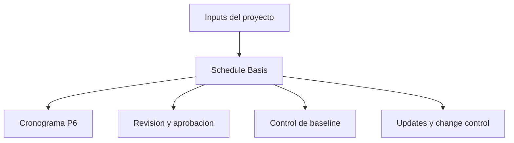

# Schedule Basis

La Schedule Basis, o Basis of Schedule, es el documento que explica como fue construido el cronograma y que supuestos lo soportan. Es el companero escrito del archivo Primavera P6.

El cronograma muestra fechas, logica, float, hitos, recursos y critical path. La Schedule Basis explica por que esos elementos aparecen asi.

## Para Que Se Usa

La Schedule Basis soporta revision, aprobacion, control de baseline, actualizaciones, change management y analisis de demoras. Ayuda al revisor a entender reglas, supuestos, inputs y limitaciones del cronograma.

Sin ella, el archivo P6 puede calcular bien, pero el equipo puede no saber que supuestos fueron usados o si el cronograma sirve para tomar decisiones.

## Quien La Escribe y Para Quien Es

El scheduler o planning engineer normalmente prepara la Schedule Basis, con input del project manager, ingenieria, procurement, construccion, commissioning, project controls, contratos y costos.

Esta dirigida al equipo del proyecto, cliente, PMO, revisores, analistas de claims y cualquier persona que necesite entender como fue construido el cronograma.

## Por Que Importa

Un cronograma esta lleno de decisiones. Calendarios, duraciones, logica, cuadrillas, hitos, ciclos de aprobacion, permisos y limites de recursos afectan fechas y float.

La Schedule Basis hace visibles esas decisiones. Reduce ambiguedad, soporta auditoria y evita discusiones futuras sobre que asumio el cronograma en baseline.

## Que Debe Incluir

Una Basis of Schedule completa debe incluir:

- Alcance y exclusiones.
- Proposito del cronograma y uso contractual.
- Metodologia de desarrollo.
- WBS y estructura de activity codes.
- Calendarios, turnos, feriados, clima y periodos no laborables.
- Supuestos y restricciones principales.
- Hitos de inicio, fin, acceso, aprobaciones y entrega de materiales.
- Ciclos de aprobacion y permisos.
- Supuestos de entrega y turnover.
- Reglas de logica, tipos de relacion y politica de lag.
- Base de duraciones, productivity rates y normas.
- Cuadrillas, disponibilidad de recursos, labor limits y equipment limits.
- Reglas de costos si aplica.
- Explicacion de critical path y near-critical path.
- Supuestos de riesgo e incertidumbres.
- Ciclo de update, reglas de status y reportes.

## Supuestos

Los supuestos deben ser claros y verificables. Pueden incluir fechas de acceso, liberaciones de ingenieria, entregas de vendors, duraciones de permisos, periodos de revision del cliente, disponibilidad de cuadrillas, clima y secuencia de commissioning.

Si un supuesto afecta fechas, float, recursos o entrega, debe estar en la Schedule Basis.

## Calendarios y Periodos de Trabajo

El documento debe explicar los calendarios principales usados en P6. Incluya dias laborables, turnos, feriados, paradas estacionales, clima, trabajo nocturno, fines de semana y periodos no laborables.

Los calendarios afectan fechas y float. Si se usan calendarios distintos para ingenieria, procurement, construccion, commissioning o recursos, explique por que.

## Cuadrillas, Recursos y Limites

Las duraciones solo tienen sentido cuando se entienden los recursos asumidos. La Schedule Basis debe indicar cuadrillas, disponibilidad, limites de labor, limites de equipos y cualquier overtime o estrategia de turnos.

Si hay resource loading, explique si se usa para manpower planning, cost loading, earned value o resource leveling.

## Hitos, Aprobaciones, Permisos y Handover

Los hitos principales deben listarse y explicarse: project start, completion contractual, access granted, aprobaciones del cliente, interfaces de terceros, material delivery, permisos, system entregas y turnover final.

Los ciclos de aprobacion y permisos deben mostrar duraciones asumidas y responsables. Si una accion del cliente o tercero controla el cronograma, debe ser visible.

## Metodologia, Productividad y Costos

La Schedule Basis debe explicar como se desarrollo el cronograma: fuentes usadas, workshops, logica de secuencia, metodo de estimacion de duraciones, productivity rates, normas y proceso de validacion.

Si hay cost loading, indique las reglas. Explique si los costos se asignan por recurso, expense, actividad, WBS, paquete contractual o earned value.

## Critical Path y Riesgo

La Schedule Basis debe resumir el critical path y explicar por que es razonable. Tambien debe identificar near-critical paths, riesgos mayores, sensibilidades y supuestos que pueden cambiar durante la ejecucion.

Esto ayuda a entender no solo la fecha final, sino que la controla.

## Buenas Practicas

Escriba la Schedule Basis antes de aprobar la baseline. Mantengala alineada con el archivo P6. Actualicela cuando cambios aprobados alteren supuestos, calendarios, hitos, estrategia de recursos o metodologia.

No debe ser una narrativa generica. Debe ser suficientemente especifica para que otro scheduler entienda como fue construido el cronograma.

## Conclusion

La Schedule Basis es la explicacion detras del cronograma. Dice que asume el cronograma, como fue construido, que incluye, que excluye y que condiciones deben mantenerse para que las fechas sigan siendo validas.

Una buena Basis of Schedule hace que el archivo P6 sea mas facil de revisar, defender, actualizar y confiar.
## Contenido relacionado
- [Actividades que Comienzan en la fecha de datos sin Lógica Impulsora: Por Qué Importa esta Métrica del Cronograma - Descripción general](../../02_metrics_es/01_activities_starting_in_dd_with_no_logic_driving/01_overview_template.md)
- [Activity Codes](../18_ACTIVITY%20CODES/18_ACTIVITY%20CODES.md)
