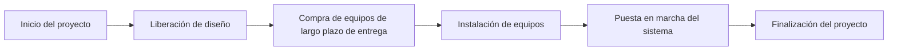

La ruta crítica es la secuencia más larga de actividades dependientes en un cronograma. Determina la duración mínima posible del proyecto y define directamente la fecha de finalización.

En términos prácticos, la ruta crítica es la cadena de tareas que no puede retrasarse sin afectar el plazo final. Si una actividad en la ruta crítica se atrasa y nada más cambia, la fecha de finalización del proyecto también se retrasará.

Por eso la ruta crítica es uno de los resultados más importantes de un cronograma en Primavera P6. No es solo un filtro, un color o un reporte. Es la explicación que da el cronograma de qué está impulsando la finalización.

## Qué significa la ruta crítica

Un cronograma contiene muchas actividades, pero no todas tienen el mismo impacto en la fecha de finalización. Algunas actividades tienen holgura (float). Pueden moverse un poco antes de afectar a la siguiente actividad o a la fecha de finalización del proyecto. Las actividades críticas no tienen esa flexibilidad, o tienen la menor flexibilidad posible según el método y los parámetros del cronograma.

La ruta crítica muestra el tiempo mínimo necesario para completar el proyecto en función de la lógica, las duraciones, los calendarios, las restricciones y el estado actual.

Si esta es la cadena controladora, un retraso en las compras puede retrasar la instalación. Un retraso en la instalación puede retrasar la puesta en marcha. Un retraso en la puesta en marcha puede retrasar la finalización del proyecto. La ruta crítica ayuda al equipo a ver esa conexión.

## Es la cadena que no se puede retrasar

La ruta crítica no es simplemente el trabajo que parece importante. Es la secuencia dependiente de trabajo que define la fecha de finalización.

Esta distinción importa. Una actividad de alto valor puede no ser crítica si tiene holgura. Un hito visible para el cliente puede no ser crítico si otra ruta está impulsando la finalización. Una pequeña actividad técnica puede ser crítica si está en la única cadena que lleva a la entrega final.

Para los equipos de control de proyectos, esto convierte a la ruta crítica en una herramienta de decisión. Ayuda a responder:

- ¿Qué está impulsando la fecha de finalización del proyecto?
- ¿Qué actividades necesitan mayor atención en el cronograma?
- ¿Dónde afectaría inmediatamente un retraso a la finalización?
- ¿Qué acciones de recuperación podrían proteger la fecha de finalización?
- ¿Tiene sentido la ruta reportada?

La última pregunta es la que los programadores nunca deben omitir.

## No acepte el filtro de críticos sin cuestionarlo

Primavera P6 puede identificar actividades críticas, pero el software no entiende la intención del proyecto. Calcula en función de los datos proporcionados: lógica, calendarios, restricciones, duraciones, avance y opciones de cronograma.

Si los datos son débiles, la ruta crítica puede lucir extraña.

Actividades o hitos pueden aparecer en el filtro de críticos aunque no estén realmente impulsando el proyecto. Esto puede ocurrir por lógica faltante, restricciones rígidas, fechas desactualizadas, extremos abiertos, calendarios inusuales, holgura negativa, estado incorrecto o configuraciones de lógica retenida.

El programador debe usar su juicio profesional. La ruta crítica debe ser cuestionada. Debe parecer razonable. Debe contar una historia que el equipo de proyecto reconozca.

Si la ruta dice que la finalización está impulsada por un hito administrativo sin trabajo posterior real, cuestionarlo. Si la ruta comienza con un hito que en realidad no controla la ejecución, cuestionarlo. Si la ruta salta entre áreas del EDT (WBS) sin relación clara entre sí, cuestionarlo.

La ruta crítica es tan buena como el modelo de cronograma que la sustenta.

## Cronogramas de línea base y la ruta crítica

En un cronograma que nunca ha sido actualizado, como una primera línea de base, la ruta crítica suele comenzar con el hito de inicio del proyecto y terminar con el hito de finalización.

Eso es común, pero no es una regla fija.

Algunos proyectos tienen una ruta crítica que comienza en un hito intermedio clave. Por ejemplo, la construcción puede no poder comenzar hasta que el propietario entregue un área, se libere un permiso o un paquete de diseño alcance el estado de aprobado. En ese caso, el hito de entrega o liberación puede desencadenar el inicio de la ruta controladora.

La misma idea aplica cerca del final del proyecto. La ruta crítica puede terminar en la finalización total, pero también puede controlar un hito contractual intermedio, una etapa de transferencia, una entrega de sistema o una fecha de acceso al cliente que actualmente sea más restrictiva.

La clave no es si la ruta comienza y termina en el lugar más tradicional. La clave es si la ruta es lógica, completa y defendible.

## Cronogramas en ejecución

Una vez que el cronograma está en ejecución, la ruta crítica cambia de forma. El trabajo completado ya no debe impulsar la finalización futura. La ruta debe comenzar desde el límite del estado actual.

En un cronograma actualizado, la ruta crítica suele comenzar con una actividad en curso, una actividad no iniciada lista para comenzar, o un hito válido que controla el acceso a trabajo futuro. También puede comenzar desde un hito de interfaz o de entrega del proyecto cuando ese evento esté genuinamente impulsando el siguiente trabajo crítico.

Aquí es donde importa la fecha de datos (data date). La fecha de datos separa el desempeño real del trabajo pronosticado. Una ruta crítica posterior a la fecha de datos debe explicar cómo el trabajo restante conduce a la finalización.

Si la ruta comienza con una actividad que no tiene lógica conductora, un inicio en la fecha de datos sin explicación, o un hito cuestionable, el revisor debe investigar. El cronograma puede estar mostrando una ruta calculada, pero no una creíble.

## Cuidado con los hitos

Los hitos son útiles porque marcan puntos clave: aviso de procedencia, entrega de área, aprobación de diseño, finalización mecánica, transferencia de sistema, finalización sustancial y finalización total.

Pero los hitos también pueden inducir a error en una revisión de la ruta crítica.

Un hito puede aparecer como crítico porque tiene una restricción. Puede aparecer como crítico porque no tiene duración y se ubica en un límite de fecha. Puede aparecer como crítico porque le falta lógica alrededor. Eso no significa automáticamente que el hito sea parte de la cadena de ejecución controladora.

Sea especialmente cuidadoso cuando la ruta crítica comienza con un hito. Pregúntese:

- ¿Representa este hito un evento controlador real?
- ¿Qué actividad o condición externa impulsa el hito?
- ¿Qué trabajo libera el hito?
- ¿Está el hito restringido por una restricción en lugar de lógica?
- ¿Seguiría siendo crítica la ruta si se corrigiera la lógica del hito?

Si el hito no controla el trabajo, no debe permitirse que defina la historia de la ruta crítica.

## La lógica retenida puede cambiar la historia

La lógica retenida (retained logic) es una configuración de Primavera P6 utilizada para manejar el avance fuera de secuencia. Puede ser apropiada, pero también puede afectar la ruta crítica de formas que los revisores necesitan entender.

Cuando se usa la lógica retenida, P6 puede preservar la lógica del predecesor incluso cuando el trabajo del sucesor ya ha comenzado fuera de secuencia. Esto puede hacer que el trabajo restante quede retenido o secuenciado de una manera que cambia la ruta crítica calculada.

El problema no es que la lógica retenida siempre sea incorrecta. El problema es que el programador debe entender si está produciendo un pronóstico realista.

Si la lógica retenida hace que la ruta crítica pase por relaciones que ya no reflejan cómo se está ejecutando el trabajo, el equipo debe revisar el estado, la lógica y las opciones del cronograma. La ruta debe reflejar un plan restante defendible, no solo un cálculo mecánico.

## Cómo revisar la ruta crítica

Una buena revisión de la ruta crítica debe combinar el resultado de P6 con el juicio del programador.

Comience generando el reporte de la ruta más larga o la ruta crítica. Luego revise la ruta actividad por actividad. Examine predecesores, sucesores, tipos de relación, desfases (lags), restricciones, calendarios, fechas reales, duración restante y holgura total.

Pregúntese si la ruta tiene sentido:

- ¿Sigue la ruta una secuencia de ejecución creíble?
- ¿Comienza desde un impulsor actual válido?
- ¿Termina en el hito de finalización o control correcto?
- ¿Están las restricciones forzando la ruta?
- ¿Están las relaciones faltantes ocultando el verdadero impulsor?
- ¿Está la lógica retenida afectando la ruta de manera engañosa?
- ¿Reconoce el equipo de proyecto este trabajo como el controlador?

Si la respuesta es no, el cronograma necesita revisión antes de que la ruta crítica pueda utilizarse con confianza.

## Conclusión

La ruta crítica es la secuencia de tareas dependientes que define la fecha de finalización del proyecto. Muestra el tiempo mínimo necesario para completar el proyecto e identifica el trabajo que no puede retrasarse sin afectar el plazo.

Pero la ruta crítica no es algo que deba aceptarse sin cuestionamiento. P6 calcula lo que los datos le indican que calcule. El programador debe cuestionar si el resultado es razonable, lógico y coherente con el plan de ejecución real.

En un cronograma sólido, la ruta crítica cuenta una historia clara. Comienza desde un impulsor actual válido, sigue dependencias reales, evita restricciones engañosas, maneja el avance correctamente y llega al hito de finalización correcto.

Cuando esa historia tiene sentido, la ruta crítica se convierte en una de las herramientas más poderosas del control de proyectos. Cuando no lo tiene, es una advertencia de que el cronograma necesita más revisión antes de que el pronóstico pueda considerarse confiable.
