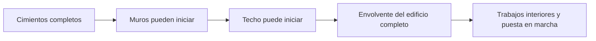
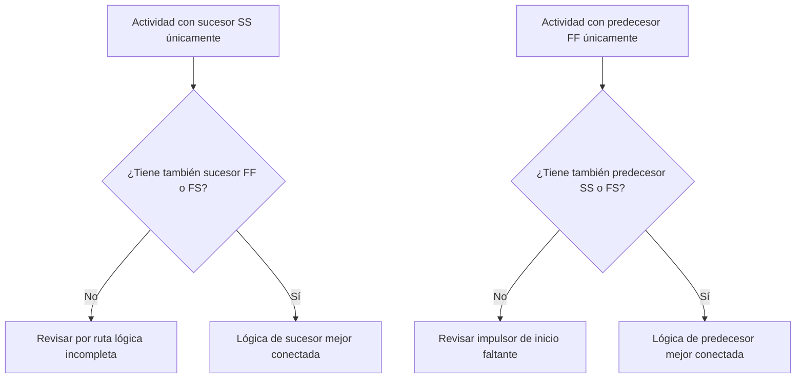

La lógica es la representación matemática del secuenciamiento y las dependencias dentro de un cronograma de proyecto. Explica qué debe ocurrir antes de qué, qué actividades pueden ocurrir al mismo tiempo y cómo el equipo de proyecto pretende avanzar desde la primera actividad hasta la finalización total.

En un buen cronograma de Primavera P6, la lógica no es un adorno. Es el motor que permite al cronograma calcular fechas, holgura (float), ruta crítica y movimiento del pronóstico. Cuenta la historia de la ejecución de una manera que puede ser revisada, cuestionada y mejorada.

Si el cronograma dice "colocar cimientos, luego construir muros, luego construir el techo", la lógica es lo que convierte esa secuencia en una red calculable. El planificador no solo está dibujando una línea de tiempo. El planificador está definiendo la ruta de entrega.

## La lógica cuenta la historia del trabajo

Todo equipo de proyecto tiene una manera prevista de ejecutar el proyecto. Ingeniería puede liberar diseño por área. Compras puede entregar equipos por paquete. El trabajo civil puede preparar el acceso antes de que comience el trabajo estructural. La finalización mecánica puede necesitar ocurrir antes de que pueda comenzar la puesta en marcha.

Los vínculos lógicos son la expresión matemática de ese plan.

Este diagrama simple no es solo una secuencia. Es un modelo de decisión. Si los cimientos se atrasan, los muros pueden atrasarse. Si los muros se atrasan, el techo puede atrasarse. Si el techo se atrasa, los trabajos interiores pueden verse afectados. El cronograma solo puede mostrar ese impacto si la lógica está presente.

La lógica robusta significa que el cronograma puede explicar por qué las actividades inician, por qué finalizan y qué ocurre cuando una parte del plan se mueve.

## Por qué la lógica robusta importa en la fecha de datos

La métrica "Actividades que inician en la fecha de datos sin lógica conductora" es una prueba sólida de la calidad del cronograma.

La fecha de datos (data date) es el límite entre el desempeño real y el trabajo pronosticado. Cuando una actividad inicia exactamente en la fecha de datos, el revisor debe hacerse una pregunta simple: ¿qué está impulsando este inicio?

Si la actividad tiene lógica de predecesor válida, el cronograma puede explicar el inicio. Quizás se liberó un área. Quizás se completó la entrega de un material. Quizás la actividad predecesora terminó y permitió que la siguiente cuadrilla comenzara.

Si la actividad no tiene lógica conductora, el inicio es más débil. La actividad puede estar en la fecha de datos porque no tiene predecesor, porque la lógica está incompleta, porque una restricción la está forzando, o porque la actualización no fue completamente estatusada.

Por eso importa la lógica robusta. Un cronograma no debe permitir que el trabajo parezca listo simplemente porque la fecha de datos avanzó. Debe mostrar la condición real que permite que el trabajo comience.

## El equilibrio: lógica suficiente, no lógica redundante

La buena lógica es equilibrada. El cronograma necesita suficientes relaciones para conectar las actividades correctamente con sus predecesores y sucesores. Al mismo tiempo, debe evitar la lógica redundante que repite la misma dependencia de manera innecesaria.

Poca lógica crea inicios abiertos, finalizaciones abiertas, holgura poco confiable y resultados débiles de ruta crítica. Demasiada lógica puede dificultar la revisión de la red y ocultar el verdadero impulsor de una actividad.

El objetivo no es maximizar el número de relaciones. El objetivo es representar las dependencias obligatorias y requeridas con claridad.

Para cada actividad, el programador debe poder responder:

- ¿Qué permite que esta actividad comience?
- ¿Qué habilita esta actividad a continuación?
- ¿Cuál relación está impulsando verdaderamente la actividad?
- ¿Está alguna relación duplicada o es innecesaria?
- ¿Entendería un revisor la secuencia prevista?

Este equilibrio es central en las revisiones de cronograma del PMO. Una red densa no es automáticamente una red sólida. Una red ligera no es automáticamente una red limpia. La red correcta explica el plan de ejecución sin desorden.

## Cada actividad necesita un impulsor de inicio

La lógica robusta significa que cada actividad tiene un predecesor que permite o desencadena su inicio, salvo excepciones válidas de inicio de proyecto o autorizadas externamente.

Para una actividad de construcción, el impulsor de inicio puede ser el acceso al área, la finalización del predecesor, la disponibilidad de materiales, la liberación del diseño, la aprobación del permiso o la finalización del comercio anterior. Para una actividad de compras, puede ser la aprobación del diseño o la emisión de la orden de compra. Para la puesta en marcha, puede ser la finalización mecánica, la preparación del paquete de pruebas o la transferencia del sistema.

Cuando falta este impulsor de inicio, la actividad puede flotar hacia una posición artificial en el cronograma. Durante las actualizaciones, puede aparecer en la fecha de datos. Eso crea una falsa sensación de preparación.

Considere una actividad llamada "Instalar bombas". Si inicia en la fecha de datos pero no tiene predecesor para la finalización de la fundación, la entrega de las bombas o la entrega del área, el cronograma no está explicando por qué puede comenzar la instalación. La actividad puede estar planificada, pero la lógica no es robusta.

## SS y FF son relaciones a medias

Las relaciones Inicio a Inicio (SS) y Fin a Fin (FF) son útiles, pero deben usarse con cuidado. En muchas revisiones de cronograma, se entienden mejor como relaciones "a medias" porque por sí solas no ubican completamente la actividad en una ruta lógica completa.

Una relación SS puede explicar cuándo puede iniciar una actividad, pero puede no explicar cuándo debe finalizar ni qué entrega. Una relación FF puede explicar la alineación de la finalización, pero puede no explicar cuándo se permite que la actividad comience.

Eso no hace que SS o FF sean incorrectas. El trabajo superpuesto es común y a menudo realista. El problema es si la actividad está completamente conectada.

Por ejemplo:

- Una actividad con un sucesor SS normalmente también debería tener un sucesor FF o FS.
- Una actividad con un predecesor FF normalmente también debería tener un predecesor SS o FS.

Esto ayuda a evitar que las actividades estén conectadas solo en un lado de su duración. El cronograma debe explicar tanto cómo comienza el trabajo como cómo se completa.

## Lógica robusta en la práctica

Una revisión lógica práctica debe comenzar con actividades cercanas a la fecha de datos, trabajo crítico y casi crítico, y las principales rutas de transferencia. Estas áreas tienen el mayor impacto en la toma de decisiones actual.

En P6, las columnas de revisión útiles incluyen ID de actividad, nombre de actividad, EDT (WBS), inicio, finalización, estado de actividad, holgura total, predecesores, sucesores, tipo de relación, desfase (lag), restricciones, calendario e indicadores de relación conductora si están disponibles.

Para cada actividad que inicia en la fecha de datos, pregúntese:

- ¿Está la actividad verdaderamente lista para iniciar?
- ¿Qué predecesor permite el inicio?
- ¿Ese predecesor está completo, en curso o pronosticado?
- ¿Es la relación conductora?
- ¿Está una restricción o fecha esperada reemplazando la lógica?
- ¿Tiene la actividad también lógica de sucesor válida?

Si la respuesta no es clara, la actividad debe revisarse con el responsable. La corrección puede ser agregar un predecesor faltante, cambiar el tipo de relación, eliminar una restricción, actualizar los datos reales o documentar una excepción válida.

## Evitar la lógica artificial

Un error es agregar relaciones solo para cumplir una métrica. Eso no crea lógica robusta. Crea lógica artificial.

Las relaciones deben representar dependencias reales. Si un vínculo no refleja secuencia constructiva, liberación de ingeniería, necesidad de compras, acceso, aprobación, prueba, puesta en marcha o transferencia, puede que no pertenezca a la red.

Otro error es dejar lógica redundante porque parece más seguro. Si la misma dependencia ya está representada por una relación más clara, los vínculos extra pueden confundir la ruta crítica y dificultar la auditoría de la red.

La lógica robusta es clara, intencional y defendible.

## Conclusión

La lógica es la historia matemática de cómo se ejecutará el proyecto. Define qué debe ocurrir primero, qué puede ocurrir junto y qué sigue después.

La lógica robusta no significa agregar tantos vínculos como sea posible. Significa agregar los vínculos correctos: suficientes para conectar cada actividad con predecesores y sucesores reales, pero no tantos que la red se vuelva redundante o engañosa.

Cuando las actividades inician en la fecha de datos sin lógica conductora, el cronograma está exponiendo una debilidad en esa historia. La actividad puede mostrarse como lista, pero la red no explica por qué.

Un cronograma confiable debe responder esa pregunta claramente. ¿Qué permite que este trabajo comience? ¿Qué habilita a continuación? Si el cronograma puede responder ambas preguntas, la lógica está siendo robusta. Si no puede, el equipo de proyecto tiene más trabajo de secuenciamiento por hacer antes de que el pronóstico pueda considerarse confiable.
