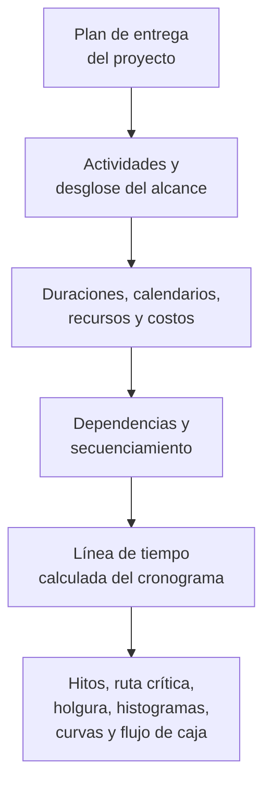

Un cronograma de proyecto es mucho más que una lista de fechas. Es una representación gráfica y lógica del plan de entrega del proyecto. Explica cómo se ejecutará el proyecto de principio a fin, cómo se conectan los paquetes de trabajo, cuándo deben alcanzarse los hitos (milestones) principales y qué información debe utilizar el equipo de proyecto para tomar decisiones.

En términos simples, el cronograma convierte el plan del proyecto en una hoja de ruta. Ayuda a todos los involucrados a entender qué debe hacerse, cuándo debe ocurrir y quién es responsable de hacerlo. Para directores de proyecto, planificadores, equipos de construcción, ingenieros, responsables de compras y revisores de PMO, el cronograma se convierte en una de las principales herramientas de coordinación y control.

El cronograma es una línea de tiempo, pero no solo eso. Un cronograma débil puede mostrar fechas. Un cronograma sólido explica por qué esas fechas son creíbles.

## El cronograma como hoja de ruta de entrega

Todo proyecto comienza con una intención. El equipo sabe qué debe entregarse: un edificio, una instalación, un sistema industrial, una parada de planta, una infraestructura o un paquete de trabajo. Pero la entrega requiere algo más que conocer el objetivo final. El equipo debe entender la secuencia.

¿Qué va primero? ¿Qué puede ocurrir en paralelo? ¿Qué debe esperar la aprobación del diseño, la entrega de materiales, el acceso, la liberación del permiso, las pruebas o la transferencia? ¿Qué actividades controlan la fecha de finalización? ¿Cuáles son los hitos más relevantes para el cliente?

Un cronograma responde a estas preguntas convirtiendo el plan en actividades, duraciones, dependencias, calendarios, recursos, costos e hitos.

La línea de tiempo gráfica es útil porque las personas pueden ver el trabajo. La red lógica es útil porque el software puede calcular el trabajo. Juntas, permiten que el cronograma sea a la vez una herramienta de comunicación y una herramienta de control.

## Qué alimenta el cronograma

Un cronograma es tan confiable como la información utilizada para construirlo. En Primavera P6, el cronograma se nutre de varios insumos principales.

El primer insumo es la lista de actividades. Las actividades desglosan el proyecto en piezas de trabajo manejables. Cada actividad debe ser lo suficientemente clara para planificar, monitorear y medir.

El segundo insumo es la duración determinista. Es el tiempo de trabajo planificado necesario para completar cada actividad. La duración debe reflejar el método de ejecución, los supuestos de productividad, el tamaño de la cuadrilla, el acceso, las restricciones de frente de trabajo y las condiciones del proyecto.

El tercer insumo es la lógica de dependencias. Las dependencias explican cómo se relacionan las actividades entre sí. Una actividad puede necesitar terminar antes de que otra comience. Dos actividades pueden iniciar juntas. Dos finalizaciones pueden necesitar alinearse. Estas relaciones crean la red CPM.

El cuarto insumo es el secuenciamiento. El secuenciamiento es el orden práctico de ejecución. Considera la constructabilidad, el flujo de ingeniería, los tiempos de compras, el acceso, la lógica de puesta en marcha, la estrategia de transferencia y las prioridades del cliente.

El quinto insumo son los recursos y costos. La carga de recursos permite que el cronograma muestre la demanda de mano de obra, equipos y materiales a lo largo del tiempo. La carga de costos permite que el cronograma respalde el flujo de caja, el valor ganado y el pronóstico financiero.

Cuando estos insumos son completos y realistas, el cronograma puede producir salidas útiles.

## Qué nos dice el cronograma

Un cronograma bien construido indica la duración total del proyecto. Muestra los hitos de finalización planificados y los entregables intermedios. Produce histogramas de recursos que muestran cuándo sube y baja la demanda de mano de obra o equipos. Apoya las curvas de avance, las curvas de flujo de caja, el reporte de valor ganado y la planificación de corto plazo (lookahead).

Lo más importante es que identifica la ruta crítica o la ruta más larga. Esta es la cadena de trabajo que determina la fecha de finalización del proyecto. Si las actividades en esa ruta se retrasan, la fecha de finalización del proyecto puede retrasarse. Por eso la lógica importa tanto. Sin buenas dependencias, la ruta crítica puede no mostrar los verdaderos impulsores del proyecto.

La holgura (float) es otra salida importante. La holgura indica cuánta flexibilidad tiene una actividad antes de que afecte a otra actividad o a la fecha de finalización del proyecto. Pero la holgura solo es significativa cuando la red del cronograma está completa. Si a las actividades les falta lógica, la holgura puede parecer mejor o peor que la realidad.

## Por qué la lógica hace creíble la línea de tiempo

Aquí es donde la métrica "Actividades que inician en la fecha de datos sin lógica conductora" cobra importancia.

La fecha de datos (data date) en P6 es el límite entre el desempeño real y el pronóstico. Todo lo que está antes de la fecha de datos debe representar lo que ya ha ocurrido. Todo lo que está después de la fecha de datos debe representar el plan desde ese momento en adelante.

Cuando las actividades inician exactamente en la fecha de datos sin lógica que las conduzca, el cronograma emite una señal de advertencia. Puede parecer que el trabajo está listo para comenzar de inmediato, pero el cronograma puede no ser capaz de explicar por qué. Puede que no haya ningún predecesor que muestre que el área está disponible, ningún vínculo con la entrega de materiales, ninguna conexión con la aprobación del diseño, ninguna relación con la liberación de la inspección, y ninguna lógica de trabajo previo.

Eso importa porque un cronograma no debe simplemente colocar trabajo en una fecha. Debe explicar el camino hacia esa fecha.

Si una actividad inicia en la fecha de datos porque todo el trabajo predecesor requerido está completo y la lógica respalda el inicio, la fecha es defendible. Si inicia allí porque la actividad está abierta, sin lógica conductora, con restricciones o mal actualizada, la fecha es débil. El equipo de proyecto puede creer que el trabajo está listo cuando las condiciones habilitadoras reales no han sido modeladas.

## Un ejemplo práctico

Imagine un cronograma de proyecto con una fecha de datos del 01 de junio. Tras la actualización, varias actividades inician el 01 de junio:

- Instalar bandeja de cables en el Área B.
- Iniciar prueba de presión de tuberías.
- Comenzar alineación de equipos.
- Movilizar cuadrilla de aislamiento.

A primera vista, el lookahead parece ocupado y listo. Pero cuando el programador revisa la lógica, el problema queda claro. La instalación de bandejas de cables no está vinculada a la entrega de materiales. La prueba de presión no está vinculada a la finalización de las tuberías. La alineación del equipo no tiene el predecesor de finalización mecánica. La movilización de la cuadrilla de aislamiento no tiene predecesor de liberación de acceso.

El cronograma muestra trabajo en la fecha de datos, pero no explica por qué el trabajo puede comenzar. Eso no es una hoja de ruta confiable. Es una lista de intenciones a corto plazo.

La solución es agregar o corregir la lógica CPM real. Si la entrega del material impulsa la instalación de bandeja de cables, vincúlelos. Si la finalización de tuberías impulsa la prueba de presión, vincúlelos. Si la liberación de acceso impulsa el aislamiento, modele esa condición. Tras el recálculo, algunas actividades puede que aún inicien cerca de la fecha de datos, pero ahora el cronograma puede explicar por qué.

## Qué debe hacer un buen cronograma

Un buen cronograma debe ayudar al equipo a ver el plan, poner a prueba el plan y gestionar el plan.

Debe mostrar qué debe hacerse. Debe explicar el orden del trabajo. Debe identificar quién necesita actuar y cuándo. Debe revelar la ruta crítica. Debe apoyar la planificación de recursos, la medición del avance, el pronóstico de flujo de caja y los reportes al PMO.

También debe hacer visibles los puntos débiles. La falta de lógica, las restricciones rígidas, las fechas desactualizadas, los inicios abiertos, las finalizaciones abiertas y las actividades agrupadas en la fecha de datos no son solo problemas técnicos. Afectan la forma en que el equipo de proyecto entiende la preparación, el riesgo y el control.

## Conclusión

Un cronograma es el plan de entrega del proyecto expresado en tiempo, lógica y trabajo medible. Es una hoja de ruta, un modelo de cálculo y una herramienta de comunicación.

Cuando está bien construido, le dice al equipo de proyecto qué debe ocurrir, cuándo debe ocurrir y por qué las fechas son creíbles. Cuando las actividades inician en la fecha de datos sin lógica conductora, esa credibilidad se debilita. El cronograma deja de explicar el plan y comienza a adivinar el siguiente paso.

Por esa razón, las revisiones de calidad del cronograma siempre deben hacerse una pregunta simple: ¿explica el cronograma por qué el trabajo comienza cuando comienza? Si la respuesta es sí, el cronograma está cumpliendo su función. Si la respuesta es no, la hoja de ruta necesita más lógica antes de que se pueda confiar en ella.
