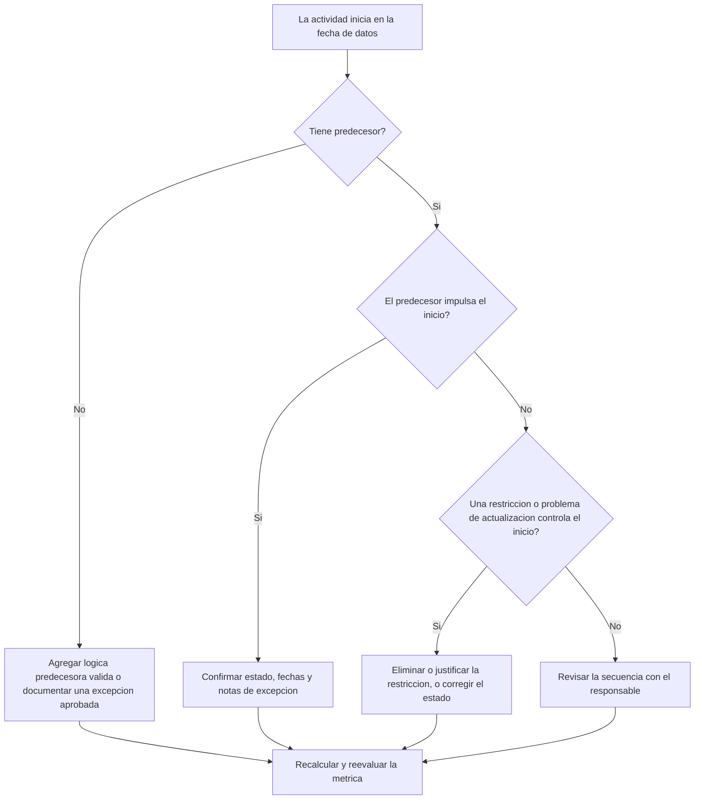

# Actividades que Comienzan en la fecha de datos sin Lógica Impulsora - Guía de mejora

## Propósito

Esta guía ayuda a los planificadores y equipos de control de proyectos a reducir o eliminar actividades que están programadas para iniciar en la fecha de datos de Primavera P6 sin una lógica predecesora válida que impulse el inicio. Aplica a revisiones de calidad del cronograma, evaluaciones de salud del cronograma del PMO y validaciones del ciclo de actualización.

El objetivo es confirmar que el trabajo actual y de corto plazo esté respaldado por una lógica CPM clara, y que las actividades no comiencen en la fecha de datos únicamente por relaciones faltantes, restricciones, fechas manuales o actualizaciones de avance incompletas.

## Antes de Empezar

Reúna la siguiente información antes de tomar acción:

- Resultado actual de la evaluación para esta métrica.
- fecha de datos del proyecto utilizada en el último cálculo del cronograma.
- Lista de actividades abiertas o no iniciadas con fecha de inicio igual a la fecha de datos.
- Detalles de relaciones predecesoras y sucesoras para cada actividad.
- Restricciones, fechas esperadas, fechas reales y calendarios asignados.
- Opciones de programación de P6 utilizadas para la actualización, incluyendo retained logic o progress override cuando corresponda.
- Cualquier excepción aprobada, como actividades de inicio del proyecto, hitos de interfaz externa o inicios instruidos por el cliente.

## Entienda su Resultado

Un resultado sólido es cero actividades no resueltas que comiencen en la fecha de datos sin lógica predecesora conductora. Esto significa que el trabajo actual y de corto plazo está conectado a la red del cronograma y que la fecha de datos no está ocultando secuenciación faltante.

Un resultado aceptable puede incluir un pequeño número de excepciones documentadas. Estas deben revisarse y aprobarse, no ignorarse. Por ejemplo, un hito de orden de proceder o una actividad autorizada externamente puede no necesitar un predecesor normal, pero la razón debe ser visible para los revisores.

Un resultado débil significa que múltiples actividades están comenzando en la fecha de datos sin un conductor lógico claro. Esto puede indicar inicios abiertos, relaciones predecesoras faltantes, exceso de restricciones, actualizaciones de avance incompletas o actividades que no fueron resecuenciadas correctamente después de la última actualización.

## Objetivo de Mejora

El objetivo es tener 0 actividades no resueltas que comiencen en la fecha de datos sin lógica impulsora válida.

El objetivo de mejora no es solamente reducir el conteo. El objetivo más importante es asegurar que cada actividad cercana a la fecha de datos tenga una razón defendible para su inicio pronosticado. Después de la corrección, cada actividad afectada debería tener lógica predecesora apropiada, una excepción documentada o una condición de estado/fecha corregida.

## Plan de Acción

### Paso 1: Identificar el Problema Principal

Cree un layout o reporte en P6 que filtre actividades abiertas o no iniciadas con fecha de inicio igual a la fecha de datos. Incluya columnas para Activity ID, Activity Name, WBS, Start, Finish, Status, Total Float, Calendar, Primary Constraint, Predecessors, Successors e indicadores de relaciones impulsoras si están disponibles.

Revise cada actividad y pregunte:

- ¿La actividad tiene predecesores?
- Si existen predecesores, ¿realmente están impulsando el inicio?
- ¿La actividad está siendo retenida o movida por una restricción?
- ¿A la actividad le falta un inicio real o una actualización de avance?
- ¿La actividad es una excepción válida, como un hito de inicio del proyecto?
- ¿La actividad pertenece a un área WBS donde la lógica es generalmente débil?

Agrupe los hallazgos en causas prácticas: predecesores faltantes, predecesores no conductores, restricciones o fechas esperadas, errores de actualización/estado o excepciones aprobadas.

### Paso 2: Aplicar las Correcciones Recomendadas

Comience con la lógica faltante o débil. Agregue relaciones predecesoras válidas que representen la secuencia real del trabajo, como relaciones finish-to-start, start-to-start o finish-to-finish cuando correspondan. Evite agregar relaciones solo para cumplir la métrica; cada relación debe reflejar una dependencia real de construcción, ingeniería, procura, acceso, aprobación o transferencia.

Luego revise las restricciones. Si una actividad comienza en la fecha de datos por una restricción de inicio, confirme si la restricción está justificada contractual u operacionalmente. Elimine restricciones innecesarias y permita que la actividad sea impulsada por lógica. Si la restricción es válida, documente la razón y confirme que no distorsione la ruta crítica.

Revise el estado de avance. Si el trabajo ya comenzó, actualice correctamente el actual start y la duración remanente. Si el trabajo no ha comenzado, confirme que el inicio pronosticado realmente deba permanecer en la fecha de datos. Una actividad no debería parecer lista para iniciar simplemente porque el ciclo de actualización la llevó a la fecha actual.

Después de realizar cambios, recalcule el cronograma y revise nuevamente las actividades afectadas. Confirme que la fecha de inicio ahora esté impulsada por lógica, correctamente actualizada o documentada como excepción aprobada.

### Paso 3: Eliminar Bloqueos Comunes

Los bloqueos comunes incluyen retroalimentación poco clara del campo, información de interfaces faltante y presión por hacer que el trabajo de corto plazo parezca listo. Resuélvalos revisando las actividades afectadas con líderes de disciplina, gerentes de construcción, responsables de procura o responsables de paquetes.

Otro bloqueo común es el uso indebido de restricciones como sustituto de la lógica. Las restricciones pueden ser necesarias en algunos casos, pero no deben reemplazar la red del cronograma. Si se conserva una restricción, documente por qué existe y cómo afecta la holgura y la ruta más larga.

También revise si el problema es causado por opciones de cálculo del cronograma o prácticas de actualización. Si progress override, retained logic, avance fuera de secuencia o actualización incompleta están afectando el resultado, alinee el método de actualización con el procedimiento de control de proyectos antes de reevaluar la métrica.

### Paso 4: Validar los Cambios

Valide el cronograma corregido antes de la siguiente evaluación. Ejecute nuevamente el filtro de actividades abiertas o no iniciadas que comienzan en la fecha de datos sin lógica impulsora. Confirme que cada elemento restante esté corregido o documentado como excepción aprobada.

Revise la holgura total, la ruta más larga y las actividades de corto plazo después del recálculo. Una corrección de lógica puede cambiar la ruta crítica o revelar problemas adicionales de secuenciación. Si el movimiento del cronograma es significativo, comunique el impacto al líder de control de proyectos o al revisor del PMO.

## Cronograma de Mejora

### Día 1: Revisar y Diagnosticar

Ejecute la métrica, confirme la fecha de datos y produzca la lista de actividades. Separe los resultados en lógica faltante, lógica no conductora, restricciones, errores de estado y posibles excepciones.

### Días 2-3: Implementar Acciones Prioritarias

Corrija primero las actividades de mayor impacto, especialmente las críticas o casi críticas. Agregue lógica predecesora válida, elimine restricciones innecesarias, actualice estados incorrectos y documente excepciones.

### Días 4-5: Monitorear Resultados Iniciales

Recalcule el cronograma y revise si las actividades afectadas ahora están impulsadas por lógica. Verifique cambios inesperados en holgura total, ruta más larga y fechas de hitos.

### Día 6: Ajustes Finales

Resuelva bloqueos restantes con la disciplina responsable o el dueño del paquete. Confirme que cualquier excepción mantenida esté justificada y claramente documentada.

### Día 7: Reevaluar y Comparar

Ejecute nuevamente la evaluación y compare el nuevo resultado contra el resultado anterior y el umbral objetivo. Confirme si la métrica ahora está en cero actividades no resueltas o si se requiere acción adicional.

## Seguimiento del Progreso

Use un tracker simple para gestionar correcciones y aprobaciones.

| Fecha | Acción Realizada | Impacto Esperado | Resultado / Observación | Siguiente Paso |
| --- | --- | --- | --- | --- |
| [Fecha] | Se revisaron actividades que comienzan en la fecha de datos sin lógica impulsora | Identificar lógica faltante o débil | [Resultado observado] | Asignar correcciones al responsable |
| [Fecha] | Se agregaron relaciones predecesoras válidas | Mejorar la secuenciación CPM | [Resultado observado] | Recalcular y revisar impacto en holgura |
| [Fecha] | Se eliminaron o justificaron restricciones | Reducir inicios artificiales | [Resultado observado] | Confirmar excepciones restantes |
| [Fecha] | Se actualizó el estado incorrecto de actividades | Mejorar la precisión de la actualización | [Resultado observado] | Ejecutar nuevamente la evaluación |

## Si los Resultados No Mejoran

Si el resultado no mejora, revise si las mismas actividades siguen fallando o si están apareciendo nuevas actividades en la fecha de datos. Fallas repetidas pueden indicar un problema más amplio de desarrollo del cronograma, como lógica incompleta en un área WBS, disciplina de actualización débil o uso inconsistente de restricciones.

Escale problemas persistentes al líder de control de proyectos, gerente de planificación o revisor del PMO. Para cronogramas grandes, considere un taller enfocado de revisión de lógica para los paquetes de trabajo afectados. Si el cronograma se utiliza para reportes contractuales, análisis de demoras o pronósticos de valor ganado, los elementos no resueltos deben tratarse como una preocupación de calidad.

## Mantenimiento

Revise esta métrica durante cada ciclo de actualización antes de emitir el cronograma. La verificación debe formar parte de la revisión estándar de salud del cronograma, especialmente después de actualizaciones de avance, resecuenciación, cambios importantes de alcance o planificación de recuperación.

Buenos hábitos de mantenimiento incluyen mantener visibles las columnas de predecesores y sucesores en layouts de P6, revisar inicios abiertos antes de cada entrega, documentar excepciones aprobadas y verificar que el movimiento de la fecha de datos no cree un nuevo grupo de actividades no impulsadas.

## Lista de Verificación Resumida

- [ ] Resultado actual revisado
- [ ] Umbral objetivo confirmado
- [ ] fecha de datos confirmada
- [ ] Actividades que comienzan en la fecha de datos identificadas
- [ ] Problema principal identificado
- [ ] Lógica faltante o débil corregida
- [ ] Restricciones revisadas y justificadas o eliminadas
- [ ] Fechas de estado revisadas
- [ ] Excepciones aprobadas documentadas
- [ ] Cronograma recalculado
- [ ] Resultados monitoreados
- [ ] Evaluación repetida
- [ ] Próximos pasos documentados
## Contenido relacionado
- [Actividades que Comienzan en la fecha de datos sin Lógica Impulsora: Por Qué Importa esta Métrica del Cronograma - Descripción general](01_overview_template.md)
- [Plantilla de Blog](03_blog_template.md)
- [Que Es Un Cronograma](../../02b_blogs_es/01_WHAT%20A%20SCHEDULE%20IS/01_blog.md)
- [Logica Robusta](../../02b_blogs_es/02_ROBUST%20LOGIC/02_ROBUST%20LOGIC.md)
