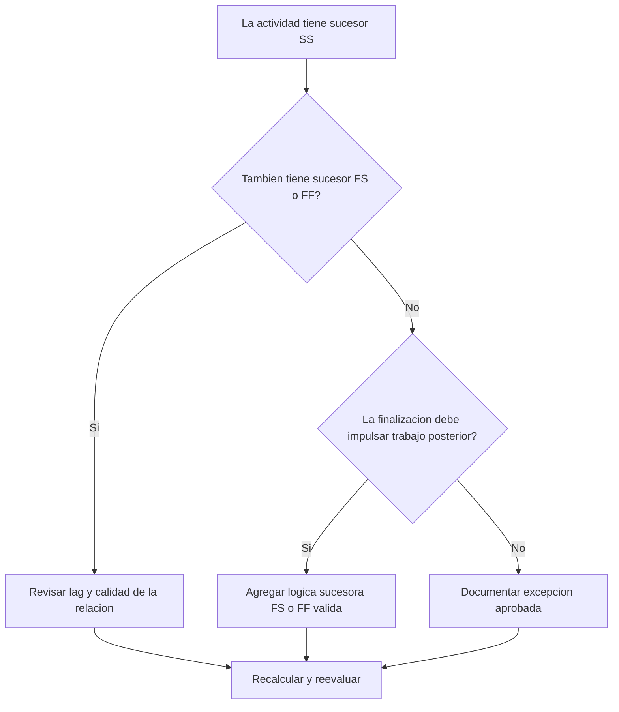

# Actividades con Sucesores SS y sin Sucesores FS o FF - Guía de mejora

## Propósito

Esta guía ayuda a revisar y corregir actividades que tienen sucesores Start-to-Start pero no tienen sucesores Finish-to-Start o Finish-to-Finish. Apoya una lógica CPM más sólida al confirmar que las finalizaciones de actividades, y no solo sus inicios, estén conectadas a la red posterior del cronograma.

## Antes de Empezar

Reúna la siguiente información antes de tomar acción:

- Resultado actual de la evaluación para esta métrica.
- Lista de actividades con sucesores SS y sin sucesores FS o FF.
- Detalles de relaciones sucesoras para cada actividad.
- Tipo de actividad, duración, estado, calendario, holgura total y WBS.
- Lags, restricciones o fechas esperadas que afecten a la actividad o sus sucesores.
- Información real de secuencia de construcción, ingeniería, procura o entrega.

## Entienda su Resultado

Un resultado sólido es cero actividades no resueltas en esta condición. Esto significa que las actividades que inician trabajo posterior también tienen lógica basada en finalización cuando la terminación del trabajo importa.

Un resultado aceptable puede incluir excepciones documentadas, como actividades level-of-effort, administrativas o de apoyo. Estas deben revisarse en lugar de asumirse válidas.

Un resultado débil significa que varias actividades pueden iniciar sucesores, pero no controlan ningún trabajo posterior mediante su propia finalización.

## Objetivo de Mejora

El objetivo es tener 0 actividades no resueltas con sucesores SS y sin sucesores FS o FF.

El objetivo es confirmar que cada actividad tenga un sucesor realista basado en finalización, o que la falta de esa lógica esté justificada y documentada.

## Plan de Acción

### Paso 1: Identificar el Problema Principal

Cree un layout o exportación de P6 que liste actividades con al menos un sucesor SS y sin sucesores FS o FF. Incluya Activity ID, Activity Name, WBS, Original Duration, Remaining Duration, Total Float, Successors, Relationship Type, Lag, Constraints y Activity Status.

Revise cada actividad y pregunte:

- ¿Qué trabajo inicia porque esta actividad inicia?
- ¿Qué trabajo, hito, entrega o inspección depende de que esta actividad termine?
- ¿Falta un sucesor FS o FF?
- ¿La relación SS modela correctamente trabajo solapado?
- ¿La actividad es una excepción válida?

### Paso 2: Aplicar las Correcciones Recomendadas

Agregue lógica basada en finalización cuando la terminación de la actividad deba controlar trabajo posterior. Use FS cuando el sucesor no pueda iniciar hasta que la actividad termine. Use FF cuando el trabajo pueda solaparse pero el sucesor no pueda terminar hasta que la actividad termine.

Revise relaciones SS con lag. Si el lag se usa para aproximar una dependencia de finalización, reemplácelo o compleméntelo con una relación FS o FF más clara.

Si la actividad es una excepción válida, documente la razón en un notebook topic, UDF, campo de comentario o tracker de calidad del cronograma.

### Paso 3: Eliminar Bloqueos Comunes

Los bloqueos comunes incluyen lógica copiada de cronogramas antiguos, exceso de relaciones SS, puntos de entrega poco claros y falta de información del campo o de los líderes de disciplina.

Otro bloqueo es asumir que el trabajo solapado solo necesita lógica SS. El solape puede ser válido, pero la finalización del predecesor a menudo debe controlar una finalización sucesora, inspección, entrega o actividad posterior.

### Paso 4: Validar los Cambios

Recalcule el cronograma después de las correcciones. Ejecute nuevamente la métrica y confirme que cada actividad restante esté corregida o documentada como excepción aprobada.

Revise el impacto en holgura total, ruta crítica, ruta más larga e hitos de corto plazo.

## Cronograma de Mejora

### Día 1: Revisar y Diagnosticar

Ejecute la métrica, confirme la lista de actividades afectadas y separe los casos en lógica de finalización faltante, lógica SS débil, problemas de lag y posibles excepciones.

### Días 2-3: Implementar Acciones Prioritarias

Corrija primero actividades críticas y casi críticas. Agregue sucesores FS o FF válidos, ajuste lógica SS inapropiada y documente excepciones justificadas.

### Días 4-5: Monitorear Resultados Iniciales

Recalcule el cronograma y revise cambios en holgura, ruta más larga y fechas de hitos.

### Día 6: Ajustes Finales

Resuelva elementos inciertos con la disciplina responsable, dueño del paquete o líder de construcción.

### Día 7: Reevaluar y Comparar

Ejecute nuevamente la evaluación y compare el resultado contra el umbral objetivo.

## Seguimiento del Progreso

Use un tracker simple para gestionar correcciones y aprobaciones.

| Fecha | Acción Realizada | Impacto Esperado | Resultado / Observación | Siguiente Paso |
| --- | --- | --- | --- | --- |
| [Fecha] | Revisar actividades con sucesores solo SS | Identificar lógica de finalización faltante | [Resultado observado] | Asignar correcciones |
| [Fecha] | Agregar lógica sucesora FS o FF | Mejorar continuidad CPM | [Resultado observado] | Recalcular cronograma |
| [Fecha] | Documentar excepciones válidas | Mejorar trazabilidad de revisión | [Resultado observado] | Reevaluar métrica |

## Si los Resultados No Mejoran

Si los resultados no mejoran, revise si el filtro identifica excepciones válidas, lógica duplicada o actividades de un área WBS específica con desarrollo de red débil.

Escale elementos no resueltos al líder de planificación o revisor PMO cuando afecten trabajo crítico, casi crítico, contractual o relacionado con entregas.

## Mantenimiento

Revise esta métrica en cada actualización del cronograma y antes de aprobar una línea base. Preste especial atención después de resecuenciación, planificación de recuperación, copia de cronogramas o cambios importantes de alcance.

## Lista de Verificación Resumida

- [ ] Resultado actual revisado
- [ ] Umbral objetivo confirmado
- [ ] Problema principal identificado
- [ ] Sucesores SS revisados
- [ ] Lógica FS o FF faltante corregida
- [ ] Lags y restricciones revisados
- [ ] Excepciones válidas documentadas
- [ ] Cronograma recalculado
- [ ] Resultados monitoreados
- [ ] Evaluación repetida
- [ ] Próximos pasos documentados
## Contenido relacionado
- [Actividades con Sucesores SS y sin Sucesores FS o FF - Descripción general](01_overview_template.md)
- [Plantilla de Blog](03_blog_template.md)
- [Que Es Un Cronograma](../../02b_blogs_es/01_WHAT%20A%20SCHEDULE%20IS/01_blog.md)
- [Logica Robusta](../../02b_blogs_es/02_ROBUST%20LOGIC/02_ROBUST%20LOGIC.md)
