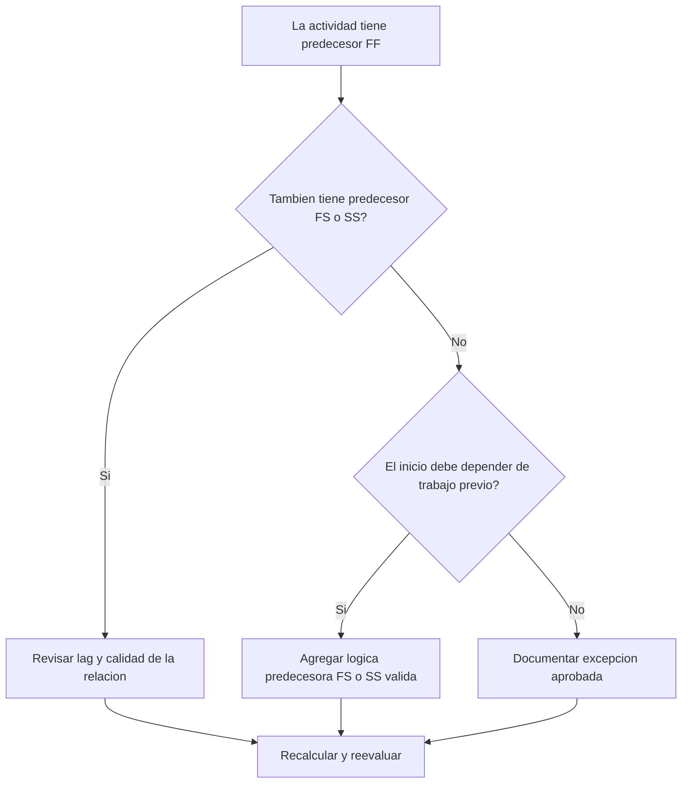

# Actividades con Predecesores FF y sin Predecesores FS o SS - Guía de mejora

## Propósito

Esta guía ayuda a revisar y corregir actividades que tienen predecesores Finish-to-Finish pero no tienen predecesores Finish-to-Start o Start-to-Start. Apoya una lógica CPM más sólida al confirmar que los inicios de actividades, y no solo sus finalizaciones, estén conectados a la red previa del cronograma.

## Antes de Empezar

Reúna la siguiente información antes de tomar acción:

- Resultado actual de la evaluación para esta métrica.
- Lista de actividades con predecesores FF y sin predecesores FS o SS.
- Detalles de relaciones predecesoras para cada actividad.
- Tipo de actividad, duración, estado, calendario, holgura total y WBS.
- Lags, restricciones o fechas esperadas que afecten a la actividad o sus predecesores.
- Información real de secuencia de construcción, ingeniería, procura, acceso, aprobación o entrega.

## Entienda su Resultado

Un resultado sólido es cero actividades no resueltas en esta condición. Esto significa que las actividades cuyas finalizaciones están ligadas a trabajo previo también tienen lógica válida que impulsa el inicio cuando corresponde.

Un resultado aceptable puede incluir excepciones documentadas, como actividades level-of-effort, administrativas o trabajo paralelo modelado intencionalmente donde no se requiere lógica de inicio.

Un resultado débil significa que varias actividades pueden terminar en relación con predecesores, pero sus inicios no están controlados por trabajo previo.

## Objetivo de Mejora

El objetivo es tener 0 actividades no resueltas con predecesores FF y sin predecesores FS o SS.

El objetivo es confirmar que cada actividad tenga un predecesor realista que impulse el inicio, o que la falta de esa lógica esté justificada y documentada.

## Plan de Acción

### Paso 1: Identificar el Problema Principal

Cree un layout o exportación de P6 que liste actividades con al menos un predecesor FF y sin predecesores FS o SS. Incluya Activity ID, Activity Name, WBS, Original Duration, Remaining Duration, Total Float, Predecessors, Relationship Type, Lag, Constraints y Activity Status.

Revise cada actividad y pregunte:

- ¿Qué debe ocurrir antes de que esta actividad pueda iniciar?
- ¿El predecesor FF solo controla alineación de finalización?
- ¿Falta un predecesor FS o SS?
- ¿La relación FF modela correctamente trabajo solapado?
- ¿La actividad es una excepción válida?

### Paso 2: Aplicar las Correcciones Recomendadas

Agregue lógica que impulse el inicio cuando la actividad deba depender de trabajo previo. Use FS cuando la actividad no pueda iniciar hasta que el predecesor termine. Use SS cuando la actividad pueda iniciar después de que el predecesor comience o alcance un punto definido de avance.

Revise relaciones FF con lag. Si el lag se usa para aproximar una dependencia de inicio, reemplácelo o compleméntelo con lógica FS o SS más clara.

Si la actividad es una excepción válida, documente la razón en un notebook topic, UDF, campo de comentario o tracker de calidad del cronograma.

### Paso 3: Eliminar Bloqueos Comunes

Los bloqueos comunes incluyen lógica copiada de cronogramas antiguos, exceso de relaciones FF, puntos de acceso o liberación poco claros y falta de información del campo o de los líderes de disciplina.

Otro bloqueo es asumir que la lógica FF es suficiente cuando dos actividades deben terminar juntas. La alineación de finalización puede ser válida, pero la actividad sucesora a menudo también necesita una condición clara de inicio.

### Paso 4: Validar los Cambios

Recalcule el cronograma después de las correcciones. Ejecute nuevamente la métrica y confirme que cada actividad restante esté corregida o documentada como excepción aprobada.

Revise el impacto en fechas tempranas, holgura total, ruta crítica, ruta más larga e hitos de corto plazo.

## Cronograma de Mejora

### Día 1: Revisar y Diagnosticar

Ejecute la métrica, confirme la lista de actividades afectadas y separe los casos en lógica de inicio faltante, lógica FF débil, problemas de lag y posibles excepciones.

### Días 2-3: Implementar Acciones Prioritarias

Corrija primero actividades críticas y casi críticas. Agregue predecesores FS o SS válidos, ajuste lógica FF inapropiada y documente excepciones justificadas.

### Días 4-5: Monitorear Resultados Iniciales

Recalcule el cronograma y revise cambios en fechas tempranas, holgura, ruta más larga y fechas de hitos.

### Día 6: Ajustes Finales

Resuelva elementos inciertos con la disciplina responsable, dueño del paquete o líder de construcción.

### Día 7: Reevaluar y Comparar

Ejecute nuevamente la evaluación y compare el resultado contra el umbral objetivo.

## Seguimiento del Progreso

Use un tracker simple para gestionar correcciones y aprobaciones.

| Fecha | Acción Realizada | Impacto Esperado | Resultado / Observación | Siguiente Paso |
| --- | --- | --- | --- | --- |
| [Fecha] | Revisar actividades con predecesores solo FF | Identificar lógica de inicio faltante | [Resultado observado] | Asignar correcciones |
| [Fecha] | Agregar lógica predecesora FS o SS | Mejorar continuidad CPM | [Resultado observado] | Recalcular cronograma |
| [Fecha] | Documentar excepciones válidas | Mejorar trazabilidad de revisión | [Resultado observado] | Reevaluar métrica |

## Si los Resultados No Mejoran

Si los resultados no mejoran, revise si el filtro identifica excepciones válidas, lógica duplicada o actividades de un área WBS específica con desarrollo de red débil.

Escale elementos no resueltos al líder de planificación o revisor PMO cuando afecten trabajo crítico, casi crítico, contractual, de acceso o relacionado con entregas.

## Mantenimiento

Revise esta métrica en cada actualización del cronograma y antes de aprobar una línea base. Preste especial atención después de resecuenciación, planificación de recuperación, copia de cronogramas o cambios importantes de alcance.

## Lista de Verificación Resumida

- [ ] Resultado actual revisado
- [ ] Umbral objetivo confirmado
- [ ] Problema principal identificado
- [ ] Predecesores FF revisados
- [ ] Lógica FS o SS faltante corregida
- [ ] Lags y restricciones revisados
- [ ] Excepciones válidas documentadas
- [ ] Cronograma recalculado
- [ ] Resultados monitoreados
- [ ] Evaluación repetida
- [ ] Próximos pasos documentados
## Contenido relacionado
- [Actividades con Predecesores FF y sin Predecesores FS o SS - Descripción general](01_overview_template.md)
- [Plantilla de Blog](03_blog_template.md)
- [Que Es Un Cronograma](../../02b_blogs_es/01_WHAT%20A%20SCHEDULE%20IS/01_blog.md)
- [Logica Robusta](../../02b_blogs_es/02_ROBUST%20LOGIC/02_ROBUST%20LOGIC.md)
