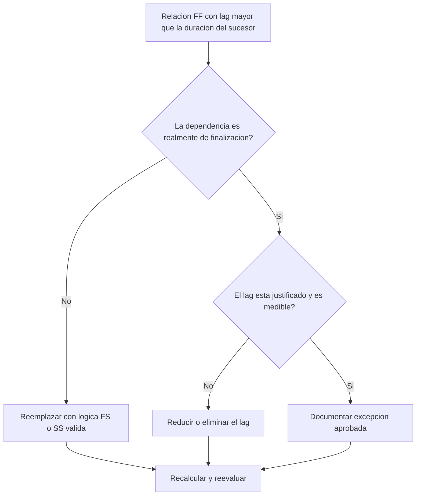

# Relaciones FF con Lag Mayor que la Duración del Sucesor - Guía de mejora

## Propósito

Esta guía ayuda a revisar y corregir relaciones Finish-to-Finish donde el lag es mayor que la duración de la actividad sucesora. Apoya una lógica CPM más clara al reemplazar lag FF excesivo por lógica o actividades visibles que representen mejor la secuencia real del trabajo.

## Antes de Empezar

Reúna la siguiente información antes de tomar acción:

- Resultado actual de la evaluación para esta métrica.
- Lista de relaciones FF donde el lag es mayor que la duración del sucesor.
- Activity ID, nombres, WBS, duraciones, calendarios y estado del predecesor y sucesor.
- Lag de relación, tipo de relación y restricciones relacionadas.
- Opciones de cálculo del cronograma y base de calendario usada para el lag.
- Lógica de campo, ingeniería, procura, aprobación o entrega que explique la dependencia prevista.

## Entienda su Resultado

Un resultado sólido es cero relaciones FF no resueltas donde el lag supera la duración del sucesor.

Un resultado aceptable puede incluir excepciones documentadas, pero deben ser poco frecuentes. Un lag FF largo suele indicar que el tipo de relación no coincide con la dependencia modelada.

Un resultado débil significa que el cronograma contiene múltiples vínculos de finalización a finalización donde la finalización del sucesor se retrasa por más tiempo que la duración de la actividad sucesora.

## Objetivo de Mejora

El objetivo es tener 0 relaciones FF no resueltas con lag mayor que la duración del sucesor.

El objetivo es confirmar si cada relación debe permanecer como FF, convertirse a lógica FS o SS, reducir el lag, o documentarse como excepción válida.

## Plan de Acción

### Paso 1: Identificar el Problema Principal

Cree un layout o exportación de P6 que liste relaciones FF donde el lag es mayor que la duración del sucesor. Incluya Activity ID del predecesor y sucesor, Activity Name, WBS, Original Duration, Remaining Duration, Relationship Type, Lag, Calendar, Total Float y Activity Status.

Revise cada relación y pregunte:

- ¿Por qué el sucesor termina después de una demora tan larga?
- ¿El sucesor depende realmente de la finalización del predecesor o de otra condición de inicio o entrega?
- ¿El lag es mayor que la duración original, la duración remanente o ambas?
- ¿El lag modela revisión, curado, entrega, aprobación, acceso u otro periodo real de espera?
- ¿Una relación FS o SS haría más clara la dependencia?

### Paso 2: Aplicar las Correcciones Recomendadas

Si el sucesor debe iniciar después de que el predecesor termina, reemplace la relación FF por una relación FS. Si el sucesor puede iniciar después de que el predecesor comience o alcance un punto definido de avance, use lógica SS.

Si la relación realmente es de finalización a finalización, revise el valor del lag. Reduzca lag excesivo cuando fue usado como marcador aproximado o heredado de lógica copiada. Si el lag representa una espera real, confirme que unidad, calendario y explicación sean correctos.

Evite usar lag largo como sustituto de actividades que deberían ser visibles en el cronograma. Si el lag representa revisión, curado, entrega, movilización, aprobación o cierre, considere modelarlo como una actividad separada.

### Paso 3: Eliminar Bloqueos Comunes

Los bloqueos comunes incluyen lógica copiada de cronogramas anteriores, periodos de espera ocultos, confusión de calendarios y presión por mantener la red simple. Resuélvalos confirmando la dependencia prevista con el responsable.

Otro bloqueo es tratar el lag como inofensivo. Un lag largo puede ser difícil de revisar, ocultar riesgo y complicar el análisis de demoras.

### Paso 4: Validar los Cambios

Recalcule el cronograma después de las correcciones. Ejecute nuevamente la métrica y confirme que cada elemento restante esté corregido o documentado como excepción aprobada.

Revise holgura total, ruta más larga, ruta crítica e hitos de corto plazo. Si los cambios de relación mueven fechas clave, comunique el resultado al líder de control de proyectos o revisor PMO.

## Cronograma de Mejora

### Día 1: Revisar y Diagnosticar

Ejecute la métrica, confirme la lista de relaciones afectadas y separe elementos en tipo de relación incorrecto, lag excesivo, actividad oculta, problema de calendario y posible excepción.

### Días 2-3: Implementar Acciones Prioritarias

Corrija primero relaciones críticas y casi críticas. Convierta lógica FF a FS o SS donde corresponda, reduzca lag injustificado y documente excepciones válidas.

### Días 4-5: Monitorear Resultados Iniciales

Recalcule el cronograma y revise cambios en holgura, ruta más larga y fechas de hitos.

### Día 6: Ajustes Finales

Resuelva elementos inciertos con la disciplina responsable, dueño del paquete o líder de construcción.

### Día 7: Reevaluar y Comparar

Ejecute nuevamente la evaluación y compare el resultado contra el umbral objetivo.

## Seguimiento del Progreso

Use un tracker simple para gestionar correcciones y aprobaciones.

| Fecha | Acción Realizada | Impacto Esperado | Resultado / Observación | Siguiente Paso |
| --- | --- | --- | --- | --- |
| [Fecha] | Revisar lag FF mayor que duración del sucesor | Identificar lógica débil o poco clara | [Resultado observado] | Asignar correcciones |
| [Fecha] | Convertir relación a FS o SS | Mejorar claridad CPM | [Resultado observado] | Recalcular cronograma |
| [Fecha] | Reducir o documentar lag | Mejorar trazabilidad de revisión | [Resultado observado] | Reevaluar métrica |

## Si los Resultados No Mejoran

Si los resultados no mejoran, revise si los mismos patrones se repiten en un área WBS, disciplina o sección copiada del cronograma. Hallazgos repetidos pueden indicar que el equipo usa lag FF como atajo estándar.

Escale elementos no resueltos cuando afecten trabajo crítico, casi crítico, contractual, de procura, aprobación, comisionamiento o entrega.

## Mantenimiento

Revise esta métrica en cada actualización del cronograma y antes de aprobar una línea base. Preste especial atención después de copiar cronogramas, resecuenciar, planificar recuperación o cambios importantes de alcance.

## Lista de Verificación Resumida

- [ ] Resultado actual revisado
- [ ] Umbral objetivo confirmado
- [ ] Problema principal identificado
- [ ] Relaciones FF revisadas
- [ ] Lag excesivo corregido o justificado
- [ ] Reemplazos FS o SS aplicados donde corresponda
- [ ] Trabajo oculto modelado donde corresponda
- [ ] Cronograma recalculado
- [ ] Resultados monitoreados
- [ ] Evaluación repetida
- [ ] Próximos pasos documentados
## Contenido relacionado
- [Relaciones FF con Lag Mayor que la Duración del Sucesor - Descripción general](01_overview_template.md)
- [Plantilla de Blog](03_blog_template.md)
- [Que Es Un Cronograma](../../02b_blogs_es/01_WHAT%20A%20SCHEDULE%20IS/01_blog.md)
- [Logica Robusta](../../02b_blogs_es/02_ROBUST%20LOGIC/02_ROBUST%20LOGIC.md)
