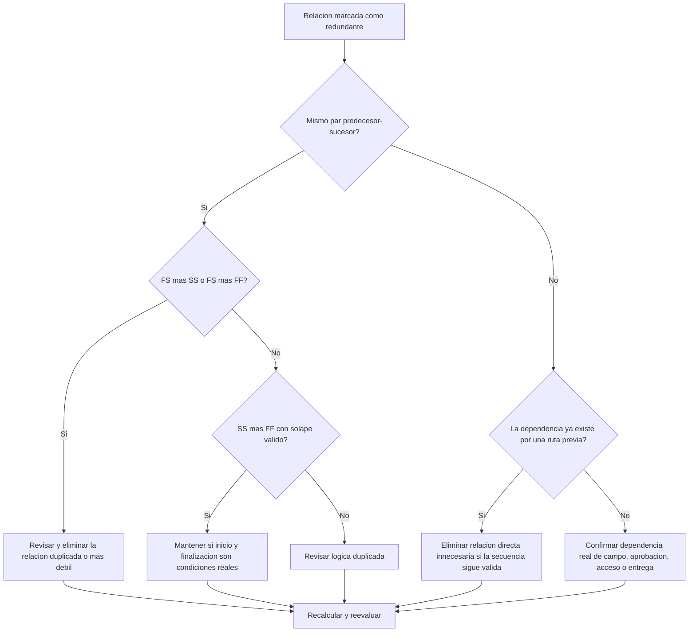

## Propósito

Esta guía ayuda a identificar y eliminar lógica redundante en un cronograma de Primavera P6. Aplica a relaciones duplicadas, lógica predecesora repetida y dependencias innecesarias que no representan una secuencia real de trabajo.

## Antes de Empezar

Reúna la siguiente información antes de tomar acción:

- Resultado actual de la evaluación para esta métrica.
- Lista de actividades y relaciones marcadas como lógica redundante.
- Detalles de predecesores y sucesores para cada actividad marcada.
- Tipos de relación, lags, calendarios, holgura total e indicadores de relación conductora.
- WBS, códigos de actividad y responsable de disciplina o paquete.
- Información de campo, ingeniería, procura, aprobación o entrega que explique la dependencia real.

## Entienda su Resultado

Un resultado sólido es cero relaciones redundantes no resueltas.

Un resultado aceptable puede incluir excepciones documentadas poco frecuentes donde una lógica que parece duplicada se usa intencionalmente por una razón defendible.

Un resultado débil significa que el cronograma contiene lógica repetida o innecesaria. Esto puede ocurrir cuando se copian secciones sin limpieza, se agregan relaciones sin revisar rutas existentes, o se usan múltiples tipos de relación entre las mismas actividades.

## Objetivo de Mejora

El objetivo es tener 0 relaciones redundantes no resueltas.

El objetivo es mantener solo las relaciones que representan dependencias reales y eliminar lógica que duplica, oculta o exagera la secuencia real del trabajo.

## Plan de Acción

### Paso 1: Identificar el Problema Principal

Cree un layout, reporte o revisión externa de relaciones que identifique lógica probablemente redundante. Enfóquese en estos casos:

- El mismo predecesor conectado al mismo sucesor más de una vez, especialmente FS más SS o FS más FF.
- SS más FF entre las mismas dos actividades puede ser válido cuando el solape está modelado correctamente y ambas condiciones importan.
- Una actividad con el mismo predecesor y tipo de relación que su propio predecesor, creando lógica heredada repetida.
- Cadenas más largas donde la misma dependencia aparece varios pasos atrás.
- Dependencias que no cambian secuencia, fechas, holgura, entrega, acceso o control de riesgo.

Revise cada relación marcada y pregunte:

- ¿Esta relación agrega una dependencia real?
- ¿La dependencia ya está representada por otra relación entre las mismas actividades?
- ¿La dependencia ya está representada por una ruta previa?
- ¿Eliminar la relación cambiaría lógica válida o solo simplificaría la red?
- ¿La relación impulsa fechas por una razón legítima o solo porque se agregó lógica redundante?

### Paso 2: Aplicar las Correcciones Recomendadas

Comience con duplicados exactos y pares predecesor-sucesor repetidos. Si las mismas dos actividades están conectadas con FS más SS o FS más FF, determine cuál relación representa la dependencia real. Elimine la relación que duplica o debilita la lógica.

Revise pares SS más FF por separado. Esta combinación puede ser válida cuando una relación controla cuándo puede iniciar el trabajo solapado y la otra controla cuándo puede terminar. Manténgala solo cuando ambas condiciones sean reales y estén respaldadas por la secuencia de trabajo.

Luego revise lógica predecesora heredada. Si la Actividad C tiene la misma relación predecesora que la Actividad B, y la Actividad B ya es predecesora de la Actividad C, la relación directa desde la actividad anterior puede ser innecesaria.

Finalmente, elimine dependencias innecesarias que no respalden secuencia de trabajo, acceso, aprobación, entrega, control de riesgo o lógica contractual.

### Paso 3: Eliminar Bloqueos Comunes

Los bloqueos comunes incluyen lógica copiada de cronogramas antiguos, sobremodelado para hacer que la red parezca conectada y relaciones agregadas durante actualizaciones sin revisar la ruta existente.

Otro bloqueo es el temor de que eliminar relaciones debilite el cronograma. El objetivo no es eliminar controles válidos; es eliminar relaciones que duplican controles ya presentes en la red.

### Paso 4: Validar los Cambios

Recalcule el cronograma después de eliminar o ajustar lógica redundante. Revise holgura total, relaciones conductoras, ruta más larga, ruta crítica y fechas de hitos clave.

Si eliminar una relación cambia fechas inesperadamente, investigue si el vínculo eliminado era realmente una dependencia válida o si falta una relación más precisa.

## Cronograma de Mejora

### Día 1: Revisar y Diagnosticar

Ejecute la métrica, confirme la lista de relaciones afectadas y separe hallazgos en pares duplicados, combinaciones FS más SS/FF, lógica predecesora heredada y dependencias innecesarias.

### Días 2-3: Implementar Acciones Prioritarias

Corrija primero relaciones críticas y casi críticas. Elimine duplicados exactos, limpie pares predecesor-sucesor repetidos y documente combinaciones SS más FF válidas.

### Días 4-5: Monitorear Resultados Iniciales

Recalcule el cronograma y revise cambios en holgura, ruta más larga, relaciones conductoras y fechas de hitos.

### Día 6: Ajustes Finales

Resuelva elementos inciertos con la disciplina responsable, dueño del paquete o líder de construcción.

### Día 7: Reevaluar y Comparar

Ejecute nuevamente la evaluación y compare el resultado contra el umbral objetivo.

## Seguimiento del Progreso

Use un tracker simple para gestionar correcciones y aprobaciones.

| Fecha | Acción Realizada | Impacto Esperado | Resultado / Observación | Siguiente Paso |
| --- | --- | --- | --- | --- |
| [Fecha] | Revisar lista de lógica redundante | Identificar lógica duplicada o innecesaria | [Resultado observado] | Asignar correcciones |
| [Fecha] | Eliminar relaciones duplicadas | Simplificar red CPM | [Resultado observado] | Recalcular cronograma |
| [Fecha] | Documentar excepciones válidas | Mejorar trazabilidad de revisión | [Resultado observado] | Reevaluar métrica |

## Si los Resultados No Mejoran

Si los resultados no mejoran, revise si la lógica redundante se concentra en un área WBS, sección copiada, disciplina o periodo de actualización específico.

Escale lógica redundante no resuelta cuando afecte trabajo crítico, casi crítico, contractual, de acceso, aprobación o entrega.

## Mantenimiento

Revise esta métrica en cada actualización del cronograma y antes de aprobar una línea base. Preste especial atención después de copiar cronogramas, resecuenciar, planificar recuperación o grandes revisiones de lógica.

## Lista de Verificación Resumida

- [ ] Resultado actual revisado
- [ ] Umbral objetivo confirmado
- [ ] Problema principal identificado
- [ ] Pares predecesor-sucesor duplicados revisados
- [ ] Combinaciones FS más SS o FS más FF corregidas
- [ ] Combinaciones SS más FF válidas documentadas
- [ ] Lógica predecesora heredada revisada
- [ ] Dependencias innecesarias eliminadas
- [ ] Cronograma recalculado
- [ ] Resultados monitoreados
- [ ] Evaluación repetida
- [ ] Próximos pasos documentados
## Contenido relacionado
- [Plantilla de Blog](03_blog_template.md)
- [Que Es Un Cronograma](../../02b_blogs_es/01_WHAT%20A%20SCHEDULE%20IS/01_blog.md)
- [Logica Robusta](../../02b_blogs_es/02_ROBUST%20LOGIC/02_ROBUST%20LOGIC.md)
