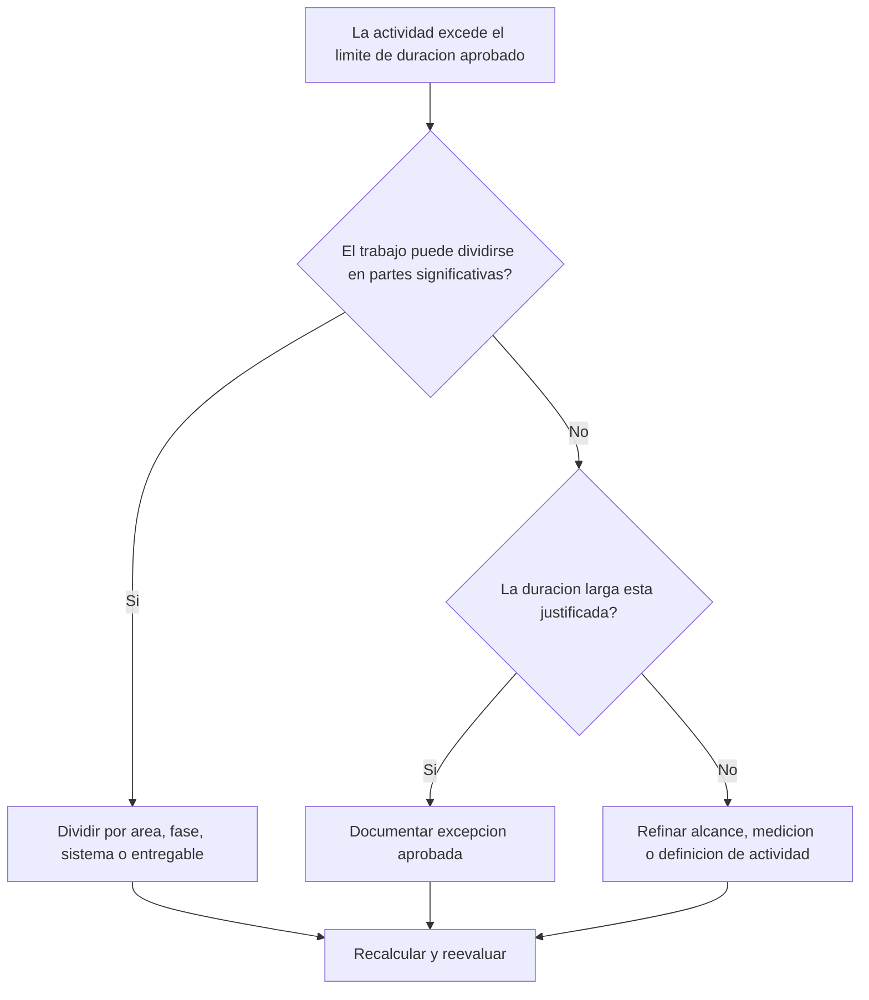

# Duración Larga de Actividades en Revisiones de Primavera P6 - Guía de mejora

## Propósito

Esta guía ayuda a revisar y mejorar actividades con duraciones mayores que el umbral aprobado del proyecto. La duración aceptable depende del tipo de proyecto, nivel de detalle, ciclo de reporte, requisitos contractuales y sensibilidad del cliente.

## Antes de Empezar

Reúna la siguiente información antes de tomar acción:

- Resultado actual de la evaluación para esta métrica.
- Duración máxima aprobada para el proyecto o nivel del cronograma.
- Lista de actividades por encima del umbral de duración.
- Original Duration, Remaining Duration, Activity Type, Status, WBS, calendario y holgura total.
- Requisitos de línea base, expectativas del cliente y reglas PMO de calidad del cronograma.
- Periodo lookahead, ciclo de actualización y responsable de disciplina o paquete.
- Excepciones justificadas, como procura, curado, entrega, revisión, pruebas o actividades level-of-effort.

## Entienda su Resultado

Un resultado sólido es cero actividades no resueltas por encima del umbral aprobado de larga duración.

Un resultado aceptable puede incluir excepciones documentadas, especialmente actividades que no pueden dividirse razonablemente o que se gestionan intencionalmente como actividades de control de alto nivel.

Un resultado débil significa que el cronograma contiene muchas actividades demasiado amplias para una planificación y control efectivos.

## Objetivo de Mejora

El objetivo es tener 0 actividades no resueltas por encima del límite de duración aprobado.

El objetivo es dividir actividades largas en actividades más pequeñas y significativas cuando se necesita mejor control, y documentar excepciones válidas cuando una duración larga es apropiada.

## Plan de Acción

### Paso 1: Identificar el Problema Principal

Cree un layout o reporte de P6 que liste actividades que exceden el umbral de duración definido para el proyecto. Incluya Activity ID, Activity Name, WBS, Activity Type, Original Duration, Remaining Duration, Start, Finish, Calendar, Total Float y Activity Status.

Revise cada actividad y pregunte:

- ¿La duración es mayor que el umbral aprobado para este tipo de proyecto y nivel del cronograma?
- ¿La actividad cubre múltiples pasos, ubicaciones, sistemas, áreas o entregables?
- ¿El avance puede medirse objetivamente en cada ciclo de actualización?
- ¿El cliente o PMO requiere mayor detalle para esta actividad?
- ¿La actividad es una excepción válida que debe permanecer larga?

### Paso 2: Aplicar las Correcciones Recomendadas

Divida actividades largas cuando el trabajo pueda planificarse y medirse en partes más pequeñas. Métodos comunes incluyen ubicación, WBS, disciplina, sistema, entregable, fase, secuencia de cuadrilla o periodo de reporte.

Al dividir una actividad, preserve la secuencia lógica real. Agregue predecesores y sucesores apropiados, asigne el calendario correcto y confirme que las nuevas actividades reflejen cómo se ejecutará el trabajo.

No divida actividades solo para cumplir la métrica. El desglose debe mejorar control, medición de avance, lookahead o claridad de reporte.

### Paso 3: Eliminar Bloqueos Comunes

Los bloqueos comunes incluyen alcance incompleto, WBS débil, poco input de campo y presión por mantener bajo el número de actividades.

Otro bloqueo es usar una actividad larga para representar trabajo que debería planificarse como secuencia. Si la actividad contiene múltiples entregas, frentes, sistemas o puntos de control, probablemente necesita más detalle.

### Paso 4: Validar los Cambios

Recalcule el cronograma después de dividir o ajustar actividades largas. Confirme que cada nueva actividad tenga lógica, duración, calendario y medición de avance apropiadas.

Revise holgura total, ruta crítica, ruta más larga y fechas de hitos. Si el desglose cambia fechas clave, comunique la razón al líder de control de proyectos o revisor PMO.

## Cronograma de Mejora

### Día 1: Revisar y Diagnosticar

Ejecute la métrica, confirme el umbral de duración y separe actividades en candidatas a división, excepciones válidas y elementos que requieren input del responsable.

### Días 2-3: Implementar Acciones Prioritarias

Corrija primero actividades críticas, casi críticas y sensibles para el cliente. Divida actividades amplias y documente excepciones válidas.

### Días 4-5: Monitorear Resultados Iniciales

Recalcule el cronograma y revise cambios en holgura, ruta más larga, fechas de hitos y visibilidad lookahead.

### Día 6: Ajustes Finales

Resuelva elementos inciertos con la disciplina responsable, dueño del paquete o líder de control de proyectos.

### Día 7: Reevaluar y Comparar

Ejecute nuevamente la evaluación y compare el resultado contra el umbral objetivo.

## Seguimiento del Progreso

Use un tracker simple para gestionar correcciones y aprobaciones.

| Fecha | Acción Realizada | Impacto Esperado | Resultado / Observación | Siguiente Paso |
| --- | --- | --- | --- | --- |
| [Fecha] | Revisar actividades de larga duración | Identificar actividades que requieren desglose | [Resultado observado] | Asignar responsables |
| [Fecha] | Dividir actividad en pasos más pequeños | Mejorar visibilidad de avance | [Resultado observado] | Recalcular cronograma |
| [Fecha] | Documentar excepción válida | Mejorar trazabilidad de revisión | [Resultado observado] | Reevaluar métrica |

## Si los Resultados No Mejoran

Si los resultados no mejoran, revise si el umbral de duración es poco claro, se aplica de forma inconsistente o no está alineado con el nivel del cronograma. También revise si las actividades largas se concentran en un área WBS, disciplina o fase.

Escale actividades largas no resueltas cuando afecten trabajo crítico, casi crítico, contractual, de reporte o sensible para el cliente.

## Mantenimiento

Revise esta métrica durante cada actualización del cronograma, desarrollo de línea base y resecuenciación importante. Actualice el umbral si el proyecto cambia de fase o nivel de detalle.

## Lista de Verificación Resumida

- [ ] Resultado actual revisado
- [ ] Umbral objetivo confirmado
- [ ] Problema principal identificado
- [ ] Actividades largas revisadas
- [ ] Candidatas a división identificadas
- [ ] Actividades desglosadas donde sea útil
- [ ] Excepciones válidas documentadas
- [ ] Cronograma recalculado
- [ ] Resultados monitoreados
- [ ] Evaluación repetida
- [ ] Próximos pasos documentados
## Contenido relacionado
- [Duración Larga de Actividades en Revisiones de Primavera P6 - Descripción general](01_overview_template.md)
- [Plantilla de Blog](03_blog_template.md)
- [Que Es Un Cronograma](../../02b_blogs_es/01_WHAT%20A%20SCHEDULE%20IS/01_blog.md)
- [Logica Robusta](../../02b_blogs_es/02_ROBUST%20LOGIC/02_ROBUST%20LOGIC.md)
