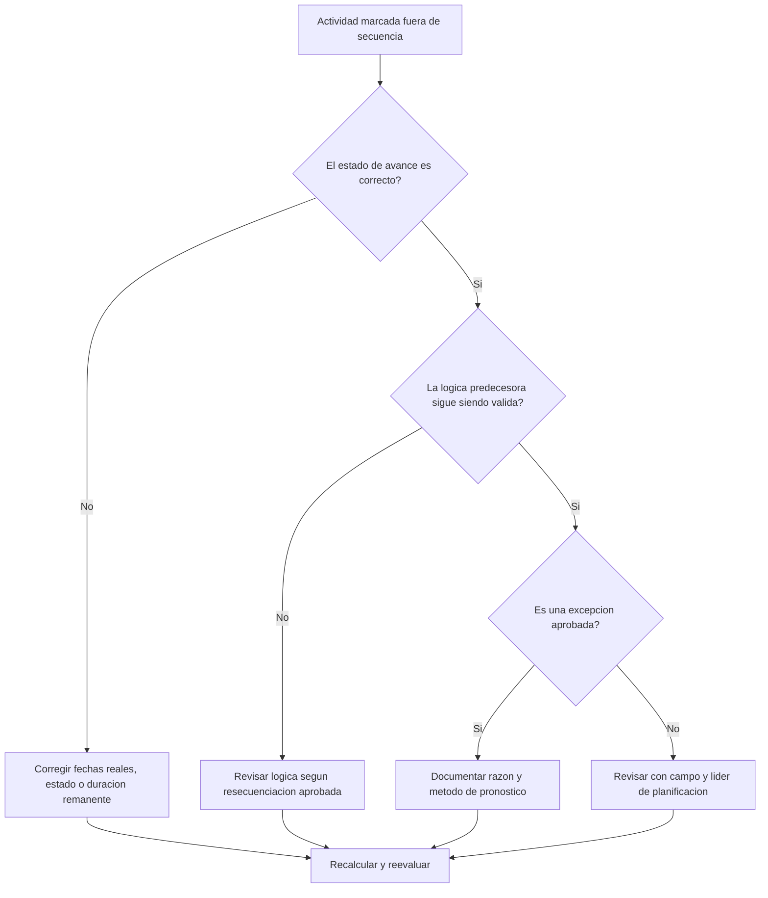

# Actividades Fuera de Secuencia en Primavera P6 - Guía de mejora

## Propósito

Esta guía ayuda a revisar y corregir actividades fuera de secuencia en Primavera P6. Aplica cuando una actividad ha iniciado o avanzado antes de que su lógica predecesora requerida se haya cumplido.

## Antes de Empezar

Reúna la siguiente información antes de tomar acción:

- Resultado actual de la evaluación para esta métrica.
- Lista de actividades marcadas como fuera de secuencia.
- fecha de datos usada en la última actualización.
- Actual Start, Actual Finish, Remaining Duration y Activity Status.
- Detalles de relaciones predecesoras y sucesoras, incluyendo tipo de relación y lag.
- Opciones de cálculo del cronograma, especialmente retained logic y progress override.
- Explicación de campo sobre por qué el trabajo avanzó antes de completar la lógica planificada.

## Entienda su Resultado

Un resultado sólido es cero actividades fuera de secuencia no resueltas.

Un resultado aceptable puede incluir excepciones documentadas donde el trabajo fue resecuenciado intencionalmente y la lógica fue actualizada para reflejar el nuevo plan.

Un resultado débil significa que la actualización contiene avance que entra en conflicto con la red lógica existente. Esto puede indicar estado incorrecto, fechas reales faltantes, lógica desactualizada o resecuenciación real no reflejada en el pronóstico.

## Objetivo de Mejora

El objetivo es tener 0 actividades fuera de secuencia no resueltas.

El objetivo es determinar si cada caso es un error de estado, error de lógica o evento real de resecuenciación, y corregir el cronograma para representar el plan actual.

## Plan de Acción

### Paso 1: Identificar el Problema Principal

Cree un layout o reporte de P6 con las actividades fuera de secuencia. Incluya Activity ID, Activity Name, WBS, Status, Actual Start, Actual Finish, Remaining Duration, Start, Finish, Total Float, predecesores, sucesores, tipo de relación, lag e indicadores de relación conductora.

Revise cada actividad y pregunte:

- ¿La actividad realmente inició antes de cumplir el requisito del predecesor?
- ¿El estado del predecesor es correcto?
- ¿El estado del sucesor es correcto?
- ¿La relación sigue siendo válida después de la resecuenciación en campo?
- ¿Debe cambiarse la lógica o corregirse la actualización de avance?
- ¿Qué opción de P6 se usa: retained logic o progress override?

### Paso 2: Aplicar las Correcciones Recomendadas

Corrija primero errores de estado. Si Actual Start, Actual Finish, Remaining Duration o el estado del predecesor son incorrectos, actualice los datos antes de cambiar la lógica.

Si la secuencia de campo cambió, revise la lógica para representar el plan actual aprobado. No elimine relaciones solo para limpiar la métrica. Reemplace lógica desactualizada con relaciones que reflejen la secuencia real.

Revise retained logic y progress override. Retained logic generalmente conserva la lógica predecesora original para trabajo remanente, mientras que progress override puede permitir que el trabajo continúe aunque la lógica predecesora esté incompleta.

### Paso 3: Eliminar Bloqueos Comunes

Los bloqueos comunes incluyen actualizaciones tardías de campo, fechas reales incompletas, presión para aceptar avance sin revisar lógica y confusión sobre opciones de cálculo.

Otro bloqueo es tratar el avance fuera de secuencia como un problema solo del software. La pregunta real es si el proyecto cambió la secuencia y si el cronograma ya refleja esa secuencia aprobada.

### Paso 4: Validar los Cambios

Recalcule el cronograma después de las correcciones. Ejecute nuevamente la revisión y confirme que cada elemento restante esté corregido, justificado o asignado para seguimiento.

Revise holgura total, ruta más larga, ruta crítica e hitos de corto plazo. Las correcciones fuera de secuencia pueden cambiar fechas pronosticadas.

## Cronograma de Mejora

### Día 1: Revisar y Diagnosticar

Ejecute la métrica, confirme la fecha de datos y separe hallazgos en errores de estado, errores de lógica, resecuenciación real y posibles excepciones.

### Días 2-3: Implementar Acciones Prioritarias

Corrija primero actividades críticas, casi críticas y del lookahead. Actualice estado, revise lógica desactualizada y documente resecuenciación aprobada.

### Días 4-5: Monitorear Resultados Iniciales

Recalcule el cronograma y revise cambios en holgura, ruta más larga, ruta crítica y fechas de hitos.

### Día 6: Ajustes Finales

Resuelva elementos restantes con líderes de campo, responsables de disciplina o gerente de planificación.

### Día 7: Reevaluar y Comparar

Ejecute nuevamente la evaluación y compare el resultado contra el umbral objetivo.

## Seguimiento del Progreso

Use un tracker simple para gestionar correcciones y aprobaciones.

| Fecha | Acción Realizada | Impacto Esperado | Resultado / Observación | Siguiente Paso |
| --- | --- | --- | --- | --- |
| [Fecha] | Revisar actividades fuera de secuencia | Identificar error de estado o lógica | [Resultado observado] | Asignar responsable |
| [Fecha] | Corregir estado o fechas reales | Mejorar precisión de actualización | [Resultado observado] | Recalcular cronograma |
| [Fecha] | Revisar lógica por resecuenciación aprobada | Mejorar confiabilidad del pronóstico | [Resultado observado] | Reevaluar métrica |

## Si los Resultados No Mejoran

Si los resultados no mejoran, revise si las mismas áreas avanzan repetidamente fuera de secuencia. Esto puede indicar disciplina de actualización débil, lógica poco realista, coordinación incompleta o resecuenciación frecuente no aprobada.

Escale elementos no resueltos cuando afecten trabajo crítico, casi crítico, contractual, de acceso, entrega o sensible para el cliente.

## Mantenimiento

Revise esta métrica en cada ciclo de actualización antes de emitir el cronograma. Confirme que el avance fuera de secuencia esté resuelto antes de usar reportes para PMO, análisis de demoras o planes de recuperación.

## Lista de Verificación Resumida

- [ ] Resultado actual revisado
- [ ] Umbral objetivo confirmado
- [ ] fecha de datos confirmada
- [ ] Problema principal identificado
- [ ] Errores de estado corregidos
- [ ] Errores de lógica corregidos
- [ ] Resequenciación aprobada documentada
- [ ] Opción de cálculo revisada
- [ ] Cronograma recalculado
- [ ] Resultados monitoreados
- [ ] Evaluación repetida
- [ ] Próximos pasos documentados
## Contenido relacionado
- [Actividades Fuera de Secuencia en Primavera P6 - Descripción general](01_overview_template.md)
- [Plantilla de Blog](03_blog_template.md)
- [Que Es Un Cronograma](../../02b_blogs_es/01_WHAT%20A%20SCHEDULE%20IS/01_blog.md)
- [Logica Robusta](../../02b_blogs_es/02_ROBUST%20LOGIC/02_ROBUST%20LOGIC.md)
