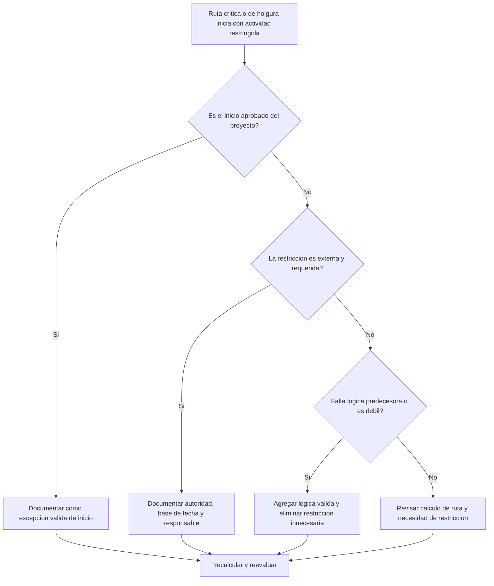

# Ruta Crítica o Ruta de Holgura que Inicia con una Restricción - Guía de mejora

## Propósito

Esta guía ayuda a revisar rutas críticas o rutas de holgura que comienzan con una actividad restringida. El inicio aprobado del proyecto normalmente es una excepción válida; la preocupación aparece cuando una ruta posterior inicia desde una restricción en lugar de una secuencia lógica.

## Antes de Empezar

Reúna la siguiente información antes de tomar acción:

- Resultado actual de la evaluación para esta métrica.
- Reporte de ruta crítica o rutas de holgura de Primavera P6.
- Primera actividad de cada ruta marcada.
- Tipo de restricción, fecha de restricción y fechas esperadas.
- Relaciones predecesoras y sucesoras de la actividad que inicia la ruta.
- fecha de datos, hito de inicio del proyecto, requisitos de línea base y reglas del cliente o PMO.
- Explicación para cualquier restricción externa aprobada.

## Entienda su Resultado

Un resultado sólido es cero rutas críticas o de holgura no resueltas que inicien con una restricción, excepto el inicio aprobado del proyecto.

Un resultado aceptable puede incluir restricciones externas documentadas, como notice to proceed, liberación de acceso del cliente, permisos o puntos contractuales de espera.

Un resultado débil significa que la ruta puede estar controlada por fechas impuestas en lugar de lógica de red.

## Objetivo de Mejora

El objetivo es tener 0 rutas no resueltas que inicien con una restricción.

El objetivo es confirmar si la ruta debe iniciar desde el inicio aprobado del proyecto, desde lógica predecesora válida o desde una restricción externa documentada.

## Plan de Acción

### Paso 1: Identificar el Problema Principal

Cree un layout o reporte de P6 que muestre la ruta crítica y rutas de holgura seleccionadas. Para la primera actividad de cada ruta, incluya Activity ID, Activity Name, WBS, Start, Finish, Total Float, Free Float, Primary Constraint, Constraint Date, Predecessors, Successors y Activity Status.

Revise cada ruta marcada y pregunte:

- ¿Es el inicio aprobado del proyecto o actividad notice-to-proceed?
- ¿La restricción es requerida contractual o externamente?
- ¿Falta lógica predecesora?
- ¿La restricción oculta una red débil o incompleta?
- ¿La ruta iniciaría de otra forma si se eliminara la restricción?
- ¿El inicio restringido está documentado para revisión PMO o del cliente?

### Paso 2: Aplicar las Correcciones Recomendadas

Si la actividad restringida es el inicio aprobado del proyecto, documéntela como excepción válida y confirme que es el punto de inicio previsto para la ruta.

Si la restricción es requerida externamente, manténgala solo cuando la razón sea clara. Documente la fuente, como hito contractual, acceso, permiso, instrucción del cliente o requisito regulatorio.

Si la restricción no es requerida, elimínela y agregue lógica predecesora válida cuando la actividad dependa de trabajo previo, aprobaciones, entregas, procura o acceso. Recalcule el cronograma y confirme que la ruta ahora sea impulsada por lógica.

### Paso 3: Eliminar Bloqueos Comunes

Los bloqueos comunes incluyen restricciones heredadas de líneas base antiguas, restricciones usadas para forzar fechas, lógica de interfaz faltante y propiedad poco clara de fechas externas.

Otro bloqueo es asumir que una ruta crítica es confiable solo porque P6 la identifica. Si la ruta inicia con una restricción innecesaria, puede reflejar control de fecha en lugar de lógica CPM real.

### Paso 4: Validar los Cambios

Recalcule el cronograma después de cambiar restricciones o lógica. Revise ruta crítica, ruta más larga, rutas de holgura seleccionadas, holgura total y fechas de hitos clave.

Si la ruta cambia significativamente, documente la razón y comunique el impacto al líder de control de proyectos, revisor PMO o planificador del cliente.

## Cronograma de Mejora

### Día 1: Revisar y Diagnosticar

Ejecute la métrica, identifique actividades restringidas que inician rutas y separe hallazgos en excepciones de inicio, restricciones externas válidas, lógica faltante y restricciones innecesarias.

### Días 2-3: Implementar Acciones Prioritarias

Corrija primero rutas críticas y sensibles para el cliente. Elimine restricciones innecesarias, agregue lógica faltante y documente excepciones aprobadas.

### Días 4-5: Monitorear Resultados Iniciales

Recalcule el cronograma y revise cambios en ruta crítica, ruta más larga, rutas de holgura y fechas de hitos.

### Día 6: Ajustes Finales

Resuelva inicios de ruta restringidos restantes con el responsable, líder de control de proyectos o revisor del cliente.

### Día 7: Reevaluar y Comparar

Ejecute nuevamente la evaluación y compare el resultado contra el umbral objetivo.

## Seguimiento del Progreso

Use un tracker simple para gestionar correcciones y aprobaciones.

| Fecha | Acción Realizada | Impacto Esperado | Resultado / Observación | Siguiente Paso |
| --- | --- | --- | --- | --- |
| [Fecha] | Revisar actividades restringidas que inician rutas | Identificar rutas impulsadas por fecha | [Resultado observado] | Asignar responsable |
| [Fecha] | Eliminar restricción innecesaria | Restaurar ruta impulsada por lógica | [Resultado observado] | Recalcular cronograma |
| [Fecha] | Documentar excepción aprobada | Mejorar trazabilidad de revisión | [Resultado observado] | Reevaluar métrica |

## Si los Resultados No Mejoran

Si los resultados no mejoran, revise si las restricciones se concentran en un área WBS, paquete de interfaz o fase del proyecto. Hallazgos repetidos pueden indicar que el cronograma está controlado por fechas impuestas en lugar de lógica completa.

Escale inicios de ruta restringidos no resueltos cuando afecten trabajo crítico, casi crítico, contractual, sensible para el cliente, de acceso o entrega.

## Mantenimiento

Revise esta métrica en cada actualización, revisión de línea base y resecuenciación importante. Preste especial atención después de planes de recuperación, cambios de fechas del cliente o revisiones de interfaz.

## Lista de Verificación Resumida

- [ ] Resultado actual revisado
- [ ] Umbral objetivo confirmado
- [ ] Reporte de ruta crítica o de holgura revisado
- [ ] Excepciones de inicio del proyecto identificadas
- [ ] Base de restricción revisada
- [ ] Lógica faltante corregida
- [ ] Restricciones innecesarias eliminadas
- [ ] Excepciones aprobadas documentadas
- [ ] Cronograma recalculado
- [ ] Resultados monitoreados
- [ ] Evaluación repetida
- [ ] Próximos pasos documentados
## Contenido relacionado
- [Ruta Crítica o Ruta de Holgura que Inicia con una Restricción - Descripción general](01_overview_template.md)
- [Plantilla de Blog](03_blog_template.md)
- [Que Es Un Cronograma](../../02b_blogs_es/01_WHAT%20A%20SCHEDULE%20IS/01_blog.md)
- [Logica Robusta](../../02b_blogs_es/02_ROBUST%20LOGIC/02_ROBUST%20LOGIC.md)
