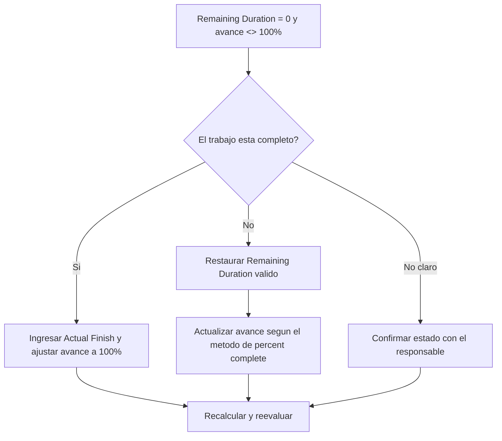

# Actividades con Remaining Duration 0 y Avance Distinto de 100% - Guía de mejora

## Propósito

Esta guía ayuda a revisar y corregir actividades donde Remaining Duration es 0 pero el avance no es 100%. Apoya actualizaciones más limpias en Primavera P6 al alinear duración remanente, porcentaje de avance, Actual Finish y estado de actividad.

## Antes de Empezar

Reúna la siguiente información antes de tomar acción:

- Resultado actual de la evaluación para esta métrica.
- Lista de actividades con Remaining Duration = 0 y avance <> 100%.
- Activity Status, Actual Start, Actual Finish, Original Duration, Remaining Duration y At Completion Duration.
- Percent Complete Type y campos de avance relacionados.
- Physical Percent Complete, Duration Percent Complete, Units Percent Complete y Activity Percent Complete.
- fecha de datos y notas de la última actualización.
- Confirmación de campo sobre si el trabajo está completo o aún tiene trabajo remanente.

## Entienda su Resultado

Un resultado sólido es cero actividades con Remaining Duration = 0 y avance menor o mayor que 100%.

Un resultado aceptable puede incluir casos raros documentados donde un método específico de percent complete crea una diferencia temporal de reporte, pero deberían resolverse antes del reporte formal.

Un resultado débil significa que el cronograma contiene actividades cuyo trabajo remanente y estado de avance no coinciden.

## Objetivo de Mejora

El objetivo es tener 0 actividades no resueltas con Remaining Duration = 0 y avance <> 100%.

El objetivo es confirmar si cada actividad está completa, fue actualizada incorrectamente o usa un método de percent complete que requiere revisión.

## Plan de Acción

### Paso 1: Identificar el Problema Principal

Cree un layout o reporte de P6 que filtre actividades donde Remaining Duration es 0 y el avance no es 100%. Incluya Activity ID, Activity Name, WBS, Activity Status, Actual Start, Actual Finish, Original Duration, Remaining Duration, Percent Complete Type, Physical Percent Complete, Duration Percent Complete, Units Percent Complete y Activity Percent Complete.

Revise cada actividad y pregunte:

- ¿El trabajo realmente está completo?
- Si está completo, ¿falta Actual Finish?
- Si no está completo, ¿por qué Remaining Duration es 0?
- ¿Qué Percent Complete Type se usa?
- ¿El valor de avance viene de avance físico, duración o unidades?
- ¿Es un error de actualización o un problema de cálculo de avance?

### Paso 2: Aplicar las Correcciones Recomendadas

Si el trabajo está completo, actualice la actividad como completa. Ingrese Actual Finish, confirme que Remaining Duration sea 0 y confirme que el avance sea 100% según el procedimiento de actualización.

Si el trabajo no está completo, restaure un Remaining Duration apropiado. Confirme el trabajo remanente con el responsable y actualice el campo de avance relevante según el Percent Complete Type.

Si el problema viene del método de percent complete, revise si la actividad debería usar Physical Percent Complete, Duration Percent Complete o Units Percent Complete. No cambie el método casualmente; alinéelo con el procedimiento de control del proyecto.

### Paso 3: Eliminar Bloqueos Comunes

Los bloqueos comunes incluyen actualizaciones incompletas de campo, Actual Finish faltante, confusión entre avance físico y de duración, y avance importado desde sistemas externos sin validación.

Otro bloqueo es tratar Remaining Duration como un campo de avance. Remaining Duration debe representar cuánto tiempo falta para terminar la actividad, no simplemente cuánto trabajo se reportó completado.

### Paso 4: Validar los Cambios

Recalcule el cronograma después de las correcciones. Ejecute nuevamente la métrica y confirme que cada elemento restante esté corregido o asignado para seguimiento.

Revise actividades completadas, Actual Finish, reportes de avance, valor ganado y lookahead para confirmar que la corrección no generó nuevas inconsistencias.

## Cronograma de Mejora

### Día 1: Revisar y Diagnosticar

Ejecute la métrica, confirme la fecha de datos y separe hallazgos en trabajo completo con estado faltante, trabajo incompleto con duración remanente cero y problemas de método de avance.

### Días 2-3: Implementar Acciones Prioritarias

Corrija primero actividades usadas en reportes. Actualice Actual Finish, restaure Remaining Duration o corrija valores de avance según corresponda.

### Días 4-5: Monitorear Resultados Iniciales

Recalcule el cronograma y revise reportes de avance, listas de actividades completadas y salidas de valor ganado.

### Día 6: Ajustes Finales

Resuelva elementos inciertos con la disciplina responsable, líder de campo o líder de control de proyectos.

### Día 7: Reevaluar y Comparar

Ejecute nuevamente la evaluación y compare el resultado contra el umbral objetivo.

## Seguimiento del Progreso

Use un tracker simple para gestionar correcciones y aprobaciones.

| Fecha | Acción Realizada | Impacto Esperado | Resultado / Observación | Siguiente Paso |
| --- | --- | --- | --- | --- |
| [Fecha] | Revisar actividades con RD 0 y avance distinto de 100 | Identificar inconsistencia de estado | [Resultado observado] | Asignar responsable |
| [Fecha] | Ingresar Actual Finish y corregir avance | Alinear estado completado | [Resultado observado] | Recalcular cronograma |
| [Fecha] | Restaurar Remaining Duration | Corregir estado de actividad incompleta | [Resultado observado] | Reevaluar métrica |

## Si los Resultados No Mejoran

Si los resultados no mejoran, revise si las actualizaciones se importan, copian o calculan de forma inconsistente. Revise si diferentes equipos usan distintos métodos de percent complete o si Actual Finish falta en el flujo de actualización.

Escale elementos no resueltos cuando afecten trabajo crítico, casi crítico, valor ganado, reporte al cliente, pagos o entregas.

## Mantenimiento

Revise esta métrica en cada ciclo de actualización antes de emitir reportes. Debe formar parte de la validación estándar junto con fechas reales, duración remanente, percent complete y estado de actividad.

## Lista de Verificación Resumida

- [ ] Resultado actual revisado
- [ ] Umbral objetivo confirmado
- [ ] fecha de datos confirmada
- [ ] Problema principal identificado
- [ ] Actividades completas actualizadas correctamente
- [ ] Actual Finish ingresado donde corresponda
- [ ] Remaining Duration restaurado donde el trabajo está incompleto
- [ ] Percent Complete Type revisado
- [ ] Cronograma recalculado
- [ ] Resultados monitoreados
- [ ] Evaluación repetida
- [ ] Próximos pasos documentados
## Contenido relacionado
- [Actividades con Remaining Duration 0 y Avance Distinto de 100% - Descripción general](01_overview_template.md)
- [Plantilla de Blog](03_blog_template.md)
- [Que Es Un Cronograma](../../02b_blogs_es/01_WHAT%20A%20SCHEDULE%20IS/01_blog.md)
- [Logica Robusta](../../02b_blogs_es/02_ROBUST%20LOGIC/02_ROBUST%20LOGIC.md)
