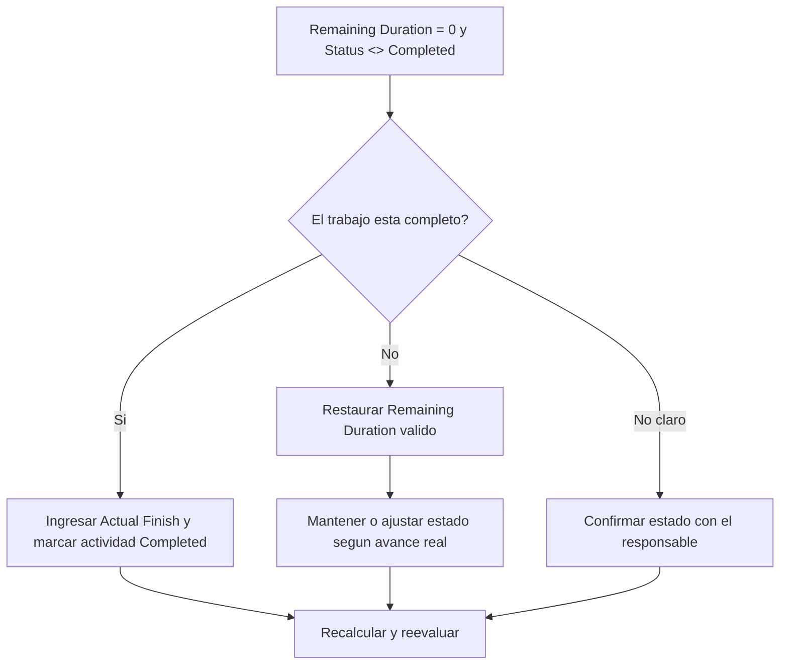

# Actividades con Remaining Duration 0 y Estado No Completed - Guía de mejora

## Propósito

Esta guía ayuda a revisar y corregir actividades donde Remaining Duration es 0 pero Activity Status no es Completed. Apoya actualizaciones limpias en Primavera P6 al alinear duración remanente, Actual Finish y estado de actividad.

## Antes de Empezar

Reúna la siguiente información antes de tomar acción:

- Resultado actual de la evaluación para esta métrica.
- Lista de actividades con Remaining Duration = 0 y Activity Status <> Completed.
- Activity Status, Actual Start, Actual Finish, Original Duration, Remaining Duration y At Completion Duration.
- Percent Complete Type y campos principales de avance.
- fecha de datos y notas de la última actualización.
- Confirmación de campo sobre si el trabajo está completo o aún tiene trabajo remanente.

## Entienda su Resultado

Un resultado sólido es cero actividades con Remaining Duration = 0 y estado distinto de Completed.

Un resultado aceptable puede incluir casos temporales raros de actualización, pero deben resolverse antes del reporte formal.

Un resultado débil significa que el cronograma contiene actividades cuyo tiempo remanente y estado de finalización no coinciden.

## Objetivo de Mejora

El objetivo es tener 0 actividades no resueltas con Remaining Duration = 0 y Activity Status <> Completed.

El objetivo es confirmar si cada actividad está completa y debe cerrarse, o si está incompleta y debe restaurarse una Remaining Duration válida.

## Plan de Acción

### Paso 1: Identificar el Problema Principal

Cree un layout o reporte de P6 que filtre actividades donde Remaining Duration es 0 y Activity Status no es Completed. Incluya Activity ID, Activity Name, WBS, Activity Status, Actual Start, Actual Finish, Original Duration, Remaining Duration, Percent Complete Type, Activity Percent Complete, Start, Finish y Total Float.

Revise cada actividad y pregunte:

- ¿El trabajo realmente está completo?
- Si está completo, ¿por qué Activity Status no es Completed?
- ¿Falta Actual Finish?
- Si el trabajo no está completo, ¿por qué Remaining Duration es 0?
- ¿El estado fue importado o actualizado manualmente?
- ¿La actividad es un hito, level-of-effort u otro tipo especial?

### Paso 2: Aplicar las Correcciones Recomendadas

Si el trabajo está completo, actualice la actividad como Completed. Ingrese Actual Finish, confirme que Remaining Duration sea 0 y confirme que los valores de avance estén alineados con el procedimiento del proyecto.

Si el trabajo no está completo, restaure un Remaining Duration apropiado. Confirme el trabajo remanente con el responsable y mantenga el estado como In Progress o Not Started según el avance real.

Si el problema viene de datos importados, revise el mapeo de importación y el flujo de actualización. El proceso no debería dejar actividades con tiempo remanente cero pero estado incompleto.

### Paso 3: Eliminar Bloqueos Comunes

Los bloqueos comunes incluyen Actual Finish faltante, confirmación de campo incompleta, datos importados y confusión entre estado de duración y estado de actividad.

Otro bloqueo es cerrar la duración remanente sin completar formalmente la actividad. Remaining Duration y Activity Status deben contar la misma historia sobre si queda trabajo.

### Paso 4: Validar los Cambios

Recalcule el cronograma después de las correcciones. Ejecute nuevamente la métrica y confirme que cada elemento restante esté corregido o asignado para seguimiento.

Revise listas de actividades completadas, Actual Finish, reportes de avance, valor ganado y lookahead para confirmar que la corrección no generó nuevas inconsistencias.

## Cronograma de Mejora

### Día 1: Revisar y Diagnosticar

Ejecute la métrica, confirme la fecha de datos y separe hallazgos en trabajo completo sin estado completado, trabajo incompleto con duración remanente cero y problemas de importación o flujo.

### Días 2-3: Implementar Acciones Prioritarias

Corrija primero actividades usadas en reportes. Ingrese Actual Finish, marque actividades Completed o restaure Remaining Duration según sea necesario.

### Días 4-5: Monitorear Resultados Iniciales

Recalcule el cronograma y revise reportes de actividades completadas, reportes de avance y salidas de valor ganado.

### Día 6: Ajustes Finales

Resuelva elementos inciertos con la disciplina responsable, líder de campo o líder de control de proyectos.

### Día 7: Reevaluar y Comparar

Ejecute nuevamente la evaluación y compare el resultado contra el umbral objetivo.

## Seguimiento del Progreso

Use un tracker simple para gestionar correcciones y aprobaciones.

| Fecha | Acción Realizada | Impacto Esperado | Resultado / Observación | Siguiente Paso |
| --- | --- | --- | --- | --- |
| [Fecha] | Revisar actividades con RD 0 y status distinto de Completed | Identificar inconsistencia de estado | [Resultado observado] | Asignar responsable |
| [Fecha] | Ingresar Actual Finish y marcar Completed | Alinear estado completado | [Resultado observado] | Recalcular cronograma |
| [Fecha] | Restaurar Remaining Duration | Corregir estado de actividad incompleta | [Resultado observado] | Reevaluar métrica |

## Si los Resultados No Mejoran

Si los resultados no mejoran, revise si las actualizaciones se importan, copian o editan manualmente de forma inconsistente. Revise si faltan Actual Finish en el flujo o si usuarios ajustan Remaining Duration a 0 sin completar actividades.

Escale elementos no resueltos cuando afecten trabajo crítico, casi crítico, valor ganado, reporte al cliente, pagos o entregas.

## Mantenimiento

Revise esta métrica en cada ciclo de actualización antes de emitir reportes. Debe formar parte de la validación estándar junto con fechas reales, duración remanente, percent complete y estado de actividad.

## Lista de Verificación Resumida

- [ ] Resultado actual revisado
- [ ] Umbral objetivo confirmado
- [ ] fecha de datos confirmada
- [ ] Problema principal identificado
- [ ] Actividades completadas marcadas correctamente
- [ ] Actual Finish ingresado donde corresponda
- [ ] Remaining Duration restaurado donde el trabajo está incompleto
- [ ] Importación o flujo de actualización revisado
- [ ] Cronograma recalculado
- [ ] Resultados monitoreados
- [ ] Evaluación repetida
- [ ] Próximos pasos documentados
## Contenido relacionado
- [Actividades con Remaining Duration 0 y Estado No Completed - Descripción general](01_overview_template.md)
- [Plantilla de Blog](03_blog_template.md)
- [Que Es Un Cronograma](../../02b_blogs_es/01_WHAT%20A%20SCHEDULE%20IS/01_blog.md)
- [Logica Robusta](../../02b_blogs_es/02_ROBUST%20LOGIC/02_ROBUST%20LOGIC.md)
