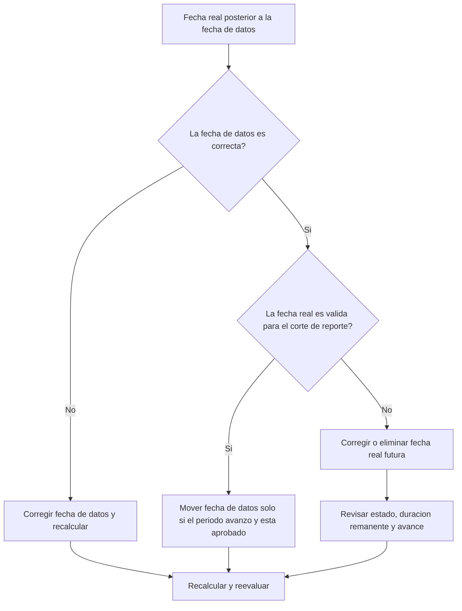

## Propósito

Esta guía ayuda a revisar y corregir actividades con fechas reales posteriores a la fecha de datos de Primavera P6. Apoya una disciplina de actualización limpia al mantener el desempeño real en o antes del límite de actualización.

## Antes de Empezar

Reúna la siguiente información antes de tomar acción:

- Resultado actual de la evaluación para esta métrica.
- fecha de datos del proyecto usada en la última actualización.
- Lista de actividades con fechas reales mayores que la fecha de datos.
- Actual Start, Actual Finish, Activity Status, Remaining Duration y Percent Complete.
- Fuente de la actualización, como reporte de campo, archivo importado, timesheet o actualización manual.
- Reglas de corte de actualización y periodo de reporte.
- Fechas reales futuras conocidas o problemas de importación.

## Entienda su Resultado

Un resultado sólido es cero actividades con fechas reales posteriores a la fecha de datos.

Un resultado aceptable también debe ser cero. Las fechas reales después de la fecha de datos normalmente indican error de actualización o fecha de datos incorrecta.

Un resultado débil significa que el cronograma contiene actuals futuros. Esto puede reportar trabajo como iniciado o terminado antes de que el periodo llegue realmente a esa fecha.

## Objetivo de Mejora

El objetivo es tener 0 actividades no resueltas con fechas reales mayores que la fecha de datos.

El objetivo es confirmar si la fecha real es incorrecta, si la fecha de datos es incorrecta o si el proceso de importación permite actuals futuros.

## Plan de Acción

### Paso 1: Identificar el Problema Principal

Cree un layout o reporte de P6 que filtre actividades con Actual Start, Actual Finish u otras fechas reales mayores que la fecha de datos. Incluya Activity ID, Activity Name, WBS, Activity Status, Actual Start, Actual Finish, Start, Finish, Remaining Duration, Percent Complete, Calendar y referencia de fecha de datos.

Revise cada actividad y pregunte:

- ¿La fecha de datos del proyecto es correcta?
- ¿La fecha real es correcta?
- ¿La actualización incluyó avance posterior al corte?
- ¿Un archivo importado cargó fechas reales futuras?
- ¿Debe cambiarse la fecha real o moverse la fecha de datos?
- ¿El estado de actividad coincide con la fecha corregida?

### Paso 2: Aplicar las Correcciones Recomendadas

Si la fecha de datos es incorrecta, corríjala según el periodo de reporte aprobado y recalcule el cronograma.

Si la fecha real es incorrecta, corrija Actual Start o Actual Finish a la fecha correcta. Si el trabajo no inició o terminó realmente antes de la fecha de datos, elimine la fecha real futura y actualice estado, Remaining Duration y Percent Complete correctamente.

Si el problema vino de una importación, revise el archivo y el mapeo. Confirme que las fechas reales futuras se bloqueen o revisen antes de emitir reportes.

### Paso 3: Eliminar Bloqueos Comunes

Los bloqueos comunes incluyen archivos de avance con fechas posteriores al corte, actualizaciones manuales sin revisar la fecha de datos y confusión entre fechas reales y fechas pronosticadas.

Otro bloqueo es mover la fecha de datos solo para aceptar actuals futuros. La fecha de datos debe representar el límite aprobado de actualización.

### Paso 4: Validar los Cambios

Recalcule el cronograma después de las correcciones. Ejecute nuevamente la métrica y confirme que no queden fechas reales posteriores a la fecha de datos.

Revise listas de actividades completadas, actividades en progreso, valor ganado y reportes de comparación para confirmar que no se crearon nuevas inconsistencias.

## Cronograma de Mejora

### Día 1: Revisar y Diagnosticar

Ejecute la métrica, confirme la fecha de datos y separe hallazgos en fechas reales incorrectas, fecha de datos incorrecta, problemas de importación y problemas de corte.

### Días 2-3: Implementar Acciones Prioritarias

Corrija primero actividades usadas en reportes. Corrija fechas reales, estados y problemas de importación.

### Días 4-5: Monitorear Resultados Iniciales

Recalcule el cronograma y revise reportes de avance, listas de actividades completadas, valor ganado y fechas de hitos.

### Día 6: Ajustes Finales

Resuelva elementos inciertos con la disciplina responsable, líder de campo o líder de control de proyectos.

### Día 7: Reevaluar y Comparar

Ejecute nuevamente la evaluación y compare el resultado contra el umbral objetivo.

## Seguimiento del Progreso

Use un tracker simple para gestionar correcciones y aprobaciones.

| Fecha | Acción Realizada | Impacto Esperado | Resultado / Observación | Siguiente Paso |
| --- | --- | --- | --- | --- |
| [Fecha] | Revisar fechas reales posteriores a fecha de datos | Identificar actuals futuros | [Resultado observado] | Asignar responsable |
| [Fecha] | Corregir Actual Start o Actual Finish | Restaurar límite válido de estado | [Resultado observado] | Recalcular cronograma |
| [Fecha] | Revisar proceso de importación | Evitar actuals futuros repetidos | [Resultado observado] | Reevaluar métrica |

## Si los Resultados No Mejoran

Si los resultados no mejoran, revise si los actuals futuros se introducen repetidamente por importaciones, timesheets o flujos manuales. Revise el procedimiento de corte y confirme que la fecha de datos se comunique claramente.

Escale elementos no resueltos cuando afecten trabajo crítico, casi crítico, valor ganado, reporte al cliente, pagos o entregas.

## Mantenimiento

Revise esta métrica en cada ciclo de actualización antes de emitir reportes. Debe formar parte de la validación estándar junto con fechas reales, fecha de datos, Remaining Duration, Percent Complete y Activity Status.

## Lista de Verificación Resumida

- [ ] Resultado actual revisado
- [ ] Umbral objetivo confirmado
- [ ] fecha de datos confirmada
- [ ] Problema principal identificado
- [ ] Fechas reales futuras corregidas
- [ ] Estado de actividad revisado
- [ ] Remaining Duration y avance revisados
- [ ] Importación o flujo de actualización revisado
- [ ] Cronograma recalculado
- [ ] Resultados monitoreados
- [ ] Evaluación repetida
- [ ] Próximos pasos documentados
## Contenido relacionado
- [Plantilla de Blog](03_blog_template.md)
- [Que Es Un Cronograma](../../02b_blogs_es/01_WHAT%20A%20SCHEDULE%20IS/01_blog.md)
- [Logica Robusta](../../02b_blogs_es/02_ROBUST%20LOGIC/02_ROBUST%20LOGIC.md)
