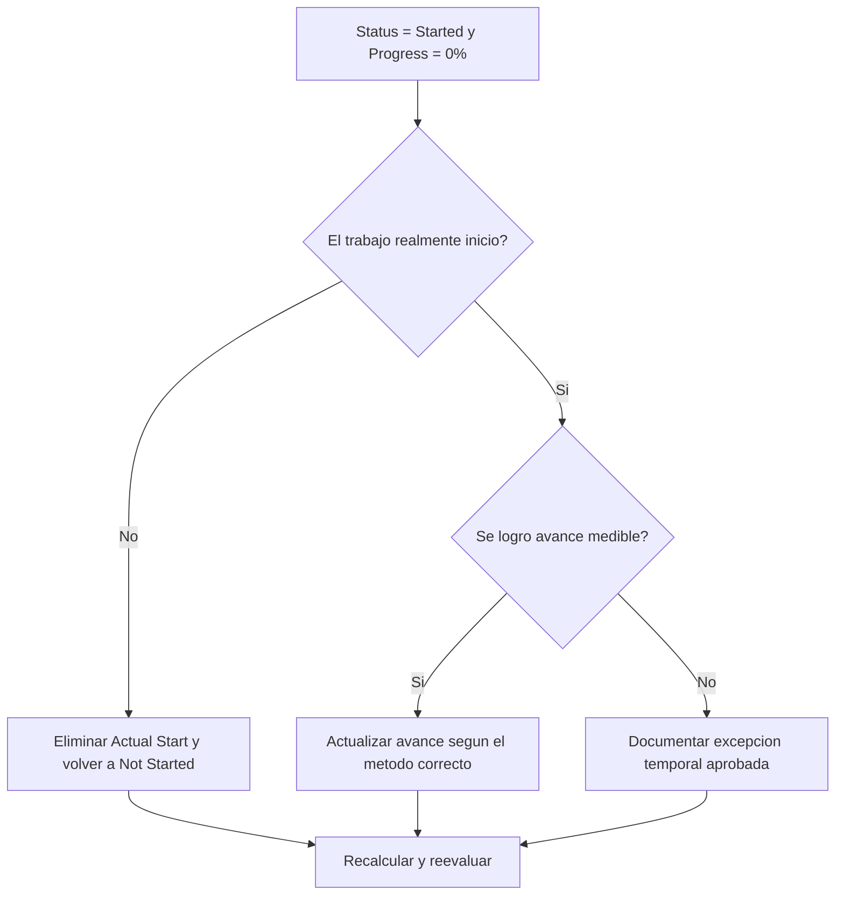

# Actividades Iniciadas con 0% de Avance en Primavera P6 - Guía de mejora

## Propósito

Esta guía ayuda a revisar y corregir actividades donde Activity Status es Started pero el avance es 0%. Apoya actualizaciones limpias en Primavera P6 al alinear Actual Start, estado de actividad, percent complete y duración remanente.

## Antes de Empezar

Reúna la siguiente información antes de tomar acción:

- Resultado actual de la evaluación para esta métrica.
- Lista de actividades con Activity Status = Started y avance = 0%.
- Actual Start, Actual Finish, Remaining Duration, Original Duration y Activity Status.
- Percent Complete Type y campos de avance relacionados.
- Physical Percent Complete, Duration Percent Complete, Units Percent Complete y Activity Percent Complete.
- fecha de datos y notas de la última actualización.
- Confirmación de campo sobre si el trabajo realmente inició y qué avance se logró.

## Entienda su Resultado

Un resultado sólido es cero actividades con estado Started y 0% de avance.

Un resultado aceptable puede incluir casos raros documentados donde una actividad inició al final del periodo y aún no ganó avance medible.

Un resultado débil significa que el cronograma contiene actividades cuyo estado de inicio y valor de avance no coinciden.

## Objetivo de Mejora

El objetivo es tener 0 actividades no resueltas con Activity Status = Started y avance = 0%.

El objetivo es confirmar si cada actividad realmente inició, si falta avance o si debe volver a Not Started.

## Plan de Acción

### Paso 1: Identificar el Problema Principal

Cree un layout o reporte de P6 que filtre actividades con estado Started y 0% de avance. Incluya Activity ID, Activity Name, WBS, Activity Status, Actual Start, Actual Finish, Original Duration, Remaining Duration, Percent Complete Type, Physical Percent Complete, Duration Percent Complete, Units Percent Complete, Activity Percent Complete, Start, Finish y Total Float.

Revise cada actividad y pregunte:

- ¿El trabajo realmente inició?
- Si inició, ¿qué avance medible se logró?
- ¿Actual Start es correcto?
- ¿Qué Percent Complete Type se usa?
- ¿Falta avance en el campo correcto?
- ¿La actividad fue iniciada administrativamente sin trabajo real?

### Paso 2: Aplicar las Correcciones Recomendadas

Si el trabajo no inició realmente, elimine el Actual Start incorrecto y devuelva la actividad a Not Started. Confirme que Remaining Duration y fechas pronosticadas sigan siendo válidas.

Si el trabajo inició y se logró avance, actualice el campo correcto según el Percent Complete Type. Para Physical Percent Complete, ingrese avance físico. Para Duration Percent Complete, confirme que Remaining Duration refleje el trabajo realizado. Para Units Percent Complete, confirme avance de unidades.

Si el trabajo inició pero no se ganó avance medible, documente la razón. Esto debería ser raro y temporal.

### Paso 3: Eliminar Bloqueos Comunes

Los bloqueos comunes incluyen cantidades de campo faltantes, Actual Starts importados sin avance, confusión sobre Percent Complete Type y presión por mostrar actividades iniciadas antes de tener avance medible.

Otro bloqueo es tratar Actual Start como señal de planificación. Actual Start debe representar inicio real del trabajo, no intención de iniciar pronto.

### Paso 4: Validar los Cambios

Recalcule el cronograma después de las correcciones. Ejecute nuevamente la métrica y confirme que cada elemento restante esté corregido, justificado o asignado para seguimiento.

Revise reportes de avance, valor ganado, lookahead y listas de actividades en progreso para confirmar que la corrección no creó nuevas inconsistencias.

## Cronograma de Mejora

### Día 1: Revisar y Diagnosticar

Ejecute la métrica, confirme la fecha de datos y separe hallazgos en inicios incorrectos, avance faltante, problemas de Percent Complete Type y posibles excepciones.

### Días 2-3: Implementar Acciones Prioritarias

Corrija primero actividades usadas en reportes. Elimine Actual Starts incorrectos, actualice avance o documente excepciones válidas.

### Días 4-5: Monitorear Resultados Iniciales

Recalcule el cronograma y revise reportes de avance, valor ganado, actividades en progreso y lookahead.

### Día 6: Ajustes Finales

Resuelva elementos inciertos con la disciplina responsable, líder de campo o líder de control de proyectos.

### Día 7: Reevaluar y Comparar

Ejecute nuevamente la evaluación y compare el resultado contra el umbral objetivo.

## Seguimiento del Progreso

Use un tracker simple para gestionar correcciones y aprobaciones.

| Fecha | Acción Realizada | Impacto Esperado | Resultado / Observación | Siguiente Paso |
| --- | --- | --- | --- | --- |
| [Fecha] | Revisar actividades Started con 0% avance | Identificar inconsistencia de estado | [Resultado observado] | Asignar responsable |
| [Fecha] | Eliminar Actual Start incorrecto | Restaurar estado preciso | [Resultado observado] | Recalcular cronograma |
| [Fecha] | Actualizar avance | Alinear estado iniciado con avance | [Resultado observado] | Reevaluar métrica |

## Si los Resultados No Mejoran

Si los resultados no mejoran, revise si Actual Starts se importan sin valores de avance o si los equipos usan reglas distintas para definir inicio. Revise el procedimiento de corte y el método de percent complete.

Escale elementos no resueltos cuando afecten trabajo crítico, casi crítico, valor ganado, reporte al cliente, pagos o entregas.

## Mantenimiento

Revise esta métrica en cada ciclo de actualización antes de emitir reportes. Debe formar parte de la validación estándar junto con fechas reales, duración remanente, percent complete y estado de actividad.

## Lista de Verificación Resumida

- [ ] Resultado actual revisado
- [ ] Umbral objetivo confirmado
- [ ] fecha de datos confirmada
- [ ] Problema principal identificado
- [ ] Actual Starts incorrectos eliminados
- [ ] Avance faltante actualizado
- [ ] Percent Complete Type revisado
- [ ] Excepciones válidas documentadas
- [ ] Cronograma recalculado
- [ ] Resultados monitoreados
- [ ] Evaluación repetida
- [ ] Próximos pasos documentados
## Contenido relacionado
- [Actividades Iniciadas con 0% de Avance en Primavera P6 - Descripción general](01_overview_template.md)
- [Plantilla de Blog](03_blog_template.md)
- [Que Es Un Cronograma](../../02b_blogs_es/01_WHAT%20A%20SCHEDULE%20IS/01_blog.md)
- [Logica Robusta](../../02b_blogs_es/02_ROBUST%20LOGIC/02_ROBUST%20LOGIC.md)
