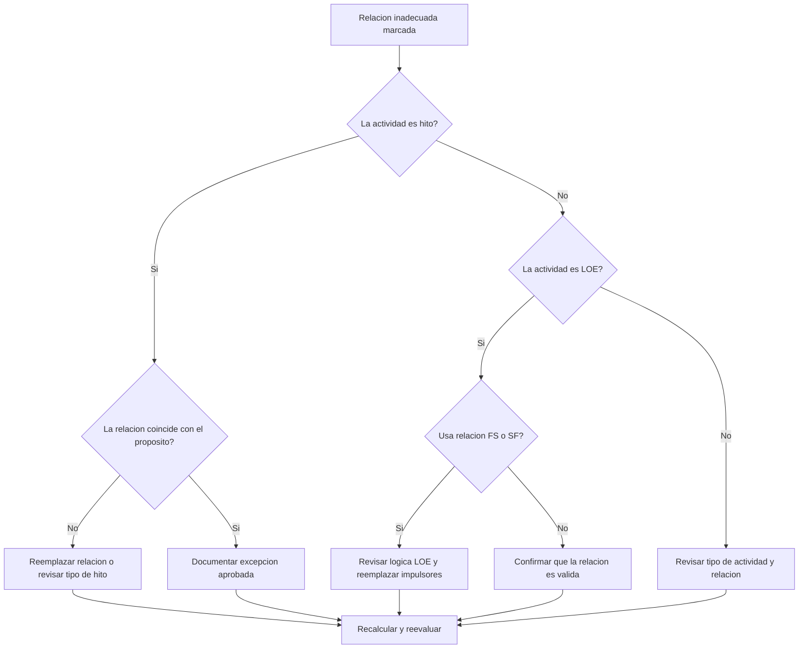

## Proposito

Esta guia ayuda a los planificadores a revisar y corregir relaciones inadecuadas que involucran Finish Milestones, Start Milestones y actividades Level of Effort (LOE) en Primavera P6.

## Antes de Empezar

Reuna la siguiente informacion antes de tomar accion:

- Resultado actual de la evaluacion para esta metrica.
- Lista de relaciones marcadas por predecesor, sucesor, tipo de actividad y tipo de relacion.
- Activity ID, Activity Name, WBS, Activity Type, Start, Finish, Total Float y estado critico o longest path.
- Tipo de relacion, lag, tipo de actividad predecesora y tipo de actividad sucesora.
- Proposito del hito, proposito del LOE y requisito de reporte asociado.
- fecha de datos y ultimo resultado de calculo del cronograma.

## Entender el Resultado

Un resultado solido es cero relaciones inadecuadas sin resolver.

La metrica debe marcar estos casos:

- Finish Milestone con sucesor SS o SF.
- Finish Milestone con predecesor SS.
- Start Milestone con predecesor FF o SF.
- Start Milestone con sucesor FS o FF.
- LOE con relacion FS.
- LOE con relacion SF.

Pueden existir excepciones poco comunes, pero deben estar documentadas y ser faciles de explicar durante una revision del cronograma.

## Objetivo de Mejora

El objetivo es 0 relaciones inadecuadas sin resolver.

La meta es hacer que cada relacion de hito y LOE coincida con el comportamiento esperado sin forzar fechas ni ocultar logica debil.

## Plan de Accion

### Paso 1: Identificar el Problema Principal

Cree un layout o reporte en P6 que muestre todas las actividades hito y LOE con detalle de predecesores y sucesores. Incluya Activity Type, Relationship Type, Lag, Start, Finish, Total Float e indicadores de critical o longest path.

Revise cada relacion marcada y pregunte:

- El tipo de actividad es correcto?
- El tipo de relacion coincide con el proposito del hito o LOE?
- La relacion esta intentando forzar una fecha de inicio, fin o reporte?
- Una relacion normal FS, SS o FF representaria mejor la logica?
- La relacion es una excepcion aprobada?

### Paso 2: Aplicar las Correcciones Recomendadas

Para Finish Milestones, confirme que la logica impulse o responda a una condicion de terminacion. Reemplace relaciones SS o SF cuando no representen una dependencia real basada en finalizacion.

Para Start Milestones, confirme que la logica soporte el evento de inicio. Reemplace relaciones FF, SF, sucesores FS u otras relaciones inadecuadas cuando se esten usando para forzar una fecha de reporte.

Para actividades LOE, revise si relaciones FS o SF estan haciendo que el LOE impulse trabajo discreto incorrectamente. Las actividades LOE normalmente resumen o abarcan otro trabajo, por lo que sus relaciones deben manejarse con cuidado.

Si la relacion es valida por contrato, metodo del cliente o diseno especial del cronograma, documente la razon y la aprobacion.

### Paso 3: Eliminar Bloqueos Comunes

Los bloqueos comunes incluyen logica copiada de cronogramas anteriores, malentendidos sobre hitos, uso de relaciones SF como atajo y uso de actividades LOE para controlar trabajo que deberia ser impulsado por actividades discretas.

Otro bloqueo es tratar esta limpieza como un tema cosmetico. Estas relaciones pueden afectar float, reporte de ruta critica, fechas de hitos y credibilidad del cronograma.

### Paso 4: Validar los Cambios

Recalcule el cronograma despues de las correcciones. Ejecute nuevamente la metrica y confirme que cada item restante este corregido, justificado o asignado para seguimiento.

Revise fechas de hitos, fechas de LOE, Total Float, critical o longest path y salidas clave de reporte para confirmar que la correccion no creo nuevos problemas.

## Cronograma de Mejora

### Dia 1: Revisar y Diagnosticar

Ejecute la metrica y agrupe los hallazgos por tipo de actividad y patron de relacion.

### Dias 2-3: Implementar Acciones Prioritarias

Corrija primero relaciones en hitos criticos, casi criticos, contractuales, de entrega y visibles para el cliente.

### Dias 4-5: Monitorear Resultados Iniciales

Recalcule el cronograma y revise float, ruta critica, movimiento de hitos y comportamiento de LOE.

### Dia 6: Ajustes Finales

Resuelva excepciones restantes con el planificador, lider de project controls o revisor PMO.

### Dia 7: Reevaluar y Comparar

Ejecute la evaluacion nuevamente y compare el resultado contra el umbral objetivo.

## Seguimiento del Progreso

Use un tracker simple para gestionar correcciones y aprobaciones.

| Fecha | Accion Tomada | Impacto Esperado | Resultado / Observacion | Siguiente Paso |
| --- | --- | --- | --- | --- |
| [Fecha] | Relaciones inadecuadas revisadas | Identificar problemas de tipo de relacion | [Resultado observado] | Asignar responsable |
| [Fecha] | Relacion de hito corregida | Alinear logica con proposito del hito | [Resultado observado] | Recalcular cronograma |
| [Fecha] | Relaciones LOE revisadas | Evitar que LOE impulse trabajo discreto incorrectamente | [Resultado observado] | Reevaluar metrica |

## Si los Resultados No Mejoran

Si los resultados no mejoran, revise si las mismas relaciones se reintroducen por importaciones, logica copiada, cambios globales o integracion con cronogramas externos.

Escale items no resueltos cuando afecten hitos contractuales, reporte de ruta critica, entregas al cliente, eventos de pago o fechas de entrega.

## Mantenimiento

Revise esta metrica en cada ciclo de actualizacion y antes de aprobar una baseline. Es especialmente util despues de importaciones, fragnets copiados, resecuenciacion importante y revisiones de hitos.

## Checklist de Resumen

- [ ] Resultado actual revisado
- [ ] Umbral objetivo confirmado
- [ ] Tipos de hito y LOE revisados
- [ ] Tipos de relacion marcados revisados
- [ ] Relaciones incorrectas corregidas
- [ ] Excepciones validas documentadas
- [ ] Cronograma recalculado
- [ ] Float y ruta critica revisados
- [ ] Resultados monitoreados
- [ ] Evaluacion repetida
- [ ] Siguientes pasos documentados
## Contenido relacionado
- [03_blog_template](../14_unusual_relations/03_blog_template.md)
- [Que Es Un Cronograma](../../02b_blogs_es/01_WHAT%20A%20SCHEDULE%20IS/01_blog.md)
- [Logica Robusta](../../02b_blogs_es/02_ROBUST%20LOGIC/02_ROBUST%20LOGIC.md)
