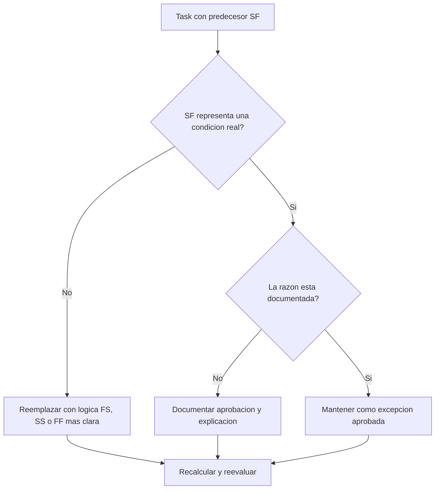

## Proposito

Esta guia ayuda a los planificadores a revisar y corregir actividades task que tienen relaciones predecesoras Start-to-Finish (SF) en Primavera P6.

## Antes de Empezar

Reuna la siguiente informacion antes de tomar accion:

- Resultado actual de la evaluacion para esta metrica.
- Lista de actividades task con al menos un predecesor SF.
- Activity ID, Activity Name, WBS, Activity Type, Start, Finish, Total Float y estado critical o longest path.
- Activity ID del predecesor, Activity Type del predecesor, tipo de relacion y lag.
- Restricciones, calendarios, condiciones esperadas de finish y notas de actualizacion relacionadas.
- fecha de datos y ultimo resultado de calculo del cronograma.

## Entender el Resultado

Un resultado solido es cero actividades task sin resolver con relaciones predecesoras SF.

Una relacion SF significa que la actividad sucesora no puede terminar hasta que la actividad predecesora inicie. Esto es poco comun en logica normal de construccion, ingenieria, procura o commissioning. La mayoria de relaciones entre tasks deberian representarse con logica FS, SS o FF cuando reflejan una secuencia real.

Un resultado debil significa que los finishes de actividades task pueden estar controlados por logica dificil de justificar o copiada desde otra parte del cronograma sin revision.

## Objetivo de Mejora

El objetivo es 0 relaciones predecesoras SF sin resolver en actividades task.

La meta es confirmar si cada relacion SF es un modelo valido de programacion o debe reemplazarse con logica mas clara.

## Plan de Accion

### Paso 1: Identificar el Problema Principal

Cree un layout o reporte en P6 que filtre actividades task con predecesor SF. Incluya IDs de predecesor y sucesor, Activity Type, Relationship Type, Lag, Start, Finish, Total Float, restricciones e indicadores critical o longest path.

Revise cada relacion y pregunte:

- Que condicion real intenta representar la relacion SF?
- El start del predecesor realmente debe controlar el finish del sucesor?
- La logica FS, SS o FF describiria la secuencia con mas claridad?
- Se esta usando lag para forzar una fecha?
- La relacion esta en ruta critica o casi critica?
- Existe una razon documentada para usar SF?

### Paso 2: Aplicar las Correcciones Recomendadas

Si la relacion SF no representa una condicion real, reemplacela con el tipo de relacion que mejor describa la secuencia. Use FS cuando el sucesor debe iniciar despues de terminar el predecesor, SS cuando los inicios estan vinculados y FF cuando la alineacion de finishes es la logica esperada.

Si la relacion SF fue agregada para controlar una fecha de finish, revise si el cronograma necesita un predecesor adecuado, un hito, una revision de restriccion o una division de actividad.

Si la relacion SF es valida, documente por que se requiere y quien la aprobo. Debe ser una excepcion poco comun, no un patron normal de programacion.

### Paso 3: Eliminar Bloqueos Comunes

Los bloqueos comunes incluyen relaciones copiadas, logica importada de fuentes externas, malentendido del comportamiento SF y uso de SF con lag para forzar una fecha de finish.

Otro bloqueo es dejar la relacion porque la fecha calculada parece aceptable. La relacion todavia debe ser defendible desde la logica.

### Paso 4: Validar los Cambios

Recalcule el cronograma despues de las correcciones. Ejecute nuevamente la metrica y confirme que cada predecesor SF restante este corregido, justificado o asignado para seguimiento.

Revise Total Float, critical o longest path, hitos afectados y salidas de lookahead para confirmar que el cambio de logica no creo nuevos problemas.

## Cronograma de Mejora

### Dia 1: Revisar y Diagnosticar

Ejecute la metrica, confirme la fecha de datos y separe hallazgos entre relaciones SF invalidas, posibles excepciones e items que requieren input del responsable.

### Dias 2-3: Implementar Acciones Prioritarias

Corrija primero relaciones SF en actividades criticas, casi criticas, contractuales y de corto plazo.

### Dias 4-5: Monitorear Resultados Iniciales

Recalcule el cronograma y revise float, ruta critica, fechas lookahead y movimiento de hitos.

### Dia 6: Ajustes Finales

Resuelva excepciones restantes con el planificador, lider de disciplina, lider de project controls o revisor PMO.

### Dia 7: Reevaluar y Comparar

Ejecute la evaluacion nuevamente y compare el resultado contra el umbral objetivo.

## Seguimiento del Progreso

Use un tracker simple para gestionar correcciones y aprobaciones.

| Fecha | Accion Tomada | Impacto Esperado | Resultado / Observacion | Siguiente Paso |
| --- | --- | --- | --- | --- |
| [Fecha] | Actividades task con predecesores SF revisadas | Identificar logica de relacion inusual | [Resultado observado] | Asignar responsable |
| [Fecha] | Relacion SF invalida reemplazada | Mejorar claridad de logica | [Resultado observado] | Recalcular cronograma |
| [Fecha] | Excepcion SF valida documentada | Mantener logica especial aprobada | [Resultado observado] | Reevaluar metrica |

## Si los Resultados No Mejoran

Si los resultados no mejoran, revise si las relaciones SF se reintroducen por importaciones, fragnets copiados, cambios globales o integracion con cronogramas externos.

Escale items no resueltos cuando afecten ruta critica, hitos contractuales, entregas al cliente, eventos de pago o trabajo de ejecucion cercano.

## Mantenimiento

Revise esta metrica en cada ciclo de actualizacion y antes de aprobar una baseline. Es especialmente util despues de importaciones, resecuenciacion importante y ejercicios de limpieza de logica.

## Checklist de Resumen

- [ ] Resultado actual revisado
- [ ] Umbral objetivo confirmado
- [ ] Lista de predecesores SF generada
- [ ] Items criticos y casi criticos priorizados
- [ ] Relaciones SF invalidas corregidas
- [ ] Excepciones validas documentadas
- [ ] Cronograma recalculado
- [ ] Float y ruta critica revisados
- [ ] Resultados monitoreados
- [ ] Evaluacion repetida
- [ ] Siguientes pasos documentados
## Contenido relacionado
- [Actividades Task con Predecesores SF en Primavera P6](03_blog_template.md)
- [Que Es Un Cronograma](../../02b_blogs_es/01_WHAT%20A%20SCHEDULE%20IS/01_blog.md)
- [Logica Robusta](../../02b_blogs_es/02_ROBUST%20LOGIC/02_ROBUST%20LOGIC.md)
