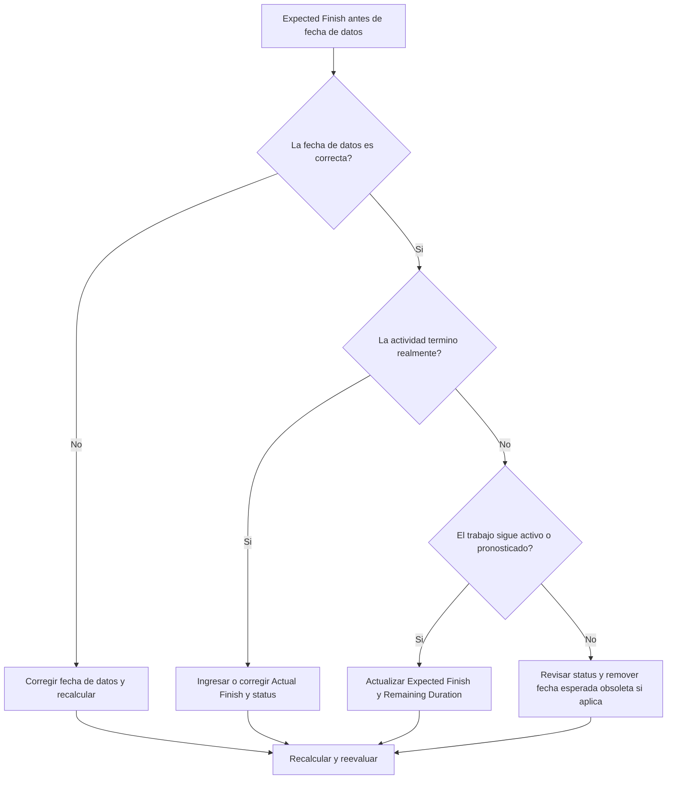

# Expected Finish Antes de la fecha de datos en Primavera P6 - Guía de mejora

## Proposito

Esta guia ayuda a los planificadores a revisar y corregir actividades cuyo Expected Finish es anterior a la fecha de datos de Primavera P6. Soporta una actualizacion mas limpia al mantener las fechas esperadas alineadas con el limite de reporte.

## Antes de Empezar

Reuna la siguiente informacion antes de tomar accion:

- Resultado actual de la evaluacion para esta metrica.
- fecha de datos del proyecto usada en la ultima actualizacion.
- Lista de actividades donde Expected Finish es anterior a la fecha de datos.
- Activity Status, Actual Start, Actual Finish, Remaining Duration, Percent Complete, Start, Finish y Total Float.
- Fuente del Expected Finish, como entrada manual, archivo de importacion, pronostico de campo o flujo de actualizacion en P6.
- Reglas de corte de actualizacion del proyecto y ultimas notas de progreso.

## Entender el Resultado

Un resultado solido es cero actividades con Expected Finish anterior a la fecha de datos.

Un Expected Finish antes de la fecha de datos normalmente significa que la informacion esperada de finalizacion no fue actualizada cuando el cronograma avanzo. Tambien puede indicar que la actividad deberia tener Actual Finish, Remaining Duration revisado o estado corregido.

Un resultado debil significa que el cronograma contiene fechas esperadas de finalizacion en el pasado respecto al limite actual de actualizacion.

## Objetivo de Mejora

El objetivo es 0 actividades sin resolver con Expected Finish anterior a la fecha de datos.

La meta es confirmar si cada actividad fue completada, sigue en progreso, no ha iniciado o fue actualizada incorrectamente.

## Plan de Accion

### Paso 1: Identificar el Problema Principal

Cree un layout o reporte en P6 que filtre actividades donde Expected Finish es anterior a la fecha de datos. Incluya Activity ID, Activity Name, WBS, Activity Status, Expected Finish, Actual Start, Actual Finish, Remaining Duration, Percent Complete, Start, Finish, Total Float y Calendar.

Revise cada actividad y pregunte:

- La fecha de datos es correcta?
- La actividad realmente termino antes de la fecha de datos?
- Si termino, falta Actual Finish?
- Si no termino, debe actualizarse Expected Finish?
- Remaining Duration todavia representa el trabajo pendiente?
- Una importacion o actualizacion manual dejo un valor antiguo de Expected Finish?

### Paso 2: Aplicar las Correcciones Recomendadas

Si la fecha de datos es incorrecta, corrijala de acuerdo con el periodo de reporte aprobado y recalcule el cronograma.

Si la actividad termino antes de la fecha de datos, ingrese o corrija el Actual Finish y confirme que Activity Status, Percent Complete y Remaining Duration sean consistentes.

Si la actividad sigue activa o no termino, actualice Expected Finish a una fecha valida en o despues de la fecha de datos. Confirme que Remaining Duration y fechas pronostico reflejen la informacion mas reciente de campo.

Si Expected Finish fue introducido por una importacion, revise el archivo y el mapeo para que fechas esperadas desactualizadas no se carguen repetidamente.

### Paso 3: Eliminar Bloqueos Comunes

Los bloqueos comunes incluyen pronosticos de campo desactualizados, importaciones de avance que actualizan percent complete pero no expected dates, y confusion entre Expected Finish, Forecast Finish y Actual Finish.

Otro bloqueo es ignorar Expected Finish porque las fechas programadas parecen aceptables. En P6, las expected dates pueden influir en el calculo segun la configuracion y el flujo de trabajo, por lo que los valores obsoletos deben revisarse.

### Paso 4: Validar los Cambios

Recalcule el cronograma despues de las correcciones. Ejecute nuevamente la metrica y confirme que no queden Expected Finish sin resolver antes de la fecha de datos.

Revise actividades en progreso, lookahead de corto plazo, Total Float, fechas de hitos y reportes de comparacion para confirmar que la correccion no creo nuevas inconsistencias.

## Cronograma de Mejora

### Dia 1: Revisar y Diagnosticar

Ejecute la metrica, confirme la fecha de datos y separe hallazgos entre trabajo completado, expected dates obsoletas, problemas de Remaining Duration e importaciones.

### Dias 2-3: Implementar Acciones Prioritarias

Corrija primero actividades usadas en reportes. Actualice Actual Finish, Expected Finish, Remaining Duration, Percent Complete o Activity Status segun corresponda.

### Dias 4-5: Monitorear Resultados Iniciales

Recalcule el cronograma y revise reportes lookahead, listas de actividades en progreso, movimiento de hitos y cambios de float.

### Dia 6: Ajustes Finales

Resuelva items inciertos restantes con el responsable de disciplina, lider de campo o lider de project controls.

### Dia 7: Reevaluar y Comparar

Ejecute la evaluacion nuevamente y compare el resultado contra el umbral objetivo.

## Seguimiento del Progreso

Use un tracker simple para gestionar correcciones y aprobaciones.

| Fecha | Accion Tomada | Impacto Esperado | Resultado / Observacion | Siguiente Paso |
| --- | --- | --- | --- | --- |
| [Fecha] | Expected Finish antes de fecha de datos revisado | Identificar expected dates obsoletas | [Resultado observado] | Asignar responsable |
| [Fecha] | Expected Finish o Actual Finish actualizado | Alinear estado con limite de actualizacion | [Resultado observado] | Recalcular cronograma |
| [Fecha] | Proceso de importacion revisado | Evitar expected dates obsoletas repetidas | [Resultado observado] | Reevaluar metrica |

## Si los Resultados No Mejoran

Si los resultados no mejoran, revise si las expected dates se importan desde sistemas de campo, hojas de calculo o archivos de actualizacion anteriores sin validacion. Revise el flujo de actualizacion y confirme quien es responsable de actualizar Expected Finish.

Escale items no resueltos cuando afecten trabajo critico, casi critico, reporte al cliente, pagos, entrega o ejecucion de corto plazo.

## Mantenimiento

Revise esta metrica en cada ciclo de actualizacion antes de emitir reportes. Debe formar parte de la validacion normal de estado junto con fecha de datos, actual dates, Remaining Duration, Percent Complete y Activity Status.

## Checklist de Resumen

- [ ] Resultado actual revisado
- [ ] Umbral objetivo confirmado
- [ ] fecha de datos confirmada
- [ ] Lista de Expected Finish generada
- [ ] Trabajo completado con Actual Finish
- [ ] Expected Finish obsoletos actualizados
- [ ] Remaining Duration revisado
- [ ] Activity Status y Percent Complete revisados
- [ ] Flujo de importacion o actualizacion revisado
- [ ] Cronograma recalculado
- [ ] Evaluacion repetida
- [ ] Siguientes pasos documentados
## Contenido relacionado
- [Expected Finish Antes de la fecha de datos en Primavera P6 - Descripción general](01_overview_template.md)
- [Expected Finish Antes de la fecha de datos en Primavera P6](03_blog_template.md)
- [Que Es Un Cronograma](../../02b_blogs_es/01_WHAT%20A%20SCHEDULE%20IS/01_blog.md)
- [Logica Robusta](../../02b_blogs_es/02_ROBUST%20LOGIC/02_ROBUST%20LOGIC.md)
