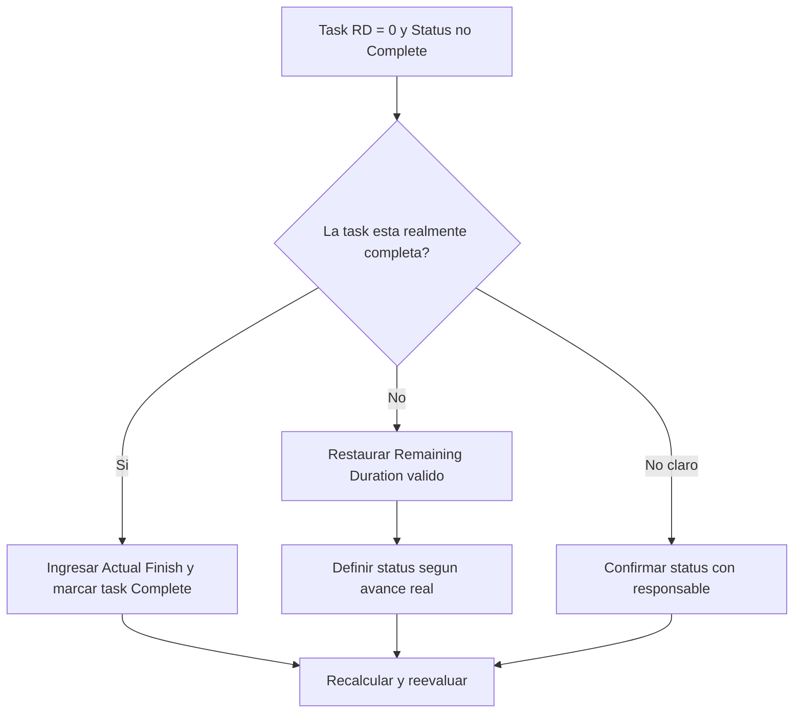

## Proposito

Esta guia ayuda a los planificadores a revisar y corregir actividades task donde Remaining Duration es igual a 0 pero el status de la task no es Complete. Soporta actualizaciones limpias en Primavera P6 al alinear trabajo restante, actual finish y status.

## Antes de Empezar

Reuna la siguiente informacion antes de tomar accion:

- Resultado actual de la evaluacion para esta metrica.
- Lista de actividades task con Remaining Duration = 0 y status no Complete.
- Activity ID, Activity Name, WBS, Activity Type, Activity Status, Actual Start, Actual Finish, Original Duration, Remaining Duration y At Completion Duration.
- Percent Complete Type y campos clave de progreso.
- fecha de datos y ultimas notas de actualizacion.
- Confirmacion de campo sobre si la task esta completa o todavia tiene trabajo pendiente.

## Entender el Resultado

Un resultado solido es cero actividades task con Remaining Duration = 0 y status no Complete.

Esta metrica se limita a actividades task para enfocar la revision en trabajo normal, no en hitos o registros LOE. Una task con cero Remaining Duration normalmente deberia tener status Complete y Actual Finish.

Un resultado debil significa que el cronograma contiene tasks cuyo tiempo restante y status de completacion no coinciden.

## Objetivo de Mejora

El objetivo es 0 actividades task sin resolver con Remaining Duration = 0 y status no Complete.

La meta es confirmar si cada task esta completa y debe cerrarse, o si esta incompleta y debe tener Remaining Duration valido restaurado.

## Plan de Accion

### Paso 1: Identificar el Problema Principal

Cree un layout o reporte en P6 que filtre actividades task donde Remaining Duration es igual a 0 y Activity Status no es Complete. Incluya Activity ID, Activity Name, WBS, Activity Type, Activity Status, Actual Start, Actual Finish, Original Duration, Remaining Duration, Percent Complete Type, Activity Percent Complete, Start, Finish y Total Float.

Revise cada task y pregunte:

- La task esta realmente completa?
- Si esta completa, por que el status no es Complete?
- Falta Actual Finish?
- Si el trabajo no esta completo, por que Remaining Duration es 0?
- El status fue importado o actualizado manualmente?
- El metodo de percent complete coincide con la actualizacion realizada?

### Paso 2: Aplicar las Correcciones Recomendadas

Si la task esta completa, actualice la actividad como Complete. Ingrese el Actual Finish, confirme que Remaining Duration es 0 y confirme que los valores de progreso coinciden con el procedimiento de actualizacion del proyecto.

Si la task no esta completa, restaure un Remaining Duration apropiado. Confirme el trabajo pendiente con el responsable y mantenga el status de la task como In Progress o Not Started segun el avance real.

Si el problema viene de datos de progreso importados, revise el mapeo de importacion y el flujo de actualizacion. El proceso no debe dejar actividades task con tiempo restante cero pero status incompleto.

### Paso 3: Eliminar Bloqueos Comunes

Los bloqueos comunes incluyen Actual Finish faltante, confirmacion de campo incompleta, datos importados y confusion entre estado de duracion y status de actividad.

Otro bloqueo es reducir Remaining Duration a 0 para mostrar avance sin completar formalmente la task. Remaining Duration y Activity Status deben contar la misma historia sobre si queda trabajo.

### Paso 4: Validar los Cambios

Recalcule el cronograma despues de las correcciones. Ejecute nuevamente la metrica y confirme que cada item restante este corregido o asignado para seguimiento.

Revise listas de tasks completadas, actual finish dates, reportes de progreso, salidas de earned value y reportes lookahead para confirmar que la correccion no creo nuevas inconsistencias.

## Cronograma de Mejora

### Dia 1: Revisar y Diagnosticar

Ejecute la metrica, confirme la fecha de datos y separe hallazgos entre tasks completas sin status Complete, tasks incompletas con Remaining Duration cero e issues de importacion o flujo.

### Dias 2-3: Implementar Acciones Prioritarias

Corrija primero tasks usadas en reportes. Ingrese Actual Finish, marque tasks como Complete o restaure Remaining Duration segun corresponda.

### Dias 4-5: Monitorear Resultados Iniciales

Recalcule el cronograma y revise reportes de tasks completadas, reportes de progreso, salidas de earned value y reportes lookahead.

### Dia 6: Ajustes Finales

Resuelva items inciertos restantes con el responsable de disciplina, lider de campo o lider de project controls.

### Dia 7: Reevaluar y Comparar

Ejecute la evaluacion nuevamente y compare el resultado contra el umbral objetivo.

## Seguimiento del Progreso

Use un tracker simple para gestionar correcciones y aprobaciones.

| Fecha | Accion Tomada | Impacto Esperado | Resultado / Observacion | Siguiente Paso |
| --- | --- | --- | --- | --- |
| [Fecha] | Task RD 0 y status no Complete revisadas | Identificar inconsistencia de status task | [Resultado observado] | Asignar responsable |
| [Fecha] | Actual Finish ingresado y task marcada Complete | Alinear status de completacion | [Resultado observado] | Recalcular cronograma |
| [Fecha] | Remaining Duration restaurado | Corregir status de task incompleta | [Resultado observado] | Reevaluar metrica |

## Si los Resultados No Mejoran

Si los resultados no mejoran, revise si las actualizaciones de progreso se importan, copian o editan manualmente de forma inconsistente. Revise si faltan Actual Finish dates en el flujo de actualizacion o si los usuarios estan configurando Remaining Duration en 0 sin completar las tasks.

Escale items no resueltos cuando afecten trabajo critico, casi critico, earned value, reporte al cliente, pagos o entrega.

## Mantenimiento

Revise esta metrica en cada ciclo de actualizacion antes de emitir reportes. Debe formar parte de la validacion normal de status task junto con actual dates, remaining duration, percent complete y activity status.

## Checklist de Resumen

- [ ] Resultado actual revisado
- [ ] Umbral objetivo confirmado
- [ ] fecha de datos confirmada
- [ ] Filtro solo task confirmado
- [ ] Problema principal identificado
- [ ] Tasks completadas marcadas correctamente
- [ ] Actual Finish ingresado cuando aplica
- [ ] Remaining Duration restaurado donde el trabajo esta incompleto
- [ ] Flujo de importacion o actualizacion revisado
- [ ] Cronograma recalculado
- [ ] Evaluacion repetida
- [ ] Siguientes pasos documentados
## Contenido relacionado
- [Remaining Duration Cero Mientras la Task No Esta Complete](03_blog_template.md)
- [Que Es Un Cronograma](../../02b_blogs_es/01_WHAT%20A%20SCHEDULE%20IS/01_blog.md)
- [Logica Robusta](../../02b_blogs_es/02_ROBUST%20LOGIC/02_ROBUST%20LOGIC.md)
